## 学习目标

- [ ] 理解分模块开发的意义
- [ ] 能够使用聚合工程快速构建项目
- [ ] 能够使用继承简化项目配置
- [ ] 能够根据需求配置生产、开发、测试环境，并在各环境间切换运行

## 一、分模块开发与设计

### 1. 分模块开发的意义

#### 问题导入

分模块开发对工程有什么好处？

### 模块拆分原则

目的：项目的扩展性变强了，方便其他项目引用相同的功能。

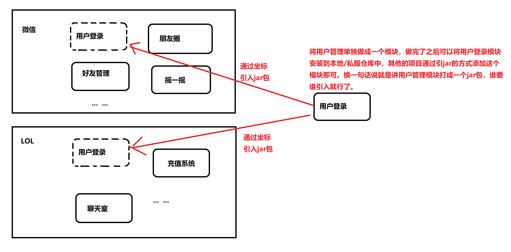

- 将原始模块按照功能拆分成若干个子模块，方便模块间的相互调用，接口共享

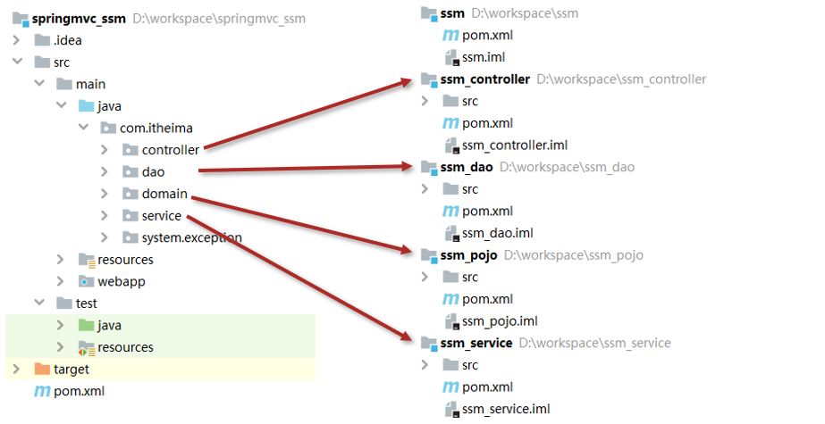

### 2. 分模块开发（模块拆分）

#### 问题导入

一个完整的工程依据什么来进行模块的拆分？

#### 2.1 创建Maven模块

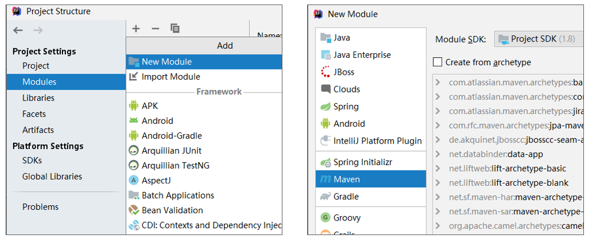

#### 2.2 书写模块代码

注意事项：

1. 分模块开发需要先针对模块功能进行设计，再进行编码。不会先将工程开发完毕，然后进行拆分

#### 2.3 通过maven指令安装模块到本地仓库（install指令）

```cmd
mvn install
```

注意事项：

1. 团队内部开发需要发布模块功能到团队内部可共享的仓库中（私服）

## 二、依赖管理

- 依赖管理指当前项目运行所需的jar，一个项目可以设置多个依赖

- 格式：

```xml
<!--设置当前项目所依赖的所有jar-->
<dependencies>
    <!--设置具体的依赖-->
    <dependency>
        <!--依赖所属群组id-->
        <groupId>org.springframework</groupId>
        <!--依赖所属项目id-->
        <artifactId>spring-webmvc</artifactId>
        <!--依赖版本号-->
        <version>5.2.10.RELEASE</version>
    </dependency>
</dependencies>
```

### 1. 依赖传递

#### 问题导入

A依赖B，B依赖C，A是否依赖于C呢？

- 依赖具有传递性
    - 直接依赖：在当前项目中通过依赖配置建立的依赖关系
    - 间接依赖：被资源的资源如果依赖其他资源，当前项目间接依赖其他资源
    - 特殊优先：当同级配置了相同资源的不同版本，后配置的覆盖先配置的

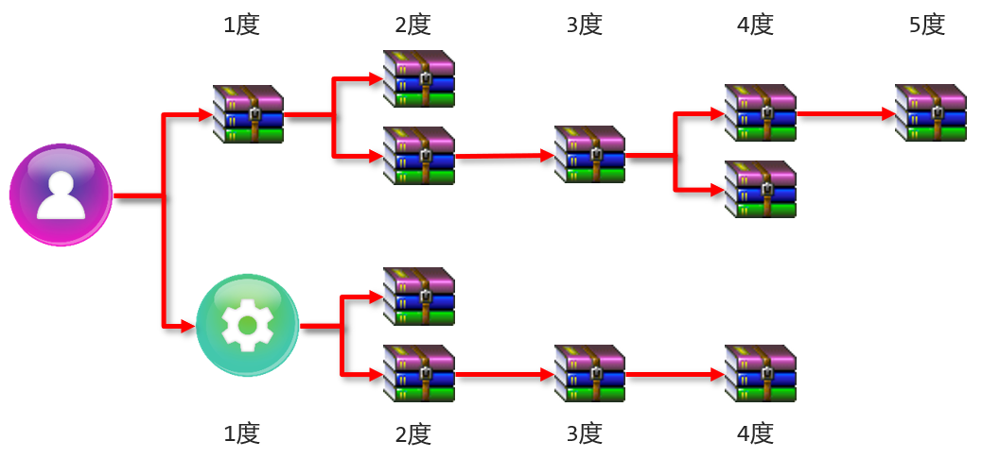 

### 2. 可选依赖

#### 问题导入

A依赖B，B依赖C，如果A不想将C依赖进来，是否可以做到？

- 可选依赖指对外隐藏当前所依赖的资源————不透明

```xml
<dependency>
    <groupId>com.itheima</groupId>
    <artifactId>maven_03_pojo</artifactId>
    <version>1.0-SNAPSHOT</version>
    <!--可选依赖是隐藏当前工程所依赖的资源，隐藏后对应资源将不具有依赖传递性-->
    <optional>false</optional>
</dependency>
```


### 3. 排除依赖

#### 问题导入

A依赖B，B依赖C，如果A不想将C依赖进来，是否可以做到？

- 排除依赖指主动断开依赖的资源，被排除的资源无需指定版本————不需要
- 排除依赖资源仅指定GA即可，无需指定V

```xml
<dependency>
    <groupId>com.itheima</groupId>
    <artifactId>maven_04_dao</artifactId>
    <version>1.0-SNAPSHOT</version>
    <!--排除依赖是隐藏当前资源对应的依赖关系-->
    <exclusions>
        <exclusion>
            <groupId>log4j</groupId>
            <artifactId>log4j</artifactId>
        </exclusion>
        <exclusion>
            <groupId>org.mybatis</groupId>
            <artifactId>mybatis</artifactId>
        </exclusion>
    </exclusions>
</dependency>
```

### 4 可选依赖和排除依赖的区别

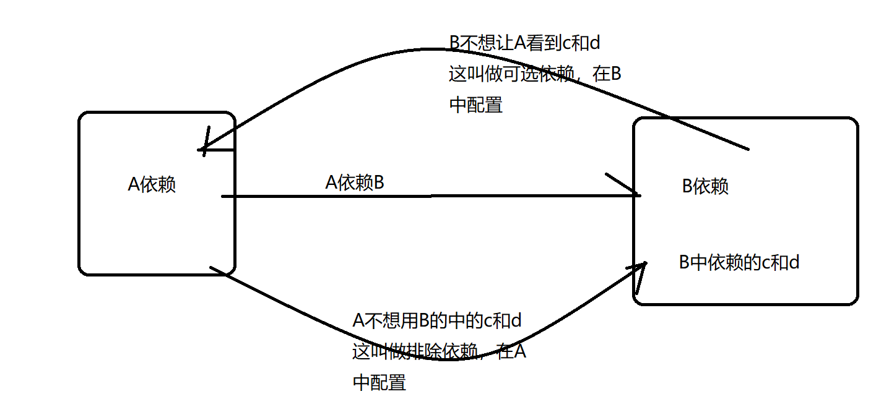

## 三、聚合与继承

### 1. 聚合工程

#### 问题导入

什么叫聚合？

- 聚合：将多个模块组织成一个整体，同时进行项目构建的过程称为聚合
- 聚合工程：通常是一个不具有业务功能的”空“工程（有且仅有一个pom文件）

- 作用：使用聚合工程可以将多个工程编组，通过对聚合工程进行构建，实现对所包含的模块进行同步构建
    - 当工程中某个模块发生更新（变更）时，必须保障工程中与已更新模块关联的模块同步更新，此时可以使用聚合工程来解决批量模块同步构建的问题

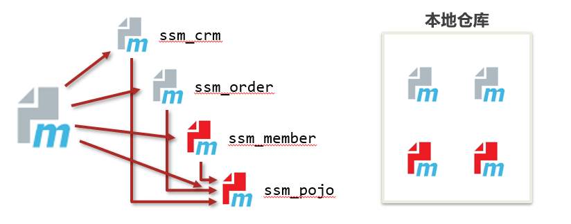

### 2. 聚合工程开发

#### 问题导入

工程的打包方式有哪几种？

#### 2.1 创建Maven模块，设置打包类型为pom

```xml
<packaging>pom</packaging>
```

注意事项：

1. 每个maven工程都有对应的打包方式，默认为jar，web工程打包方式为war

#### 2.2 设置当前聚合工程所包含的子模块名称

```xml
<modules>
    <module>../maven_ssm</module>
    <module>../maven_pojo</module>
    <module>../maven_dao</module>
</modules>
```

注意事项：

1. 聚合工程中所包含的模块在进行构建时会根据模块间的依赖关系设置构建顺序，与聚合工程中模块的配置书写位置无关。
2. 参与聚合的工程无法向上感知是否参与聚合，只能向下配置哪些模块参与本工程的聚合。

### 3. 继承关系

#### 问题导入

什么叫继承？

- 概念：
    - 继承描述的是两个工程间的关系，与java中的继承相似，子工程可以继承父工程中的配置信息，常见于依赖关系的继承
- 作用：
    - 简化配置
    - 减少版本冲突

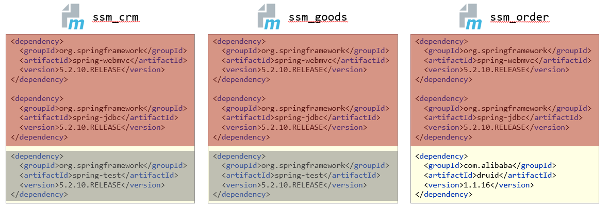

### 4. 继承关系开发

#### 4.1 创建Maven模块，设置打包类型为pom

```xml
<packaging>pom</packaging>
```

注意事项：

1. 建议父工程打包方式设置为pom

#### 4.2 在父工程的pom文件中配置依赖关系（子工程将沿用父工程中的依赖关系）

```xml
<dependencies>
    <dependency>
        <groupId>org.springframework</groupId>
        <artifactId>spring-webmvc</artifactId>
        <version>5.2.10.RELEASE</version>
    </dependency>
    ……
</dependencies>
```

#### 4.3 配置子工程中可选的依赖关系

```xml
<dependencyManagement>
    <dependencies>
        <dependency>
            <groupId>com.alibaba</groupId>
            <artifactId>druid</artifactId>
            <version>1.1.16</version>
        </dependency>
        ……
    </dependencies>
</dependencyManagement>
```

#### 4.3 在子工程中配置当前工程所继承的父工程

```xml
<!--定义该工程的父工程-->
<parent>
    <groupId>com.itheima</groupId>
    <artifactId>maven_parent</artifactId>
    <version>1.0-SNAPSHOT</version>
    <!--填写父工程的pom文件，根据实际情况填写-->
    <relativePath>../maven_parent/pom.xml</relativePath>
</parent>
```

#### 4.5 在子工程中配置使用父工程中可选依赖的坐标

```xml
<dependencies>
    <dependency>
        <groupId>com.alibaba</groupId>
        <artifactId>druid</artifactId>
    </dependency>
</dependencies>
```

注意事项：

1. 子工程中使用父工程中的可选依赖时，仅需要提供群组id和项目id，无需提供版本，版本由父工程统一提供，避免版本冲突
2. 子工程中还可以定义父工程中没有定义的依赖关系


### 5. 聚合与继承的区别

#### 问题导入

聚合和继承的作用？

- 作用
    - 聚合用于快速构建项目
    - 继承用于快速配置
- 相同点：
    - 聚合与继承的pom.xml文件打包方式均为pom，可以将两种关系制作到同一个pom文件中
    - 聚合与继承均属于设计型模块，并无实际的模块内容
- 不同点：
    - 聚合是在当前模块中配置关系，聚合可以感知到参与聚合的模块有哪些
    - 继承是在子模块中配置关系，父模块无法感知哪些子模块继承了自己


## 四、属性管理

### 1. 属性

#### 问题导入

定义属性有什么好处？

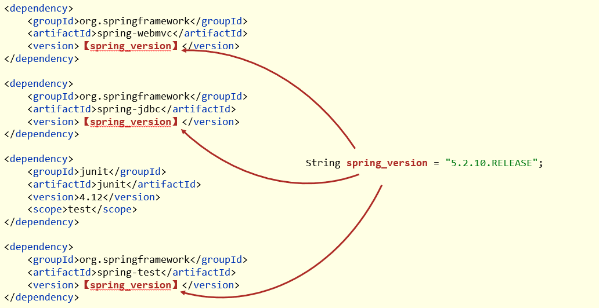 

#### 1.1 属性配置与使用

##### ①：定义属性

```xml
<!--定义自定义属性-->
<properties>
    <spring.version>5.2.10.RELEASE</spring.version>
    <junit.version>4.12</junit.version>
</properties>
```

##### ②：引用属性

```xml
<dependency>
    <groupId>org.springframework</groupId>
    <artifactId>spring-context</artifactId>
    <version>${spring.version}</version>
</dependency>
```


#### 1.2 资源文件引用属性

##### ①：定义属性

```xml
<!--定义自定义属性-->
<properties>
    <spring.version>5.2.10.RELEASE</spring.version>
    <junit.version>4.12</junit.version>
    <jdbc.url>jdbc:mysql://127.0.0.1:3306/ssm_db</jdbc.url>
</properties>
```

##### ②：配置文件中引用属性

```properties
jdbc.driver=com.mysql.jdbc.Driver
jdbc.url=${jdbc.url}
jdbc.username=root
jdbc.password=root
```

##### ③：开启资源文件目录加载属性的过滤器

```xml
<build>
    <resources>
        <resource>
            <directory>${project.basedir}/src/main/resources</directory>
            <filtering>true</filtering>
        </resource>
    </resources>
</build>
```

##### ④：配置maven打war包时，忽略web.xml检查

```xml
<plugin>
    <groupId>org.apache.maven.plugins</groupId>
    <artifactId>maven-war-plugin</artifactId>
    <version>3.2.3</version>
    <configuration>
        <failOnMissingWebXml>false</failOnMissingWebXml>
    </configuration>
</plugin>
```

#### 1.3 其他属性（了解）

- 属性列表
    - 自定义属性（常用）
    - 内置属性
    - Setting属性
    - Java系统属性
    - 环境变量属性

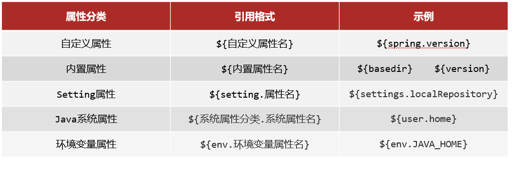

查看windows系统环境变量： maven目录下：mvn help:system

### 2. 版本管理

#### 问题导入

项目开发的版本可以分为哪几种？

#### 2.1 工程版本

- SNAPSHOT（快照版本）
    - 项目开发过程中临时输出的版本，称为快照版本
    - 快照版本会随着开发的进展不断更新
- RELEASE（发布版本）
    - 项目开发到进入阶段里程碑后，向团队外部发布较为稳定的版本，这种版本所对应的构件文件是稳定的
    - 即便进行功能的后续开发，也不会改变当前发布版本内容，这种版本称为发布版本

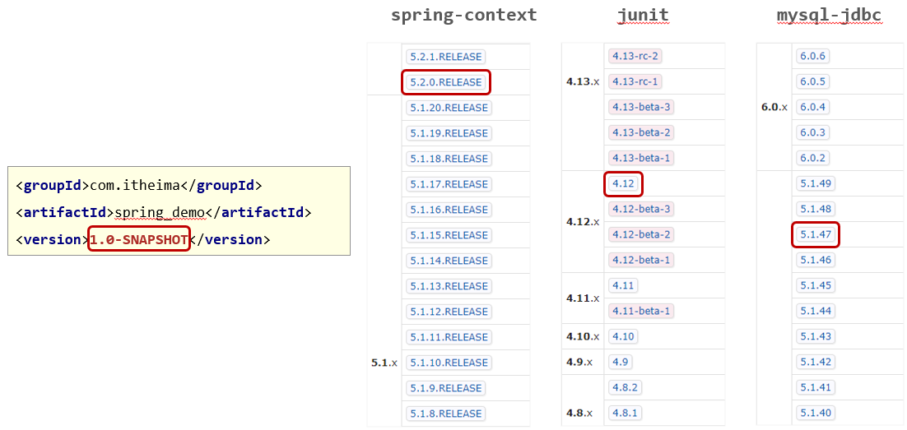

#### 2.2 发布版本

- alpha版
- beta版
- 纯数字版

## 五、多环境配置与应用

### 1. 多环境配置作用

#### 问题导入

多环境配置有什么好处？

- maven提供配置多种环境的设定，帮助开发者使用过程中快速切换环境

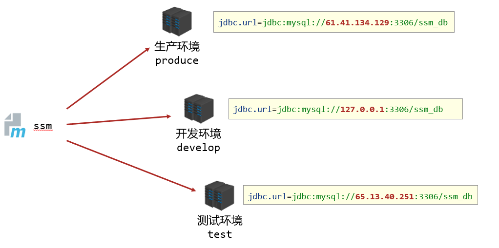 

### 2. 多环境配置步骤

#### 2.1 定义多环境

```xml
<!--定义多环境-->
<profiles>
    <!--定义具体的环境：生产环境-->
    <profile>
        <!--定义环境对应的唯一名称-->
        <id>env_dep</id>
        <!--定义环境中专用的属性值-->
        <properties>
            <jdbc.url>jdbc:mysql://127.0.0.1:3306/ssm_db</jdbc.url>
        </properties>
        <!--设置默认启动-->
        <activation>
            <activeByDefault>true</activeByDefault>
        </activation>
    </profile>
    <!--定义具体的环境：开发环境-->
    <profile>
        <id>env_pro</id>
        ……
    </profile>
</profiles>
```

#### 2.2 使用多环境（构建过程）

```cmd
【命令】：
mvn 指令 –P 环境定义id

【范例】：
mvn install –P pro_env
```

### 2. 跳过测试（了解）

#### 问题导入

跳过测试会不会影响项目的构建过程？

#### 2.1 应用场景

- 功能更新中并且没有开发完毕
- 快速打包
- ……

#### 2.2 跳过测试命令

- mvn install –D skipTests

注意事项：

1. 执行的项目构建指令必须包含测试生命周期，否则无效果。例如执行compile生命周期，不经过test生命周期。

#### 2.3 细粒度控制跳过测试

```xml
<plugin>
    <artifactId>maven-surefire-plugin</artifactId>
    <version>2.22.1</version>
    <configuration>
        <skipTests>true</skipTests>
        <!--设置跳过测试-->
        <includes>
            <!--包含指定的测试用例-->
            <include>**/User*Test.java</include>
        </includes>
        <excludes>
            <!--排除指定的测试用例-->
            <exclude>**/User*TestCase.java</exclude>
        </excludes>
    </configuration>
</plugin>
```


## 六、私服

### 1. 私服介绍

#### 问题导入

这里的私服和平时我们听的国服、体验服、欧服等等有什么区别？

#### 1.1 介绍

- 团队开发现状分析

- 私服是一台独立的服务器，用于解决团队内部的资源共享与资源同步问题
- Nexus
    - Sonatype公司的一款maven私服产品
    - 下载地址：https://help.sonatype.com/repomanager3/download 

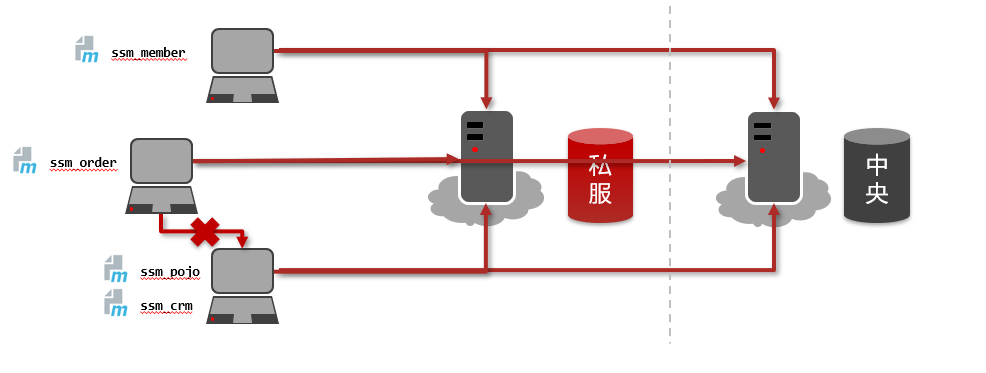

#### 1.2 Nexus安装与启动

- 启动服务器（命令行启动）
    - nexus.exe /run nexus

- 访问服务器（默认端口：8081）
    - http://localhost:8081

- 修改基础配置信息
    - 安装路径下etc目录中nexus-default.properties文件保存有nexus基础配置信息，例如默认访问端口。
- 修改服务器运行配置信息
    - 安装路径下bin目录中nexus.vmoptions文件保存有nexus服务器启动对应的配置信息，例如默认占用内存空间。

#### 1.3 私服资源操作流程分析

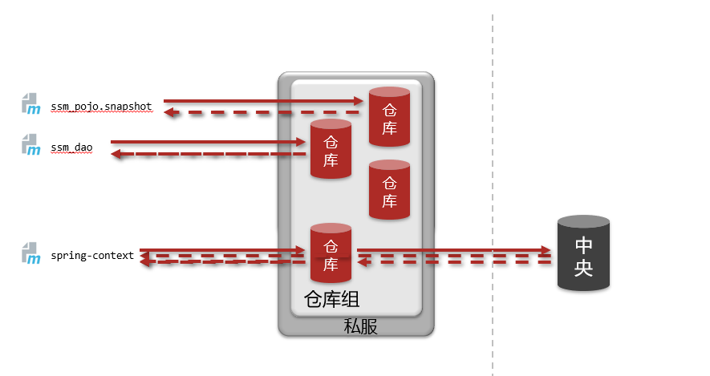

### 2. 私服仓库分类

#### 问题导入

私服仓库分为哪几种？

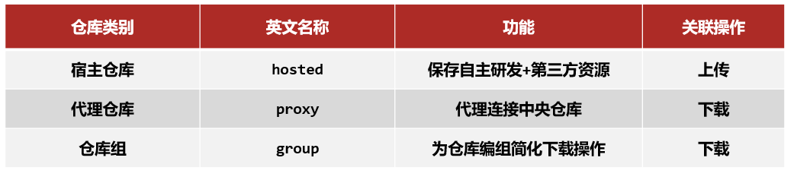

### 3. 资源上传与下载

#### 问题导入

往私服上传资源是否需要身份认证？在哪里设置认证信息？

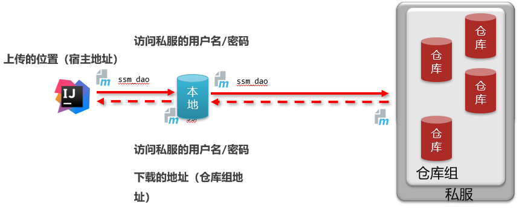

#### 3.1 从私服中下载依赖

【第一步】在maven的settings.xml中\<mirrors>标签中配置，此时就需要注释掉aliyun的配置。

```xml
<mirror>
    <id>nexus-heima</id>
    <mirrorOf>*</mirrorOf>
    <url>http://localhost:8081/repository/maven-public/</url>
</mirror>
```

【第二步】在nexus中设置允许匿名下载，如果不允许将不会从私服中下载依赖


如果私服中没有对应的jar，会去中央仓库下载，速度很慢。可以配置让私服去阿里云中下载依赖。

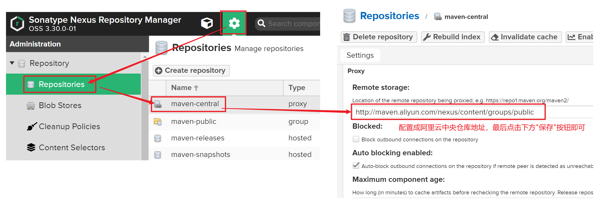

#### 3.2 上传依赖到私服中

【第一步】配置本地仓库访问私服的权限（在maven的settings.xml的servers标签中配置）

```xml
<server>
  <!--id任意，多个server的id不重复就行，后面会用到-->
  <id>heima-nexus</id>
  <username>admin</username>
  <password>123456</password><!--填写自己nexus设定的登录秘密-->
</server>
```

【第一步】配置当前项目访问私服上传资源的保存位置（项目的pom.xml文件中配置）

```xml
<distributionManagement>
    <repository>
      	<!--和maven/settings.xml中server中的id一致，表示使用该id对应的用户名和密码-->
        <id>heima-nexus</id>
      	<!--如果jar的版本是release版本，那么就上传到这个仓库，根据自己情况修改-->
        <url>http://localhost:8081/repository/heima-releases/</url>
    </repository>
    <snapshotRepository>
      	<!--和maven/settings.xml中server中的id一致，表示使用该id对应的用户名和密码-->
        <id>heima-nexus</id>
      	<!--如果jar的版本是snapshot版本，那么就上传到这个仓库，根据自己情况修改-->
        <url>http://localhost:8081/repository/heima-snapshots/</url>
    </snapshotRepository>
</distributionManagement>
```

**==注意：要和maven的settings.xml中server中定义的\<id>heima-nexus\</id>对应==**

【第三步】发布资源到私服命令

```
mvn deploy
```


