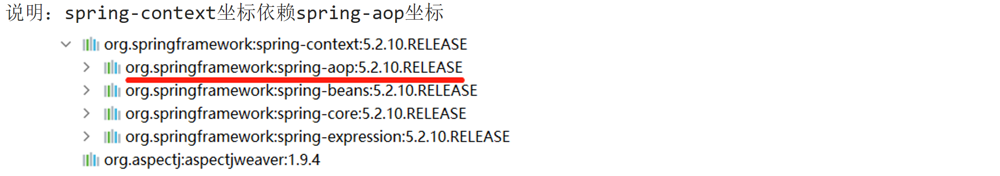
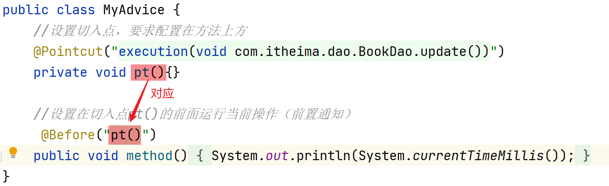
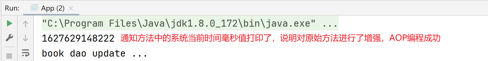
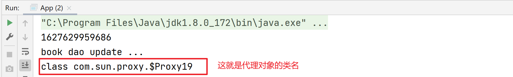
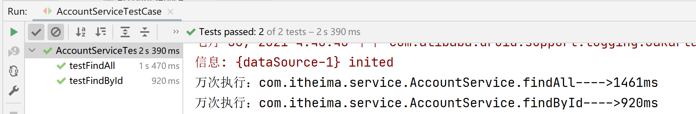
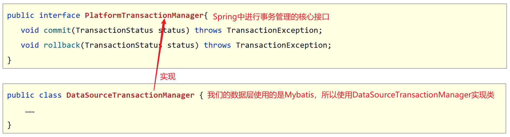
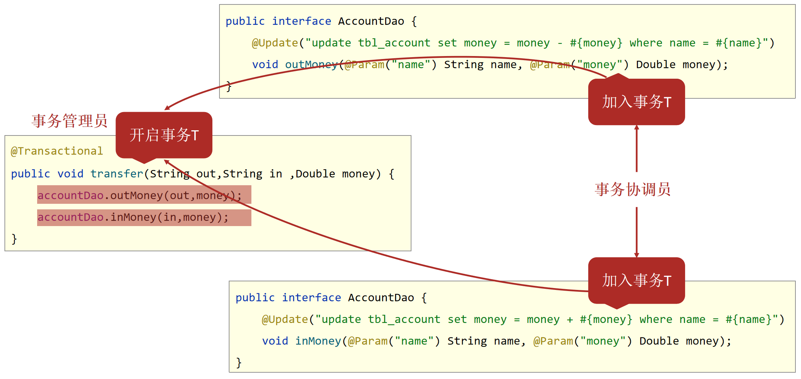

## 今日目标

- [ ] 能够理解AOP的作用
- [ ] 能够完成AOP的入门案例
- [ ] 能够理解AOP的工作流程
- [ ] 能够说出AOP的五种通知类型
- [ ] 能够完成"测量业务层接口万次执行效率"案例
- [ ] 能够掌握Spring事务配置

## 一、AOP

### 1 AOP简介

#### 问题导入

问题1：AOP的作用是什么？

问题2：连接点和切入点有什么区别，二者谁的范围大？

问题3：请描述什么是切面？

#### 1.1 AOP简介和作用【理解】

- AOP(Aspect Oriented Programming)面向切面编程，一种编程范式，指导开发者如何组织程序结构
  - OOP(Object Oriented Programming)面向对象编程
- 作用：在不惊动原始设计的基础上为其进行功能增强。简单的说就是在不改变方法源代码的基础上对方法进行功能增强。
- Spring理念：无入侵式/无侵入式

#### 1.2 AOP中的核心概念【理解】


- 连接点（JoinPoint）：正在执行的方法，例如：update()、delete()、select()等都是连接点。
- 切入点（Pointcut）：进行功能增强了的方法，例如:update()、delete()方法，select()方法没有被增强所以不是切入点，但是是连接点。
  - 在SpringAOP中，一个切入点可以只描述一个具体方法，也可以匹配多个方法
    - 一个具体方法：com.itheima.dao包下的BookDao接口中的无形参无返回值的save方法
    - 匹配多个方法：所有的save方法，所有的get开头的方法，所有以Dao结尾的接口中的任意方法，所有带有一个参数的方法
- 通知（Advice）：在切入点前后执行的操作，也就是增强的共性功能
  - 在SpringAOP中，功能最终以方法的形式呈现
- 通知类：通知方法所在的类叫做通知类
- 切面（Aspect）：描述通知与切入点的对应关系，也就是哪些通知方法对应哪些切入点方法。


### 2 AOP入门案例【重点】

#### 问题导入

问题1：在通知方法中如何定义切入点表达式？

问题2：如何配置切面？

问题3：在配置类上如何开启AOP注解功能？

#### 2.1 AOP入门案例思路分析

- 案例设定：测定接口执行效率
- 简化设定：在接口执行前输出当前系统时间
- 开发模式：XML or ****注解****
- 思路分析：
  1. 导入坐标（pom.xml）
  2. 制作连接点方法（原始操作，dao接口与实现类）
  3. 制作共性功能（通知类与通知）
  4. 定义切入点
  5. 绑定切入点与通知关系（切面）

#### 2.2 AOP入门案例实现

##### 【第一步】导入aop相关坐标

```xml
<dependencies>
    <!--spring核心依赖，会将spring-aop传递进来-->
    <dependency>
        <groupId>org.springframework</groupId>
        <artifactId>spring-context</artifactId>
        <version>5.2.10.RELEASE</version>
    </dependency>
    <!--切入点表达式依赖，目的是找到切入点方法，也就是找到要增强的方法-->
    <dependency>
        <groupId>org.aspectj</groupId>
        <artifactId>aspectjweaver</artifactId>
        <version>1.9.4</version>
    </dependency>
</dependencies>
```



##### 【第二步】定义dao接口与实现类

```java
public interface BookDao {
    public void save();
    public void update();
}

@Repository
public class BookDaoImpl implements BookDao {

    public void save() {
        System.out.println(System.currentTimeMillis());
        System.out.println("book dao save ...");
    }
    public void update(){
        System.out.println("book dao update ...");
    }
}
```

##### 【第三步】定义通知类，制作通知方法

```java
//通知类必须配置成Spring管理的bean
@Component
public class MyAdvice {
    public void method(){
        System.out.println(System.currentTimeMillis());
    }
}
```

##### 【第四步】定义切入点表达式、配置切面(绑定切入点与通知关系)

```java
//通知类必须配置成Spring管理的bean
@Component
//设置当前类为切面类类
@Aspect
public class MyAdvice {
    //设置切入点，@Pointcut注解要求配置在方法上方
    @Pointcut("execution(void com.itheima.dao.BookDao.update())")
    private void pt(){}

    //设置在切入点pt()的前面运行当前操作(前置通知)
    @Before("pt()") 
    public void method(){
        System.out.println(System.currentTimeMillis());
    }
}
```



##### 【第五步】在配置类中进行Spring注解包扫描和开启AOP功能

```java
@Configuration
@ComponentScan("com.itheima")
//开启注解开发AOP功能
@EnableAspectJAutoProxy
public class SpringConfig {
}
```

##### 测试类和运行结果

```java
public class App {
    public static void main(String[] args) {
        ApplicationContext ctx = new AnnotationConfigApplicationContext(SpringConfig.class);
        BookDao bookDao = ctx.getBean(BookDao.class);
        bookDao.update();
    }
}
```




### 3 AOP工作流程【理解】

#### 问题导入

什么是目标对象？什么是代理对象？

#### 3.1 AOP工作流程

1. Spring容器启动
2. 读取所有切面配置中的切入点
3. 初始化bean，判定bean对应的类中的方法是否匹配到任意切入点
   - 匹配失败，创建原始对象
   - 匹配成功，创建原始对象（目标对象）的代理对象
4. 获取bean执行方法
   - 获取的bean是原始对象时，调用方法并执行，完成操作
   - 获取的bean是代理对象时，根据代理对象的运行模式运行原始方法与增强的内容，完成操作

#### 3.2 AOP核心概念

目标对象（Target）：被代理的对象，也叫原始对象，该对象中的方法没有任何功能增强。
代理对象（Proxy）：代理后生成的对象，由Spring帮我们创建代理对象。

#### 3.3 在测试类中验证代理对象

```java
public class App {
    public static void main(String[] args) {
        ApplicationContext ctx = new AnnotationConfigApplicationContext(SpringConfig.class);
        BookDao bookDao = ctx.getBean(BookDao.class);
        bookDao.update();
		//打印对象的类名
        System.out.println(bookDao.getClass());
    }
}
```




### 4 AOP切入点表达式

#### 问题导入

在切入点表达式中如何简化包名和参数类型书写？

#### 4.1 语法格式

- 切入点：要进行增强的方法

- 切入点表达式：要进行增强的方法的描述方式

  - 描述方式一：执行com.itheima.dao包下的BookDao接口中的无参数update方法

  ```java
  execution(void com.itheima.dao.BookDao.update())
  ```

  - 描述方式二：执行com.itheima.dao.impl包下的BookDaoImpl类中的无参数update方法

  ```java
  execution(void com.itheima.dao.impl.BookDaoImpl.update())
  ```

- 切入点表达式标准格式：动作关键字(访问修饰符  返回值  包名.类/接口名.方法名(参数) 异常名）

  ```
  execution(public User com.itheima.service.UserService.findById(int))
  ```

  - 动作关键字：描述切入点的行为动作，例如execution表示执行到指定切入点
  - 访问修饰符：public，private等，可以省略
  - 返回值：写返回值类型
  - 包名：多级包使用点连接
  - 类/接口名：
  - 方法名：
  - 参数：直接写参数的类型，多个类型用逗号隔开
  - 异常名：方法定义中抛出指定异常，可以省略

#### 4.2 通配符

> 目的：可以使用通配符描述切入点，快速描述。

* ：单个独立的任意符号，可以独立出现，也可以作为前缀或者后缀的匹配符出现

> 匹配com.itheima包下的任意包中的UserService类或接口中所有find开头的带有一个参数的方法

```java
execution（public * com.itheima.*.UserService.find*(*))
```

- .. ：多个连续的任意符号，可以独立出现，常用于简化包名与参数的书写

> 匹配com包下的任意包中的UserService类或接口中所有名称为findById的方法

```java
execution（public User com..UserService.findById(..))
```

- +：专用于匹配子类类型

```java
execution(* *..*Service+.*(..))
```


#### 4.3 书写技巧

- 所有代码按照标准规范开发，否则以下技巧全部失效
- 描述切入点通****常描述接口****，而不描述实现类
- 访问控制修饰符针对接口开发均采用public描述（****可省略访问控制修饰符描述****）
- 返回值类型对于增删改类使用精准类型加速匹配，对于查询类使用\*通配快速描述
- ****包名****书写****尽量不使用..匹配****，效率过低，常用\*做单个包描述匹配，或精准匹配
- ****接口名/类名****书写名称与模块相关的****采用\*匹配****，例如UserService书写成\*Service，绑定业务层接口名
- ****方法名****书写以****动词****进行****精准匹配****，名词采用*匹配，例如getById书写成getBy*,selectAll书写成selectAll
- 参数规则较为复杂，根据业务方法灵活调整
- 通常****不使用异常****作为****匹配****规则


### 5 AOP通知类型【重点】

#### 问题导入

请描述一下如何定义环绕通知方法？

#### 5.1 AOP通知分类

- AOP通知描述了抽取的共性功能，根据共性功能抽取的位置不同，最终运行代码时要将其加入到合理的位置
- AOP通知共分为5种类型
  - 前置通知：在切入点方法执行之前执行
  - 后置通知：在切入点方法执行之后执行，无论切入点方法内部是否出现异常，后置通知都会执行。
  - ****环绕通知(重点)：****手动调用切入点方法并对其进行增强的通知方式。
  - 返回后通知(了解)：在切入点方法执行之后执行，如果切入点方法内部出现异常将不会执行。
  - 抛出异常后通知(了解)：在切入点方法执行之后执行，只有当切入点方法内部出现异常之后才执行。

#### 5.2 AOP通知详解

##### 5.2.1 前置通知

- 名称：@Before
- 类型：****方法注解****
- 位置：通知方法定义上方
- 作用：设置当前通知方法与切入点之间的绑定关系，当前通知方法在原始切入点方法前运行
- 范例：

```java
@Before("pt()")
public void before() {
    System.out.println("before advice ...");
}
```

##### 5.2.2 后置通知

- 名称：@After
- 类型：****方法注解****
- 位置：通知方法定义上方
- 作用：设置当前通知方法与切入点之间的绑定关系，当前通知方法在原始切入点方法后运行
- 范例：

```java
@After("pt()")
public void after() {
    System.out.println("after advice ...");
}
```

##### 5.2.3 返回后通知

- 名称：@AfterReturning（了解）
- 类型：****方法注解****
- 位置：通知方法定义上方
- 作用：设置当前通知方法与切入点之间的绑定关系，当前通知方法在原始切入点方法正常执行完毕后运行
- 范例：

```java
@AfterReturning("pt()")
public void afterReturning() {
    System.out.println("afterReturning advice ...");
}
```

##### 5.2.4 抛出异常后通知

- 名称：@AfterThrowing（了解）
- 类型：****方法注解****
- 位置：通知方法定义上方
- 作用：设置当前通知方法与切入点之间的绑定关系，当前通知方法在原始切入点方法运行抛出异常后执行
- 范例：

```java
@AfterThrowing("pt()")
public void afterThrowing() {
    System.out.println("afterThrowing advice ...");
}
```

##### 5.2.5 环绕通知

- 名称：@Around（重点，常用）
- 类型：****方法注解****
- 位置：通知方法定义上方
- 作用：设置当前通知方法与切入点之间的绑定关系，当前通知方法在原始切入点方法前后运行
- 范例：：

```java
@Around("pt()")
public Object around(ProceedingJoinPoint pjp) throws Throwable {
    System.out.println("around before advice ...");
    Object ret = pjp.proceed();
    System.out.println("around after advice ...");
    return ret;
}
```

****环绕通知注意事项****

1. 环绕通知方法形参必须是ProceedingJoinPoint，表示正在执行的连接点，使用该对象的proceed()方法表示对原始对象方法进行调用，返回值为原始对象方法的返回值。
2. 环绕通知方法的返回值建议写成Object类型，用于将原始对象方法的返回值进行返回，哪里使用代理对象就返回到哪里。


## 二、AOP案例

### 1 案例-测量业务层接口万次执行效率

#### 问题导入

能不能描述一下环绕通知里面的实现步骤？

#### 1.1 需求和分析

需求：任意业务层接口执行均可显示其执行效率（执行时长）

分析：

​	①：业务功能：业务层接口执行前后分别记录时间，求差值得到执行效率
​	②：通知类型选择前后均可以增强的类型——环绕通知

#### 1.2 代码实现

##### 【前置工作】环境准备

1. Spring整合mybatis对spring_db数据库中的Account进行CRUD操作
2. Spring整合Junit测试CRUD是否OK。
3. 在pom.xml中添加aspectjweaver切入点表达式依赖

4. ... ...

##### 【第一步】编写通知类

```java
@Component
@Aspect
public class ProjectAdvice {
    //匹配业务层的所有方法
    @Pointcut("execution(* com.itheima.service.*Service.*(..))")
    private void servicePt(){}

    //设置环绕通知，在原始操作的运行前后记录执行时间
    @Around("ProjectAdvice.servicePt()") //本类类名可以省略不写
    public void runSpeed(ProceedingJoinPoint pjp) throws Throwable {
        //获取执行的签名对象
        Signature signature = pjp.getSignature();
        //获取接口/类全限定名
        String className = signature.getDeclaringTypeName();
        //获取方法名
        String methodName = signature.getName();
        //记录开始时间
        long start = System.currentTimeMillis();
        //执行万次操作
        for (int i = 0; i < 10000; i++) {
           pjp.proceed();
        }
        //记录结束时间
        long end = System.currentTimeMillis();
        //打印执行结果
        System.out.println("万次执行："+ className+"."+methodName+"---->" +(end-start) + "ms");
    }
}
```

##### 【第二步】在SpringConfig配置类上开启AOP注解功能

```java
@Configuration
@ComponentScan("com.itheima")
@PropertySource("classpath:jdbc.properties")
@Import({JdbcConfig.class,MybatisConfig.class})
@EnableAspectJAutoProxy //开启AOP注解功能
public class SpringConfig {
}
```

##### 【第三步】运行测试类，查看结果

```java
@RunWith(SpringJUnit4ClassRunner.class)
@ContextConfiguration(classes = SpringConfig.class)
public class AccountServiceTestCase {
    @Autowired
    private AccountService accountService;
    @Test
    public void testFindById(){
        Account account = accountService.findById(2);
    }
    @Test
    public void testFindAll(){
        List<Account> list = accountService.findAll();
    }
}
```




### 2 AOP切入点数据获取

#### 问题导入

在环绕通知中可以获取到哪些数据？

#### 2.1 获取参数

> 说明：在前置通知和环绕通知中都可以获取到连接点方法的参数们

- JoinPoint对象描述了连接点方法的运行状态，可以获取到原始方法的调用参数

```java
@Before("pt()")
public void before(JoinPoint jp) {
    Object[] args = jp.getArgs(); //获取连接点方法的参数们
    System.out.println(Arrays.toString(args));
}
```

- ProccedJointPoint是JoinPoint的子类

```java
@Around("pt()")
public Object around(ProceedingJoinPoint pjp) throws Throwable {
    Object[] args = pjp.getArgs(); //获取连接点方法的参数们
    System.out.println(Arrays.toString(args));
    Object ret = pjp.proceed();
    return ret;
}
```

#### 2.2 获取返回值

> 说明：在返回后通知和环绕通知中都可以获取到连接点方法的返回值

- 抛出异常后通知可以获取切入点方法中出现的异常信息，使用形参可以接收对应的异常对象

```java
@AfterReturning(value = "pt()",returning = "ret")
public void afterReturning(String ret) { //变量名要和returning="ret"的属性值一致
    System.out.println("afterReturning advice ..."+ret);
}
```

- 环绕通知中可以手工书写对原始方法的调用，得到的结果即为原始方法的返回值

```java
@Around("pt()")
public Object around(ProceedingJoinPoint pjp) throws Throwable {
    // 手动调用连接点方法，返回值就是连接点方法的返回值
    Object ret = pjp.proceed();
    return ret;
}
```

#### 2.3 获取异常

> 说明：在抛出异常后通知和环绕通知中都可以获取到连接点方法中出现的异常

- 抛出异常后通知可以获取切入点方法中出现的异常信息，使用形参可以接收对应的异常对象

```java
@AfterThrowing(value = "pt()",throwing = "t")
public void afterThrowing(Throwable t) {//变量名要和throwing = "t"的属性值一致
    System.out.println("afterThrowing advice ..."+ t);
}
```

- 抛出异常后通知可以获取切入点方法运行的异常信息，使用形参可以接收运行时抛出的异常对象

```java
@Around("pt()")
public Object around(ProceedingJoinPoint pjp)  {
    Object ret = null;
    //此处需要try...catch处理，catch中捕获到的异常就是连接点方法中抛出的异常
    try {
        ret = pjp.proceed();
    } catch (Throwable t) {
        t.printStackTrace();
    }
    return ret;
}
```


### 3 案例-百度网盘密码数据兼容处理

#### 问题导入

请说出我们该使用什么类型的通知来完成这个需求？

#### 3.1 需求和分析

需求：对百度网盘分享链接输入密码时尾部多输入的空格做兼容处理


分析：
①：在业务方法执行之前对所有的输入参数进行格式处理——trim()
②：使用处理后的参数调用原始方法——环绕通知中存在对原始方法的调用

#### 3.2 代码实现

##### 【前置工作】环境准备

```java
//-------------service层代码-----------------------
public interface ResourcesService {
    public boolean openURL(String url ,String password);
}
@Service
public class ResourcesServiceImpl implements ResourcesService {
    @Autowired
    private ResourcesDao resourcesDao;

    public boolean openURL(String url, String password) {
        return resourcesDao.readResources(url,password);
    }
}
//-------------dao层代码-----------------------
public interface ResourcesDao {
    boolean readResources(String url, String password);
}
@Repository
public class ResourcesDaoImpl implements ResourcesDao {
    public boolean readResources(String url, String password) {
        System.out.println(password.length());
        //模拟校验
        return password.equals("root");
    }
}
```

##### 【第一步】编写通知类

```java
@Component
@Aspect
public class DataAdvice {
    
    @Pointcut("execution(boolean com.itheima.service.*Service.*(*,*))")
    private void servicePt(){}

    @Around("DataAdvice.servicePt()")
    public Object trimStr(ProceedingJoinPoint pjp) throws Throwable {
        Object[] args = pjp.getArgs();
        for (int i = 0; i < args.length; i++) {
            //判断参数是不是字符串
            if(args[i].getClass().equals(String.class)){
                args[i] = args[i].toString().trim();
            }
        }
        Object ret = pjp.proceed(args);
        return ret;
    }
}
```

##### 【第二步】在SpringConfig配置类上开启AOP注解功能

```java
@Configuration
@ComponentScan("com.itheima")
@EnableAspectJAutoProxy
public class SpringConfig {
}
```

##### 【第三步】运行测试类，查看结果

```java
public class App {
    public static void main(String[] args) {
        ApplicationContext ctx = new AnnotationConfigApplicationContext(SpringConfig.class);
        ResourcesService resourcesService = ctx.getBean(ResourcesService.class);
        boolean flag = resourcesService.openURL("http://pan.baidu.com/haha", "root ");
        System.out.println(flag);
    }
}
```

### 4 AOP开发总结

#### 4.1 AOP的核心概念

- 概念：AOP(Aspect Oriented Programming)面向切面编程，一种编程范式
- 作用：在不惊动原始设计的基础上为方法进行功能增强
- 核心概念
  - 代理（Proxy）：SpringAOP的核心本质是采用代理模式实现的
  - 连接点（JoinPoint）：	在SpringAOP中，理解为任意方法的执行
  - 切入点（Pointcut）：匹配连接点的式子，也是具有共性功能的方法描述
  - 通知（Advice）：若干个方法的共性功能，在切入点处执行，最终体现为一个方法
  - 切面（Aspect）：描述通知与切入点的对应关系
  - 目标对象（Target）：被代理的原始对象成为目标对象

#### 4.2 切入点表达式语法

- 切入点表达式标准格式：动作关键字(访问修饰符  返回值  包名.类/接口名.方法名（参数）异常名)
  - execution(* com.itheima.service.*Service.*(..))
- 切入点表达式描述通配符：
  - 作用：用于快速描述，范围描述
  - *：匹配任意符号（常用）
  -  .. ：匹配多个连续的任意符号（常用）
  - +：匹配子类类型

- 切入点表达式书写技巧

  1.按标准规范开发
  2.查询操作的返回值建议使用\*匹配
  3.减少使用..的形式描述包
  4.对接口进行描述，使用\*表示模块名，例如UserService的匹配描述为*Service
  5.方法名书写保留动词，例如get，使用\*表示名词，例如getById匹配描述为getBy\*
  6.参数根据实际情况灵活调整

#### 4.3 五种通知类型

- 前置通知
- 后置通知
  - 环绕通知（重点）
  - 环绕通知依赖形参ProceedingJoinPoint才能实现对原始方法的调用
  - 环绕通知可以隔离原始方法的调用执行
  - 环绕通知返回值设置为Object类型
  - 环绕通知中可以对原始方法调用过程中出现的异常进行处理
- 返回后通知
- 抛出异常后通知


## 三、Spring事务管理

### 1 Spring事务简介【重点】

#### 问题导入

Spring提供的事务管理是数据层的事务还是业务层的事务?

#### 1.1 Spring事务作用

- 事务作用：在数据层保障一系列的数据库操作同成功同失败
- Spring事务作用：在数据层或****业务层****保障一系列的数据库操作同成功同失败



#### 1.2 需求和分析

- 需求：实现任意两个账户间转账操作
- 需求微缩：A账户减钱，B账户加钱
- 分析：
  ①：数据层提供基础操作，指定账户减钱（outMoney），指定账户加钱（inMoney）
  ②：业务层提供转账操作（transfer），调用减钱与加钱的操作
  ③：提供2个账号和操作金额执行转账操作
  ④：基于Spring整合MyBatis环境搭建上述操作
- 结果分析：
  ①：程序正常执行时，账户金额A减B加，没有问题
  ②：程序出现异常后，转账失败，但是异常之前操作成功，异常之后操作失败，整体业务失败

#### 1.3 代码实现

##### 【前置工作】环境准备

> Spring整合Mybatis相关代码(依赖、JdbcConfig、MybatisConfig、SpringConfig)省略。

```java
public interface AccountDao {

    @Update("update tbl_account set money = money + #{money} where name = #{name}")
    void inMoney(@Param("name") String name, @Param("money") Double money);

    @Update("update tbl_account set money = money - #{money} where name = #{name}")
    void outMoney(@Param("name") String name, @Param("money") Double money);
}

public interface AccountService {
    /**
     * 转账操作
     * @param out 传出方
     * @param in 转入方
     * @param money 金额
     */
    public void transfer(String out,String in ,Double money) ;
}

@Service
public class AccountServiceImpl implements AccountService {
    @Autowired
    private AccountDao accountDao;

    public void transfer(String out,String in ,Double money) {
        accountDao.outMoney(out,money);
        int i = 1/0;
        accountDao.inMoney(in,money);
    }
}
```

##### 【第一步】在业务层接口上添加Spring事务管理

```java
public interface AccountService {
    //配置当前接口方法具有事务
    @Transactional
    public void transfer(String out,String in ,Double money) ;
}
```

注意事项

1. Spring注解式事务通常添加在业务层接口中而不会添加到业务层实现类中，降低耦合
2. 注解式事务可以添加到业务方法上表示当前方法开启事务，也可以添加到接口上表示当前接口所有方法开启事务

##### 【第二步】设置事务管理器(将事务管理器添加到IOC容器中)

> 说明：可以在JdbcConfig中配置事务管理器

```java
//配置事务管理器，mybatis使用的是jdbc事务
@Bean
public PlatformTransactionManager transactionManager(DataSource dataSource){
    DataSourceTransactionManager dtm = new DataSourceTransactionManager();
    transactionManager.setDataSource(dataSource);
    return transactionManager;
}
```

注意事项

1. 事务管理器要根据实现技术进行选择
2. MyBatis框架使用的是JDBC事务

##### 【第三步】开启注解式事务驱动

```java
@Configuration
@ComponentScan("com.itheima")
@PropertySource("classpath:jdbc.properties")
@Import({JdbcConfig.class,MybatisConfig.class})
//开启注解式事务驱动
@EnableTransactionManagement
public class SpringConfig {
}
```

##### 【第四步】运行测试类，查看结果

```java
@RunWith(SpringJUnit4ClassRunner.class)
@ContextConfiguration(classes = SpringConfig.class)
public class AccountServiceTest {

    @Autowired
    private AccountService accountService;

    @Test
    public void testTransfer() throws IOException {
        accountService.transfer("Tom","Jerry",100D);
    }
}
```


### 2 Spring事务角色【理解】

#### 问题导入

什么是事务管理员，什么是事务协调员？

#### 2.1 Spring事务角色

- 事务管理员：发起事务方，在Spring中通常指代业务层开启事务的方法
- 事务协调员：加入事务方，在Spring中通常指代数据层方法，也可以是业务层方法



### 3 Spring事务相关配置

#### 问题导入

什么样的异常，Spring事务默认是不进行回滚的？

#### 3.1 事务配置


> 说明：对于RuntimeException类型异常或者Error错误，Spring事务能够进行回滚操作。但是对于编译器异常，Spring事务是不进行回滚的，所以需要使用rollbackFor来设置要回滚的异常。

#### 3.2 案例：转账业务追加日志

##### 需求和分析

- 需求：实现任意两个账户间转账操作，并对每次转账操作在数据库进行留痕
- 需求微缩：A账户减钱，B账户加钱，数据库记录日志
- 分析：
  ①：基于转账操作案例添加日志模块，实现数据库中记录日志
  ②：业务层转账操作（transfer），调用减钱、加钱与记录日志功能
- 实现效果预期：
         无论转账操作是否成功，均进行转账操作的日志留痕
- 存在的问题：
         日志的记录与转账操作隶属同一个事务，同成功同失败
- 实现效果预期改进：
          无论转账操作是否成功，日志必须保留
- 事务传播行为：事务协调员对事务管理员所携带事务的处理态度


##### 【准备工作】环境整备

```sql
USE spring_db;
CREATE TABLE tbl_log(
	id INT PRIMARY KEY AUTO_INCREMENT,
	info VARCHAR(255),
	createDate DATE
);
```

```java
public interface LogService {
    //propagation设置事务属性：传播行为设置为当前操作需要新事务
    @Transactional
    void log(String out, String in, Double money);
}

@Service
public class LogServiceImpl implements LogService {

    @Autowired
    private LogDao logDao;
    public void log(String out,String in,Double money ) {
        logDao.log("转账操作由"+out+"到"+in+",金额："+money);
    }
}

public interface LogDao {
    @Insert("insert into tbl_log (info,createDate) values(#{info},now())")
    void log(String info);
}
```

##### 【第一步】在AccountServiceImpl中调用logService中添加日志的方法

```java
@Service
public class AccountServiceImpl implements AccountService {
    @Autowired
    private AccountDao accountDao;

    @Autowired
    private LogService logService;

    public void transfer(String out,String in ,Double money) {
        try{
            accountDao.outMoney(out,money);
            int i = 1/0;
            accountDao.inMoney(in,money);
        }finally {
            logService.log(out,in,money);
        }
    }
}
```

##### 【第二步】在LogService的log()方法上设置事务的传播行为

```java
public interface LogService {
    //propagation设置事务属性：传播行为设置为当前操作需要新事务
    @Transactional(propagation = Propagation.REQUIRES_NEW)
    void log(String out, String in, Double money);
}
```

##### 【第三步】运行测试类，查看结果

```java
@RunWith(SpringJUnit4ClassRunner.class)
@ContextConfiguration(classes = SpringConfig.class)
public class AccountServiceTest {
    @Autowired
    private AccountService accountService;

    @Test
    public void testTransfer() throws IOException {
        accountService.transfer("Tom","Jerry",50D);
    }
}
```

#### 3.3 事务传播行为


