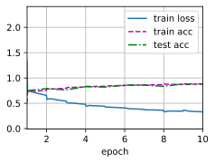

# 1、深度卷积神经网络（AlexNet）


```python
import torch
from torch import nn
from d2l import torch as d2l

net = nn.Sequential( 
            nn.Conv2d(1,96,kernel_size=11,stride=4,padding=1), nn.ReLU(),     #(224-11+2+4)/4=54        [1,96,54,54]
            nn.MaxPool2d(kernel_size=(3,3),stride=2),                         #(54-3+2)/2=26             [1,96,26,26] 
            nn.Conv2d(96,256,kernel_size=5,padding=2), nn.ReLU(),             #(26-5+4+1)=26             [1,256,26,26]
            nn.MaxPool2d(kernel_size=(3,3),stride=2),                         #(26-3+2)/2=12             [1,256,12,12]
            nn.Conv2d(256,384,kernel_size=3,padding=1), nn.ReLU(),            #(12-3+1+2)=12             [1,384,12,12]
            nn.Conv2d(384,384,kernel_size=3,padding=1), nn.ReLU(),             #                            [1,384,12,12]
            nn.Conv2d(384,256,kernel_size=3,padding=1), nn.ReLU(),           #小改动通道256            [1,256,12,12]
            nn.MaxPool2d(kernel_size=(3,3),stride=2), nn.Flatten(),           #(12-3+2)/2=5            [1,256,5,5] --->[1,256*5*5]
            nn.Linear(6400,4096),nn.ReLU(),nn.Dropout(p=0.5),            #6400需要出头算起            [1,6400]->[1,4096]
            nn.Linear(4096,4096),nn.ReLU(),nn.Dropout(p=0.5),                                          #[1,6400]->[1,4096]
            nn.Linear(4096,10)                                                                          #[1,4096]->[1,10]
            )
```

构造单通道数据，观察每层输出的形状


```python
X = torch.randn(1,1,224,224)
for layer in net:
    X = layer(X)
    print(layer.__class__.__name__,'Output shape: \t',X.shape)
```

    Conv2d Output shape: 	 torch.Size([1, 96, 54, 54])
    ReLU Output shape: 	 torch.Size([1, 96, 54, 54])
    MaxPool2d Output shape: 	 torch.Size([1, 96, 26, 26])
    Conv2d Output shape: 	 torch.Size([1, 256, 26, 26])
    ReLU Output shape: 	 torch.Size([1, 256, 26, 26])
    MaxPool2d Output shape: 	 torch.Size([1, 256, 12, 12])
    Conv2d Output shape: 	 torch.Size([1, 384, 12, 12])
    ReLU Output shape: 	 torch.Size([1, 384, 12, 12])
    Conv2d Output shape: 	 torch.Size([1, 384, 12, 12])
    ReLU Output shape: 	 torch.Size([1, 384, 12, 12])
    Conv2d Output shape: 	 torch.Size([1, 256, 12, 12])
    ReLU Output shape: 	 torch.Size([1, 256, 12, 12])
    MaxPool2d Output shape: 	 torch.Size([1, 256, 5, 5])
    Flatten Output shape: 	 torch.Size([1, 6400])
    Linear Output shape: 	 torch.Size([1, 4096])
    ReLU Output shape: 	 torch.Size([1, 4096])
    Dropout Output shape: 	 torch.Size([1, 4096])
    Linear Output shape: 	 torch.Size([1, 4096])
    ReLU Output shape: 	 torch.Size([1, 4096])
    Dropout Output shape: 	 torch.Size([1, 4096])
    Linear Output shape: 	 torch.Size([1, 10])


# 准备数据集


```python
batch_size = 128
train_iter,test_iter = d2l.load_data_fashion_mnist(batch_size=batch_size,resize=224)
```


```python
def evaluate_accuracy_gpu(net,data_iter,device=None):
    """使用GPU计算模型在数据集上的精度"""
    if isinstance(net,torch.nn.Module):
        net.eval()                                    #进入评估模式
        if not device:                               #将网络层中的第一个参数的device拿出来
            device = next(iter(net.parameters())).device
    metric = d2l.Accumulator(2)                      #做一个累加器
    for X,y in data_iter:                            
        if isinstance(X,list):                       #如果数据是list就每个挪一下
            X = [x.to(device) for x in X]
        else:
            X = X.to(device)                          #如果是tensor就挪一次
        y = y.to(device)                              #把标签也放过去
        metric.add(d2l.accuracy(net(X),y),y.numel())   #计算  accuracy，计算y的个数
        return metric[0]/metric[1]
```


```python
def train_ch6(net,train_iter,test_iter,num_epochs,lr,device):
    """使用GPU进行训练"""
    def init_weights(m):
        if type(m) ==nn.Linear or type(m) == nn.Conv2d:
            nn.init.xavier_uniform_(m.weight)             #根据输入输出大小，评估模型方差，保证模型一开始不要炸了
    net.apply(init_weights)                            #对net中每一个parameter初始化权重
    print("training on ", device)
    net.to(device)                                    #参数挪到device
    optimizer = torch.optim.SGD(net.parameters(),lr=lr)  
    loss = nn.CrossEntropyLoss()                      #多类分类问题
    animator = d2l.Animator(xlabel = 'epoch',xlim=[1,num_epochs],             #动画效果
                            legend=['train loss','train acc','test acc'])
    timer,num_batches = d2l.Timer() , len(train_iter)
    for epoch in range(num_epochs):               #对每次输入做迭代   
        metric = d2l.Accumulator(3)
        net.train()
        for i ,(X,y) in enumerate(train_iter):      #每次迭代中取一个batch
            timer.start()
            optimizer.zero_grad()                    #梯度设零
            X,y = X.to(device),y.to(device)         #挪到gpu
            y_hat = net(X)                          #X丢进网络,前向操作，
            l = loss(y_hat,y)                       #计算损失
            l.backward()                             #计算梯度
            optimizer.step()                        #优化权重参数
            metric.add(l*X.shape[0],d2l.accuracy(y_hat,y),X.shape[0])  #存储绘图参数值
            timer.stop()
            train_l = metric[0]/metric[2]
            train_acc = metric[1] / metric[2]
            if (i+1) %(num_batches//5) == 0 or i == num_epochs-1:
                animator.add(epoch+(i+1)/num_batches,
                            (train_l,train_acc,None))
        test_acc = evaluate_accuracy_gpu(net,test_iter)
        animator.add(epoch+1 ,(None,None,test_acc))
    print(f'loss {train_l:.3f}, trian acc {train_acc:.3f} , test acc {test_acc:.3f}')
    print(f'{metric[2]*num_epochs/timer.sum():.1f} ',f'expamples/sec on {str(device)}')
            
            
```


```python
lr , num_epochs = 0.01 ,10
train_ch6(net,train_iter,test_iter,num_epochs,lr,d2l.try_gpu())
```

    loss 0.332, trian acc 0.878 , test acc 0.883
    3059.6  expamples/sec on cuda:0


    

    

