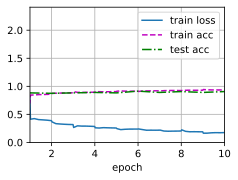

# 使用块的网络 VGG


```python
import torch
from torch import nn
from d2l import torch as d2l

def vgg_block(num_convs,in_channels,out_channels):
    layers = []
    for _ in range(num_convs):
        layers.append(nn.Conv2d(in_channels,out_channels,kernel_size=3,padding=1))
        layers.append(nn.ReLU())
        in_channels = out_channels
    layers.append(nn.MaxPool2d(kernel_size=2,stride=2))
    return nn.Sequential(*layers)
```


```python
conv_arch = ((1,64),(1,128),(2,256),(2,512),(2,512))
def vgg(conv_arch):
    conv_blks = []
    in_channels = 1
    for (num_convs , out_channels) in conv_arch:
        conv_blks.append(vgg_block(num_convs,in_channels,out_channels))
        in_channels = out_channels
    return nn.Sequential(*conv_blks,nn.Flatten(),
                        nn.Linear(out_channels*7*7,4096),nn.ReLU(),
                        nn.Dropout(0.5),nn.Linear(4096,4096),nn.ReLU(),
                        nn.Dropout(0.5),nn.Linear(4096,10)
                        )
net = vgg(conv_arch)
```


```python
X = torch.randn(size=(1,1,224,224))
for blk in net:
    X = blk(X)
    print(blk.__class__.__name__, 'output shape :\t' , X.shape)
```

    Sequential output shape :	 torch.Size([1, 64, 112, 112])
    Sequential output shape :	 torch.Size([1, 128, 56, 56])
    Sequential output shape :	 torch.Size([1, 256, 28, 28])
    Sequential output shape :	 torch.Size([1, 512, 14, 14])
    Sequential output shape :	 torch.Size([1, 512, 7, 7])
    Flatten output shape :	 torch.Size([1, 25088])
    Linear output shape :	 torch.Size([1, 4096])
    ReLU output shape :	 torch.Size([1, 4096])
    Dropout output shape :	 torch.Size([1, 4096])
    Linear output shape :	 torch.Size([1, 4096])
    ReLU output shape :	 torch.Size([1, 4096])
    Dropout output shape :	 torch.Size([1, 4096])
    Linear output shape :	 torch.Size([1, 10])


用于VGG-11比AlexNet计算量更大，因此我们构建了通道数较少的网络


```python
ratio = 4
small_conv_arch = [(pair[0],pair[1]//ratio) for pair in conv_arch]
net = vgg(small_conv_arch)
```


```python
batch_size = 128
train_iter,test_iter = d2l.load_data_fashion_mnist(batch_size=batch_size,resize=224)
```


```python
def evaluate_accuracy_gpu(net,data_iter,device=None):
    """使用GPU计算模型在数据集上的精度"""
    if isinstance(net,torch.nn.Module):
        net.eval()                                    #进入评估模式
        if not device:                               #将网络层中的第一个参数的device拿出来
            device = next(iter(net.parameters())).device
    metric = d2l.Accumulator(2)                      #做一个累加器
    for X,y in data_iter:                            
        if isinstance(X,list):                       #如果数据是list就每个挪一下
            X = [x.to(device) for x in X]
        else:
            X = X.to(device)                          #如果是tensor就挪一次
        y = y.to(device)                              #把标签也放过去
        metric.add(d2l.accuracy(net(X),y),y.numel())   #计算  accuracy，计算y的个数
        return metric[0]/metric[1]
```


```python
def train_ch6(net,train_iter,test_iter,num_epochs,lr,device):
    """使用GPU进行训练"""
    def init_weights(m):
        if type(m) ==nn.Linear or type(m) == nn.Conv2d:
            nn.init.xavier_uniform_(m.weight)             #根据输入输出大小，评估模型方差，保证模型一开始不要炸了
    net.apply(init_weights)                            #对net中每一个parameter初始化权重
    print("training on ", device)
    net.to(device)                                    #参数挪到device
    optimizer = torch.optim.SGD(net.parameters(),lr=lr)  
    loss = nn.CrossEntropyLoss()                      #多类分类问题
    animator = d2l.Animator(xlabel = 'epoch',xlim=[1,num_epochs],             #动画效果
                            legend=['train loss','train acc','test acc'])
    timer,num_batches = d2l.Timer() , len(train_iter)
    for epoch in range(num_epochs):               #对每次输入做迭代   
        metric = d2l.Accumulator(3)
        net.train()
        for i ,(X,y) in enumerate(train_iter):      #每次迭代中取一个batch
            timer.start()
            optimizer.zero_grad()                    #梯度设零
            X,y = X.to(device),y.to(device)         #挪到gpu
            y_hat = net(X)                          #X丢进网络,前向操作，
            l = loss(y_hat,y)                       #计算损失
            l.backward()                             #计算梯度
            optimizer.step()                        #优化权重参数
            metric.add(l*X.shape[0],d2l.accuracy(y_hat,y),X.shape[0])  #存储绘图参数值
            timer.stop()
            train_l = metric[0]/metric[2]
            train_acc = metric[1] / metric[2]
            if (i+1) %(num_batches//5) == 0 or i == num_epochs-1:
                animator.add(epoch+(i+1)/num_batches,
                            (train_l,train_acc,None))
        test_acc = evaluate_accuracy_gpu(net,test_iter)
        animator.add(epoch+1 ,(None,None,test_acc))
    print(f'loss {train_l:.3f}, trian acc {train_acc:.3f} , test acc {test_acc:.3f}')
    print(f'{metric[2]*num_epochs/timer.sum():.1f} ',f'expamples/sec on {str(device)}')
            
            
```


```python
lr , num_epochs = 0.05 ,10

train_ch6(net,train_iter,test_iter,num_epochs,lr,d2l.try_gpu())
```

    loss 0.175, trian acc 0.935 , test acc 0.906
    1402.1  expamples/sec on cuda:0


    

    

