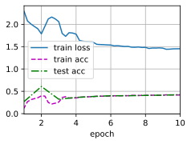

# 1、网络中的网络 NiN


```python
import torch
from torch import nn
from d2l import torch as d2l

def nin_block(in_chanels,out_channels,kernel_size,strides,padding):
    return nn.Sequential(
        nn.Conv2d(in_chanels,out_channels,kernel_size,strides,padding),nn.ReLU(),
        nn.Conv2d(out_channels,out_channels,kernel_size=1),nn.ReLU(),
        nn.Conv2d(out_channels,out_channels,kernel_size=1),nn.ReLU()
    )
```

NiN模型


```python
net = nn.Sequential(
    nin_block(1,96,kernel_size=11,strides=4,padding=0),        #来自AlexNet
    nn.MaxPool2d(kernel_size=3,stride=2),                      #高宽减半
    nin_block(96,256,kernel_size=5,strides=1,padding=2),       #来自AlexNet，加两个1*1的卷积层
    nn.MaxPool2d(kernel_size=3,stride=2),                      
    nin_block(256,384,kernel_size=3,strides=1,padding=1),
    nn.MaxPool2d(3,stride=2),nn.Dropout(0.5),
    nin_block(384,10,kernel_size=3,strides=1,padding=1),        #通道数降成10
    nn.AdaptiveAvgPool2d((1,1)),                                #全局平均池化，高宽都变成1
    nn.Flatten()                                                #4d 最后两个维度消掉     ---》softmax
)
```

查看每个块的输出形状


```python
X = torch.rand(size=(1,1,224,224))
for layer in net:
    X = layer(X)
    print(layer.__class__.__name__,"output shape: :\t",X.shape)
```

    Sequential output shape: :	 torch.Size([1, 96, 54, 54])
    MaxPool2d output shape: :	 torch.Size([1, 96, 26, 26])
    Sequential output shape: :	 torch.Size([1, 256, 26, 26])
    MaxPool2d output shape: :	 torch.Size([1, 256, 12, 12])
    Sequential output shape: :	 torch.Size([1, 384, 12, 12])
    MaxPool2d output shape: :	 torch.Size([1, 384, 5, 5])
    Dropout output shape: :	 torch.Size([1, 384, 5, 5])
    Sequential output shape: :	 torch.Size([1, 10, 5, 5])
    AdaptiveAvgPool2d output shape: :	 torch.Size([1, 10, 1, 1])
    Flatten output shape: :	 torch.Size([1, 10])


训练模型


```python
lr,num_epochs,batch_size = 0.1 ,10,128
train_iter,test_iter = d2l.load_data_fashion_mnist(batch_size,resize=224)
```


```python
d2l.train_ch6(net,train_iter,test_iter,num_epochs,lr,d2l.try_gpu())
```

    loss 1.453, train acc 0.417, test acc 0.425
    2303.3 examples/sec on cuda:0


    

    

