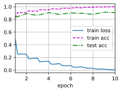

# 构建Residual块


```python
import torch
from torch import nn
from d2l import torch as d2l
from torch.nn import functional as F

class Residual(nn.Module):
    def __init__(self,input_channels,num_channels,use_1x1conv=False,strides = 1):
        super().__init__()
        self.conv1 = nn.Conv2d(input_channels,num_channels,kernel_size =3,padding=1,stride = strides)
        self.conv2 = nn.Conv2d(num_channels,num_channels,kernel_size=3,padding=1)
        if use_1x1conv:
            self.conv3 = nn.Conv2d(input_channels,num_channels,kernel_size=1,stride= strides)
        else:
            self.conv3 = None
        self.bn1 = nn.BatchNorm2d(num_channels)
        self.bn2 = nn.BatchNorm2d(num_channels)
        self.relu = nn.ReLU(inplace=True)
        
    def forward(self ,X):
        Y = F.relu(self.bn1(self.conv1(X)))
        Y = self.bn2(self.conv2(Y))
        if self.conv3:
            X = self.conv3(X)
        Y +=X
        return F.relu(Y)
        
```


```python
blk = Residual(3,3)
X = torch.rand(4,3,6,6)
Y = blk(X)
Y.shape
```


    torch.Size([4, 3, 6, 6])


```python
blk = Residual(3,6,use_1x1conv=True,strides=2)
blk(X).shape
```


    torch.Size([4, 6, 3, 3])


```python
b1 = nn.Sequential( nn.Conv2d(1,64,kernel_size=7,stride=2,padding=3),nn.BatchNorm2d(64), nn.ReLU(),
                    nn.MaxPool2d(kernel_size=3,stride=2,padding=1)   
                  )
def resnet_block(input_channels,num_channels,num_residuals,first_block=False):
    blk = []
    for i in range(num_residuals):           #构造n个
        if i == 0 and not first_block:
            blk.append(Residual(input_channels,num_channels,use_1x1conv=True,strides=2))  #第一个设置高宽减半
        else:
            blk.append(Residual(num_channels,num_channels))
    return blk

b2 = nn.Sequential(*resnet_block(64,64,2,first_block=True))
b3 = nn.Sequential(*resnet_block(64,128,2))
b4 = nn.Sequential(*resnet_block(128,256,2))
b5 = nn.Sequential(*resnet_block(256,512,2))

net = nn.Sequential(b1,b2,b3,b4,b5,nn.AdaptiveAvgPool2d((1,1)),nn.Flatten(),nn.Linear(512,10))
```

观察ResNet中不同模块的输入形状是如何变化的


```python
X = torch.rand(size=(1,1,224,224))
for layer in net:
    X = layer(X)
    print(layer.__class__.__name__,'output shape :\t',X.shape)
```

    Sequential output shape :	 torch.Size([1, 64, 56, 56])
    Sequential output shape :	 torch.Size([1, 64, 56, 56])
    Sequential output shape :	 torch.Size([1, 128, 28, 28])
    Sequential output shape :	 torch.Size([1, 256, 14, 14])
    Sequential output shape :	 torch.Size([1, 512, 7, 7])
    AdaptiveAvgPool2d output shape :	 torch.Size([1, 512, 1, 1])
    Flatten output shape :	 torch.Size([1, 512])
    Linear output shape :	 torch.Size([1, 10])


```python
lr, num_epochs,batch_size = 0.05,10,256
train_iter, test_iter = d2l.load_data_fashion_mnist(batch_size,resize=(96,96))
d2l.train_ch6(net,train_iter,test_iter,num_epochs,lr,d2l.try_gpu())
```

    loss 0.007, train acc 0.999, test acc 0.907
    3207.0 examples/sec on cuda:0


    

    

