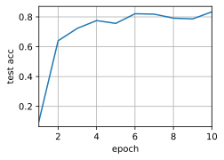

# 多GPU训练实现


```python
%matplotlib inline
import torch
from torch import nn
from torch.nn import functional as F
from d2l import torch as d2l

```

简单网络 LeNET


```python
scale = 0.01
W1 = torch.randn(size=(20,1,3,3))*scale
b1 = torch.zeros(20)
W2 = torch.randn(size=(50,20,5,5))*scale
b2 = torch.zeros(50)
W3 = torch.randn(size=(800,128))*scale
b3 = torch.zeros(128)
W4 = torch.randn(size=(128,10))*scale
b4 = torch.zeros(10)

params = [W1,b1,W2,b2,W3,b3,W4,b4]

def lenet(X,params):
    h1_conv = F.conv2d(input=X,weight=params[0],bias = params[1])
    h1_activation = F.relu(h1_conv)
    h1 = F.avg_pool2d(input=h1_activation,kernel_size = (2,2),stride = 2)
    h2_conv = F.conv2d(input = h1,weight=params[2],bias=params[3])
    h2_activation = F.relu(h2_conv)
    h2 = F.avg_pool2d(input=h2_activation,kernel_size=(2,2),stride=2)
    h2 = h2.reshape(h2.shape[0],-1)
    h3_linear = torch.mm(h2,params[4])+params[5]
    h3 = F.relu(h3_linear)
    y_hat = torch.mm(h3,params[6])+params[7]
    return y_hat
loss = nn.CrossEntropyLoss(reduction='none')
    
```

多个设备分发参数


```python
def get_params(params,device):
    new_params = [p.clone().to(device) for p in params]
    for p in new_params:
        p.requires_grad_()
    return new_params

new_params = get_params(params,d2l.try_gpu(0))
print('b1 weight:',new_params[1])
print('b1 grad',new_params[1].grad)
```

    b1 weight: tensor([0., 0., 0., 0., 0., 0., 0., 0., 0., 0., 0., 0., 0., 0., 0., 0., 0., 0., 0., 0.],
           device='cuda:0', requires_grad=True)
    b1 grad None


allreduce 函数将所用有向量相加，b1将结果广播给所有GPU


```python
data = torch.arange(20).reshape(4,5)
devices = [torch.device('cuda:0'),torch.device('cuda:1')]
split = nn.parallel.scatter(data,devices)                        #将tensor均匀切开分配到给定GPU
print('input:',data)
print('load into',devices)
print('output:',split)
```

    input: tensor([[ 0,  1,  2,  3,  4],
            [ 5,  6,  7,  8,  9],
            [10, 11, 12, 13, 14],
            [15, 16, 17, 18, 19]])
    load into [device(type='cuda', index=0), device(type='cuda', index=1)]
    output: (tensor([[0, 1, 2, 3, 4],
            [5, 6, 7, 8, 9]], device='cuda:0'), tensor([[10, 11, 12, 13, 14],
            [15, 16, 17, 18, 19]], device='cuda:1'))


```python
def allreduce(data):
    for i in range(1,len(data)):
        data[0][:] += data[i].to(data[0].device)        
    for i in range(1,len(data)):
        data[i] = data[0].to(data[i].device)

data = [torch.ones((1,2),device = d2l.try_gpu(i)) *(i +1) for i in range(len(devices))]
print('before allreduce:\n',data[0],'\n',data[1])
allreduce(data)
print('after allreduce:\n',data[0],'\n',data[1])
```

    before allreduce:
     tensor([[1., 1.]], device='cuda:0') 
     tensor([[2., 2.]], device='cuda:1')
    after allreduce:
     tensor([[3., 3.]], device='cuda:0') 
     tensor([[3., 3.]], device='cuda:1')


将一个小批量数据均匀的分布在多个GPU上


```python
def split_batch(X,y,devices):
    """将 X 和 y 拆分到多个设备"""
    assert X.shape[0] == y.shape[0]
    return (nn.parallel.scatter(X,devices),
            nn.parallel.scatter(y,devices))
```

在多GPU上训练一个小批量


```python
def train_batch(X,y,device_params,devices,lr):
    X_shards,y_shards = split_batch(X,y,devices)                #均匀分配
    ls = [
        loss(lenet(
            X_shard,devic_W),y_shard).sum()
                for X_shard ,y_shard,devic_W in zip(X_shards,y_shards,device_params)]    #对每个gpu上小批量样本计算loss   
    for l in ls:                                             #对里面每一个计算梯度
        l.backward()
    with torch.no_grad():
        for i in range(len(device_params[0])):                #遍历每个GPU上的每一层
            allreduce([device_params[c][i].grad               #i是每一层，对所有的GPU的梯度拿出来，做allreduce，然后广播会每个梯度
                       for c in range(len(devices))])         #对每个GPU上样本梯度累加后广播      
    for param in device_params:                               #对每一个gpu做sgd，会有点冗余
        d2l.sgd(param,lr,X.shape[0])
```

## 定义训练函数


```python
def train(num_gpus,batch_size,lr):
    train_iter , test_iter = d2l.load_data_fashion_mnist(batch_size)
    devices = [d2l.try_gpu(i) for i in range (num_gpus)]
    device_params = [get_params(params , d) for d in devices]
    num_epochs = 10
    animator = d2l.Animator('epoch','test acc',xlim=[1,num_epochs])
    timer = d2l.Timer()
    for epoch in range(num_epochs):
        timer.start()
        for X,y in train_iter:
            train_batch(X,y,device_params,devices,lr)
            torch.cuda.synchronize()                       #保证每个做完后同步一次
        timer.stop()
        animator.add(epoch+1,(d2l.evaluate_accuracy_gpu(
            lambda x:lenet(x, device_params[0]),test_iter,devices[0])))
    print(f'test acc: {animator.Y[0][-1]:.2f},{timer.avg():.1f} sec',f' on {str(devices)}')
```


```python
train(num_gpus=1,batch_size=256,lr=0.2)
```

    test acc: 0.83,1.7 sec  on [device(type='cuda', index=0)]


    

    


```python
train(num_gpus=2,batch_size=256,lr=0.2)
```

    test acc: 0.78,1.9 sec  on [device(type='cuda', index=0), device(type='cuda', index=1)]


    

    


```python
train(num_gpus=2,batch_size=256*2,lr=0.2)
```

    test acc: 0.62,1.6 sec  on [device(type='cuda', index=0), device(type='cuda', index=1)]


    

    

