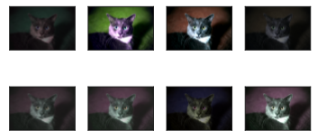

```python
%matplotlib inline
import torch
import torchvision
from torch import nn
from d2l import torch as d2l

d2l.set_figsize()
img = d2l.Image.open('./data/tmp2E5F.png')
d2l.plt.imshow(img)                     
```


    <matplotlib.image.AxesImage at 0x7fd01038c3d0>


    

    


```python
def apply(img,aug,num_rows=2,num_cols=4,scalel=1.5):
    Y = [aug(img) for _ in range(num_rows*num_cols)]
    d2l.show_images(Y,num_rows,num_cols,scale=scalel)

```

左右翻转图像


```python
apply(img,torchvision.transforms.RandomHorizontalFlip())
```


    

    


上下翻转


```python
apply(img,torchvision.transforms.RandomVerticalFlip())
```


    

    


随机剪裁


```python
shape_aug = torchvision.transforms.RandomResizedCrop(
        (200,200),scale=(0.1,1),ratio=(0.5,2))
apply(img,shape_aug)
```


    

    


随机改变图片亮度


```python
apply(img,torchvision.transforms.ColorJitter(brightness=0.5,contrast=0,saturation=0,hue=0))
```


    

    


随机改变图片色调


```python
apply(img,torchvision.transforms.ColorJitter(brightness=0,contrast=0,saturation=0,hue=0.5))
```


    

    


随机更改图片亮度（brightness）、对比度（contrast）、饱和度（saturation）和色调（hue）


```python
color_aug = torchvision.transforms.ColorJitter(brightness=0.5,contrast=0.5,saturation=0.5,hue=0.5)
apply(img,color_aug)
```


    

    


结合多种图像增广方法


```python
augs = torchvision.transforms.Compose([
    torchvision.transforms.RandomHorizontalFlip(),
    color_aug,shape_aug
])
apply(img,augs)
```


    

    


使用图像增广进行训练


```python
!mkdir ./data/cifar10
```

    mkdir: 无法创建目录"./data/cifar10": 文件已存在


```python
all_images = torchvision.datasets.CIFAR10(
            train=True,root='./data/cifar10',download=True)
```

    Files already downloaded and verified


```python
d2l.show_images([all_images[i][0] for i in range(32)],4,8,scale=0.8)
```


    array([<AxesSubplot:>, <AxesSubplot:>, <AxesSubplot:>, <AxesSubplot:>,
           <AxesSubplot:>, <AxesSubplot:>, <AxesSubplot:>, <AxesSubplot:>,
           <AxesSubplot:>, <AxesSubplot:>, <AxesSubplot:>, <AxesSubplot:>,
           <AxesSubplot:>, <AxesSubplot:>, <AxesSubplot:>, <AxesSubplot:>,
           <AxesSubplot:>, <AxesSubplot:>, <AxesSubplot:>, <AxesSubplot:>,
           <AxesSubplot:>, <AxesSubplot:>, <AxesSubplot:>, <AxesSubplot:>,
           <AxesSubplot:>, <AxesSubplot:>, <AxesSubplot:>, <AxesSubplot:>,
           <AxesSubplot:>, <AxesSubplot:>, <AxesSubplot:>, <AxesSubplot:>],
          dtype=object)


    

    


只使用最简单的随机左右翻转


```python
train_augs = torchvision.transforms.Compose([
    torchvision.transforms.RandomHorizontalFlip(),
    torchvision.transforms.ToTensor()
])
test_augs = torchvision.transforms.Compose([
    torchvision.transforms.ToTensor()
])
```

定义辅助函数，以便于读取图像和应用图像增广


```python
def load_cifar10(is_train,augs,batch_size):
    dataset = torchvision.datasets.CIFAR10(
        root = './data/cifar10',train=is_train,
        transform = augs,download = False
    )
    
    dataloader = torch.utils.data.DataLoader(
            dataset,batch_size=batch_size,shuffle=is_train,num_workers=4)
    return dataloader
```

定义一个函数，使用多gpu对模型进行训练和评估


```python
def train_batch_ch13(net,X,y,loss,trainer,devices):
    if isinstance(X,list):
        X = [x.to(devices[0] for x in X)]
    else:
        X = X.to(devices[0])
    y = y.to(devices[0])
    net.train()
    trainer.zero_grad()
    pred = net(X)
    l = loss(pred ,y)
    l.sum().backward()
    trainer.step()
    train_loss_sum = l.sum()
    train_acc_sum = d2l.accuracy(pred,y)
    return train_loss_sum,train_acc_sum

def train_ch13(net,train_iter,test_iter,loss,trainer,num_epochs,devices=d2l.try_all_gpus()):
    timer,num_batches = d2l.Timer(),len(train_iter)
    animator = d2l.Animator(xlabel='epoch',xlim=[1,num_epochs],ylim=[0,1],legend=['train loss','train acc','test acc'])
#     net = nn.DataParallel(net,device_ids=devices).to(devices[0])
    net = net.cuda()
    for epoch in range(num_epochs):
        #4个维度：储存训练损失，训练准确度，实例数，特点数
        metric = d2l.Accumulator(4)
        for i ,(features,labels) in enumerate(train_iter):
            timer.start()
            l,acc =train_batch_ch13(
                net,features,labels,loss,trainer,devices)
            metric.add(l,acc,labels.shape[0],labels.numel())
            timer.stop()
            if(i+1)%(num_batches//5) == 0 or i ==num_batches-1:
                animator.add(epoch+(i+1)/num_batches,(metric[0]/metric[2],metric[1]/metric[3],None))
            test_acc = d2l.evaluate_accuracy_gpu(net,test_iter)
            animator.add(epoch+1,(None,None,test_acc))
        print(f'loss{metric[0]/metric[2]:.3f},train acc'
              f'{metric[1]/metric[3]:.3f},test acc{test_acc:.3f}')
        print(f'{metric[1]*num_epochs/timer.sum():.1f}exmples/sec on {str(devices)}'
             )
    
    
    

```


```python
batch_size,devices,net =256,d2l.try_all_gpus(),d2l.resnet18(10,3)

def init_weights(m):
    if type(m) in [nn.Linear,nn.Conv2d]:
        nn.init.xavier_uniform_(m.weight)
net.apply(init_weights)

def train_with_data_aug(train_augs,test_augs,net,lr=0.001):
    train_iter = load_cifar10(True,train_augs,batch_size)
    test_iter = load_cifar10(False,test_augs,batch_size)
    loss = nn.CrossEntropyLoss(reduction='none')
    trainer = torch.optim.Adam(net.parameters(),lr=lr)
    train_ch13(net,train_iter,test_iter,loss,trainer,10,devices)
    
```


```python
train_with_data_aug(train_augs,test_augs,net)
```

    loss0.169,train acc0.942,test acc0.829
    1654.1exmples/sec on [device(type='cuda', index=0), device(type='cuda', index=1)]


    

    


```python
train_with_data_aug(test_augs,test_augs,net)          #这里是在训练集上使用测试集的增广方式。而不是代表测试集
```

    loss0.033,train acc0.989,test acc0.857
    1722.6exmples/sec on [device(type='cuda', index=0), device(type='cuda', index=1)]


    

    

