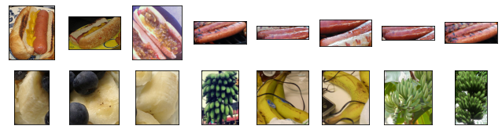
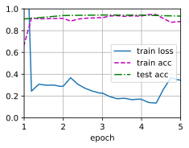
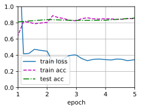

# 微调


```python
%matplotlib inline
import os
import torch
import torchvision
from torch import nn
from d2l import torch as d2l
```


```python
#@save               
d2l.DATA_HUB['hotdog'] = (d2l.DATA_URL + 'hotdog.zip',
                         'fba480ffa8aa7e0febbb511d181409f899b9baa5')

data_dir = d2l.download_extract('hotdog')

train_imgs = torchvision.datasets.ImageFolder(os.path.join(data_dir,'train'))
test_imgs = torchvision.datasets.ImageFolder(os.path.join(data_dir,'test'))
```

图像的大小和纵横比各有不同


```python
hotdogs = [train_imgs[i][0] for i in range(8)]
not_hotdogs = [train_imgs[-i-1][0] for i in range(8)]
d2l.show_images(hotdogs +not_hotdogs,2,8,scale=1.4)
```


    array([<AxesSubplot:>, <AxesSubplot:>, <AxesSubplot:>, <AxesSubplot:>,
           <AxesSubplot:>, <AxesSubplot:>, <AxesSubplot:>, <AxesSubplot:>,
           <AxesSubplot:>, <AxesSubplot:>, <AxesSubplot:>, <AxesSubplot:>,
           <AxesSubplot:>, <AxesSubplot:>, <AxesSubplot:>, <AxesSubplot:>],
          dtype=object)


    

    


s数据增广


```python
normalize = torchvision.transforms.Normalize([0.485,0.456,0.406],[0.229,0.224,0.225])
train_augs = torchvision.transforms.Compose([
    torchvision.transforms.RandomResizedCrop(224),
    torchvision.transforms.RandomHorizontalFlip(),
    torchvision.transforms.ToTensor(),
    normalize
])

test_augs = torchvision.transforms.Compose([
    torchvision.transforms.Resize(224),
    torchvision.transforms.CenterCrop(224),
    torchvision.transforms.ToTensor(),
    normalize
])
```

定义和初始化模型


```python
pretrained_net = torchvision.models.resnet18(pretrained=True)  #不仅将模型拿过来，而且将模型参数拿过来; 这是pretrain
pretrained_net.fc
```


    Linear(in_features=512, out_features=1000, bias=True)


```python
finetune_net = torchvision.models.resnet18(pretrained=True)        #下载预训练模型
finetune_net.fc = nn.Linear(finetune_net.fc.in_features,2)           #将最后全连接层,分类问题改成2分类问题
nn.init.xavier_normal_(finetune_net.fc.weight)                  #只对最后一层weight做随机初始化      
                    
```


    Parameter containing:
    tensor([[ 0.0026, -0.1623, -0.0596,  ..., -0.0453, -0.0063, -0.1450],
            [-0.0554,  0.0253, -0.0593,  ...,  0.0768,  0.1451,  0.0037]],
           requires_grad=True)


```python
#如果param_graop =True ,输出层的模型参数将使用十倍的学习率
def train_fine_tuning(net,learning_rate,batch_size=128,num_epochs=5,param_group = True):
    train_iter = torch.utils.data.DataLoader(torchvision.datasets.ImageFolder(
    os.path.join(data_dir,'train'),transform=train_augs),
    batch_size=batch_size,shuffle=True)
    
    test_iter = torch.utils.data.DataLoader(torchvision.datasets.ImageFolder(
    os.path.join(data_dir,'test'),transform=test_augs),
    batch_size=batch_size)
    #devices = d2l.try_all_gpus()
    devices = [0] 
    loss = nn.CrossEntropyLoss(reduction="none")
    
    if param_group:               #不是最后一层的拿出来，将最后一层设置为10倍学习率，因为他是随机初始的，希望训练快一点
        params_1x = [param for name,param in net.named_parameters()
                    if name not in ["fc.weight","fc.bias"]]
        trainer = torch.optim.SGD([{'params':params_1x},
                                  {'params':net.fc.parameters(),
                                   'lr':learning_rate* 10}],
                                 lr = learning_rate,weight_decay=0.001)
    else:
        trainer = torch.optim.SGD(net.parameters(),lr = learning_rate,
                                     weight_decay=0.001)
    d2l.train_ch13(net,train_iter,test_iter,loss,trainer,num_epochs,devices)
```


```python
train_fine_tuning(finetune_net,5e-5)    #测试集精度高于训练集，overfiting不大
```

    loss 0.346, train acc 0.884, test acc 0.934
    726.8 examples/sec on [0]


    

    


对比实验，不使用与训练模型


```python
scratch_net = torchvision.models.resnet18()
scratch_net.fc = nn.Linear(scratch_net.fc.in_features,2)
train_fine_tuning(scratch_net,5e-4,param_group=False)     #可以看到训练效果差了10个点
```

    loss 0.344, train acc 0.851, test acc 0.859
    725.2 examples/sec on [0]


    

    


```python

```


```python

```
