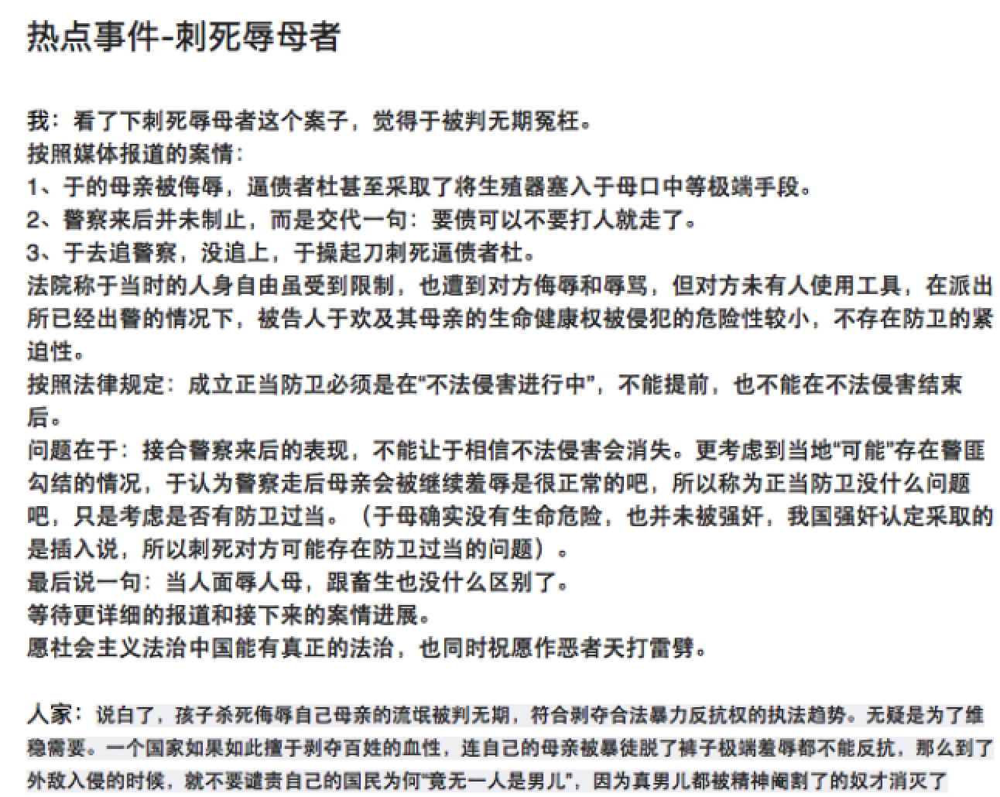
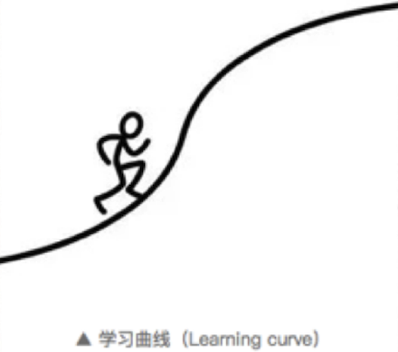

# 是什么决定了你的学习效果

## 一、如何提高学习效率

- 有目的的学习
- 利用别人的经历和脑袋学习
- 积累更多的背景知识

❓：成年学习者的问题

- 想要学习的范围太大、东西太多
- 学习时间不足
- 追求理论和计划的完美，无从下手

### 1.1、**有目的的学习**

①支持学习自主性的2种动力来源：a.兴趣   b. 急用

从急用性出发学习的好处：

- 能够及时的使用这些知识解决问题，得到反馈
- 符合学习新事物的正确步骤，能够更深刻的理解知识
- 问题会提醒学习，促进坚持。

②从急用性出发去学习的做法

1. 列举出自己眼下最想解决的问题，做一个问题清单
2. 为这些问题做一个紧急排名
3. 去豆瓣上去寻找问题相关的书单
4. 从目录和框架出发，找出书单中你最着急阅读的章节
5. 为问题记录答案
6. 其他章节阅读

### 1.2、利用别人的经历和思维去学习

- 利用别人的经历作为学习材料
- 利用别人的思维作为发散方向

当看见一个社会事件，学会思考🤔：

- 如果是我，我会怎么做
- 他是怎么做的，结果如何
- 与他的做法相比，我的做法优点/缺点是什么

- 独立思考：阐述自己的观点
- 理解不同的观点
- 丰富自己的观点

### 1.3、积累更多的背景知识

**背景知识：理解、记忆、认知**

《为什么学生不喜欢上学？》

〝我不会在老板来吃晚饭的时候试用我得新烧烤炉！〞马克喊道。

这句话包含了两个要点：
A，马克要试用他的新烧烤炉。
B，但是他不会再老板来吃晚饭的时候这么做。

为了理解这句话，你需要理解A和B的关系，但是有两个能帮助你联接A和B的信息是文中没有给出的：一是，人们用一个新工具的时候往往很容易出错
二是，马克想给他的老板留下一个好印象。
加入这些信息会帮助你理解：其实这句话的意思是马克想要用自己的新烤炉，但是他担心使用的时候会搞砸，所以他决定不在老板来吃饭的时候用。

①背景知识越多的时候，思考、理解和学习的速度会越快

②学的越多，积累越多的事实和知识，学习的效率就越好，速度就越快。

## 二、如何放大自己的努力效果

### 2.1、找到趋势、定位重点

- 既然用不平衡，就有重点
- 对应人来说，在什么文章投入产出比更高，在什么城市，什么行业？在什么职位？

**纵向：**我所处在的行业/公司/职位，在历史上是什么样子，现在是什么样子，未来是什么样子？

**横向**：我能够选择的其他行业/公司/职位，与我的行业相比，有没有收入差距，为什么有这个差距？

- 行业发展的趋势和重点是什么？
- 公司的趋势和重点是什么
- 部门的趋势和重点是什么？
- 我的工作的趋势和重点是什么？
- 考试的趋势和我复现的重点是什么？

### 2.2、加持杠杆

①总结：为你的努力加持一个外界的杠杆，用杠杆思维持续的观察和分析。

②常常为自己一个问题：除了我自己的努力之外，我还可能撬动的其他资源是什么？

🌰：

- 我 + 北京大学 ------- 撬动了更多的工作机会
- 我 + 演讲比赛 -------撬动了更多的合作机会
- 我 + 直播平台 --------撬动了更多的听众
- 我 + 资本   ----------- 撬动价值更高的事业

### 2.3、保存充沛的热情 挖掘更多的潜能

① 为什么总是没有兴趣？

- 第一，没有深度学习，对于不了解的事情肯定没有兴趣
- 第二，没有获得成就感

② 20小时的学习理论

【怎么放大自己的努力效果】总结：

1. 从趋势中，找到重点，站位
2. 在正确的位置上多次使用外界杠杆
3. 用热情去激发潜能

【如何提高学习效率？】总结：

1. 有目的的学习
2. 利用别人的经历和脑袋学习
3. 积累更多的背景知识