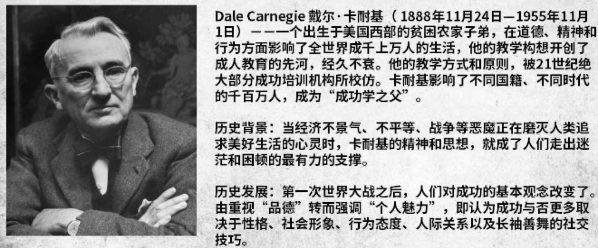
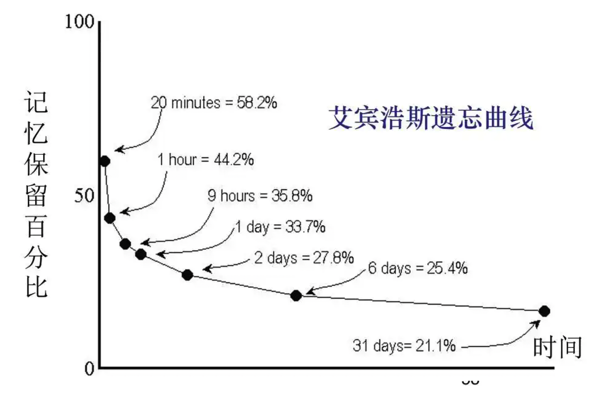
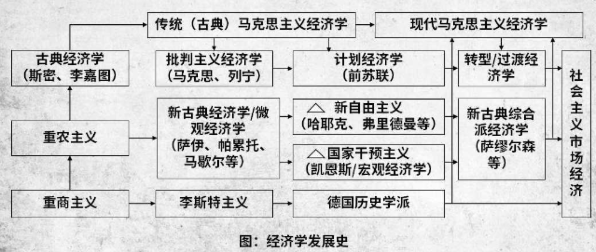
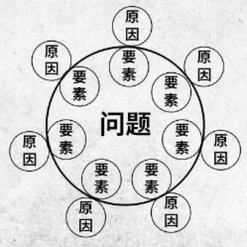
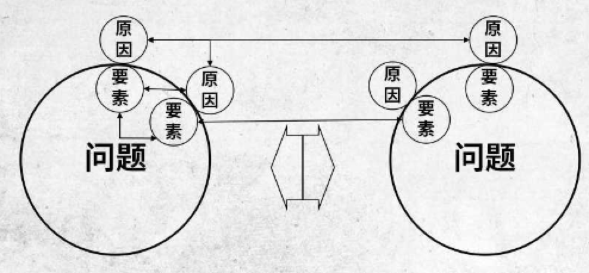
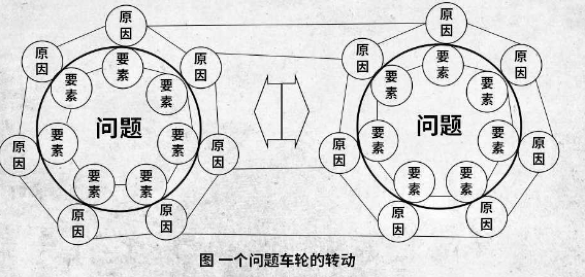

# 学习一切知识前先学“历史”【逆向学习思维】

## 一、为什么先要学历史？

通过掌握发展脉络，更全面所学内容的真实内涵和背景，**理解**，**判断**，**创新**。

## 二、一般性的学习方法和思路

### 2.1、费曼学习法：一种基于提问和传授的学习方法。

1. 选择一个想要理解的概念
2. 设想一种场景，你正要向别人传授这个概念
3. 如果你感觉卡壳了，就回顾一下学习资料
4. 为了让你的讲解通俗易懂，简化语言表达

2.2、艾宾浩斯学习法：一种基于大脑遗忘曲线的学习方法

### 2.3、整体性学习

1. 获取
   - 信息进入眼睛和耳朵，阅读、课堂上记笔记以及个人的种种经历都是获取信息。
   - 重点：获取信息要准确，信息量要压缩提炼
2. 理解
   - 了解信息的基本信息，并联系上下文。
3. 拓展
   - 整个阶段是真题性学习中最花力气的步骤
   - 形成模型、思维高速公路和广泛联系，从而获得良好的结构。
   - 可以采用笔记流和比喻的方法
4. 纠错
   - 在思维模型和思维高速公路中寻找错误
   - 删除信息中无效的联系，可以采用模型纠错法和实际应用法
5. 应用
   - 把纠错带入最后的水平，通过比较知识思考 **信息是如何运行的**来进行调整，如果理解的信息不符合现实世界，那么再多也无用
6. 测试
   - 上述每一个阶段都要测试，有助于找到学习中的问题所在，帮助改进学习技术，克服缺点。

## 三、正向学习与逆向学习

**正向思维：** 由 起因/条件 推 结果/结论 的过程

**逆向思维：** 由结论反推所需要的产生条件，再推回去找到结论的过程

【学习思维】

正向学习：面向现实问题，通过学习多种方法，进而解决问题的过程

逆向学习： 面向问题的演进过程，寻找方法的源头和条件，发现问题最优解的过程

【补充】交大校长王树国讲话：研究问题，领域，搞清楚领域最先进的技术是什么，发展历史，现在自己在哪个阶段，和最先进的技术差距是多少。

🌰：学习社会主义市场经济

学习一切知识之前先学“历史” 属于乐学者

同时，先学“历史” 是一种方法，能够帮助学习者成为后天的乐学者

## 四、历史的学习路径

1. 由上而下，自古从今，循着时代先后来作通体的研究。
   - 全面了解，容易有其它收获
   - 耗时长，容易打击自信心
2. 研究历史的途径，自下而上，自今到古
   - 从问题本身出发，有针对性
   - 容易产生时间上局限性，达不到分析效果
3. 凭借兴趣作为研究问题和相关历史。
   - 快速有效
   - 从个别问题出发，容易了解不深刻

## 五、历史学习的三种境界

1. 史才：能分析，能综合问题，将一件事情剖析开来，从各个方面去看

   

2. 史识：能看到全局，看得长远，看得深入，看见普通人看不见的地方。
   

4. 史德：一种心智修养，不报偏见，不作武断，不凭主观，不求速度。

   

兼备上述三点，可研究高深卓越的造就，通过问题研究发展和演变历史，正可以训练分析能力和综合的头脑，正可增长我们的心智修养，加深我们见识和智慧。

## 六、逆向学习的三个目标

1. 起：起源由来(发现本质)
2. 纵：发展脉络(变化)
3. 横：历史背景（原因）

**现实问题与“历史”学习**

​										"博古通今"  !=  "切中要害"

学习一切知识前先学“历史”的目的是解决问题

学习过程不能脱离问题，变成为了学习历史而学习历史的“学问家”

## 七、总结

1. 先学“历史”是一种思维习惯，是一种长效学习方法
2. 先学“历史”的核心寻找问题的源头和演讲过程，进而解决问题
3. 先学“历史”可从上而下，从下溯上，亦可以兴趣所使
4. 先学“历史”主要培养自己的才，识，德
5. 先学“历史” 主要学习三个方面：起，纵，横
6. 先学“历史” 是以成为某一领域的专家为目标，需要持续性学习