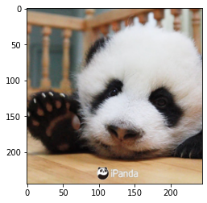
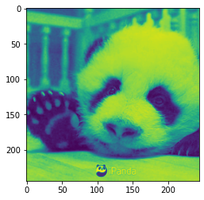
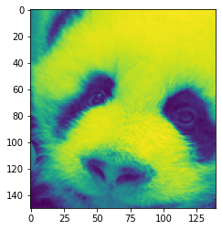

```python
import torch
import numpy as np
from sklearn import datasets
from PIL import Image
import os
import matplotlib.pyplot as plt 
from glob import glob 
import time
```

# 第二章

## 1、Tensor概念

<font color='red'>**张量** </font>：一个不定维度的数组。他是 标量（0维张量），向量（1为维张量），矩阵（二维张量）等 


```python
#标量  包含一个元素的张量成为张量 标量类型通常为FloatTensor 和 LongTensor
x = torch.Tensor(1)
print(x)
x.size()
```

    tensor([4.4842e-44])


    torch.Size([1])


```python
# 向量 一个元素序列的数组
ve = torch.FloatTensor([24,24,24,25,26])
print(ve)
ve.size()
```

    tensor([24., 24., 24., 25., 26.])


    torch.Size([5])


```python
# 矩阵
#使用波士顿房价数据集
boston = datasets.load_boston()
print(type(boston))
boston_tensor = torch.from_numpy(boston.data)
print(type(boston_tensor))
boston_tensor.size()
```

    <class 'sklearn.utils.Bunch'>
    <class 'torch.Tensor'>


    torch.Size([506, 13])


```python
print(os.getcwd())
print(os.path.abspath('./'))
os.chdir('/home/snnu/chenkequan/paperExper/Efficientnet/pytorch深度学习/')
print(os.getcwd())
```

    /home/snnu/chenkequan/paperExper/Efficientnet/pytorch深度学习
    /home/snnu/chenkequan/paperExper/Efficientnet/pytorch深度学习
    /home/snnu/chenkequan/paperExper/Efficientnet/pytorch深度学习


```python
panda = np.array(Image.open('./panda.jpeg').resize((244,244)))
panda_tensor = torch.from_numpy(panda)
panda_tensor.size()
```


    torch.Size([244, 244, 3])


```python
plt.imshow(panda)
```


    <matplotlib.image.AxesImage at 0x7f23b3306a30>


    

    


### 张量的切片


```python
# 张量的切片操作类似 python列表的切片操作 或 numpy的操作
sales = torch.rand(10)
print(sales)
print(sales[:5])
print(sales[ :-3])            #注意：留头去尾

```

    tensor([0.3561, 0.7622, 0.1336, 0.5861, 0.3819, 0.8128, 0.2810, 0.8988, 0.3863,
            0.0204])
    tensor([0.3561, 0.7622, 0.1336, 0.5861, 0.3819])
    tensor([0.3561, 0.7622, 0.1336, 0.5861, 0.3819, 0.8128, 0.2810])


```python
#使用切片操作 选取熊猫的一个通道  torch.Size([244, 244, 3])  3为通道数
plt.imshow(panda_tensor[:,:,0].numpy())
```


    <matplotlib.image.AxesImage at 0x7f23b0b23370>


    

    


```python
# 也可以用来剪裁图片，构造面部检测器
plt.imshow(panda_tensor[50:200,70:210,0].numpy())
```


    <matplotlib.image.AxesImage at 0x7f23b331e0d0>


    

    


```python
# 4维张量 64*244*244*3 一般64代表的是batchsize 也就是批量尺寸，一次给gpu喂入多少张图片
#读取猫咪图片
cats = glob("./catDogDataSet/training_set/training_set/cats/"+'*.jpg')
#将图片转换为numpy数组
cat_imgs = np.array([np.array(Image.open(cat).resize((244,244))) for cat in cats[:64]])
cat_imgs = cat_imgs.reshape(-1,244,244,3)
cat_tensors = torch.from_numpy(cat_imgs)
cat_tensors.size()
```


    torch.Size([64, 244, 244, 3])


```python
# 5维张量  视频数据 1*30*244*244*3  1代表一个视屏数据 ；30 代表有30帧
```

### cuda上的加速


```python
# CPU测试
start_time = time.time()
end_time = time.time()
print(start_time-end_time)
```

    -0.00010609626770019531


```python

```


```python

```


```python

```


```python

```


```python

```


```python

```
