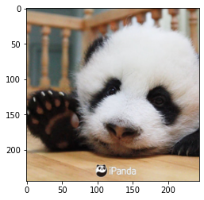
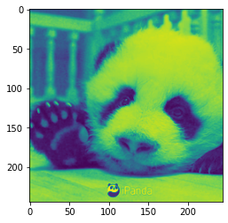
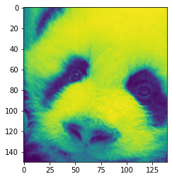

```python
import torch
import numpy as np
from sklearn import datasets
from PIL import Image
import os
import matplotlib.pyplot as plt 
from glob import glob 
import time
from functools import wraps
```

# 第一章

## 1.2、Tensor概念

<font color='red'>**张量** </font>：一个不定维度的数组。他是 标量（0维张量），向量（1为维张量），矩阵（二维张量）等 


```python
#标量  包含一个元素的张量成为张量 标量类型通常为FloatTensor 和 LongTensor
x = torch.Tensor(1)
print(x)
x.size()
```

    tensor([3.4766e-23])


    torch.Size([1])


```python
# 向量 一个元素序列的数组
ve = torch.FloatTensor([24,24,24,25,26])
print(ve)
ve.size()
```

    tensor([24., 24., 24., 25., 26.])


    torch.Size([5])


```python
# 矩阵
#使用波士顿房价数据集
boston = datasets.load_boston()
print(type(boston))
boston_tensor = torch.from_numpy(boston.data)
print(type(boston_tensor))
boston_tensor.size()
```

    <class 'sklearn.utils.Bunch'>
    <class 'torch.Tensor'>


    torch.Size([506, 13])


```python
print(os.getcwd())
print(os.path.abspath('./'))
os.chdir('/home/snnu/chenkequan/paperExper/Efficientnet/pytorch深度学习/')
print(os.getcwd())
```

    /home/snnu
    /home/snnu
    /home/snnu/chenkequan/paperExper/Efficientnet/pytorch深度学习


```python
panda = np.array(Image.open('./panda.jpeg').resize((244,244)))
panda_tensor = torch.from_numpy(panda)
panda_tensor.size()
```


    torch.Size([244, 244, 3])


```python
plt.imshow(panda)
```


    <matplotlib.image.AxesImage at 0x7f20825644c0>


    

    


### 张量的切片


```python
# 张量的切片操作类似 python列表的切片操作 或 numpy的操作
sales = torch.rand(10)
print(sales)
print(sales[:5])
print(sales[ :-3])            #注意：留头去尾

```

    tensor([0.3415, 0.2202, 0.0800, 0.6721, 0.8304, 0.4599, 0.1862, 0.0319, 0.7402,
            0.5107])
    tensor([0.3415, 0.2202, 0.0800, 0.6721, 0.8304])
    tensor([0.3415, 0.2202, 0.0800, 0.6721, 0.8304, 0.4599, 0.1862])


```python
#使用切片操作 选取熊猫的一个通道  torch.Size([244, 244, 3])  3为通道数
plt.imshow(panda_tensor[:,:,0].numpy())
```


    <matplotlib.image.AxesImage at 0x7f208250d610>


    

    


```python
# 也可以用来剪裁图片，构造面部检测器
plt.imshow(panda_tensor[50:200,70:210,0].numpy())
```


    <matplotlib.image.AxesImage at 0x7f2080c772b0>


    

    


```python
# 4维张量 64*244*244*3 一般64代表的是batchsize 也就是批量尺寸，一次给gpu喂入多少张图片
#读取猫咪图片
cats = glob("./catDogDataSet/training_set/training_set/cats/"+'*.jpg')
#将图片转换为numpy数组
cat_imgs = np.array([np.array(Image.open(cat).resize((244,244))) for cat in cats[:64]])
cat_imgs = cat_imgs.reshape(-1,244,244,3)
cat_tensors = torch.from_numpy(cat_imgs)
cat_tensors.size()
```


    torch.Size([64, 244, 244, 3])


```python
# 5维张量  视频数据 1*30*244*244*3  1代表一个视屏数据 ；30 代表有30帧
```

### cuda上的加速


```python
def cal_time(fun):
    def cal(*args,**kwargs):
        star=time.time()
        res=fun(*args,**kwargs)
        end=time.time()
        print(fun.__name__,'花销时间为',end-star,'秒')
        return res
    return cal
        
```


```python
# CPU测试
@cal_time
def creat_tensor():
    x_cpu = torch.randn((50000,10000))
    y_cpu = torch.randn((50000,10000))
    return x_cpu,y_cpu
@cal_time
def cal_cpu(x,y):
    return x_cpu+y_cpu
```


```python
x_cpu,y_cpu = creat_tensor()
print(cal_cpu(x_cpu,y_cpu))   
```

    creat_tensor 花销时间为 7.781049966812134 秒
    cal_cpu 花销时间为 0.7585670948028564 秒
    tensor([[ 0.4218, -1.0934, -1.8450,  ...,  1.0817,  0.2299,  1.1149],
            [ 0.6395,  2.5215,  0.1921,  ..., -3.1240,  1.7373, -2.1196],
            [-2.9321, -2.2304, -1.5508,  ..., -0.4232, -0.7614, -2.4405],
            ...,
            [-1.7179,  0.2312, -0.0456,  ..., -1.2327, -1.7076, -1.5357],
            [-0.6335,  0.4866,  0.1738,  ...,  0.2655, -0.6369,  1.9307],
            [-0.0963,  0.3834, -1.5777,  ...,  1.1345,  1.8132,  1.0807]])


```python
# GPU测试
@cal_time
def creat_tensor_gpu():
    x_gpu = torch.randn((50000,10000),device='cuda')
    y_gpu = torch.randn((50000,10000),device='cuda')
    return x_gpu,y_gpu
@cal_time
def cal_gpu(x,y):
    return torch.add(x_gpu,y_gpu)
```


```python
x_gpu,y_gpu = creat_tensor_gpu()
print(cal_gpu(x_gpu,y_gpu))   
```

    creat_tensor_gpu 花销时间为 3.0725808143615723 秒
    cal_gpu 花销时间为 0.0021376609802246094 秒
    tensor([[ 1.2633,  0.0651,  0.1060,  ..., -1.1363,  0.7937, -0.5824],
            [-0.5406,  0.1474, -0.1843,  ..., -0.1312,  0.2232,  1.2701],
            [ 2.0337, -1.2932, -2.6606,  ...,  1.1343, -0.4229,  0.5408],
            ...,
            [-1.7416,  0.1344, -0.4626,  ...,  1.9360,  0.6391,  3.6585],
            [-0.9642, -0.3821, -3.2032,  ..., -1.6488, -1.2991, -1.4392],
            [ 0.7526,  2.2511, -0.5516,  ..., -1.0669, -0.2451,  0.7008]],
           device='cuda:0')


```python

```


```python

```


```python

```
