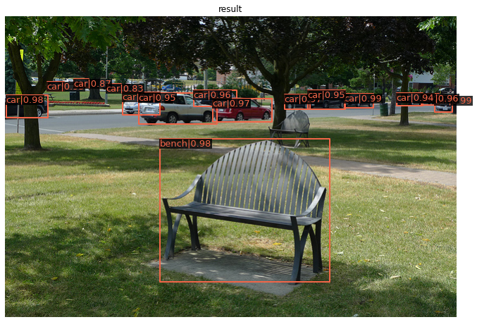

# MMDetection 教程

## 1、安装配置MMDetection


```python
#新建conda环境
!conda env list        
```

    # conda environments:
    #
                             /home/snnu/anaconda3
                             /home/snnu/anaconda3/envs/jxl
                             /home/snnu/anaconda3/envs/torch18
                             /home/snnu/anaconda3/envs/zt
    base                     /home/snnu/miniconda3
    mmcls                    /home/snnu/miniconda3/envs/mmcls
    mmdet                    /home/snnu/miniconda3/envs/mmdet
    mmdet17               *  /home/snnu/miniconda3/envs/mmdet17
    mmpose                   /home/snnu/miniconda3/envs/mmpose
    paddleVedio              /home/snnu/miniconda3/envs/paddleVedio
    tensorflow               /home/snnu/miniconda3/envs/tensorflow
    torch18                  /home/snnu/miniconda3/envs/torch18
    


```python
!pip list
```

    Package             Version
    ------------------- ---------
    argon2-cffi         21.1.0
    attrs               21.2.0
    backcall            0.2.0
    bleach              4.1.0
    certifi             2021.10.8
    cffi                1.15.0
    debugpy             1.5.1
    decorator           5.1.0
    defusedxml          0.7.1
    entrypoints         0.3
    importlib-resources 5.4.0
    ipykernel           6.5.0
    ipython             7.29.0
    ipython-genutils    0.2.0
    ipywidgets          7.6.5
    jedi                0.18.0
    Jinja2              3.0.3
    jsonschema          4.2.1
    jupyter             1.0.0
    jupyter-client      7.0.6
    jupyter-console     6.4.0
    jupyter-core        4.9.1
    jupyterlab-pygments 0.1.2
    jupyterlab-widgets  1.0.2
    MarkupSafe          2.0.1
    matplotlib-inline   0.1.3
    mistune             0.8.4
    nbclient            0.5.8
    nbconvert           6.3.0
    nbformat            5.1.3
    nest-asyncio        1.5.1
    notebook            6.4.5
    packaging           21.2
    pandocfilters       1.5.0
    parso               0.8.2
    pexpect             4.8.0
    pickleshare         0.7.5
    pip                 21.2.4
    prometheus-client   0.12.0
    prompt-toolkit      3.0.22
    ptyprocess          0.7.0
    pycparser           2.21
    Pygments            2.10.0
    pyparsing           2.4.7
    pyrsistent          0.18.0
    python-dateutil     2.8.2
    pyzmq               22.3.0
    qtconsole           5.2.0
    QtPy                1.11.2
    Send2Trash          1.8.0
    setuptools          58.0.4
    six                 1.16.0
    terminado           0.12.1
    testpath            0.5.0
    tornado             6.1
    traitlets           5.1.1
    wcwidth             0.2.5
    webencodings        0.5.1
    wheel               0.37.0
    widgetsnbextension  3.5.2
    zipp                3.6.0


```python
#安装pytorch
!pip install torchvision==0.9.1 
```

    Collecting torchvision==0.9.1
      Using cached torchvision-0.9.1-cp38-cp38-manylinux1_x86_64.whl (17.4 MB)
    Collecting pillow>=4.1.1
      Using cached Pillow-8.4.0-cp38-cp38-manylinux_2_17_x86_64.manylinux2014_x86_64.whl (3.1 MB)
    Collecting numpy
      Using cached numpy-1.21.4-cp38-cp38-manylinux_2_12_x86_64.manylinux2010_x86_64.whl (15.7 MB)
    Collecting torch==1.8.1
      Using cached torch-1.8.1-cp38-cp38-manylinux1_x86_64.whl (804.1 MB)
    Collecting typing-extensions
      Downloading typing_extensions-4.0.0-py3-none-any.whl (22 kB)
    Installing collected packages: typing-extensions, numpy, torch, pillow, torchvision
    Successfully installed numpy-1.21.4 pillow-8.4.0 torch-1.8.1 torchvision-0.9.1 typing-extensions-4.0.0


```python
import torch
print(torch.__version__)
torch.cuda.is_available()

```

    1.8.1+cu102


    True


```python
#安装mmcv-full 注意对应版本
# !pip install mmcv-full -f https://download.openmmlab.com/mmcv/dist/cu102/torch1.8.0/index.html      #加sudo权限
```


```python
# 下载mmdetection17版本
# !git clone https://github.com/open-mmlab/mmclassification.git

```


```python
%cd mmdetection/
```

    /home/snnu/chenkequan/notebooke/mmdet/mmdetection


```python
# 安装依赖
# !pip install -e .
```


```python
#检查环境
#检查torch 和gpu
import torch ,torchvision
print(torch.__version__,torch.cuda.is_available())

#检查mmdetection
import mmdet
print(mmdet.__version__)

#检查mmcv
from mmcv.ops import get_compiling_cuda_version,get_compiler_version
print(get_compiler_version())
print(get_compiling_cuda_version())
```

    1.8.1+cu102 True
    2.18.0
    GCC 7.3
    10.2


## 2、使用faster RCNN模型实现单张推理


```python
from PIL import Image
Image.open('demo/demo.jpg')
```


    

    


```python
# 下载训练好的faster-RCNN模型到checkpoints文件夹
!mkdir checkpoints
!wget -c https://download.openmmlab.com/mmdetection/v2.0/faster_rcnn/faster_rcnn_r50_fpn_1x_coco/faster_rcnn_r50_fpn_1x_coco_20200130-047c8118.pth -O checkpoints/faster_rcnn_r50_fpn_1x_coco_20200130-047c8118.pth
```

    --2021-11-15 11:20:56--  https://download.openmmlab.com/mmdetection/v2.0/faster_rcnn/faster_rcnn_r50_fpn_1x_coco/faster_rcnn_r50_fpn_1x_coco_20200130-047c8118.pth
    正在解析主机 download.openmmlab.com (download.openmmlab.com)... 47.108.5.70
    正在连接 download.openmmlab.com (download.openmmlab.com)|47.108.5.70|:443... 已连接。
    已发出 HTTP 请求，正在等待回应... 200 OK
    长度： 167287506 (160M) [application/octet-stream]
    正在保存至: “checkpoints/faster_rcnn_r50_fpn_1x_coco_20200130-047c8118.pth”
    
    checkpoints/faster_ 100%[===================>] 159.54M  10.9MB/s    in 15s     
    
    2021-11-15 11:21:12 (10.3 MB/s) - 已保存 “checkpoints/faster_rcnn_r50_fpn_1x_coco_20200130-047c8118.pth” [167287506/167287506])
    


```python
from mmdet.apis import inference_detector ,init_detector ,show_result_pyplot

#设置device
device1  = torch.device('cuda:0' if torch.cuda.is_available() else 'cpu')

#选择模型对应的配置文件
condfig = 'configs/faster_rcnn/faster_rcnn_r50_fpn_1x_coco.py'
#选择下载好的checkpoint
checkpoint = 'checkpoints/faster_rcnn_r50_fpn_1x_coco_20200130-047c8118.pth'
#初始化模型
model = init_detector(condfig,checkpoint,device=device1)
```

    load checkpoint from local path: checkpoints/faster_rcnn_r50_fpn_1x_coco_20200130-047c8118.pth


```python
#使用模型进行单张推理
img = 'demo/demo.jpg'
result = inference_detector(model,img)
```

    /home/snnu/chenkequan/notebooke/mmdet/mmdetection/mmdet/datasets/utils.py:65: UserWarning: "ImageToTensor" pipeline is replaced by "DefaultFormatBundle" for batch inference. It is recommended to manually replace it in the test data pipeline in your config file.
      warnings.warn(


```python
#在原图上绘制结果
show_result_pyplot(model,img,result,score_thr=0.8)
```


    

    


```python
result
```


    [array([[3.75348572e+02, 1.19171005e+02, 3.81950867e+02, 1.34460617e+02,
             1.35454655e-01],
            [5.32362000e+02, 1.09554726e+02, 5.40526550e+02, 1.25222633e+02,
             8.88788104e-02],
            [3.61124298e+02, 1.09049202e+02, 3.68625610e+02, 1.22483063e+02,
             7.20716342e-02]], dtype=float32),
     array([], shape=(0, 5), dtype=float32),
     array([[6.09650024e+02, 1.13805901e+02, 6.34511658e+02, 1.36951904e+02,
             9.88766015e-01],
            [4.81773712e+02, 1.10480995e+02, 5.22459717e+02, 1.30407104e+02,
             9.87157285e-01],
            [1.01821303e+00, 1.12144722e+02, 6.04374390e+01, 1.44173752e+02,
             9.83206093e-01],
            [2.94623749e+02, 1.17035233e+02, 3.78022675e+02, 1.50550873e+02,
             9.71326888e-01],
            [3.96328979e+02, 1.11203323e+02, 4.32490540e+02, 1.32729263e+02,
             9.67802048e-01],
            [5.90976318e+02, 1.10802658e+02, 6.15401917e+02, 1.26493553e+02,
             9.59414959e-01],
            [2.67582001e+02, 1.05686005e+02, 3.28818756e+02, 1.28226547e+02,
             9.59253430e-01],
            [1.66856735e+02, 1.08006607e+02, 2.19100693e+02, 1.40194809e+02,
             9.56841230e-01],
            [1.89769592e+02, 1.09801109e+02, 3.00310822e+02, 1.53781891e+02,
             9.51012254e-01],
            [4.29822510e+02, 1.05655380e+02, 4.82741547e+02, 1.32376724e+02,
             9.45850194e-01],
            [5.55000916e+02, 1.09784981e+02, 5.92761780e+02, 1.27808495e+02,
             9.43992376e-01],
            [5.96790390e+01, 9.31827927e+01, 8.34545517e+01, 1.06242905e+02,
             9.33143973e-01],
            [9.78446579e+01, 8.96542969e+01, 1.18172356e+02, 1.01011108e+02,
             8.66324604e-01],
            [1.43899002e+02, 9.61869888e+01, 1.64599808e+02, 1.04979256e+02,
             8.26784194e-01],
            [8.55894241e+01, 8.99445801e+01, 9.88920746e+01, 9.85285416e+01,
             7.53480613e-01],
            [9.78282623e+01, 9.07443695e+01, 1.10298058e+02, 9.97373276e+01,
             7.16600537e-01],
            [2.23579224e+02, 9.85184631e+01, 2.49845108e+02, 1.07509857e+02,
             6.00782990e-01],
            [1.68928635e+02, 9.59468994e+01, 1.82843445e+02, 1.05694962e+02,
             5.91999710e-01],
            [1.35021347e+02, 9.08739395e+01, 1.50607025e+02, 1.02798874e+02,
             5.54030061e-01],
            [0.00000000e+00, 1.11521957e+02, 1.45326672e+01, 1.25850281e+02,
             5.43520629e-01],
            [5.53896606e+02, 1.16170540e+02, 5.62602295e+02, 1.26390923e+02,
             4.76758868e-01],
            [3.75809753e+02, 1.19579056e+02, 3.82376495e+02, 1.32113892e+02,
             4.61191684e-01],
            [1.37924118e+02, 9.37975311e+01, 1.54497177e+02, 1.04659683e+02,
             4.00998443e-01],
            [5.55009033e+02, 1.10952698e+02, 5.74925659e+02, 1.26912033e+02,
             3.43850315e-01],
            [5.54043152e+02, 1.00959076e+02, 5.61297913e+02, 1.10927711e+02,
             2.87964016e-01],
            [6.14741028e+02, 1.01987068e+02, 6.35481628e+02, 1.12593704e+02,
             2.61201501e-01],
            [5.70760315e+02, 1.09679382e+02, 5.90286133e+02, 1.27248878e+02,
             2.58405149e-01],
            [4.78544116e-01, 1.11568169e+02, 2.25040913e+01, 1.42623535e+02,
             2.56050646e-01],
            [3.75093140e+02, 1.11696442e+02, 4.20536804e+02, 1.33691055e+02,
             2.55963594e-01],
            [2.62747253e+02, 1.07565620e+02, 3.26765961e+02, 1.43925293e+02,
             2.09969178e-01],
            [7.91312561e+01, 9.03788834e+01, 1.00247879e+02, 1.01080872e+02,
             2.03961387e-01],
            [6.09313477e+02, 1.13308517e+02, 6.25961975e+02, 1.25342506e+02,
             1.97424650e-01],
            [1.35304840e+02, 9.23771439e+01, 1.64080185e+02, 1.04992455e+02,
             1.49972796e-01],
            [6.73540573e+01, 8.85008087e+01, 8.29853516e+01, 9.73942108e+01,
             1.48384452e-01],
            [5.40852417e+02, 1.13848946e+02, 5.61855530e+02, 1.26198776e+02,
             1.47629425e-01],
            [3.51735046e+02, 1.09432648e+02, 4.39310089e+02, 1.34819733e+02,
             1.41735569e-01],
            [9.63179016e+01, 8.98780594e+01, 1.53287766e+02, 1.01776367e+02,
             1.32708758e-01],
            [4.54495049e+01, 1.17444977e+02, 6.18955803e+01, 1.44275055e+02,
             1.25890389e-01],
            [6.06407532e+02, 1.12215973e+02, 6.18935669e+02, 1.24957237e+02,
             1.10721953e-01],
            [1.02152626e+02, 9.36143646e+01, 1.41081863e+02, 1.01598961e+02,
             8.13646615e-02],
            [3.98364838e+02, 1.12081459e+02, 4.09389862e+02, 1.32897766e+02,
             7.64547288e-02],
            [5.39245911e+02, 1.12394836e+02, 5.48756714e+02, 1.21964462e+02,
             7.32634813e-02],
            [6.09156555e+02, 1.04017456e+02, 6.35472107e+02, 1.26777176e+02,
             6.47420660e-02],
            [3.75895119e+00, 9.85745163e+01, 7.45848312e+01, 1.35155014e+02,
             6.32170066e-02],
            [1.68166473e+02, 9.14260483e+01, 2.20303146e+02, 1.07955681e+02,
             5.16179651e-02],
            [7.09723892e+01, 9.02684860e+01, 1.05398132e+02, 1.03825508e+02,
             5.15382327e-02]], dtype=float32),
     array([], shape=(0, 5), dtype=float32),
     array([], shape=(0, 5), dtype=float32),
     array([], shape=(0, 5), dtype=float32),
     array([], shape=(0, 5), dtype=float32),
     array([[1.8820006e+02, 1.0994707e+02, 3.0047134e+02, 1.5633583e+02,
             9.7509347e-02],
            [4.2774911e+02, 1.0511559e+02, 4.8345544e+02, 1.3294328e+02,
             9.6881956e-02],
            [2.9450482e+02, 1.1764229e+02, 3.7863281e+02, 1.5046356e+02,
             7.4364685e-02]], dtype=float32),
     array([], shape=(0, 5), dtype=float32),
     array([], shape=(0, 5), dtype=float32),
     array([], shape=(0, 5), dtype=float32),
     array([], shape=(0, 5), dtype=float32),
     array([], shape=(0, 5), dtype=float32),
     array([[2.1920888e+02, 1.7456264e+02, 4.6010876e+02, 3.7704666e+02,
             9.7778010e-01],
            [3.7206638e+02, 1.3631430e+02, 4.3219525e+02, 1.8717291e+02,
             4.1699946e-01]], dtype=float32),
     array([], shape=(0, 5), dtype=float32),
     array([], shape=(0, 5), dtype=float32),
     array([], shape=(0, 5), dtype=float32),
     array([], shape=(0, 5), dtype=float32),
     array([], shape=(0, 5), dtype=float32),
     array([], shape=(0, 5), dtype=float32),
     array([], shape=(0, 5), dtype=float32),
     array([], shape=(0, 5), dtype=float32),
     array([], shape=(0, 5), dtype=float32),
     array([], shape=(0, 5), dtype=float32),
     array([], shape=(0, 5), dtype=float32),
     array([], shape=(0, 5), dtype=float32),
     array([], shape=(0, 5), dtype=float32),
     array([], shape=(0, 5), dtype=float32),
     array([[9.13259964e+01, 1.07155769e+02, 1.06029366e+02, 1.19777306e+02,
             1.15152769e-01]], dtype=float32),
     array([], shape=(0, 5), dtype=float32),
     array([], shape=(0, 5), dtype=float32),
     array([], shape=(0, 5), dtype=float32),
     array([], shape=(0, 5), dtype=float32),
     array([], shape=(0, 5), dtype=float32),
     array([], shape=(0, 5), dtype=float32),
     array([], shape=(0, 5), dtype=float32),
     array([], shape=(0, 5), dtype=float32),
     array([], shape=(0, 5), dtype=float32),
     array([], shape=(0, 5), dtype=float32),
     array([], shape=(0, 5), dtype=float32),
     array([], shape=(0, 5), dtype=float32),
     array([], shape=(0, 5), dtype=float32),
     array([], shape=(0, 5), dtype=float32),
     array([], shape=(0, 5), dtype=float32),
     array([], shape=(0, 5), dtype=float32),
     array([], shape=(0, 5), dtype=float32),
     array([], shape=(0, 5), dtype=float32),
     array([], shape=(0, 5), dtype=float32),
     array([], shape=(0, 5), dtype=float32),
     array([], shape=(0, 5), dtype=float32),
     array([], shape=(0, 5), dtype=float32),
     array([], shape=(0, 5), dtype=float32),
     array([], shape=(0, 5), dtype=float32),
     array([], shape=(0, 5), dtype=float32),
     array([], shape=(0, 5), dtype=float32),
     array([], shape=(0, 5), dtype=float32),
     array([[3.7265186e+02, 1.3614308e+02, 4.3205383e+02, 1.8844647e+02,
             7.7787608e-01],
            [2.1840410e+02, 1.7513782e+02, 4.6210764e+02, 3.6554123e+02,
             1.0123572e-01]], dtype=float32),
     array([], shape=(0, 5), dtype=float32),
     array([], shape=(0, 5), dtype=float32),
     array([], shape=(0, 5), dtype=float32),
     array([], shape=(0, 5), dtype=float32),
     array([], shape=(0, 5), dtype=float32),
     array([], shape=(0, 5), dtype=float32),
     array([], shape=(0, 5), dtype=float32),
     array([], shape=(0, 5), dtype=float32),
     array([], shape=(0, 5), dtype=float32),
     array([], shape=(0, 5), dtype=float32),
     array([], shape=(0, 5), dtype=float32),
     array([], shape=(0, 5), dtype=float32),
     array([], shape=(0, 5), dtype=float32),
     array([], shape=(0, 5), dtype=float32),
     array([], shape=(0, 5), dtype=float32),
     array([], shape=(0, 5), dtype=float32),
     array([], shape=(0, 5), dtype=float32),
     array([], shape=(0, 5), dtype=float32),
     array([], shape=(0, 5), dtype=float32),
     array([], shape=(0, 5), dtype=float32),
     array([], shape=(0, 5), dtype=float32),
     array([], shape=(0, 5), dtype=float32),
     array([], shape=(0, 5), dtype=float32)]


### 2.1、结果解析
    列表中包含的元素为ndarray， 列表长度为80，一共80个类
        一个ndarray中包含多行 5列
        行：代表检测到的一个物体
        列：【物体的坐标（x,y,h,w）,置信度】 其中x，y ：检测框中心的横纵坐标；hw：检测框的高宽

### 2.2、Faster RCNN模型解析


```python
#查看Faster-RCNN模型结构
for name ,model in model.named_children():
    print(name)
    [print(F'       {n}') for n, _ in model.named_children()]
```

    backbone
           conv1
           bn1
           relu
           maxpool
           layer1
           layer2
           layer3
           layer4
    neck
           lateral_convs
           fpn_convs
    rpn_head
           loss_cls
           loss_bbox
           rpn_conv
           rpn_cls
           rpn_reg
    roi_head
           bbox_roi_extractor
           bbox_head


#### 说明
    backbone：主干网络
    neck: lateral_convs 旁路卷积
        fpn卷积
     rpn_head (产生提议框)   rpn_cls和rpn_reg 是否包含物体以及边界框回归
     roi_head:分类和边界框回归

### 2.2、尝试体验rpn模型的效果
    查看RPN候选框提取结结果


```python
# 下载rpn预训练模型
!wget -c https://download.openmmlab.com/mmdetection/v2.0/rpn/rpn_r50_fpn_1x_coco/rpn_r50_fpn_1x_coco_20200218-5525fa2e.pth -O checkpoints/rpn_r50_fpn_1x_coco_20200218-5525fa2e.pth
```

    --2021-11-15 12:48:01--  https://download.openmmlab.com/mmdetection/v2.0/rpn/rpn_r50_fpn_1x_coco/rpn_r50_fpn_1x_coco_20200218-5525fa2e.pth
    正在解析主机 download.openmmlab.com (download.openmmlab.com)... 47.104.39.18
    正在连接 download.openmmlab.com (download.openmmlab.com)|47.104.39.18|:443... 已连接。
    已发出 HTTP 请求，正在等待回应... 200 OK
    长度： 110057751 (105M) [application/octet-stream]
    正在保存至: “checkpoints/rpn_r50_fpn_1x_coco_20200218-5525fa2e.pth”
    
    checkpoints/rpn_r50 100%[===================>] 104.96M  11.3MB/s    in 9.8s    
    
    2021-11-15 12:48:16 (10.7 MB/s) - 已保存 “checkpoints/rpn_r50_fpn_1x_coco_20200218-5525fa2e.pth” [110057751/110057751])
    


```python
#类似上面推理过程
#设置device
device1  = torch.device('cuda:0' if torch.cuda.is_available() else 'cpu')
#选择模型对应的配置文件
condfig = 'configs/rpn/rpn_r50_fpn_1x_coco.py'
#选择下载好的checkpoint
checkpoint = 'checkpoints/rpn_r50_fpn_1x_coco_20200218-5525fa2e.pth'
#初始化模型
model = init_detector(condfig,checkpoint,device=device1)
```

    load checkpoint from local path: checkpoints/rpn_r50_fpn_1x_coco_20200218-5525fa2e.pth


```python
#使用模型进行单张推理
img = 'demo/demo.jpg'
rpn_result = inference_detector(model,img)
```

    /home/snnu/chenkequan/notebooke/mmdet/mmdetection/mmdet/datasets/utils.py:65: UserWarning: "ImageToTensor" pipeline is replaced by "DefaultFormatBundle" for batch inference. It is recommended to manually replace it in the test data pipeline in your config file.
      warnings.warn(


```python
# 安装opencv模块
! pip install opencv-python
```

    Requirement already satisfied: opencv-python in /home/snnu/miniconda3/envs/mmdet17/lib/python3.8/site-packages (4.5.4.58)
    Requirement already satisfied: numpy>=1.17.3 in /home/snnu/miniconda3/envs/mmdet17/lib/python3.8/site-packages (from opencv-python) (1.21.4)


```python
!pip install google 
```

    Collecting google
      Downloading google-3.0.0-py2.py3-none-any.whl (45 kB)
         |████████████████████████████████| 45 kB 464 kB/s eta 0:00:01
    [?25hCollecting beautifulsoup4
      Downloading beautifulsoup4-4.10.0-py3-none-any.whl (97 kB)
         |████████████████████████████████| 97 kB 1.3 MB/s eta 0:00:01
    [?25hCollecting soupsieve>1.2
      Downloading soupsieve-2.3.1-py3-none-any.whl (37 kB)
    Installing collected packages: soupsieve, beautifulsoup4, google
    Successfully installed beautifulsoup4-4.10.0 google-3.0.0 soupsieve-2.3.1


```python
# import cv2
# from google.colab.pathes import cv2_imshow
model.show_result(img,rpn_result,top_k=100)
```


```python
#在原图上绘制结果
show_result_pyplot(model,img,result,score_thr=0.01)                  #显示到终端了
```


```python
### 2.3、模型配置文件说明
```

```# model settings
model = dict(
    type='FasterRCNN',    ##模型
    backbone=dict(
        type='ResNet',
        depth=50,
        num_stages=4,    #残差模块组
        out_indices=(0, 1, 2, 3),  #把4个残差模块组都输出
        frozen_stages=1, #模型固定哪些参数，第一个模块组中finetune过程是不进行训练
        norm_cfg=dict(type='BN', requires_grad=True),
        norm_eval=True,
        style='pytorch',
        init_cfg=dict(type='Pretrained', checkpoint='torchvision://resnet50')),
    neck=dict(
        type='FPN',          #FPN模型
        in_channels=[256, 512, 1024, 2048],       #输入特征
        out_channels=256, 									#统一压缩至256
        num_outs=5),                           #四个特征层+最高层的特征图做pooling产生更大的提议框        
    rpn_head=dict(
        type='RPNHead',
        in_channels=256,                #输入256通道，和上面对应
        feat_channels=256,				#第一个卷积通道是256			
        anchor_generator=dict(        #产生不同尺度的提议框
            type='AnchorGenerator',
            scales=[8],                      #应为FPN模块有多尺度，所有这里产生8x8的提议框
            ratios=[0.5, 1.0, 2.0],      #控制不同的长宽比，产生不同的提议框
            strides=[4, 8, 16, 32, 64]),     #特征图一像素对应原图的步长数，每提高一层，将采样率提升一倍
        bbox_coder=dict(
            type='DeltaXYWHBBoxCoder',     #对边界框进行编码
            target_means=[.0, .0, .0, .0],
            target_stds=[1.0, 1.0, 1.0, 1.0]),
        loss_cls=dict(
            type='CrossEntropyLoss', use_sigmoid=True, loss_weight=1.0),     #指定分类使用CrossEntropyLoss；因为是二分类问题可以使用, use_sigmoid=True
        loss_bbox=dict(type='L1Loss', loss_weight=1.0)),        #回归使用L1Loss
    roi_head=dict(                 #roi分两步
        type='StandardRoIHead',
        bbox_roi_extractor=dict(             #第一步：从特征图裁剪下来
            type='SingleRoIExtractor',
            roi_layer=dict(type='RoIAlign', output_size=7, sampling_ratio=0),     #指定ROLAlign算法，输出7*7
            out_channels=256,     #输出通道维数是256
            featmap_strides=[4, 8, 16, 32]),    #特征图上位移对应原图像上的步长
        bbox_head=dict(                        #裁剪下的特征图使用Shared2FCBBoxHead，这是一个共享结构全连接层
            type='Shared2FCBBoxHead',
            in_channels=256,                    #输入一个256通道7*7的特征图
            fc_out_channels=1024,           #通过两层全连接层，转化成1024维度的特征向量
            roi_feat_size=7,                        #经过分类头和回归头产生80个类别的分类结果和边界框回归结果
            num_classes=80,
            bbox_coder=dict(
                type='DeltaXYWHBBoxCoder',     #对边界框进行编码
                target_means=[0., 0., 0., 0.],
                target_stds=[0.1, 0.1, 0.2, 0.2]),
            reg_class_agnostic=False,
            loss_cls=dict(
                type='CrossEntropyLoss', use_sigmoid=False, loss_weight=1.0),    #由于这里是80类所有没有使用sigmoid
            loss_bbox=dict(type='L1Loss', loss_weight=1.0))),
    # model training and testing settings
    train_cfg=dict(             #不是配置模型结构的，是配置一些模块在训练中的一些行为
        rpn=dict(               
            assigner=dict(       
                type='MaxIoUAssigner',       #分类方式采用IOU分类方法
                pos_iou_thr=0.7,
                neg_iou_thr=0.3,
                min_pos_iou=0.3,
                match_low_quality=True,
                ignore_iof_thr=-1),
            sampler=dict(
                type='RandomSampler',       #产生上千个提议框只采样256个用于训练
                num=256,
                pos_fraction=0.5,
                neg_pos_ub=-1,
                add_gt_as_proposals=False),
            allowed_border=-1,
            pos_weight=-1,
            debug=False),
        rpn_proposal=dict(            #先产生2000个proposal，经过nms后只剩下1000个
            nms_pre=2000,
            max_per_img=1000,
            nms=dict(type='nms', iou_threshold=0.7),
            min_bbox_size=0),
        rcnn=dict(
            assigner=dict(
                type='MaxIoUAssigner',
                pos_iou_thr=0.5,
                neg_iou_thr=0.5,
                min_pos_iou=0.5,
                match_low_quality=False,
                ignore_iof_thr=-1),
            sampler=dict(
                type='RandomSampler',
                num=512,
                pos_fraction=0.25,
                neg_pos_ub=-1,
                add_gt_as_proposals=True),
            pos_weight=-1,
            debug=False)),
    test_cfg=dict(       #测试不需要给模型分配值了，所以只有nms
        rpn=dict(
            nms_pre=1000,
            max_per_img=1000,
            nms=dict(type='nms', iou_threshold=0.7),
            min_bbox_size=0),
        rcnn=dict(
            score_thr=0.05,
            nms=dict(type='nms', iou_threshold=0.5),
            max_per_img=100)
        # soft-nms is also supported for rcnn testing
        # e.g., nms=dict(type='soft_nms', iou_threshold=0.5, min_score=0.05)
    ))```
