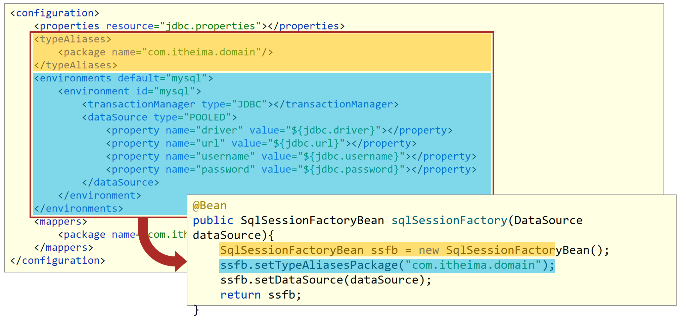

## 今日目标

- [ ] 能够掌握注解开发定义Bean对象
- [ ] 能够掌握纯注解开发模式
- [ ] 能够配置注解开发依赖注入
- [ ] 能够配置注解开发管理第三方Bean
- [ ] 能够配置注解开发为第三方Bean注入资源
- [ ] 能够使用Spring整合Mybatis
- [ ] 能够使用Spring整合Junit

## 一、第三方资源配置管理

> 说明：以管理DataSource连接池对象为例讲解第三方资源配置管理

### 1 管理DataSource连接池对象

#### 问题导入

配置数据库连接参数时，注入驱动类名是用driverClassName还是driver？

#### 1.1 管理Druid连接池【重点】

**数据库准备**

```sql
create database if not exists spring_db character set utf8;
use spring_db;
create table if not exists tbl_account(
    id int primary key auto_increment,
    name varchar(20),
    money double
);
insert into tbl_account values(null,'Tom',1000);
insert into tbl_account values(null,'Jerry',1000);
```

**【第一步】添加Druid连接池依赖**

```xml
<dependency>
    <groupId>com.alibaba</groupId>
    <artifactId>druid</artifactId>
    <version>1.1.16</version>
</dependency>
<dependency>
    <groupId>mysql</groupId>
    <artifactId>mysql-connector-java</artifactId>
    <version>5.1.47</version>
</dependency>
```

> 注意：除了添加以上两个依赖之外，别忘了添加spring-context依赖。

**【第二步】配置DruidDataSource连接池Bean对象**

```xml
<bean id="dataSource" class="com.alibaba.druid.pool.DruidDataSource">
    <property name="driverClassName" value="com.mysql.jdbc.Driver"/>
    <property name="url" value="jdbc:mysql://localhost:3306/spring_db"/>
    <property name="username" value="root"/>
    <property name="password" value="root"/>
</bean>
```

**【第三步】在测试类中从IOC容器中获取连接池对象并打印**

```java
public class App {
    public static void main(String[] args) {
        ApplicationContext ctx = new ClassPathXmlApplicationContext("applicationContext.xml");
        DataSource dataSource = (DataSource) ctx.getBean("dataSource");
        System.out.println(dataSource);
    }
}
```

#### 1.2 管理c3p0连接池

**【第一步】添加c3p0连接池依赖**

```xml
<dependency>
    <groupId>c3p0</groupId>
    <artifactId>c3p0</artifactId>
    <version>0.9.1.2</version>
</dependency>
```

**【第二步】配置c3p0连接池Bean对象**

```xml
<bean id="dataSource" class="com.mchange.v2.c3p0.ComboPooledDataSource">
    <property name="driverClass" value="com.mysql.jdbc.Driver"/>
    <property name="jdbcUrl" value="jdbc:mysql://localhost:3306/spring_db"/>
    <property name="user" value="root"/>
    <property name="password" value="root"/>
    <property name="maxPoolSize" value="1000"/>
</bean>
```

> 注意：同一个Spring容器中不能有两个id="dataSource"的连接池。

**【第三步】在测试类中从IOC容器中获取连接池对象并打印**

```java
public class App {
    public static void main(String[] args) {
        ApplicationContext ctx = new ClassPathXmlApplicationContext("applicationContext.xml");
        DataSource dataSource = (DataSource) ctx.getBean("dataSource");
        System.out.println(dataSource);
    }
}
```


### 2 加载properties属性文件【重点】

> 目的：将数据库的连接参数抽取到一个单独的文件中，与Spring配置文件解耦。

#### 问题导入

问题1：如何解决使用EL表达式读取属性文件中的值结果读取到了系统属性问题？

问题2：加载properties文件写法标准写法该怎么写？

#### 2.1 基本用法

**【第一步】编写jdbc.properties属性文件**

```properties
jdbc.driver=com.mysql.jdbc.Driver
jdbc.url=jdbc:mysql://127.0.0.1:3306/spring_db
jdbc.username=root
jdbc.password=root
```

**【第二步】在applicationContext.xml中开启开启context命名空间，加载jdbc.properties属性文件**


****小技巧：如果同学们觉得上述复制粘贴方式不好改或者容易改错，其实idea是有提示功能的，注意不要选错就行了。有些版本的idea没有这个提示，那么就按照上面复制粘贴的方式改，改完之后可以做成live template模板，后期直接用。****


```xml
<context:property-placeholder location="jdbc.properties"/>
```

**【第三步】在配置连接池Bean的地方使用EL表达式获取jdbc.properties属性文件中的值**

```xml
<bean class="com.alibaba.druid.pool.DruidDataSource">
    <property name="driverClassName" value="${jdbc.driver}"/>
    <property name="url" value="${jdbc.url}"/>
    <property name="username" value="${jdbc.username}"/>
    <property name="password" value="${jdbc.password}"/>
</bean>
```

> 配置完成之后，运行之前的获取Druid连接池代码，可以获取到连接池对象就表示配置成功。


#### 2.2 配置不加载系统属性

**问题**

如果属性文件中配置的不是jdbc.username，而是username=root666，那么使用${username}获取到的不是root666，而是计算机的名称。

**原因**

系统属性的优先级比我们属性文件中的高，替换了我们的username=root666。

**解决**

解决1：换一个名称，例如不叫username，叫jdbc.username。

解决2：使用system-properties-mode="NEVER"属性表示不使用系统属性。

```properties
<context:property-placeholder location="jdbc.properties" system-properties-mode="NEVER"/>
```


#### 2.3 加载properties文件写法

- 不加载系统属性

```xml
<context:property-placeholder location="jdbc.properties" system-properties-mode="NEVER"/>
```

- 加载多个properties文件
```xml
<context:property-placeholder location="jdbc.properties,msg.properties"/>
```
- 加载所有properties文件
```xml
<context:property-placeholder location="*.properties"/>
```
- 加载properties文件****标准格式****
```xml
<context:property-placeholder location="classpath:*.properties"/>
```
- 加载properties文件标准格式
```xml
<context:property-placeholder location="classpath*:*.properties"/>
```


## 二、Spring容器

### 1 Spring核心容器介绍

#### 问题导入

问题：按照Bean名称获取Bean有什么弊端，按照Bean类型获取Bean有什么弊端？

#### 1.1 创建容器

- 方式一：类路径加载配置文件

```java
ApplicationContext ctx = new ClassPathXmlApplicationContext("applicationContext.xml");
```

- 方式二：文件路径加载配置文件

```java
ApplicationContext ctx = new FileSystemXmlApplicationContext("D:\\applicationContext.xml");
```

- 加载多个配置文件

```java
ApplicationContext ctx = new ClassPathXmlApplicationContext("bean1.xml", "bean2.xml");
```


#### 1.2 获取bean对象

- 方式一：使用bean名称获取

> 弊端：需要自己强制类型转换

```java
BookDao bookDao = (BookDao) ctx.getBean("bookDao");
```

- ****方式二：使用bean名称获取并指定类型****

> 弊端：推荐使用

```java
BookDao bookDao = ctx.getBean("bookDao", BookDao.class);
```

- 方式三：使用bean类型获取

> 弊端：如果IOC容器中同类型的Bean对象有多个，此处获取会报错

```java
BookDao bookDao = ctx.getBean(BookDao.class);
```

#### 1.3 容器类层次结构


#### 1.4 BeanFactory

- 类路径加载配置文件

```java
Resource resources = new ClassPathResource("applicationContext.xml");
BeanFactory bf = new XmlBeanFactory(resources);
BookDao bookDao = bf.getBean("bookDao", BookDao.class);
bookDao.save();
```

- BeanFactory创建完毕后，所有的Bean均为延迟加载，也就是说我们调用getBean()方法获取Bean对象时才创建Bean对象并返回给我们


### 2 Spring核心容器总结

#### 2.1 容器相关

- BeanFactory是IoC容器的顶层接口，初始化BeanFactory对象时，加载的bean延迟加载
- ApplicationContext接口是Spring容器的核心接口，初始化时bean立即加载, lazy-init="true"延迟加载
- ApplicationContext接口提供基础的bean操作相关方法，通过其他接口扩展其功能
- ApplicationContext接口常用初始化类
  - **ClassPathXmlApplicationContext(常用)**
  - FileSystemXmlApplicationContext

#### 2.2 bean相关


#### 2.3 依赖注入相关


## 三、Spring注解开发

### 1 注解开发定义Bean对象【重点】

> 目的：xml配置Bean对象有些繁琐，使用注解简化Bean对象的定义

#### 问题导入

问题1：使用什么标签进行Spring注解包扫描？

问题2：@Component注解和@Controller、@Service、@Repository三个衍生注解有什么区别？

#### 1.1 基本使用

**【第一步】在applicationContext.xml中开启Spring注解包扫描**

```xml
<?xml version="1.0" encoding="UTF-8"?>
<beans xmlns="http://www.springframework.org/schema/beans"
       xmlns:context="http://www.springframework.org/schema/context"
       xmlns:xsi="http://www.w3.org/2001/XMLSchema-instance"
       xsi:schemaLocation="
        http://www.springframework.org/schema/beans http://www.springframework.org/schema/beans/spring-beans.xsd
        http://www.springframework.org/schema/context http://www.springframework.org/schema/context/spring-context.xsd">
	 <!--扫描com.itheima包及其子包下的类中注解-->
    <context:component-scan base-package="com.itheima"/>
</beans>
```

**【第二步】在类上使用@Component注解定义Bean。**

```java
//@Component定义bean
@Component("bookDao")
public class BookDaoImpl implements BookDao {
    public void save() {
        System.out.println("book dao save ...");
    }
}
@Component
public class BookServiceImpl implements BookService {
    private BookDao bookDao;

    public void setBookDao(BookDao bookDao) {
        this.bookDao = bookDao;
    }

    public void save() {
        System.out.println("book service save ...");
        bookDao.save();
    }
}
```

> 补充说明：如果@Component注解没有使用参数指定Bean的名称，那么类名首字母小写就是Bean在IOC容器中的默认名称。例如：BookServiceImpl对象在IOC容器中的名称是bookServiceImpl。

**【第三步】在测试类中获取Bean对象**

```java
public class AppForAnnotation {
    public static void main(String[] args) {
        ApplicationContext ctx = new ClassPathXmlApplicationContext("applicationContext.xml");
        BookDao bookDao = (BookDao) ctx.getBean("bookDao");
        System.out.println(bookDao);
        //按类型获取bean
        BookService bookService = ctx.getBean(BookService.class);
        System.out.println(bookService);
    }
}
```

> 注意：在测试类中不要调用bookService的save方法，因为还没有给BookServiceImpl中的bookDao赋值，调用bookService的save方法会出现空指针异常。

**运行结果**


#### 1.2 @Component三个衍生注解

> 说明：加粗的注解为常用注解

- Spring提供**`@Component`**注解的三个衍生注解
  - **`@Controller`**：用于表现层bean定义
  - **`@Service`**：用于业务层bean定义
  - `@Repository`：用于数据层bean定义

```java
@Repository("bookDao")
public class BookDaoImpl implements BookDao {
}

@Service
public class BookServiceImpl implements BookService {
}

```


### 2 纯注解开发模式【重点】

#### 问题导入

问题1：配置类上使用什么注解表示该类是一个配置类？

问题2：配置类上使用什么注解进行Spring注解包扫描？

#### 2.1 纯注解开发模式介绍

- Spring3.0开启了纯注解开发模式，使用Java类替代配置文件，开启了Spring快速开发赛道
- Java类代替Spring核心配置文件


- @Configuration注解用于设定当前类为配置类
- @ComponentScan注解用于设定扫描路径，此注解只能添加一次，多个数据请用数组格式

```java
@ComponentScan({com.itheima.service","com.itheima.dao"})
```

- 读取Spring核心配置文件初始化容器对象切换为读取Java配置类初始化容器对象

```java
//加载配置文件初始化容器
ApplicationContext ctx = new ClassPathXmlApplicationContext("applicationContext.xml");
//加载配置类初始化容器
ApplicationContext ctx = new AnnotationConfigApplicationContext(SpringConfig.class);
```

#### 2.2 代码演示

**【第一步】定义配置类代替配置文件**

```java
//声明当前类为Spring配置类
@Configuration
//Spring注解扫描，相当于<context:component-scan base-package="com.itheima"/>
@ComponentScan("com.itheima")
//设置bean扫描路径，多个路径书写为字符串数组格式
//@ComponentScan({"com.itheima.service","com.itheima.dao"})
public class SpringConfig {
}
```

**【第二步】在测试类中加载配置类，获取Bean对象并使用**

```java
public class AppForAnnotation {
    public static void main(String[] args) {
        //AnnotationConfigApplicationContext加载Spring配置类初始化Spring容器
        ApplicationContext ctx = new AnnotationConfigApplicationContext(SpringConfig.class);
        BookDao bookDao = (BookDao) ctx.getBean("bookDao");
        System.out.println(bookDao);
        //按类型获取bean
        BookService bookService = ctx.getBean(BookService.class);
        System.out.println(bookService);
    }
}
```


### 3 注解开发Bean作用范围和生命周期管理

#### 问题导入

在类上使用什么注解定义Bean的作用范围？

#### 3.1 bean作用范围注解配置

- 使用@Scope定义bean作用范围

```java
@Repository
@Scope("singleton")
public class BookDaoImpl implements BookDao {
}
```

#### 3.2 bean生命周期注解配置

- 使用@PostConstruct、@PreDestroy定义bean生命周期

```java
@Repository
@Scope("singleton")
public class BookDaoImpl implements BookDao {
    public BookDaoImpl() {
        System.out.println("book dao constructor ...");
    }
    @PostConstruct
    public void init(){
        System.out.println("book init ...");
    }
    @PreDestroy
    public void destroy(){
        System.out.println("book destory ...");
    }
}
```

****注意：@PostConstruct和@PreDestroy注解是jdk中提供的注解，从jdk9开始，jdk中的javax.annotation包被移除了，也就是说这两个注解就用不了了，可以额外导入一下依赖解决这个问题。****

```xml
<dependency>
  <groupId>javax.annotation</groupId>
  <artifactId>javax.annotation-api</artifactId>
  <version>1.3.2</version>
</dependency>
```


### 4 注解开发依赖注入【重点】

#### 问题导入

问题1：请描述@Autowired注解是如何进行自动装配的？

问题2：请描述@Qualifier注解的作用

#### 4.1 使用@Autowired注解开启自动装配模式（按类型）

```java
@Service
public class BookServiceImpl implements BookService {
    //@Autowired：注入引用类型，自动装配模式，默认按类型装配
    @Autowired
    private BookDao bookDao;

    public void save() {
        System.out.println("book service save ...");
        bookDao.save();
    }
}
```

> 说明：不管是使用配置文件还是配置类，都必须进行对应的Spring注解包扫描才可以使用。@Autowired默认按照类型自动装配，如果IOC容器中同类的Bean有多个，那么默认按照变量名和Bean的名称匹配，建议使用@Qualifier注解指定要装配的bean名称

**注意：自动装配基于反射设计创建对象并暴力反射对应属性为私有属性初始化数据，因此无需提供setter方法。**

#### 4.2 使用@Qualifier注解指定要装配的bean名称

> 目的：解决IOC容器中同类型Bean有多个装配哪一个的问题

```java
@Service
public class BookServiceImpl implements BookService {
    //@Autowired：注入引用类型，自动装配模式，默认按类型装配
    @Autowired
    //@Qualifier：自动装配bean时按bean名称装配
    @Qualifier("bookDao")
    private BookDao bookDao;

    public void save() {
        System.out.println("book service save ...");
        bookDao.save();
    }
}
```

**注意：@Qualifier注解无法单独使用，必须配合@Autowired注解使用**

#### 4.3 使用@Value实现简单类型注入

```java
@Repository("bookDao")
public class BookDaoImpl implements BookDao {
    //@Value：注入简单类型（无需提供set方法）
    @Value("${name}")
    private String name;

    public void save() {
        System.out.println("book dao save ..." + name);
    }
}
```

以上@Value注解中使用${name}从属性文件中读取name值，那么就需要在配置类或者配置文件中加载属性文件。

```java
@Configuration
@ComponentScan("com.itheima")
//@PropertySource加载properties配置文件
@PropertySource({"classpath:jdbc.properties"}) //{}可以省略不写
public class SpringConfig {
}
```

**注意：@PropertySource()中加载多文件请使用数组格式配置，不允许使用通配符***


### 5 注解开发管理第三方Bean【重点】

#### 问题导入

导入自己定义的配置类有几种方式？

#### **【第一步】单独定义配置类**

```java
public class JdbcConfig {
    //@Bean：表示当前方法的返回值是一个bean对象，添加到IOC容器中
    @Bean
    public DataSource dataSource(){
        DruidDataSource ds = new DruidDataSource();
        ds.setDriverClassName("com.mysql.jdbc.Driver");
        ds.setUrl("jdbc:mysql://localhost:3306/spring_db");
        ds.setUsername("root");
        ds.setPassword("root");
        return ds;
    }
}
```

#### **【第二步】将独立的配置类加入核心配置**

##### 方式1：@Import注解导入式

```java
@Configuration
@ComponentScan("com.itheima")
//@Import:导入配置信息
@Import({JdbcConfig.class})
public class SpringConfig {
}
```

##### 方式2：@ComponentScan扫描式

```java
@Configuration
@ComponentScan({"com.itheima.config","com.itheima.service","com.itheima.dao"})  //只要com.itheima.config包扫到了就行，三个包可以合并写成com.itheima
public class SpringConfig {
}
```


### 6 注解开发为第三方Bean注入资源【重点】

#### 问题导入

配置类中如何注入简单类型数据，如何注入引用类型数据？

#### 6.1 简单类型依赖注入

```java
public class JdbcConfig {
    //1.定义一个方法获得要管理的对象
    @Value("com.mysql.jdbc.Driver")
    private String driver;
    @Value("jdbc:mysql://localhost:3306/spring_db")
    private String url;
    @Value("root")
    private String userName;
    @Value("root")
    private String password;
    //2.@Bean：表示当前方法的返回值是一个bean对象，添加到IOC容器中
    @Bean
    public DataSource dataSource(){
        DruidDataSource ds = new DruidDataSource();
        ds.setDriverClassName(driver);
        ds.setUrl(url);
        ds.setUsername(userName);
        ds.setPassword(password);
        return ds;
    }
}
```

> 说明：如果@Value()中使用了EL表达式读取properties属性文件中的内容，那么就需要加载properties属性文件。

#### 6.2 引用类型依赖注入

```java
//Spring会自动从IOC容器中找到BookDao对象赋值给参数bookDao变量，如果没有就会报错。
@Bean 
public DataSource dataSource(BookDao bookDao){
    System.out.println(bookDao);
    DruidDataSource ds = new DruidDataSource();
    ds.setDriverClassName(driver);
    ds.setUrl(url);
    ds.setUsername(userName);
    ds.setPassword(password);
    return ds;
}
```

> 说明：引用类型注入只需要为bean定义方法设置形参即可，容器会根据类型自动装配对象


### 7 注解开发总结


## 四、Spring整合其他技术【重点】

### 1 Spring整合mybatis【重点】

#### 1.1 思路分析

##### 问题导入

mybatis进行数据层操作的核心对象是谁？

##### 1.1.1 MyBatis程序核心对象分析


##### 1.1.2 整合MyBatis

- 使用SqlSessionFactoryBean封装SqlSessionFactory需要的环境信息



- 使用MapperScannerConfigurer加载Dao接口，创建代理对象保存到IOC容器中


#### 1.2 代码实现

##### 问题导入

问题1：Spring整合mybatis的依赖叫什么？

问题2：Spring整合mybatis需要管理配置哪两个Bean，这两个Bean作用分别是什么？

##### 【前置工作】

1. 在pom.xml中添加spring-context、druid、mybatis、mysql-connector-java等基础依赖。
2. 准备service和dao层基础代码

```java
public interface AccountService {

    void save(Account account);

    void delete(Integer id);

    void update(Account account);

    List<Account> findAll();

    Account findById(Integer id);

}
@Service
public class AccountServiceImpl implements AccountService {

    @Autowired
    private AccountDao accountDao;

    public void save(Account account) {
        accountDao.save(account);
    }

    public void update(Account account){
        accountDao.update(account);
    }

    public void delete(Integer id) {
        accountDao.delete(id);
    }

    public Account findById(Integer id) {
        return accountDao.findById(id);
    }

    public List<Account> findAll() {
        return accountDao.findAll();
    }
}
public interface AccountDao {

    @Insert("insert into tbl_account(name,money)values(#{name},#{money})")
    void save(Account account);

    @Delete("delete from tbl_account where id = #{id} ")
    void delete(Integer id);

    @Update("update tbl_account set name = #{name} , money = #{money} where id = #{id} ")
    void update(Account account);

    @Select("select * from tbl_account")
    List<Account> findAll();

    @Select("select * from tbl_account where id = #{id} ")
    Account findById(Integer id);
}
```

##### **【第一步】导入Spring整合Mybatis依赖**

```xml
<dependency>
    <groupId>org.springframework</groupId>
    <artifactId>spring-jdbc</artifactId>
    <version>5.2.10.RELEASE</version>
</dependency>

<dependency>
    <groupId>org.mybatis</groupId>
    <artifactId>mybatis-spring</artifactId>
    <version>1.3.0</version>
</dependency>
```

##### **【第二步】创建JdbcConfig配置DataSource数据源**

```properties
jdbc.driver=com.mysql.jdbc.Driver
jdbc.url=jdbc:mysql://localhost:3306/spring_db?useSSL=false
jdbc.username=root
jdbc.password=root
```

```java
public class JdbcConfig {
    @Value("${jdbc.driver}")
    private String driver;
    @Value("${jdbc.url}")
    private String url;
    @Value("${jdbc.username}")
    private String userName;
    @Value("${jdbc.password}")
    private String password;

    @Bean
    public DataSource dataSource(){
        DruidDataSource ds = new DruidDataSource();
        ds.setDriverClassName(driver);
        ds.setUrl(url);
        ds.setUsername(userName);
        ds.setPassword(password);
        return ds;
    }
}
```

##### **【第三步】创建MybatisConfig整合mybatis**

```java
public class MybatisConfig {
    //定义bean，SqlSessionFactoryBean，用于产生SqlSessionFactory对象
    @Bean
    public SqlSessionFactoryBean sqlSessionFactory(DataSource dataSource){
        SqlSessionFactoryBean ssfb = new SqlSessionFactoryBean();
        ssfb.setTypeAliasesPackage("com.itheima.domain");
        ssfb.setDataSource(dataSource);
        return ssfb;
    }
    //定义bean，返回MapperScannerConfigurer对象
    @Bean
    public MapperScannerConfigurer mapperScannerConfigurer(){
        MapperScannerConfigurer msc = new MapperScannerConfigurer();
        msc.setBasePackage("com.itheima.dao");
        return msc;
    }
}
```

##### **【第四步】创建SpringConfig主配置类进行包扫描和加载其他配置类**

```java
@Configuration
@ComponentScan("com.itheima")
//@PropertySource：加载类路径jdbc.properties文件
@PropertySource("classpath:jdbc.properties")
@Import({JdbcConfig.class,MybatisConfig.class})
public class SpringConfig {
}
```

##### **【第五步】定义测试类进行测试**

```java
public class App {
    public static void main(String[] args) {
        ApplicationContext ctx = new AnnotationConfigApplicationContext(SpringConfig.class);

        AccountService accountService = ctx.getBean(AccountService.class);

        Account ac = accountService.findById(1);
        System.out.println(ac);
    }
}
```

### 2 Spring整合Junit单元测试【重点】

#### 问题导入

Spring整合Junit的两个注解作用分别是什么？

#### 【第一步】导入整合的依赖坐标spring-test

```xml
<!--junit-->
<dependency>
  <groupId>junit</groupId>
  <artifactId>junit</artifactId>
  <version>4.12</version>
</dependency>
<!--spring整合junit-->
<dependency>
  <groupId>org.springframework</groupId>
  <artifactId>spring-test</artifactId>
  <version>5.1.9.RELEASE</version>
</dependency>
```

#### 【第二步】使用Spring整合Junit专用的类加载器

#### 【第三步】加载配置文件或者配置类

```java
//【第二步】使用Spring整合Junit专用的类加载器
@RunWith(SpringJUnit4ClassRunner.class)
//【第三步】加载配置文件或者配置类
@ContextConfiguration(classes = {SpringConfiguration.class}) //加载配置类
//@ContextConfiguration(locations={"classpath:applicationContext.xml"})//加载配置文件
public class AccountServiceTest {
    //支持自动装配注入bean
    @Autowired
    private AccountService accountService;

    @Test
    public void testFindById(){
        System.out.println(accountService.findById(1));
    }

    @Test
    public void testFindAll(){
        System.out.println(accountService.findAll());
    }
}
```

****注意：junit的依赖至少要是4.12版本,可以是4.13等版本,否则出现如下异常：****


