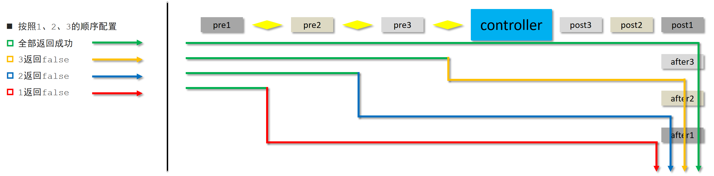

## 今日内容

- [ ] 能够掌握SSM整合的流程
- [ ] 能够编写SSM整合功能模块类
- [ ] 能够使用Result统一表现层响应结果
- [ ] 能够编写异常处理器进行项目异常
- [ ] 能够完成SSM整合前端页面发送请求实现增删改查操作
- [ ] 能够编写拦截器并配置拦截器

## 一、SSM整合【重点】

### 1 SSM整合配置

#### 问题导入

请描述“SSM整合流程”中各个配置类的作用？

#### 1.1 SSM整合流程

1. 创建工程
2. SSM整合
   - Spring
     - SpringConfig
   - MyBatis
     - MybatisConfig
     - JdbcConfig
     - jdbc.properties
   - SpringMVC
     - ServletConfig
     - SpringMvcConfig
3. 功能模块
   - 表与实体类
   - dao（接口+自动代理）
   - service（接口+实现类）
     - 业务层接口测试（整合JUnit）
   - controller
     - 表现层接口测试（PostMan）

#### 1.2 SSM整合配置

##### 1.2.1 创建工程，添加依赖和插件


```xml
<dependencies>
    <dependency>
        <groupId>org.springframework</groupId>
        <artifactId>spring-webmvc</artifactId>
        <version>5.2.10.RELEASE</version>
    </dependency>

    <dependency>
        <groupId>org.springframework</groupId>
        <artifactId>spring-jdbc</artifactId>
        <version>5.2.10.RELEASE</version>
    </dependency>

    <dependency>
        <groupId>org.springframework</groupId>
        <artifactId>spring-test</artifactId>
        <version>5.2.10.RELEASE</version>
    </dependency>

    <dependency>
        <groupId>org.mybatis</groupId>
        <artifactId>mybatis</artifactId>
        <version>3.5.6</version>
    </dependency>

    <dependency>
        <groupId>org.mybatis</groupId>
        <artifactId>mybatis-spring</artifactId>
        <version>1.3.0</version>
    </dependency>

    <dependency>
        <groupId>mysql</groupId>
        <artifactId>mysql-connector-java</artifactId>
        <version>5.1.47</version>
    </dependency>

    <dependency>
        <groupId>com.alibaba</groupId>
        <artifactId>druid</artifactId>
        <version>1.1.16</version>
    </dependency>

    <dependency>
        <groupId>junit</groupId>
        <artifactId>junit</artifactId>
        <version>4.12</version>
        <scope>test</scope>
    </dependency>

    <dependency>
        <groupId>javax.servlet</groupId>
        <artifactId>javax.servlet-api</artifactId>
        <version>3.1.0</version>
        <scope>provided</scope>
    </dependency>

    <dependency>
        <groupId>com.fasterxml.jackson.core</groupId>
        <artifactId>jackson-databind</artifactId>
        <version>2.9.0</version>
    </dependency>
</dependencies>

<build>
    <plugins>
        <plugin>
            <groupId>org.apache.tomcat.maven</groupId>
            <artifactId>tomcat7-maven-plugin</artifactId>
            <version>2.1</version>
            <configuration>
                <port>80</port>
                <path>/</path>
            </configuration>
        </plugin>
    </plugins>
</build>
```

##### 1.2.2 Spring整合Mybatis

- 创建数据库和表

```sql
-- 创建ssm_db数据库
CREATE DATABASE IF NOT EXISTS ssm_db CHARACTER SET utf8;

-- 使用ssm_db数据库
USE ssm_db;

-- 创建tbl_book表
CREATE TABLE tbl_book(
    id INT PRIMARY KEY AUTO_INCREMENT, -- 图书编号
    TYPE VARCHAR(100), -- 图书类型
    NAME VARCHAR(100), -- 图书名称
    description VARCHAR(100) -- 图书描述
);
-- 添加初始化数据
INSERT INTO tbl_book VALUES(NULL,'计算机理论','Spring实战 第5版','Spring入门经典教材，深入理解Spring原理技术内幕');
INSERT INTO tbl_book VALUES(NULL,'计算机理论','Spring 5核心原理与30个类手写实战','十年沉淀之作,手写Spring精华思想');
INSERT INTO tbl_book VALUES(NULL,'计算机理论','Spring 5设计模式','深入Spring源码剖析,Spring源码蕴含的10大设计模式');
INSERT INTO tbl_book VALUES(NULL,'市场营销','直播就该这么做:主播高效沟通实战指南','李子柒、李佳琦、薇娅成长为网红的秘密都在书中');
INSERT INTO tbl_book VALUES(NULL,'市场营销','直播销讲实战一本通','和秋叶一起学系列网络营销书籍');
INSERT INTO tbl_book VALUES(NULL,'市场营销','直播带货:淘宝、天猫直播从新手到高手','一本教你如何玩转直播的书,10堂课轻松实现带货月入3W+');
```

- jdbc.properties属性文件

```properties
jdbc.driver=com.mysql.jdbc.Driver
jdbc.url=jdbc:mysql://localhost:3306/ssm_db
jdbc.username=root
jdbc.password=root
```
- JdbcConfig配置类
```java
public class JdbcConfig {
    @Value("${jdbc.driver}")
    private String driver;
    @Value("${jdbc.url}")
    private String url;
    @Value("${jdbc.username}")
    private String username;
    @Value("${jdbc.password}")
    private String password;
	//配置连接池
    @Bean
    public DataSource dataSource(){
        DruidDataSource dataSource = new DruidDataSource();
        dataSource.setDriverClassName(driver);
        dataSource.setUrl(url);
        dataSource.setUsername(username);
        dataSource.setPassword(password);
        return dataSource;
    }
	//Spring事务管理需要的平台事务管理器对象
    @Bean
    public PlatformTransactionManager transactionManager(DataSource dataSource){
        DataSourceTransactionManager ds = new DataSourceTransactionManager();
        ds.setDataSource(dataSource);
        return ds;
    }
}
```

- MybatisConfig配置类

```java
public class MyBatisConfig {
    @Bean
    public SqlSessionFactoryBean sqlSessionFactory(DataSource dataSource){
        SqlSessionFactoryBean factoryBean = new SqlSessionFactoryBean();
        factoryBean.setDataSource(dataSource);
        factoryBean.setTypeAliasesPackage("com.itheima.domain");
        return factoryBean;
    }

    @Bean
    public MapperScannerConfigurer mapperScannerConfigurer(){
        MapperScannerConfigurer msc = new MapperScannerConfigurer();
        msc.setBasePackage("com.itheima.dao");
        return msc;
    }
}
```

- SpringConfig配置类

```java
@Configuration
@ComponentScan({"com.itheima.service"})
@PropertySource("classpath:jdbc.properties")
@Import({JdbcConfig.class,MyBatisConfig.class})
@EnableTransactionManagement //开启Spring事务管理
public class SpringConfig {
}
```

##### 1.2.3 Spring整合SpringMVC

- SpringMvcConfig配置类

```java
@Configuration
@ComponentScan("com.itheima.controller")
@EnableWebMvc
public class SpringMvcConfig {
}
```

- ServletConfig配置类，加载SpringMvcConfig和SpringConfig配置类

```java
public class ServletConfig extends AbstractAnnotationConfigDispatcherServletInitializer {
    protected Class<?>[] getRootConfigClasses() {
        return new Class[]{SpringConfig.class};
    }

    protected Class<?>[] getServletConfigClasses() {
        return new Class[]{SpringMvcConfig.class};
    }

    protected String[] getServletMappings() {
        return new String[]{"/"};
    }
}
```

### 2 功能模块开发

#### 2.1 数据层开发(BookDao)

- Book实体类

```java
public class Book {
    private Integer id;
    private String type;
    private String name;
    private String description;
    //同学们自己添加getter、setter、toString()方法
}
```
- BookDao接口
```java
public interface BookDao {

    //@Insert("insert into tbl_book values(null,#{type},#{name},#{description})")
    @Insert("insert into tbl_book (type,name,description) values(#{type},#{name},#{description})")
    public int save(Book book);  //返回值表示影响的行数

    @Update("update tbl_book set type = #{type}, name = #{name}, description = #{description} where id = #{id}")
    public int update(Book book);

    @Delete("delete from tbl_book where id = #{id}")
    public int delete(Integer id);

    @Select("select * from tbl_book where id = #{id}")
    public Book getById(Integer id);

    @Select("select * from tbl_book")
    public List<Book> getAll();
}
```

#### 2.2 业务层开发(BookService/BookServiceImpl)

- BookService接口

```java
@Transactional //表示所有方法进行事务管理
public interface BookService {

    /**
     * 保存
     * @param book
     * @return
     */
    public boolean save(Book book);

    /**
     * 修改
     * @param book
     * @return
     */
    public boolean update(Book book);

    /**
     * 按id删除
     * @param id
     * @return
     */
    public boolean delete(Integer id);

    /**
     * 按id查询
     * @param id
     * @return
     */
    public Book getById(Integer id);

    /**
     * 查询全部
     * @return
     */
    public List<Book> getAll();
}
```

- BookServiceImpl实现类

```java
@Service
public class BookServiceImpl implements BookService {
    @Autowired
    private BookDao bookDao;

    public boolean save(Book book) {
        bookDao.save(book);
        return true;
    }

    public boolean update(Book book) {
        bookDao.update(book);
        return true;
    }

    public boolean delete(Integer id) {
        bookDao.delete(id);
        return true;
    }

    public Book getById(Integer id) {
        return bookDao.getById(id);
    }

    public List<Book> getAll() {
        return bookDao.getAll();
    }
}
```

#### 2.3 表现层开发(BookController)

```java
@RestController
@RequestMapping("/books")
public class BookController {

    @Autowired
    private BookService bookService;

    @PostMapping
    public boolean save(@RequestBody Book book) {
        return bookService.save(book);
    }

    @PutMapping
    public boolean update(@RequestBody Book book) {
        return bookService.update(book);
    }

    @DeleteMapping("/{id}")
    public boolean delete(@PathVariable Integer id) {
        return bookService.delete(id);
    }

    @GetMapping("/{id}")
    public Book getById(@PathVariable Integer id) {
        return bookService.getById(id);
    }

    @GetMapping
    public List<Book> getAll() {
        return bookService.getAll();
    }
}
```

### 3 接口测试

#### 3.1 Spring整合Junit测试业务层方法

```java
@RunWith(SpringJUnit4ClassRunner.class)
@ContextConfiguration(classes = SpringConfig.class)
public class BookServiceTest {

    @Autowired
    private BookService bookService;

    @Test
    public void testGetById(){
        Book book = bookService.getById(1);
        System.out.println(book);
    }

    @Test
    public void testGetAll(){
        List<Book> all = bookService.getAll();
        System.out.println(all);
    }
}
```

#### 3.2 postman测试表现层接口

- 测试保存图书


> 这里就以保存图书为例，其他接口同学们自己测试


## 二、表现层数据封装【重点】

### 问题导入

目前我们表现层响应给客户端的数据有哪几种？

### 1 表现层响应数据的问题

问题：我们表现层增删改方法返回true或者false表示是否成功，getById()方法返回一个json对象，getAll()方法返回一个json对象数组，这里就出现了三种格式的响应结果，极其不利于前端解析。


解决：我们需要统一响应结果的格式

### 2 定义Result类封装响应结果

#### 2.1 Result类封装响应结果

```java
public class Result {
    //描述统一格式中的数据
    private Object data;
    //描述统一格式中的编码，用于区分操作，可以简化配置0或1表示成功失败
    private Integer code;
    //描述统一格式中的消息，可选属性
    private String msg;

    public Result() {
    }
    public Result(Integer code,Object data) {
        this.data = data;
        this.code = code;
    }
    public Result(Integer code, Object data, String msg) {
        this.data = data;
        this.code = code;
        this.msg = msg;
    }
     //同学们自己添加getter、setter、toString()方法
}
```

**注意事项：**

Result类中的字段并不是固定的，可以根据需要自行增减

#### 2.2 Code类封装响应码

```java
//状态码
public class Code {
    public static final Integer SAVE_OK = 20011;
    public static final Integer DELETE_OK = 20021;
    public static final Integer UPDATE_OK = 20031;
    public static final Integer GET_OK = 20041;

    public static final Integer SAVE_ERR = 20010;
    public static final Integer DELETE_ERR = 20020;
    public static final Integer UPDATE_ERR = 20030;
    public static final Integer GET_ERR = 20040;
}
```

**注意事项：**

Code类的常量设计也不是固定的，可以根据需要自行增减，例如将查询再进行细分为GET_OK，GET_ALL_OK，GET_PAGE_OK

### 3 表现层数据封装返回Result对象

```java
@RestController
@RequestMapping("/books")
public class BookController {

    @Autowired
    private BookService bookService;

    @PostMapping
    public Result save(@RequestBody Book book) {
        boolean flag = bookService.save(book);
        return new Result(flag ? Code.SAVE_OK:Code.SAVE_ERR,flag);
    }

    @PutMapping
    public Result update(@RequestBody Book book) {
        boolean flag = bookService.update(book);
        return new Result(flag ? Code.UPDATE_OK:Code.UPDATE_ERR,flag);
    }

    @DeleteMapping("/{id}")
    public Result delete(@PathVariable Integer id) {
        boolean flag = bookService.delete(id);
        return new Result(flag ? Code.DELETE_OK:Code.DELETE_ERR,flag);
    }

    @GetMapping("/{id}")
    public Result getById(@PathVariable Integer id) {
        Book book = bookService.getById(id);
        Integer code = book != null ? Code.GET_OK : Code.GET_ERR;
        String msg = book != null ? "" : "数据查询失败，请重试！";
        return new Result(code,book,msg);
    }

    @GetMapping
    public Result getAll() {
        List<Book> bookList = bookService.getAll();
        Integer code = bookList != null ? Code.GET_OK : Code.GET_ERR;
        String msg = bookList != null ? "" : "数据查询失败，请重试！";
        return new Result(code,bookList,msg);
    }
}
```

## 三、异常处理器【理解】

### 问题导入

问题1：项目各个个层级均可能出现异常，异常处理代码书写在哪一层？

### 1 异常介绍

- 程序开发过程中不可避免的会遇到异常现象，我们不能让用户看到这样的页面数据


- 出现异常现象的常见位置与常见诱因如下：
  - 框架内部抛出的异常：因使用不合规导致
  - 数据层抛出的异常：因外部服务器故障导致（例如：服务器访问超时）
  - 业务层抛出的异常：因业务逻辑书写错误导致（例如：遍历业务书写操作，导致索引异常等）
  - 表现层抛出的异常：因数据收集、校验等规则导致（例如：不匹配的数据类型间导致异常）
  - 工具类抛出的异常：因工具类书写不严谨不够健壮导致（例如：必要释放的连接长期未释放等）

### 2 异常处理器

#### 2.2.1 编写异常处理器

```java
@RestControllerAdvice  //用于标识当前类为REST风格对应的异常处理器
public class ProjectExceptionAdvice {

    //统一处理所有的Exception异常
    @ExceptionHandler(Exception.class)
    public Result doOtherException(Exception ex){
        return new Result(666,null);
    }
}
```

**使用异常处理器之后的效果**


#### 2.2.2 @RestControllerAdvice注解介绍

- 名称：@RestControllerAdvice

- 类型：==类注解==

- 位置：Rest风格开发的控制器增强类定义上方
- 作用：为Rest风格开发的控制器类做增强
- 说明：此注解自带@ResponseBody注解与@Component注解，具备对应的功能

#### 2.2.3 @ExceptionHandler注解介绍

- 名称：@ExceptionHandler
- 类型：==方法注解==
- 位置：专用于异常处理的控制器方法上方
- 作用：设置指定异常的处理方案，功能等同于控制器方法，出现异常后终止原始控制器执行，并转入当前方法执行
- 说明：此类方法可以根据处理的异常不同，制作多个方法分别处理对应的异常

## 四、项目异常处理方案【理解】

### 问题导入

请说出项目当前异常的分类以及对应类型异常该如何处理？

### 1 项目异常分类

- 业务异常（BusinessException）
  - 规范的用户行为产生的异常
  - 不规范的用户行为操作产生的异常
- 系统异常（SystemException）
  - 项目运行过程中可预计且无法避免的异常
- 其他异常（Exception）
  - 编程人员未预期到的异常

### 2 项目异常处理方案

- 业务异常（BusinessException）
  - ==发送对应消息传递给用户，提醒规范操作==
- 系统异常（SystemException）
  - ==发送固定消息传递给用户，安抚用户==
  - 发送特定消息给运维人员，提醒维护
  - 记录日志
- 其他异常（Exception）
  - ==发送固定消息传递给用户，安抚用户==
  - 发送特定消息给编程人员，提醒维护（纳入预期范围内）
  - 记录日志

### 3 项目异常处理代码实现

#### 3.1 根据异常分类自定义异常类

##### 3.1.1 自定义项目系统级异常

```java
//自定义异常处理器，用于封装异常信息，对异常进行分类
public class SystemException extends RuntimeException{
    private Integer code;

    public Integer getCode() {
        return code;
    }

    public void setCode(Integer code) {
        this.code = code;
    }

    public SystemException(Integer code, String message) {
        super(message);
        this.code = code;
    }

    public SystemException(Integer code, String message, Throwable cause) {
        super(message, cause);
        this.code = code;
    }
}
```

##### 3.1.2 自定义项目业务级异常

```java 
//自定义异常处理器，用于封装异常信息，对异常进行分类
public class BusinessException extends RuntimeException{
    private Integer code;

    public Integer getCode() {
        return code;
    }

    public void setCode(Integer code) {
        this.code = code;
    }

    public BusinessException(Integer code, String message) {
        super(message);
        this.code = code;
    }

    public BusinessException(Integer code,String message,Throwable cause) {
        super(message, cause);
        this.code = code;
    }
}
```

#### 3.2 自定义异常编码（持续补充）

```java
public class Code {

	//之前其他状态码省略没写，以下是新补充的状态码，可以根据需要自己补充
    
    public static final Integer SYSTEM_ERR = 50001;
    public static final Integer SYSTEM_TIMEOUT_ERR = 50002;
    public static final Integer SYSTEM_UNKNOW_ERR = 59999;
    public static final Integer BUSINESS_ERR = 60002;
    
}
```

#### 3.3 触发自定义异常

```java
@Service
public class BookServiceImpl implements BookService {
    @Autowired
    private BookDao bookDao;

	//在getById演示触发异常，其他方法省略没有写进来
    public Book getById(Integer id) {
        //模拟业务异常，包装成自定义异常
        if(id <0){
            throw new BusinessException(Code.BUSINESS_ERR,"请不要使用你的技术挑战我的耐性!");
        }
    }
}
```

#### 3.4 在异常通知类中拦截并处理异常

```java
@RestControllerAdvice //用于标识当前类为REST风格对应的异常处理器
public class ProjectExceptionAdvice {
    //@ExceptionHandler用于设置当前处理器类对应的异常类型
    @ExceptionHandler(SystemException.class)
    public Result doSystemException(SystemException ex){
        //记录日志
        //发送消息给运维
        //发送邮件给开发人员,ex对象发送给开发人员
        return new Result(ex.getCode(),null,ex.getMessage());
    }

    @ExceptionHandler(BusinessException.class)
    public Result doBusinessException(BusinessException ex){
        return new Result(ex.getCode(),null,ex.getMessage());
    }

    //除了自定义的异常处理器，保留对Exception类型的异常处理，用于处理非预期的异常
    @ExceptionHandler(Exception.class)
    public Result doOtherException(Exception ex){
        //记录日志
        //发送消息给运维
        //发送邮件给开发人员,ex对象发送给开发人员
        return new Result(Code.SYSTEM_UNKNOW_ERR,null,"系统繁忙，请稍后再试！");
    }
}
```

测试：在postman中发送请求访问getById方法，传递参数-1，得到以下结果：


## 五、SSM整合页面开发【重点】

### 1 准备工作

> 为了确保静态资源能够被访问到，需要设置静态资源过滤

```java
@Configuration
public class SpringMvcSupport extends WebMvcConfigurationSupport {
    @Override
    protected void addResourceHandlers(ResourceHandlerRegistry registry) {
        registry.addResourceHandler("/pages/**")
            .addResourceLocations("/pages/");
        registry.addResourceHandler("/css/**")
            .addResourceLocations("/css/");
        registry.addResourceHandler("/js/**")
            .addResourceLocations("/js/");
        registry.addResourceHandler("/plugins/**")
            .addResourceLocations("/plugins/");
    }
}
```

### 2 列表查询功能

- 前端代码

```javascript
//列表
getAll() {
    //发送ajax请求
    axios.get("/books").then((res)=>{
        this.dataList = res.data.data;
    });
}
```

### 3 添加功能

- 前端代码

```javascript
//弹出添加窗口
handleCreate() {
    this.dialogFormVisible = true;
    this.resetForm();
},
//重置表单
resetForm() {
    this.formData = {};
},
//添加
handleAdd () {
    //发送ajax请求
    axios.post("/books",this.formData).then((res)=>{
        console.log(res.data);
        //如果操作成功，关闭弹层，显示数据
        if(res.data.code == 20011){
            this.dialogFormVisible = false;
            this.$message.success("添加成功");
        }else if(res.data.code == 20010){
            this.$message.error("添加失败");
        }else{
            this.$message.error(res.data.msg);
        }
    }).finally(()=>{
        this.getAll();
    });
},
```

- 后台代码改进

```java
@Service
public class BookServiceImpl implements BookService {
    @Autowired
    private BookDao bookDao;
	//增删改的方法判断了影响的行数是否大于0，而不是固定返回true
    public boolean save(Book book) {
        return bookDao.save(book) > 0;
    }
	//增删改的方法判断了影响的行数是否大于0，而不是固定返回true
    public boolean update(Book book) {
        return bookDao.update(book) > 0;
    }
	//增删改的方法判断了影响的行数是否大于0，而不是固定返回true
    public boolean delete(Integer id) {
        return bookDao.delete(id) > 0;
    }

    public Book getById(Integer id) {
        if(id < 0){
            throw new BusinessException(Code.BUSINESS_ERR,"请不要使用你的技术挑战我的耐性!");
            return bookDao.getById(id);
        }
    }
    public List<Book> getAll() {
        return bookDao.getAll();
    }
}
```

### 4 修改功能

- 显示弹出框查询图书信息

```javascript
//弹出编辑窗口
handleUpdate(row) {
    // console.log(row);   //row.id 查询条件
    //查询数据，根据id查询
    axios.get("/books/"+row.id).then((res)=>{
        // console.log(res.data.data);
        if(res.data.code == 20041){
            //展示弹层，加载数据
            this.formData = res.data.data;
            this.dialogFormVisible4Edit = true;
        }else{
            this.$message.error(res.data.msg);
        }
    });
}
```

- 保存修改后的图书信息

```javascript
//编辑
handleEdit() {
    //发送ajax请求
    axios.put("/books",this.formData).then((res)=>{
        //如果操作成功，关闭弹层，显示数据
        if(res.data.code == 20031){
            this.dialogFormVisible4Edit = false;
            this.$message.success("修改成功");
        }else if(res.data.code == 20030){
            this.$message.error("修改失败");
        }else{
            this.$message.error(res.data.msg);
        }
    }).finally(()=>{
        this.getAll();
    });
}
```

### 5 删除功能

```javascript
// 删除
handleDelete(row) {
    //1.弹出提示框
    this.$confirm("此操作永久删除当前数据，是否继续？","提示",{
        type:'info'
    }).then(()=>{
        //2.做删除业务
        axios.delete("/books/"+row.id).then((res)=>{
            if(res.data.code == 20021){
                this.$message.success("删除成功");
            }else{
                this.$message.error("删除失败");
            }
        }).finally(()=>{
            this.getAll();
        });
    }).catch(()=>{
        //3.取消删除
        this.$message.info("取消删除操作");
    });
}
```

## 六、拦截器【理解】

### 1 拦截器简介

#### 问题导入

问题1：拦截器拦截的对象是谁？

问题2：拦截器和过滤器有什么区别？

#### 1.1 拦截器概念和作用


- 拦截器（Interceptor）是一种动态拦截方法调用的机制，在SpringMVC中动态拦截控制器方法的执行
- 作用：
  1. 在指定的方法调用前后执行预先设定的代码
  2. 阻止原始方法的执行
  3. 总结：增强
- 核心原理：AOP思想

#### 1.2 拦截器和过滤器的区别

- 归属不同：Filter属于Servlet技术，Interceptor属于SpringMVC技术
- 拦截内容不同：Filter对所有访问进行增强，Interceptor仅针对SpringMVC的访问进行增强


### 2 入门案例

#### 问题导入

定义拦截器需要实现什么接口？

#### 2.1 拦截器代码实现

##### 【第一步】定义拦截器

> 做法：定义一个类，实现HandlerInterceptor接口即可

```java
@Component //注意当前类必须受Spring容器控制
//定义拦截器类，实现HandlerInterceptor接口
public class ProjectInterceptor implements HandlerInterceptor {
    @Override
    //原始方法调用前执行的内容
    //返回值类型可以拦截控制的执行，true放行，false终止
    public boolean preHandle(HttpServletRequest request, HttpServletResponse response, Object handler) throws Exception {
        System.out.println("preHandle..."+contentType);
        return true;
    }

    @Override
    //原始方法调用后执行的内容
    public void postHandle(HttpServletRequest request, HttpServletResponse response, Object handler, ModelAndView modelAndView) throws Exception {
        System.out.println("postHandle...");
    }

    @Override
    //原始方法调用完成后执行的内容
    public void afterCompletion(HttpServletRequest request, HttpServletResponse response, Object handler, Exception ex) throws Exception {
        System.out.println("afterCompletion...");
    }
}
```

##### 【第二步】配置加载拦截器

```java
@Configuration
public class SpringMvcSupport extends WebMvcConfigurationSupport {
    @Autowired
    private ProjectInterceptor projectInterceptor;

    @Override
    protected void addInterceptors(InterceptorRegistry registry) {
        //配置拦截器
        registry.addInterceptor(projectInterceptor)
            .addPathPatterns("/books","/books/*");
    }
}
```

使用标准接口WebMvcConfigurer简化开发（注意：侵入式较强）

```java
@Configuration
@ComponentScan({"com.itheima.controller"})
@EnableWebMvc
//实现WebMvcConfigurer接口可以简化开发，但具有一定的侵入性
public class SpringMvcConfig implements WebMvcConfigurer {
    @Autowired
    private ProjectInterceptor projectInterceptor;

    @Override
    public void addInterceptors(InterceptorRegistry registry) {
        //配置多拦截器
        registry.addInterceptor(projectInterceptor)
            .addPathPatterns("/books","/books/*");
    }
}
```

#### 2.2 拦截器流程分析


### 3 拦截器参数

#### 问题导入

postHandle()和afterCompletion()方法都是处理器方法执行之后执行，有什么区别？

#### 3.1 前置处理

```java
//原始方法调用前执行的内容
//返回值类型可以拦截控制的执行，true放行，false终止
public boolean preHandle(HttpServletRequest request, HttpServletResponse response, Object handler) throws Exception {
    System.out.println("preHandle..."+contentType);
    return true;
}
```

- 参数
  1. request:请求对象
  2. response:响应对象
  3. handler:被调用的处理器对象，本质上是一个方法对象，对反射技术中的Method对象进行了再包装

- 返回值
  返回值为false，被拦截的处理器将不执行。

#### 3.2 后置处理

```java
//原始方法调用后执行的内容
public void postHandle(HttpServletRequest request, HttpServletResponse response, Object handler, ModelAndView modelAndView) throws Exception {
    System.out.println("postHandle...");
}
```

- 参数
  modelAndView：如果处理器执行完成具有返回结果，可以读取到对应数据与页面信息，并进行跳转

> 注意：如果处理器方法出现异常了，该方法不会执行

#### 3.3 完成后处理

```java 
//原始方法调用完成后执行的内容
public void afterCompletion(HttpServletRequest request, HttpServletResponse response, Object handler, Exception ex) throws Exception {
    System.out.println("afterCompletion...");
}
```

- 参数
  ex:如果处理器执行过程中出现异常对象，可以针对异常情况进行单独处理

> 注意：无论处理器方法内部是否出现异常，该方法都会执行。

### 4 拦截器链配置

#### 问题导入

什么是拦截器链？

#### 4.1 多个拦截器配置

- 定义第二个拦截器

```java
@Component
public class ProjectInterceptor2 implements HandlerInterceptor {
    @Override
    public boolean preHandle(HttpServletRequest request, HttpServletResponse response, Object handler) throws Exception {
        System.out.println("preHandle...222");
        return false;
    }

    @Override
    public void postHandle(HttpServletRequest request, HttpServletResponse response, Object handler, ModelAndView modelAndView) throws Exception {
        System.out.println("postHandle...222");
    }

    @Override
    public void afterCompletion(HttpServletRequest request, HttpServletResponse response, Object handler, Exception ex) throws Exception {
        System.out.println("afterCompletion...222");
    }
}
```

- 配置第二个拦截器

```java
@Configuration
@ComponentScan({"com.itheima.controller"})
@EnableWebMvc
//实现WebMvcConfigurer接口可以简化开发，但具有一定的侵入性
public class SpringMvcConfig implements WebMvcConfigurer {
    @Autowired
    private ProjectInterceptor projectInterceptor;
    @Autowired
    private ProjectInterceptor2 projectInterceptor2;

    @Override
    public void addInterceptors(InterceptorRegistry registry) {
        //配置多拦截器
        registry.addInterceptor(projectInterceptor)
            .addPathPatterns("/books","/books/*");
        registry.addInterceptor(projectInterceptor2)
            .addPathPatterns("/books","/books/*");
    }
}
```

#### 4.2 多个连接器工作流程分析

- 当配置多个拦截器时，形成拦截器链
- 拦截器链的运行顺序参照拦截器添加顺序为准
- 当拦截器中出现对原始处理器的拦截，后面的拦截器均终止运行
- 当拦截器运行中断，仅运行配置在前面的拦截器的afterCompletion操作

