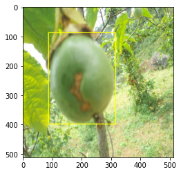
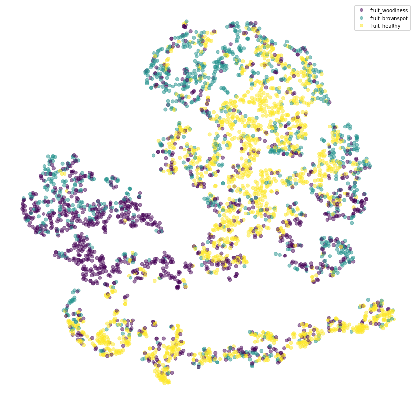
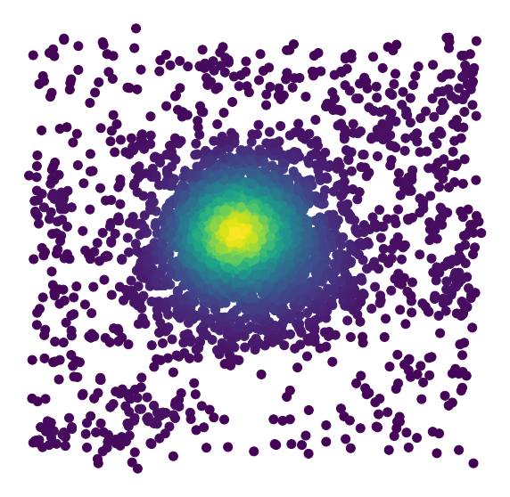
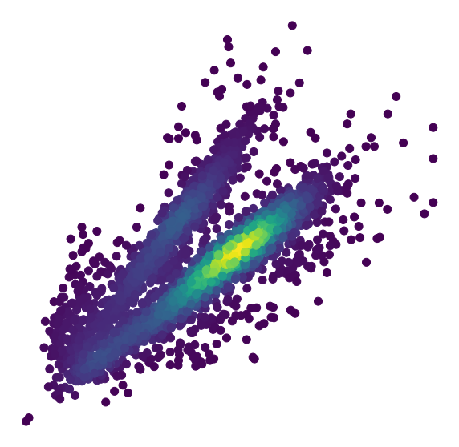

```python
import torch
import torchvision
```


```python
# 数据处理
!pip install --upgrade seaborn
```

    Requirement already satisfied: seaborn in ./anaconda3/envs/torch18/lib/python3.8/site-packages (0.11.2)
    Requirement already satisfied: matplotlib>=2.2 in ./anaconda3/envs/torch18/lib/python3.8/site-packages (from seaborn) (3.4.3)
    Requirement already satisfied: pandas>=0.23 in ./anaconda3/envs/torch18/lib/python3.8/site-packages (from seaborn) (1.3.3)
    Requirement already satisfied: numpy>=1.15 in ./anaconda3/envs/torch18/lib/python3.8/site-packages (from seaborn) (1.21.2)
    Requirement already satisfied: scipy>=1.0 in ./anaconda3/envs/torch18/lib/python3.8/site-packages (from seaborn) (1.7.1)
    Requirement already satisfied: pillow>=6.2.0 in ./anaconda3/envs/torch18/lib/python3.8/site-packages (from matplotlib>=2.2->seaborn) (8.3.2)
    Requirement already satisfied: cycler>=0.10 in ./anaconda3/envs/torch18/lib/python3.8/site-packages (from matplotlib>=2.2->seaborn) (0.10.0)
    Requirement already satisfied: python-dateutil>=2.7 in ./anaconda3/envs/torch18/lib/python3.8/site-packages (from matplotlib>=2.2->seaborn) (2.8.2)
    Requirement already satisfied: pyparsing>=2.2.1 in ./anaconda3/envs/torch18/lib/python3.8/site-packages (from matplotlib>=2.2->seaborn) (2.4.7)
    Requirement already satisfied: kiwisolver>=1.0.1 in ./anaconda3/envs/torch18/lib/python3.8/site-packages (from matplotlib>=2.2->seaborn) (1.3.2)
    Requirement already satisfied: six in ./anaconda3/envs/torch18/lib/python3.8/site-packages (from cycler>=0.10->matplotlib>=2.2->seaborn) (1.16.0)
    Requirement already satisfied: pytz>=2017.3 in ./anaconda3/envs/torch18/lib/python3.8/site-packages (from pandas>=0.23->seaborn) (2021.1)


```python
import numpy as np,pandas as pd 
from glob import glob
import shutil ,os
import matplotlib.pyplot as plt
from sklearn.model_selection import GroupKFold
from tqdm.notebook import tqdm
import seaborn as sns
```


```python
dim = 512 #初始图片数据尺寸
fold = 4     #分为四则
```


```python
train_df = pd.read_csv('/home/snnu/chenkequan/paperExper/yolov5/dataSet/fruit/Train.csv')
train_df.head()
```


<div>
<style scoped>
    .dataframe tbody tr th:only-of-type {
        vertical-align: middle;
    }

    .dataframe tbody tr th {
        vertical-align: top;
    }

    .dataframe thead th {
        text-align: right;
    }
</style>
<table border="1" class="dataframe">
  <thead>
    <tr style="text-align: right;">
      <th></th>
      <th>Image_ID</th>
      <th>class</th>
      <th>xmin</th>
      <th>ymin</th>
      <th>width</th>
      <th>height</th>
    </tr>
  </thead>
  <tbody>
    <tr>
      <th>0</th>
      <td>ID_007FAIEI</td>
      <td>fruit_woodiness</td>
      <td>87.0</td>
      <td>87.5</td>
      <td>228.0</td>
      <td>311.0</td>
    </tr>
    <tr>
      <th>1</th>
      <td>ID_00G8K1V3</td>
      <td>fruit_brownspot</td>
      <td>97.5</td>
      <td>17.5</td>
      <td>245.0</td>
      <td>354.5</td>
    </tr>
    <tr>
      <th>2</th>
      <td>ID_00WROUT9</td>
      <td>fruit_brownspot</td>
      <td>156.5</td>
      <td>209.5</td>
      <td>248.0</td>
      <td>302.5</td>
    </tr>
    <tr>
      <th>3</th>
      <td>ID_00ZJEEK3</td>
      <td>fruit_healthy</td>
      <td>125.0</td>
      <td>193.0</td>
      <td>254.5</td>
      <td>217.0</td>
    </tr>
    <tr>
      <th>4</th>
      <td>ID_018UIENR</td>
      <td>fruit_brownspot</td>
      <td>79.5</td>
      <td>232.5</td>
      <td>233.5</td>
      <td>182.0</td>
    </tr>
  </tbody>
</table>
</div>


```python
#将图片路径整合到表中
train_df['image_path'] = f'/home/snnu/chenkequan/paperExper/yolov5/dataSet/fruit/Train_Images/Train_Images/'+train_df.Image_ID+'.jpg'
train_df.head()
```


<div>
<style scoped>
    .dataframe tbody tr th:only-of-type {
        vertical-align: middle;
    }

    .dataframe tbody tr th {
        vertical-align: top;
    }

    .dataframe thead th {
        text-align: right;
    }
</style>
<table border="1" class="dataframe">
  <thead>
    <tr style="text-align: right;">
      <th></th>
      <th>Image_ID</th>
      <th>class</th>
      <th>xmin</th>
      <th>ymin</th>
      <th>width</th>
      <th>height</th>
      <th>image_path</th>
    </tr>
  </thead>
  <tbody>
    <tr>
      <th>0</th>
      <td>ID_007FAIEI</td>
      <td>fruit_woodiness</td>
      <td>87.0</td>
      <td>87.5</td>
      <td>228.0</td>
      <td>311.0</td>
      <td>/home/snnu/chenkequan/paperExper/yolov5/dataSe...</td>
    </tr>
    <tr>
      <th>1</th>
      <td>ID_00G8K1V3</td>
      <td>fruit_brownspot</td>
      <td>97.5</td>
      <td>17.5</td>
      <td>245.0</td>
      <td>354.5</td>
      <td>/home/snnu/chenkequan/paperExper/yolov5/dataSe...</td>
    </tr>
    <tr>
      <th>2</th>
      <td>ID_00WROUT9</td>
      <td>fruit_brownspot</td>
      <td>156.5</td>
      <td>209.5</td>
      <td>248.0</td>
      <td>302.5</td>
      <td>/home/snnu/chenkequan/paperExper/yolov5/dataSe...</td>
    </tr>
    <tr>
      <th>3</th>
      <td>ID_00ZJEEK3</td>
      <td>fruit_healthy</td>
      <td>125.0</td>
      <td>193.0</td>
      <td>254.5</td>
      <td>217.0</td>
      <td>/home/snnu/chenkequan/paperExper/yolov5/dataSe...</td>
    </tr>
    <tr>
      <th>4</th>
      <td>ID_018UIENR</td>
      <td>fruit_brownspot</td>
      <td>79.5</td>
      <td>232.5</td>
      <td>233.5</td>
      <td>182.0</td>
      <td>/home/snnu/chenkequan/paperExper/yolov5/dataSe...</td>
    </tr>
  </tbody>
</table>
</div>


```python
cls = train_df['class'].unique()
cls
```


    array(['fruit_woodiness', 'fruit_brownspot', 'fruit_healthy'],
          dtype=object)


```python
def setCategory(c):
    if c["class"] == 'fruit_woodiness':
        return 0
    elif c['class']== 'fruit_brownspot':
        return 1
    elif c['class'] == 'fruit_healthy':
        return 2
    else: 
        return -1
```


```python
train_df['class_id'] = train_df.apply(setCategory,axis=1)
train_df.head()
```


<div>
<style scoped>
    .dataframe tbody tr th:only-of-type {
        vertical-align: middle;
    }

    .dataframe tbody tr th {
        vertical-align: top;
    }

    .dataframe thead th {
        text-align: right;
    }
</style>
<table border="1" class="dataframe">
  <thead>
    <tr style="text-align: right;">
      <th></th>
      <th>Image_ID</th>
      <th>class</th>
      <th>xmin</th>
      <th>ymin</th>
      <th>width</th>
      <th>height</th>
      <th>image_path</th>
      <th>class_id</th>
    </tr>
  </thead>
  <tbody>
    <tr>
      <th>0</th>
      <td>ID_007FAIEI</td>
      <td>fruit_woodiness</td>
      <td>87.0</td>
      <td>87.5</td>
      <td>228.0</td>
      <td>311.0</td>
      <td>/home/snnu/chenkequan/paperExper/yolov5/dataSe...</td>
      <td>0</td>
    </tr>
    <tr>
      <th>1</th>
      <td>ID_00G8K1V3</td>
      <td>fruit_brownspot</td>
      <td>97.5</td>
      <td>17.5</td>
      <td>245.0</td>
      <td>354.5</td>
      <td>/home/snnu/chenkequan/paperExper/yolov5/dataSe...</td>
      <td>1</td>
    </tr>
    <tr>
      <th>2</th>
      <td>ID_00WROUT9</td>
      <td>fruit_brownspot</td>
      <td>156.5</td>
      <td>209.5</td>
      <td>248.0</td>
      <td>302.5</td>
      <td>/home/snnu/chenkequan/paperExper/yolov5/dataSe...</td>
      <td>1</td>
    </tr>
    <tr>
      <th>3</th>
      <td>ID_00ZJEEK3</td>
      <td>fruit_healthy</td>
      <td>125.0</td>
      <td>193.0</td>
      <td>254.5</td>
      <td>217.0</td>
      <td>/home/snnu/chenkequan/paperExper/yolov5/dataSe...</td>
      <td>2</td>
    </tr>
    <tr>
      <th>4</th>
      <td>ID_018UIENR</td>
      <td>fruit_brownspot</td>
      <td>79.5</td>
      <td>232.5</td>
      <td>233.5</td>
      <td>182.0</td>
      <td>/home/snnu/chenkequan/paperExper/yolov5/dataSe...</td>
      <td>1</td>
    </tr>
  </tbody>
</table>
</div>


```python
train_df['class_id'].unique()
```


    array([0, 1, 2])


```python
#整合图片size
import cv2
def setImageSize(row):
        #读取图片
    img = cv2.imread(f"{row.image_path}")
#     print(img.shape)
    hig, wid,_ = img.shape
    row['img_hig']=hig
    row['img_wid']=wid
    return row
#     print(hig,wid)
```


```python
# setImageSize(train_df.loc[0])
train_df = train_df.apply(setImageSize,axis=1)
```


```python
train_df.head()
```


<div>
<style scoped>
    .dataframe tbody tr th:only-of-type {
        vertical-align: middle;
    }

    .dataframe tbody tr th {
        vertical-align: top;
    }

    .dataframe thead th {
        text-align: right;
    }
</style>
<table border="1" class="dataframe">
  <thead>
    <tr style="text-align: right;">
      <th></th>
      <th>Image_ID</th>
      <th>class</th>
      <th>xmin</th>
      <th>ymin</th>
      <th>width</th>
      <th>height</th>
      <th>image_path</th>
      <th>class_id</th>
      <th>img_hig</th>
      <th>img_wid</th>
    </tr>
  </thead>
  <tbody>
    <tr>
      <th>0</th>
      <td>ID_007FAIEI</td>
      <td>fruit_woodiness</td>
      <td>87.0</td>
      <td>87.5</td>
      <td>228.0</td>
      <td>311.0</td>
      <td>/home/snnu/chenkequan/paperExper/yolov5/dataSe...</td>
      <td>0</td>
      <td>512</td>
      <td>512</td>
    </tr>
    <tr>
      <th>1</th>
      <td>ID_00G8K1V3</td>
      <td>fruit_brownspot</td>
      <td>97.5</td>
      <td>17.5</td>
      <td>245.0</td>
      <td>354.5</td>
      <td>/home/snnu/chenkequan/paperExper/yolov5/dataSe...</td>
      <td>1</td>
      <td>512</td>
      <td>512</td>
    </tr>
    <tr>
      <th>2</th>
      <td>ID_00WROUT9</td>
      <td>fruit_brownspot</td>
      <td>156.5</td>
      <td>209.5</td>
      <td>248.0</td>
      <td>302.5</td>
      <td>/home/snnu/chenkequan/paperExper/yolov5/dataSe...</td>
      <td>1</td>
      <td>512</td>
      <td>512</td>
    </tr>
    <tr>
      <th>3</th>
      <td>ID_00ZJEEK3</td>
      <td>fruit_healthy</td>
      <td>125.0</td>
      <td>193.0</td>
      <td>254.5</td>
      <td>217.0</td>
      <td>/home/snnu/chenkequan/paperExper/yolov5/dataSe...</td>
      <td>2</td>
      <td>512</td>
      <td>512</td>
    </tr>
    <tr>
      <th>4</th>
      <td>ID_018UIENR</td>
      <td>fruit_brownspot</td>
      <td>79.5</td>
      <td>232.5</td>
      <td>233.5</td>
      <td>182.0</td>
      <td>/home/snnu/chenkequan/paperExper/yolov5/dataSe...</td>
      <td>1</td>
      <td>512</td>
      <td>512</td>
    </tr>
  </tbody>
</table>
</div>


```python
#将box按比例压缩
train_df['box_xmin'] = train_df.apply(lambda row: (row.xmin)/row.img_wid,axis=1)
train_df['box_ymin'] = train_df.apply(lambda row: (row.ymin)/row.img_hig,axis=1)

train_df['box_xmax'] = train_df.apply(lambda row: (row.xmin+row.width)/row.img_wid,axis=1)
train_df['box_ymax'] = train_df.apply(lambda row: (row.ymin+row.height)/row.img_hig,axis=1)
```


```python
train_df.head()
```


<div>
<style scoped>
    .dataframe tbody tr th:only-of-type {
        vertical-align: middle;
    }

    .dataframe tbody tr th {
        vertical-align: top;
    }

    .dataframe thead th {
        text-align: right;
    }
</style>
<table border="1" class="dataframe">
  <thead>
    <tr style="text-align: right;">
      <th></th>
      <th>Image_ID</th>
      <th>class</th>
      <th>xmin</th>
      <th>ymin</th>
      <th>width</th>
      <th>height</th>
      <th>image_path</th>
      <th>class_id</th>
      <th>img_hig</th>
      <th>img_wid</th>
      <th>box_xmin</th>
      <th>box_ymin</th>
      <th>box_xmax</th>
      <th>box_ymax</th>
    </tr>
  </thead>
  <tbody>
    <tr>
      <th>0</th>
      <td>ID_007FAIEI</td>
      <td>fruit_woodiness</td>
      <td>87.0</td>
      <td>87.5</td>
      <td>228.0</td>
      <td>311.0</td>
      <td>/home/snnu/chenkequan/paperExper/yolov5/dataSe...</td>
      <td>0</td>
      <td>512</td>
      <td>512</td>
      <td>0.169922</td>
      <td>0.170898</td>
      <td>0.615234</td>
      <td>0.778320</td>
    </tr>
    <tr>
      <th>1</th>
      <td>ID_00G8K1V3</td>
      <td>fruit_brownspot</td>
      <td>97.5</td>
      <td>17.5</td>
      <td>245.0</td>
      <td>354.5</td>
      <td>/home/snnu/chenkequan/paperExper/yolov5/dataSe...</td>
      <td>1</td>
      <td>512</td>
      <td>512</td>
      <td>0.190430</td>
      <td>0.034180</td>
      <td>0.668945</td>
      <td>0.726562</td>
    </tr>
    <tr>
      <th>2</th>
      <td>ID_00WROUT9</td>
      <td>fruit_brownspot</td>
      <td>156.5</td>
      <td>209.5</td>
      <td>248.0</td>
      <td>302.5</td>
      <td>/home/snnu/chenkequan/paperExper/yolov5/dataSe...</td>
      <td>1</td>
      <td>512</td>
      <td>512</td>
      <td>0.305664</td>
      <td>0.409180</td>
      <td>0.790039</td>
      <td>1.000000</td>
    </tr>
    <tr>
      <th>3</th>
      <td>ID_00ZJEEK3</td>
      <td>fruit_healthy</td>
      <td>125.0</td>
      <td>193.0</td>
      <td>254.5</td>
      <td>217.0</td>
      <td>/home/snnu/chenkequan/paperExper/yolov5/dataSe...</td>
      <td>2</td>
      <td>512</td>
      <td>512</td>
      <td>0.244141</td>
      <td>0.376953</td>
      <td>0.741211</td>
      <td>0.800781</td>
    </tr>
    <tr>
      <th>4</th>
      <td>ID_018UIENR</td>
      <td>fruit_brownspot</td>
      <td>79.5</td>
      <td>232.5</td>
      <td>233.5</td>
      <td>182.0</td>
      <td>/home/snnu/chenkequan/paperExper/yolov5/dataSe...</td>
      <td>1</td>
      <td>512</td>
      <td>512</td>
      <td>0.155273</td>
      <td>0.454102</td>
      <td>0.611328</td>
      <td>0.809570</td>
    </tr>
  </tbody>
</table>
</div>


```python
train_df = train_df.rename(columns={'class':'class_name'})
train_df.head()
```


<div>
<style scoped>
    .dataframe tbody tr th:only-of-type {
        vertical-align: middle;
    }

    .dataframe tbody tr th {
        vertical-align: top;
    }

    .dataframe thead th {
        text-align: right;
    }
</style>
<table border="1" class="dataframe">
  <thead>
    <tr style="text-align: right;">
      <th></th>
      <th>Image_ID</th>
      <th>class_name</th>
      <th>xmin</th>
      <th>ymin</th>
      <th>width</th>
      <th>height</th>
      <th>image_path</th>
      <th>class_id</th>
      <th>img_hig</th>
      <th>img_wid</th>
      <th>box_xmin</th>
      <th>box_ymin</th>
      <th>box_xmax</th>
      <th>box_ymax</th>
    </tr>
  </thead>
  <tbody>
    <tr>
      <th>0</th>
      <td>ID_007FAIEI</td>
      <td>fruit_woodiness</td>
      <td>87.0</td>
      <td>87.5</td>
      <td>228.0</td>
      <td>311.0</td>
      <td>/home/snnu/chenkequan/paperExper/yolov5/dataSe...</td>
      <td>0</td>
      <td>512</td>
      <td>512</td>
      <td>0.169922</td>
      <td>0.170898</td>
      <td>0.615234</td>
      <td>0.778320</td>
    </tr>
    <tr>
      <th>1</th>
      <td>ID_00G8K1V3</td>
      <td>fruit_brownspot</td>
      <td>97.5</td>
      <td>17.5</td>
      <td>245.0</td>
      <td>354.5</td>
      <td>/home/snnu/chenkequan/paperExper/yolov5/dataSe...</td>
      <td>1</td>
      <td>512</td>
      <td>512</td>
      <td>0.190430</td>
      <td>0.034180</td>
      <td>0.668945</td>
      <td>0.726562</td>
    </tr>
    <tr>
      <th>2</th>
      <td>ID_00WROUT9</td>
      <td>fruit_brownspot</td>
      <td>156.5</td>
      <td>209.5</td>
      <td>248.0</td>
      <td>302.5</td>
      <td>/home/snnu/chenkequan/paperExper/yolov5/dataSe...</td>
      <td>1</td>
      <td>512</td>
      <td>512</td>
      <td>0.305664</td>
      <td>0.409180</td>
      <td>0.790039</td>
      <td>1.000000</td>
    </tr>
    <tr>
      <th>3</th>
      <td>ID_00ZJEEK3</td>
      <td>fruit_healthy</td>
      <td>125.0</td>
      <td>193.0</td>
      <td>254.5</td>
      <td>217.0</td>
      <td>/home/snnu/chenkequan/paperExper/yolov5/dataSe...</td>
      <td>2</td>
      <td>512</td>
      <td>512</td>
      <td>0.244141</td>
      <td>0.376953</td>
      <td>0.741211</td>
      <td>0.800781</td>
    </tr>
    <tr>
      <th>4</th>
      <td>ID_018UIENR</td>
      <td>fruit_brownspot</td>
      <td>79.5</td>
      <td>232.5</td>
      <td>233.5</td>
      <td>182.0</td>
      <td>/home/snnu/chenkequan/paperExper/yolov5/dataSe...</td>
      <td>1</td>
      <td>512</td>
      <td>512</td>
      <td>0.155273</td>
      <td>0.454102</td>
      <td>0.611328</td>
      <td>0.809570</td>
    </tr>
  </tbody>
</table>
</div>


```python
train_df.image_path[0]
train_df.box_xmin[0]
```


    0.169921875


```python
from PIL import Image
# image = cv2.imread(train_df.image_path[0])
img = cv2.cvtColor(cv2.imread(train_df.image_path[0]),cv2.COLOR_BGR2RGB)
xmin = train_df.box_xmin[0]*train_df.img_wid[0]
ymin = train_df.box_ymin[0]*train_df.img_hig[0]
xmax = train_df.box_xmax[0]*train_df.img_wid[0]
ymax = train_df.box_ymax[0]*train_df.img_hig[0]
print(xmin,ymin,xmax,ymax)

cv2.rectangle(img,(int(xmin),int(ymin)),(int(xmax),int(ymax)),(255,255,0),2)
# pan = np.array(Image.open(train_df.image_path[0]))
# cv2.imshow('head', img)
plt.imshow(img)
```

    87.0 87.5 315.0 398.5


    <matplotlib.image.AxesImage at 0x7fac07d541c0>


    

    


```python
train_df['box_xmid'] = train_df.apply(lambda row: (row.box_xmin+row.box_xmax)/2,axis=1)
train_df['box_ymid'] = train_df.apply(lambda row: (row.box_ymin+row.box_ymax)/2,axis=1)

train_df['w']= train_df.apply(lambda row: (row.box_xmax-row.box_xmin),axis=1)
train_df['h']= train_df.apply(lambda row: (row.box_ymax-row.box_ymin),axis=1)

train_df['area']= train_df['w']*train_df['h']
train_df.head()
```


<div>
<style scoped>
    .dataframe tbody tr th:only-of-type {
        vertical-align: middle;
    }

    .dataframe tbody tr th {
        vertical-align: top;
    }

    .dataframe thead th {
        text-align: right;
    }
</style>
<table border="1" class="dataframe">
  <thead>
    <tr style="text-align: right;">
      <th></th>
      <th>Image_ID</th>
      <th>class_name</th>
      <th>xmin</th>
      <th>ymin</th>
      <th>width</th>
      <th>height</th>
      <th>image_path</th>
      <th>class_id</th>
      <th>img_hig</th>
      <th>img_wid</th>
      <th>box_xmin</th>
      <th>box_ymin</th>
      <th>box_xmax</th>
      <th>box_ymax</th>
      <th>box_xmid</th>
      <th>box_ymid</th>
      <th>w</th>
      <th>h</th>
      <th>area</th>
    </tr>
  </thead>
  <tbody>
    <tr>
      <th>0</th>
      <td>ID_007FAIEI</td>
      <td>fruit_woodiness</td>
      <td>87.0</td>
      <td>87.5</td>
      <td>228.0</td>
      <td>311.0</td>
      <td>/home/snnu/chenkequan/paperExper/yolov5/dataSe...</td>
      <td>0</td>
      <td>512</td>
      <td>512</td>
      <td>0.169922</td>
      <td>0.170898</td>
      <td>0.615234</td>
      <td>0.778320</td>
      <td>0.392578</td>
      <td>0.474609</td>
      <td>0.445312</td>
      <td>0.607422</td>
      <td>0.270493</td>
    </tr>
    <tr>
      <th>1</th>
      <td>ID_00G8K1V3</td>
      <td>fruit_brownspot</td>
      <td>97.5</td>
      <td>17.5</td>
      <td>245.0</td>
      <td>354.5</td>
      <td>/home/snnu/chenkequan/paperExper/yolov5/dataSe...</td>
      <td>1</td>
      <td>512</td>
      <td>512</td>
      <td>0.190430</td>
      <td>0.034180</td>
      <td>0.668945</td>
      <td>0.726562</td>
      <td>0.429688</td>
      <td>0.380371</td>
      <td>0.478516</td>
      <td>0.692383</td>
      <td>0.331316</td>
    </tr>
    <tr>
      <th>2</th>
      <td>ID_00WROUT9</td>
      <td>fruit_brownspot</td>
      <td>156.5</td>
      <td>209.5</td>
      <td>248.0</td>
      <td>302.5</td>
      <td>/home/snnu/chenkequan/paperExper/yolov5/dataSe...</td>
      <td>1</td>
      <td>512</td>
      <td>512</td>
      <td>0.305664</td>
      <td>0.409180</td>
      <td>0.790039</td>
      <td>1.000000</td>
      <td>0.547852</td>
      <td>0.704590</td>
      <td>0.484375</td>
      <td>0.590820</td>
      <td>0.286179</td>
    </tr>
    <tr>
      <th>3</th>
      <td>ID_00ZJEEK3</td>
      <td>fruit_healthy</td>
      <td>125.0</td>
      <td>193.0</td>
      <td>254.5</td>
      <td>217.0</td>
      <td>/home/snnu/chenkequan/paperExper/yolov5/dataSe...</td>
      <td>2</td>
      <td>512</td>
      <td>512</td>
      <td>0.244141</td>
      <td>0.376953</td>
      <td>0.741211</td>
      <td>0.800781</td>
      <td>0.492676</td>
      <td>0.588867</td>
      <td>0.497070</td>
      <td>0.423828</td>
      <td>0.210672</td>
    </tr>
    <tr>
      <th>4</th>
      <td>ID_018UIENR</td>
      <td>fruit_brownspot</td>
      <td>79.5</td>
      <td>232.5</td>
      <td>233.5</td>
      <td>182.0</td>
      <td>/home/snnu/chenkequan/paperExper/yolov5/dataSe...</td>
      <td>1</td>
      <td>512</td>
      <td>512</td>
      <td>0.155273</td>
      <td>0.454102</td>
      <td>0.611328</td>
      <td>0.809570</td>
      <td>0.383301</td>
      <td>0.631836</td>
      <td>0.456055</td>
      <td>0.355469</td>
      <td>0.162113</td>
    </tr>
  </tbody>
</table>
</div>


```python
features = ['box_xmin','box_ymin','box_xmax','box_ymax','box_xmid','box_ymid','w','h','area']
X = train_df[features]
y = train_df['class_id']
X.shape , y.shape
```


    ((3906, 9), (3906,))


```python
train_df = train_df.rename(columns={'class':'class_name'})
train_df.head()
```


<div>
<style scoped>
    .dataframe tbody tr th:only-of-type {
        vertical-align: middle;
    }

    .dataframe tbody tr th {
        vertical-align: top;
    }

    .dataframe thead th {
        text-align: right;
    }
</style>
<table border="1" class="dataframe">
  <thead>
    <tr style="text-align: right;">
      <th></th>
      <th>Image_ID</th>
      <th>class_name</th>
      <th>xmin</th>
      <th>ymin</th>
      <th>width</th>
      <th>height</th>
      <th>image_path</th>
      <th>class_id</th>
      <th>img_hig</th>
      <th>img_wid</th>
      <th>box_xmin</th>
      <th>box_ymin</th>
      <th>box_xmax</th>
      <th>box_ymax</th>
      <th>box_xmid</th>
      <th>box_ymid</th>
      <th>w</th>
      <th>h</th>
      <th>area</th>
    </tr>
  </thead>
  <tbody>
    <tr>
      <th>0</th>
      <td>ID_007FAIEI</td>
      <td>fruit_woodiness</td>
      <td>87.0</td>
      <td>87.5</td>
      <td>228.0</td>
      <td>311.0</td>
      <td>/home/snnu/chenkequan/paperExper/yolov5/dataSe...</td>
      <td>0</td>
      <td>512</td>
      <td>512</td>
      <td>0.169922</td>
      <td>0.170898</td>
      <td>0.615234</td>
      <td>0.778320</td>
      <td>0.392578</td>
      <td>0.474609</td>
      <td>0.445312</td>
      <td>0.607422</td>
      <td>0.270493</td>
    </tr>
    <tr>
      <th>1</th>
      <td>ID_00G8K1V3</td>
      <td>fruit_brownspot</td>
      <td>97.5</td>
      <td>17.5</td>
      <td>245.0</td>
      <td>354.5</td>
      <td>/home/snnu/chenkequan/paperExper/yolov5/dataSe...</td>
      <td>1</td>
      <td>512</td>
      <td>512</td>
      <td>0.190430</td>
      <td>0.034180</td>
      <td>0.668945</td>
      <td>0.726562</td>
      <td>0.429688</td>
      <td>0.380371</td>
      <td>0.478516</td>
      <td>0.692383</td>
      <td>0.331316</td>
    </tr>
    <tr>
      <th>2</th>
      <td>ID_00WROUT9</td>
      <td>fruit_brownspot</td>
      <td>156.5</td>
      <td>209.5</td>
      <td>248.0</td>
      <td>302.5</td>
      <td>/home/snnu/chenkequan/paperExper/yolov5/dataSe...</td>
      <td>1</td>
      <td>512</td>
      <td>512</td>
      <td>0.305664</td>
      <td>0.409180</td>
      <td>0.790039</td>
      <td>1.000000</td>
      <td>0.547852</td>
      <td>0.704590</td>
      <td>0.484375</td>
      <td>0.590820</td>
      <td>0.286179</td>
    </tr>
    <tr>
      <th>3</th>
      <td>ID_00ZJEEK3</td>
      <td>fruit_healthy</td>
      <td>125.0</td>
      <td>193.0</td>
      <td>254.5</td>
      <td>217.0</td>
      <td>/home/snnu/chenkequan/paperExper/yolov5/dataSe...</td>
      <td>2</td>
      <td>512</td>
      <td>512</td>
      <td>0.244141</td>
      <td>0.376953</td>
      <td>0.741211</td>
      <td>0.800781</td>
      <td>0.492676</td>
      <td>0.588867</td>
      <td>0.497070</td>
      <td>0.423828</td>
      <td>0.210672</td>
    </tr>
    <tr>
      <th>4</th>
      <td>ID_018UIENR</td>
      <td>fruit_brownspot</td>
      <td>79.5</td>
      <td>232.5</td>
      <td>233.5</td>
      <td>182.0</td>
      <td>/home/snnu/chenkequan/paperExper/yolov5/dataSe...</td>
      <td>1</td>
      <td>512</td>
      <td>512</td>
      <td>0.155273</td>
      <td>0.454102</td>
      <td>0.611328</td>
      <td>0.809570</td>
      <td>0.383301</td>
      <td>0.631836</td>
      <td>0.456055</td>
      <td>0.355469</td>
      <td>0.162113</td>
    </tr>
  </tbody>
</table>
</div>


```python
class_ids ,class_names = list(zip(*set(zip(train_df.class_id,train_df.class_name))))
classes = list((np.array(class_names)[np.argsort(class_ids)]))
classes = list(map(lambda x :str(x),classes))
classes
```


    ['fruit_woodiness', 'fruit_brownspot', 'fruit_healthy']


```python
%%time
from sklearn.manifold import TSNE

tsne = TSNE(n_components=2,perplexity=40 ,random_state=1,n_iter=5000)
data_X = X
data_y = y.loc[data_X.index]
embs = tsne.fit_transform(data_X)
#增加置信度
plot_x = embs[:,0]
plot_y = embs[:,1]
```

    CPU times: user 2min 7s, sys: 71.4 ms, total: 2min 7s
    Wall time: 2min 7s


```python
import matplotlib.pyplot as plt
plt.figure(figsize=(15,15))
plt.axis('off')
scatter = plt.scatter(plot_x,plot_y,marker='o',s=50,c=data_y.to_list(),alpha=0.5,cmap='viridis')
plt.legend(handles=scatter.legend_elements()[0],labels=classes)
```


    <matplotlib.legend.Legend at 0x7fac07a4ae50>


    

    


## BBOX Location

### x_mid 和y_mid


```python
from scipy.stats import gaussian_kde

x_val = train_df.box_xmid.values     #第一维数据
y_val = train_df.box_ymid.values     #第二维数据
print(x_val)
print(y_val)
#计算点密度
xy = np.vstack([x_val,y_val])    #将两维数据进行叠加
kenal = gaussian_kde(xy)        #根据xy的样本数据，在定义域上建立概率密度分布，kenal 其实就是一个概率密度分布函数，输入xy坐标给出相应的概率密度
z = kenal.evaluate(xy)          #得到每个样本点的概率密度

# z = gaussian_kde(xy)(xy)     #上面两行的简化版

fig, ax = plt.subplots(figsize=(10,10))
ax.axis('off')
ax.scatter(x_val,y_val,c=z,s=100,cmap='viridis')
plt.show()
```

    [0.39257812 0.4296875  0.54785156 ... 0.83056641 0.46142578 0.43408203]
    [0.47460938 0.38037109 0.70458984 ... 0.56152344 0.47216797 0.57666016]


    

    


## bbx_w 和 bbox_h 概率密度分布


```python
x_val = train_df.w.values
y_val = train_df.h.values

#计算概率密度
xy = np.vstack([x_val,y_val])
z = gaussian_kde(xy)(xy)

fig ,ax = plt.subplots(figsize = (10,10))
ax.axis('off')
ax.scatter(x_val,y_val,c=z,s=100,cmap='viridis')
plt.show()
```


    

    


### 图片大小分布


```python
#两个向量不能相同
x_val = train_df.img_wid.values
y_val = train_df.img_hig.values

# Calculate the point density
xy = np.vstack([x_val,y_val])
z = gaussian_kde(xy)(xy)

fig, ax = plt.subplots(figsize = (10, 10))
ax.axis('off')
ax.scatter(x_val, y_val, c=z, s=100, cmap='viridis')
# ax.set_xlabel('image_width')
# ax.set_ylabel('image_height')
plt.show()
```


    ---------------------------------------------------------------------------

    LinAlgError                               Traceback (most recent call last)

    /tmp/ipykernel_19767/968791208.py in <module>
          5 # Calculate the point density
          6 xy = np.vstack([x_val,y_val])
    ----> 7 z = gaussian_kde(xy)(xy)
          8 
          9 fig, ax = plt.subplots(figsize = (10, 10))


    ~/anaconda3/envs/torch18/lib/python3.8/site-packages/scipy/stats/kde.py in __init__(self, dataset, bw_method, weights)
        204             self._neff = 1/sum(self._weights**2)
        205 
    --> 206         self.set_bandwidth(bw_method=bw_method)
        207 
        208     def evaluate(self, points):


    ~/anaconda3/envs/torch18/lib/python3.8/site-packages/scipy/stats/kde.py in set_bandwidth(self, bw_method)
        552             raise ValueError(msg)
        553 
    --> 554         self._compute_covariance()
        555 
        556     def _compute_covariance(self):


    ~/anaconda3/envs/torch18/lib/python3.8/site-packages/scipy/stats/kde.py in _compute_covariance(self)
        564                                                bias=False,
        565                                                aweights=self.weights))
    --> 566             self._data_inv_cov = linalg.inv(self._data_covariance)
        567 
        568         self.covariance = self._data_covariance * self.factor**2


    ~/anaconda3/envs/torch18/lib/python3.8/site-packages/scipy/linalg/basic.py in inv(a, overwrite_a, check_finite)
        966         inv_a, info = getri(lu, piv, lwork=lwork, overwrite_lu=1)
        967     if info > 0:
    --> 968         raise LinAlgError("singular matrix")
        969     if info < 0:
        970         raise ValueError('illegal value in %d-th argument of internal '


    LinAlgError: singular matrix


```python
#划分数据集, 多则训练
gkf = GroupKFold(n_splits=5)
train_df['fold'] = -1
for fold,(train_idx,val_idx) in enumerate(gkf.split(train_df,groups=train_df.Image_ID.tolist())):
    train_df.loc[val_idx,'fold'] = fold
train_df.head()
```


<div>
<style scoped>
    .dataframe tbody tr th:only-of-type {
        vertical-align: middle;
    }

    .dataframe tbody tr th {
        vertical-align: top;
    }

    .dataframe thead th {
        text-align: right;
    }
</style>
<table border="1" class="dataframe">
  <thead>
    <tr style="text-align: right;">
      <th></th>
      <th>Image_ID</th>
      <th>class_name</th>
      <th>xmin</th>
      <th>ymin</th>
      <th>width</th>
      <th>height</th>
      <th>image_path</th>
      <th>class_id</th>
      <th>img_hig</th>
      <th>img_wid</th>
      <th>box_xmin</th>
      <th>box_ymin</th>
      <th>box_xmax</th>
      <th>box_ymax</th>
      <th>box_xmid</th>
      <th>box_ymid</th>
      <th>w</th>
      <th>h</th>
      <th>area</th>
      <th>fold</th>
    </tr>
  </thead>
  <tbody>
    <tr>
      <th>0</th>
      <td>ID_007FAIEI</td>
      <td>fruit_woodiness</td>
      <td>87.0</td>
      <td>87.5</td>
      <td>228.0</td>
      <td>311.0</td>
      <td>/home/snnu/chenkequan/paperExper/yolov5/dataSe...</td>
      <td>0</td>
      <td>512</td>
      <td>512</td>
      <td>0.169922</td>
      <td>0.170898</td>
      <td>0.615234</td>
      <td>0.778320</td>
      <td>0.392578</td>
      <td>0.474609</td>
      <td>0.445312</td>
      <td>0.607422</td>
      <td>0.270493</td>
      <td>0</td>
    </tr>
    <tr>
      <th>1</th>
      <td>ID_00G8K1V3</td>
      <td>fruit_brownspot</td>
      <td>97.5</td>
      <td>17.5</td>
      <td>245.0</td>
      <td>354.5</td>
      <td>/home/snnu/chenkequan/paperExper/yolov5/dataSe...</td>
      <td>1</td>
      <td>512</td>
      <td>512</td>
      <td>0.190430</td>
      <td>0.034180</td>
      <td>0.668945</td>
      <td>0.726562</td>
      <td>0.429688</td>
      <td>0.380371</td>
      <td>0.478516</td>
      <td>0.692383</td>
      <td>0.331316</td>
      <td>4</td>
    </tr>
    <tr>
      <th>2</th>
      <td>ID_00WROUT9</td>
      <td>fruit_brownspot</td>
      <td>156.5</td>
      <td>209.5</td>
      <td>248.0</td>
      <td>302.5</td>
      <td>/home/snnu/chenkequan/paperExper/yolov5/dataSe...</td>
      <td>1</td>
      <td>512</td>
      <td>512</td>
      <td>0.305664</td>
      <td>0.409180</td>
      <td>0.790039</td>
      <td>1.000000</td>
      <td>0.547852</td>
      <td>0.704590</td>
      <td>0.484375</td>
      <td>0.590820</td>
      <td>0.286179</td>
      <td>1</td>
    </tr>
    <tr>
      <th>3</th>
      <td>ID_00ZJEEK3</td>
      <td>fruit_healthy</td>
      <td>125.0</td>
      <td>193.0</td>
      <td>254.5</td>
      <td>217.0</td>
      <td>/home/snnu/chenkequan/paperExper/yolov5/dataSe...</td>
      <td>2</td>
      <td>512</td>
      <td>512</td>
      <td>0.244141</td>
      <td>0.376953</td>
      <td>0.741211</td>
      <td>0.800781</td>
      <td>0.492676</td>
      <td>0.588867</td>
      <td>0.497070</td>
      <td>0.423828</td>
      <td>0.210672</td>
      <td>3</td>
    </tr>
    <tr>
      <th>4</th>
      <td>ID_018UIENR</td>
      <td>fruit_brownspot</td>
      <td>79.5</td>
      <td>232.5</td>
      <td>233.5</td>
      <td>182.0</td>
      <td>/home/snnu/chenkequan/paperExper/yolov5/dataSe...</td>
      <td>1</td>
      <td>512</td>
      <td>512</td>
      <td>0.155273</td>
      <td>0.454102</td>
      <td>0.611328</td>
      <td>0.809570</td>
      <td>0.383301</td>
      <td>0.631836</td>
      <td>0.456055</td>
      <td>0.355469</td>
      <td>0.162113</td>
      <td>1</td>
    </tr>
  </tbody>
</table>
</div>


```python
train_files = []
val_files = []
# val_files += [list(train_df[train_df.fold==fold].image_path.unique()),list(train_df[train_df.fold==fold].box_xmin),list(train_df[train_df.fold==fold].class_id),list(train_df[train_df.fold==fold].box_ymin),list(train_df[train_df.fold==fold].box_xmax),list(train_df[train_df.fold==fold].box_ymax)]
val_files += list(train_df[train_df.fold==fold].image_path.unique())
train_files += list(train_df[train_df.fold!=fold].image_path.unique())
len(train_files),len(val_files)
```


    (2401, 600)


```python
train_df[train_df.fold==fold]
```


<div>
<style scoped>
    .dataframe tbody tr th:only-of-type {
        vertical-align: middle;
    }

    .dataframe tbody tr th {
        vertical-align: top;
    }

    .dataframe thead th {
        text-align: right;
    }
</style>
<table border="1" class="dataframe">
  <thead>
    <tr style="text-align: right;">
      <th></th>
      <th>Image_ID</th>
      <th>class_name</th>
      <th>xmin</th>
      <th>ymin</th>
      <th>width</th>
      <th>height</th>
      <th>image_path</th>
      <th>class_id</th>
      <th>img_hig</th>
      <th>img_wid</th>
      <th>box_xmin</th>
      <th>box_ymin</th>
      <th>box_xmax</th>
      <th>box_ymax</th>
      <th>box_xmid</th>
      <th>box_ymid</th>
      <th>w</th>
      <th>h</th>
      <th>area</th>
      <th>fold</th>
    </tr>
  </thead>
  <tbody>
    <tr>
      <th>1</th>
      <td>ID_00G8K1V3</td>
      <td>fruit_brownspot</td>
      <td>97.5</td>
      <td>17.5</td>
      <td>245.0</td>
      <td>354.5</td>
      <td>/home/snnu/chenkequan/paperExper/yolov5/dataSe...</td>
      <td>1</td>
      <td>512</td>
      <td>512</td>
      <td>0.190430</td>
      <td>0.034180</td>
      <td>0.668945</td>
      <td>0.726562</td>
      <td>0.429688</td>
      <td>0.380371</td>
      <td>0.478516</td>
      <td>0.692383</td>
      <td>0.331316</td>
      <td>4</td>
    </tr>
    <tr>
      <th>16</th>
      <td>ID_05V8XX4L</td>
      <td>fruit_woodiness</td>
      <td>286.5</td>
      <td>150.5</td>
      <td>162.0</td>
      <td>193.5</td>
      <td>/home/snnu/chenkequan/paperExper/yolov5/dataSe...</td>
      <td>0</td>
      <td>512</td>
      <td>512</td>
      <td>0.559570</td>
      <td>0.293945</td>
      <td>0.875977</td>
      <td>0.671875</td>
      <td>0.717773</td>
      <td>0.482910</td>
      <td>0.316406</td>
      <td>0.377930</td>
      <td>0.119579</td>
      <td>4</td>
    </tr>
    <tr>
      <th>17</th>
      <td>ID_05V8XX4L</td>
      <td>fruit_woodiness</td>
      <td>112.0</td>
      <td>118.0</td>
      <td>155.5</td>
      <td>184.0</td>
      <td>/home/snnu/chenkequan/paperExper/yolov5/dataSe...</td>
      <td>0</td>
      <td>512</td>
      <td>512</td>
      <td>0.218750</td>
      <td>0.230469</td>
      <td>0.522461</td>
      <td>0.589844</td>
      <td>0.370605</td>
      <td>0.410156</td>
      <td>0.303711</td>
      <td>0.359375</td>
      <td>0.109146</td>
      <td>4</td>
    </tr>
    <tr>
      <th>26</th>
      <td>ID_07MFGPW3</td>
      <td>fruit_healthy</td>
      <td>141.0</td>
      <td>189.5</td>
      <td>244.5</td>
      <td>197.5</td>
      <td>/home/snnu/chenkequan/paperExper/yolov5/dataSe...</td>
      <td>2</td>
      <td>512</td>
      <td>512</td>
      <td>0.275391</td>
      <td>0.370117</td>
      <td>0.752930</td>
      <td>0.755859</td>
      <td>0.514160</td>
      <td>0.562988</td>
      <td>0.477539</td>
      <td>0.385742</td>
      <td>0.184207</td>
      <td>4</td>
    </tr>
    <tr>
      <th>27</th>
      <td>ID_07MFGPW3</td>
      <td>fruit_healthy</td>
      <td>4.5</td>
      <td>233.0</td>
      <td>81.5</td>
      <td>58.0</td>
      <td>/home/snnu/chenkequan/paperExper/yolov5/dataSe...</td>
      <td>2</td>
      <td>512</td>
      <td>512</td>
      <td>0.008789</td>
      <td>0.455078</td>
      <td>0.167969</td>
      <td>0.568359</td>
      <td>0.088379</td>
      <td>0.511719</td>
      <td>0.159180</td>
      <td>0.113281</td>
      <td>0.018032</td>
      <td>4</td>
    </tr>
    <tr>
      <th>...</th>
      <td>...</td>
      <td>...</td>
      <td>...</td>
      <td>...</td>
      <td>...</td>
      <td>...</td>
      <td>...</td>
      <td>...</td>
      <td>...</td>
      <td>...</td>
      <td>...</td>
      <td>...</td>
      <td>...</td>
      <td>...</td>
      <td>...</td>
      <td>...</td>
      <td>...</td>
      <td>...</td>
      <td>...</td>
      <td>...</td>
    </tr>
    <tr>
      <th>3899</th>
      <td>ID_ZZ0MWI19</td>
      <td>fruit_brownspot</td>
      <td>90.5</td>
      <td>18.5</td>
      <td>327.0</td>
      <td>267.0</td>
      <td>/home/snnu/chenkequan/paperExper/yolov5/dataSe...</td>
      <td>1</td>
      <td>512</td>
      <td>512</td>
      <td>0.176758</td>
      <td>0.036133</td>
      <td>0.815430</td>
      <td>0.557617</td>
      <td>0.496094</td>
      <td>0.296875</td>
      <td>0.638672</td>
      <td>0.521484</td>
      <td>0.333057</td>
      <td>4</td>
    </tr>
    <tr>
      <th>3901</th>
      <td>ID_ZZAB1FH1</td>
      <td>fruit_healthy</td>
      <td>96.0</td>
      <td>175.5</td>
      <td>289.5</td>
      <td>222.0</td>
      <td>/home/snnu/chenkequan/paperExper/yolov5/dataSe...</td>
      <td>2</td>
      <td>512</td>
      <td>512</td>
      <td>0.187500</td>
      <td>0.342773</td>
      <td>0.752930</td>
      <td>0.776367</td>
      <td>0.470215</td>
      <td>0.559570</td>
      <td>0.565430</td>
      <td>0.433594</td>
      <td>0.245167</td>
      <td>4</td>
    </tr>
    <tr>
      <th>3902</th>
      <td>ID_ZZAB1FH1</td>
      <td>fruit_healthy</td>
      <td>330.0</td>
      <td>241.0</td>
      <td>182.0</td>
      <td>180.5</td>
      <td>/home/snnu/chenkequan/paperExper/yolov5/dataSe...</td>
      <td>2</td>
      <td>512</td>
      <td>512</td>
      <td>0.644531</td>
      <td>0.470703</td>
      <td>1.000000</td>
      <td>0.823242</td>
      <td>0.822266</td>
      <td>0.646973</td>
      <td>0.355469</td>
      <td>0.352539</td>
      <td>0.125317</td>
      <td>4</td>
    </tr>
    <tr>
      <th>3903</th>
      <td>ID_ZZJZ2CV6</td>
      <td>fruit_healthy</td>
      <td>358.0</td>
      <td>234.0</td>
      <td>134.5</td>
      <td>107.0</td>
      <td>/home/snnu/chenkequan/paperExper/yolov5/dataSe...</td>
      <td>2</td>
      <td>512</td>
      <td>512</td>
      <td>0.699219</td>
      <td>0.457031</td>
      <td>0.961914</td>
      <td>0.666016</td>
      <td>0.830566</td>
      <td>0.561523</td>
      <td>0.262695</td>
      <td>0.208984</td>
      <td>0.054899</td>
      <td>4</td>
    </tr>
    <tr>
      <th>3904</th>
      <td>ID_ZZJZ2CV6</td>
      <td>fruit_healthy</td>
      <td>98.5</td>
      <td>135.0</td>
      <td>275.5</td>
      <td>213.5</td>
      <td>/home/snnu/chenkequan/paperExper/yolov5/dataSe...</td>
      <td>2</td>
      <td>512</td>
      <td>512</td>
      <td>0.192383</td>
      <td>0.263672</td>
      <td>0.730469</td>
      <td>0.680664</td>
      <td>0.461426</td>
      <td>0.472168</td>
      <td>0.538086</td>
      <td>0.416992</td>
      <td>0.224378</td>
      <td>4</td>
    </tr>
  </tbody>
</table>
<p>781 rows × 20 columns</p>
</div>


```python

```

### 复制文件，整理数据集


```python
os.makedirs('/home/snnu/chenkequan/paperExper/yolov5/dataSet/fruit_yolov5/labels/train',exist_ok=True)
os.makedirs('/home/snnu/chenkequan/paperExper/yolov5/dataSet/fruit_yolov5/labels/val',exist_ok=True)
os.makedirs('/home/snnu/chenkequan/paperExper/yolov5/dataSet/fruit_yolov5/images/train',exist_ok=True)
os.makedirs('/home/snnu/chenkequan/paperExper/yolov5/dataSet/fruit_yolov5/images/val',exist_ok=True)

labeldir = '/home/snnu/chenkequan/paperExper/yolov5/dataSet/fruit/labels/train/'
#当前没有源标签，由自己后面生成，当前
for file in tqdm(train_files):
    shutil.copy(file,'/home/snnu/chenkequan/paperExper/yolov5/dataSet/fruit_yolov5/images/train')
    filename = file.split("/")[-1].split('.')[0]
    shutil.copy(os.path.join(labeldir,filename+'.txt'),'/home/snnu/chenkequan/paperExper/yolov5/dataSet/fruit_yolov5/labels/train')
    
for file in tqdm(val_files):
    shutil.copy(file,'/home/snnu/chenkequan/paperExper/yolov5/dataSet/fruit_yolov5/images/val')
    filename = file.split("/")[-1].split('.')[0]
    shutil.copy(os.path.join(labeldir,filename+'.txt'),'/home/snnu/chenkequan/paperExper/yolov5/dataSet/fruit_yolov5/labels/val')        
        

```


      0%|          | 0/2401 [00:00<?, ?it/s]


      0%|          | 0/600 [00:00<?, ?it/s]


```python
## 获取类名
class_ids,class_names ,classes
```


    ((2, 1, 0),
     ('fruit_healthy', 'fruit_brownspot', 'fruit_woodiness'),
     ['fruit_woodiness', 'fruit_brownspot', 'fruit_healthy'])


## Yolov5


```python
from os import listdir
from os.path import isfile,jion
import yaml

cwd = '/home/snnu/chenkequan/paperExper/yolov5/dataSet/fruit_yolov5'

```


```python

```


```python

```


```python

```
