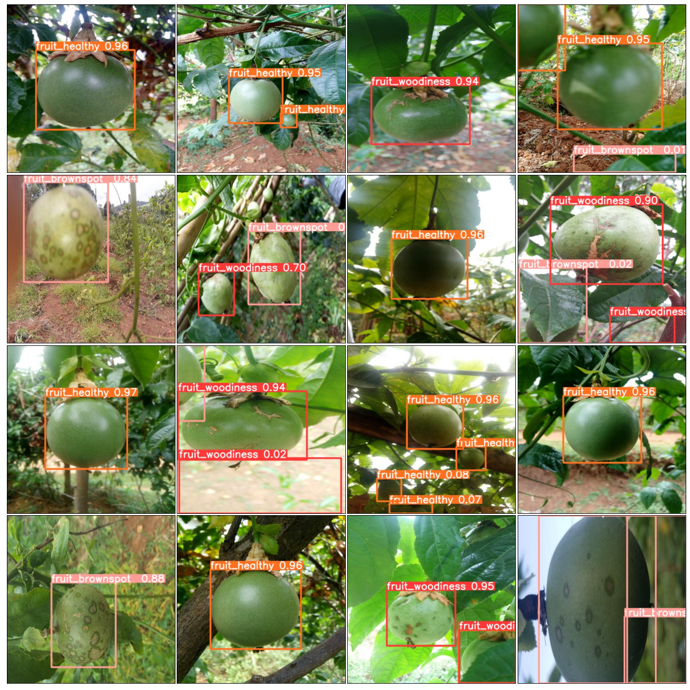
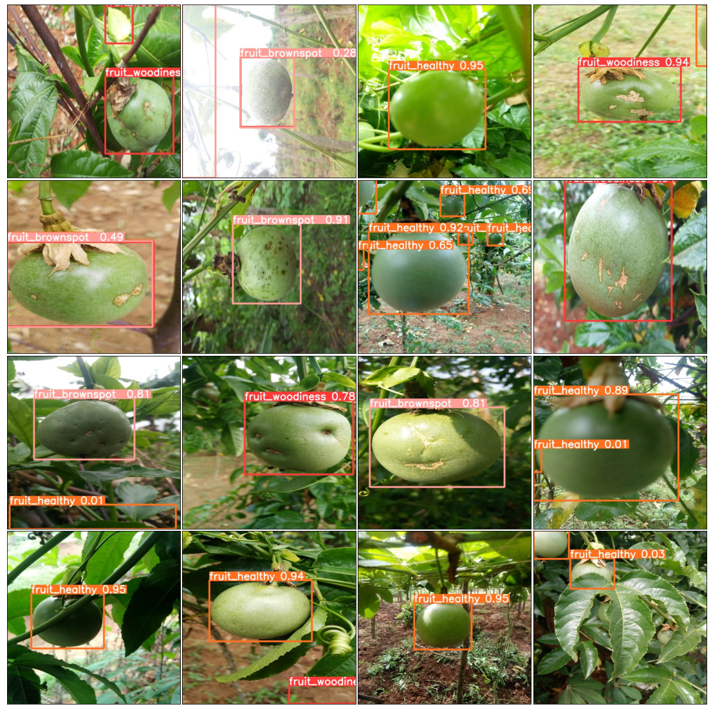
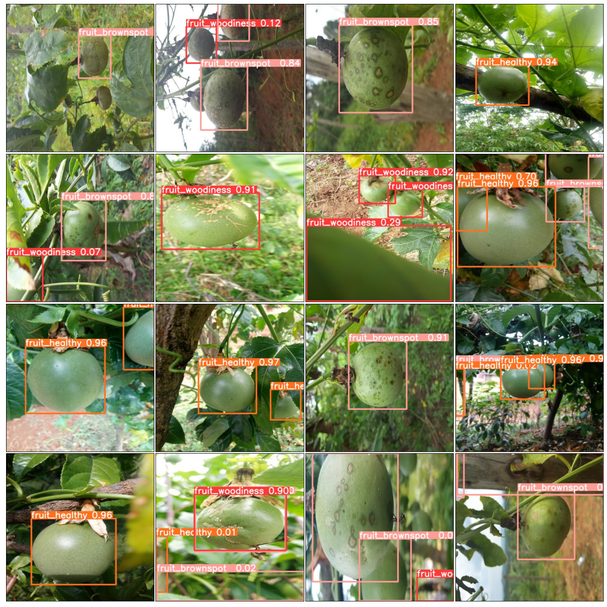

## 水果检测推理结果处理


```python
import numpy as np, pandas as pd
from glob import glob
import shutil, os
import matplotlib.pyplot as plt
from sklearn.model_selection import GroupKFold
from tqdm.notebook import tqdm
import seaborn as sns
```


```python

```


```python
os.chdir('/home/snnu/chenkequan/paperExper/yolov5')
```


```python
import matplotlib.pyplot as plt
from mpl_toolkits.axes_grid1 import ImageGrid
import numpy as np
import random
import cv2
from glob import glob
from tqdm import tqdm

files = glob('runs/detect/exp/*.jpg')
for _ in range(3):
    row = 4
    col = 4
    grid_files = random.sample(files,row*col)
    images = []
    for image_path in tqdm(grid_files):
        img = cv2.cvtColor(cv2.imread(image_path),cv2.COLOR_BGR2RGB)
        images.append(img)
    fig = plt.figure(figsize=(col*5,row*5))
    grid = ImageGrid(fig,111,
                    nrows_ncols=(col,row),
                    axes_pad=0.05,)
    for ax,im in zip(grid,images):
        ax.imshow(im)
        ax.set_xticks([])
        ax.set_yticks([])
    plt.show()
```

    100%|██████████████████████████████████████████| 16/16 [00:00<00:00, 256.30it/s]


    

    


    100%|██████████████████████████████████████████| 16/16 [00:00<00:00, 314.60it/s]


    

    


    100%|██████████████████████████████████████████| 16/16 [00:00<00:00, 338.72it/s]


    

    


```python
import torch
def xywh2xyxy(img_h,img_w,x):
    # Convert nx4 boxes from [x, y, w, h] to [x1, y1, x2, y2] where xy1=top-left, xy2=bottom-right
    y = x.clone() if isinstance(x, torch.Tensor) else np.copy(x)
    print(y)
    y[:, 0] = img_w * (x[:, 0] - x[:, 2] / 2)  # top left x
    y[:, 1] = img_h * (x[:, 1] - x[:, 3] / 2)  # top left y
    y[:, 2] = img_w * (x[:, 0] + x[:, 2] / 2)  # bottom right x
    y[:, 3] = img_h * (x[:, 1] + x[:, 3] / 2)  # bottom right y
    return y
```


```python
image_names = []
class_id  = []
conf = []
xminboxes = []
yminboxes = []
xmaxboxes = []
ymaxboxes = []
class_dict = {0:'fruit_woodiness', 1:'fruit_brownspot', 2:'fruit_healthy'}    
for file_path in tqdm(glob('runs/detect/exp/labels/*txt')):
        image_name= file_path.split('/')[-1].replace('txt','jpg')
        f = open(file_path,'r')
        #在推理的标签中读取数据，先替换换行符，去空格，以空格分割，转浮点型，变形
        data = np.array(f.read().replace('\n',' ').strip().split(' ')).astype(np.float32).reshape(-1,6)      
#         以 标签 置信度 box 排列
        data = data[:,[0,5,1,2,3,4]]
#         data = np.array(data)
#         sort_box = data[np.lexsort(-data[:,::-2].T)][0:4]
        sort_box = data[np.lexsort(-data[:,::-2].T)]
        
#         print(sort_Index)
        #以置信度进行排列
        for box in sort_box:
#             print([list(box[2:])])
            box_xyxy = xywh2xyxy(512,512,np.array([box[2:]]))[0]
#             print(box_xyxy)
            print(image_name.split('.')[0])
            image_names.append(image_name.split('.')[0])
            class_id.append(class_dict[int(box[0])])
            conf.append(box[1])
#             xminboxes.append(box_xyxy[0])
#             yminboxes.append(box_xyxy[1])
#             xmaxboxes.append(box_xyxy[2])
#             ymaxboxes.append(box_xyxy[3])
            
            
            xminboxes.append(box_xyxy[0] if box_xyxy[0]>=0 else 0)
            yminboxes.append(box_xyxy[1] if box_xyxy[1]>=0 else 0)
            xmaxboxes.append(box_xyxy[2] if box_xyxy[2]>=0 else 0)
            ymaxboxes.append(box_xyxy[3] if box_xyxy[3]>=0 else 0)
            
            
            
#         print(data)= data[:,[]]
#         bbox_max = []
#     #选取其中置信度最大的框
#         if len(data)==1 :
#             bbox_max = data[0] 
#         elif len(data)>1:
#             bbox_max = data[0] 
#             for box in data:
#                 if bbox_max[1] < box[1]:
#                      bbox_max = box
#                 print("box",box)
          
        
#         bbox_max = bbox_max[:2]
#         print("bbox_max",bbox_max)

print(len(image_names))
print(len(class_id))
print(len(conf))

```

     27%|██████████▍                            | 248/931 [00:00<00:00, 1247.22it/s]

    [[0.571289 0.28418  0.220703 0.291016]]
    ID_UVT1BV5I
    [[0.612305 0.739258 0.251953 0.322266]]
    ID_UVT1BV5I
    [[0.417969 0.113281 0.1875   0.226562]]
    ID_UVT1BV5I
    [[0.415039 0.108398 0.189453 0.216797]]
    ID_UVT1BV5I
    [[0.599609 0.739258 0.28125  0.322266]]
    ID_UVT1BV5I
    [[0.424805 0.604492 0.517578 0.412109]]
    ID_4OXFGOGA
    [[0.769531  0.948242  0.460938  0.0996094]]
    ID_4OXFGOGA
    [[0.782227 0.134766 0.431641 0.269531]]
    ID_4OXFGOGA
    [[0.508789 0.486328 0.419922 0.566406]]
    ID_BRFCKCPH
    [[0.491211 0.388672 0.416016 0.367188]]
    ID_XEQDU0L1
    [[0.332031 0.264648 0.230469 0.306641]]
    ID_M3V2AUVC
    [[0.756836  0.663086  0.0917969 0.103516 ]]
    ID_M3V2AUVC
    [[0.373047 0.47168  0.472656 0.587891]]
    ID_86WK6QMP
    [[0.0322266 0.711914  0.0644531 0.576172 ]]
    ID_86WK6QMP
    [[0.807617 0.163086 0.357422 0.326172]]
    ID_86WK6QMP
    [[0.808594 0.161133 0.359375 0.322266]]
    ID_86WK6QMP
    [[0.50293  0.545898 0.314453 0.244141]]
    ID_CM597XOK
    [[0.0371094 0.87207   0.0742188 0.205078 ]]
    ID_CM597XOK
    [[0.484375 0.581055 0.390625 0.322266]]
    ID_AR13HARC
    [[0.876953 0.682617 0.203125 0.205078]]
    ID_AR13HARC
    [[0.348633 0.46582  0.388672 0.318359]]
    ID_UENNAV2T
    [[0.912109  0.0888672 0.175781  0.177734 ]]
    ID_UENNAV2T
    [[0.0205078 0.249023  0.0410156 0.259766 ]]
    ID_UENNAV2T
    [[0.53125  0.672852 0.375    0.466797]]
    ID_6RUAZPEU
    [[0.470703 0.601562 0.566406 0.320312]]
    ID_Q292J4KL
    [[0.533203 0.578125 0.519531 0.398438]]
    ID_ED2VFMPY
    [[0.706055 0.379883 0.279297 0.330078]]
    ID_LIURKW5N
    [[0.738281 0.677734 0.257812 0.324219]]
    ID_LIURKW5N
    [[0.519531 0.460938 0.292969 0.425781]]
    ID_O7QJFD51
    [[0.479492 0.470703 0.423828 0.339844]]
    ID_OXOCXET8
    [[0.0195312 0.555664  0.0390625 0.134766 ]]
    ID_OXOCXET8
    [[0.435547 0.487305 0.605469 0.478516]]
    ID_PT3IMK8O
    [[0.851562 0.591797 0.164062 0.121094]]
    ID_PT3IMK8O
    [[0.525391 0.454102 0.386719 0.294922]]
    ID_ENVT7ZIJ
    [[0.538086 0.46582  0.580078 0.451172]]
    ID_OY4BC7ZK
    [[0.865234 0.56543  0.269531 0.451172]]
    ID_OLES0AAK
    [[0.392578 0.458008 0.691406 0.529297]]
    ID_OLES0AAK
    [[0.394531 0.473633 0.6875   0.494141]]
    ID_OLES0AAK
    [[0.831055  0.970703  0.322266  0.0585938]]
    ID_OLES0AAK
    [[0.491211 0.466797 0.591797 0.40625 ]]
    ID_ATZ8R9PL
    [[0.646484 0.476562 0.441406 0.566406]]
    ID_EP9PX8AP
    [[0.458008 0.484375 0.333984 0.421875]]
    ID_RD4JDJG1
    [[0.489258 0.772461 0.974609 0.455078]]
    ID_RD4JDJG1
    [[0.447266 0.563477 0.308594 0.396484]]
    ID_I7A7QK3H
    [[0.566406 0.47168  0.355469 0.435547]]
    ID_T1O01L63
    [[0.43457  0.432617 0.240234 0.333984]]
    ID_NJ6YKKOG
    [[0.423828 0.430664 0.265625 0.333984]]
    ID_NJ6YKKOG
    [[0.419922 0.490234 0.5      0.761719]]
    ID_L4UMREDN
    [[0.919922 0.824219 0.15625  0.304688]]
    ID_L4UMREDN
    [[0.485352 0.519531 0.568359 0.371094]]
    ID_QCTB17VM
    [[0.510742 0.832031 0.974609 0.335938]]
    ID_QCTB17VM
    [[0.572266 0.500977 0.3125   0.412109]]
    ID_M39EONS8
    [[0.149414  0.977539  0.298828  0.0449219]]
    ID_M39EONS8
    [[0.261719 0.62793  0.523438 0.486328]]
    ID_P9BJU39R
    [[0.380859 0.337891 0.761719 0.507812]]
    ID_C8S3CO41
    [[0.515625 0.932617 0.933594 0.134766]]
    ID_C8S3CO41
    [[0.474609  0.0888672 0.28125   0.177734 ]]
    ID_27XRLVUQ
    [[0.637695 0.731445 0.533203 0.537109]]
    ID_MYTX2LAA
    [[0.454102 0.5      0.908203 1.      ]]
    ID_MYTX2LAA
    [[0.505859 0.407227 0.988281 0.814453]]
    ID_MYTX2LAA
    [[0.5      0.523438 0.335938 0.277344]]
    ID_17DT3SQU
    [[0.583008 0.921875 0.212891 0.15625 ]]
    ID_17DT3SQU
    [[0.49707  0.591797 0.623047 0.507812]]
    ID_66UEXYMF
    [[0.761719 0.919922 0.46875  0.15625 ]]
    ID_66UEXYMF
    [[0.638672 0.915039 0.722656 0.166016]]
    ID_66UEXYMF
    [[0.545898 0.545898 0.544922 0.349609]]
    ID_CFW00IDY
    [[0.110352 0.539062 0.212891 0.417969]]
    ID_CFW00IDY
    [[0.549805 0.533203 0.533203 0.371094]]
    ID_CFW00IDY
    [[0.569336 0.484375 0.572266 0.457031]]
    ID_D48HOC00
    [[0.755859 0.874023 0.382812 0.251953]]
    ID_D48HOC00
    [[0.258789  0.0791016 0.482422  0.154297 ]]
    ID_D48HOC00
    [[0.896484 0.422852 0.207031 0.240234]]
    ID_D48HOC00
    [[0.113281 0.766602 0.226562 0.466797]]
    ID_D48HOC00
    [[0.363281 0.548828 0.324219 0.265625]]
    ID_NYRXEUH1
    [[0.479492 0.496094 0.357422 0.300781]]
    ID_W0VS8GW0
    [[0.676758 0.56543  0.302734 0.388672]]
    ID_4LYDXW1O
    [[0.530273 0.28418  0.294922 0.361328]]
    ID_4LYDXW1O
    [[0.671875 0.449219 0.425781 0.335938]]
    ID_Y4LEKLH2
    [[0.199219 0.683594 0.34375  0.289062]]
    ID_Y4LEKLH2
    [[0.486328 0.483398 0.390625 0.458984]]
    ID_UKM8AHO1
    [[0.452148 0.475586 0.580078 0.458984]]
    ID_W3UWB38H
    [[0.0322266 0.55957   0.0644531 0.283203 ]]
    ID_W3UWB38H
    [[0.9375   0.268555 0.125    0.111328]]
    ID_W3UWB38H
    [[0.266602  0.0185547 0.240234  0.0371094]]
    ID_W3UWB38H
    [[0.334961  0.0458984 0.173828  0.0917969]]
    ID_W3UWB38H
    [[0.500977 0.629883 0.423828 0.501953]]
    ID_S6I7MIMU
    [[0.533203 0.515625 0.421875 0.324219]]
    ID_NE7KN6UJ
    [[0.255859  0.0185547 0.0820312 0.0371094]]
    ID_NE7KN6UJ
    [[0.0341797 0.634766  0.0683594 0.285156 ]]
    ID_NE7KN6UJ
    [[0.427734 0.432617 0.425781 0.263672]]
    ID_AQILUJHZ
    [[0.420898 0.53418  0.818359 0.474609]]
    ID_0WHIP8CQ
    [[0.419922 0.53418  0.816406 0.478516]]
    ID_0WHIP8CQ
    [[0.0908203 0.729492  0.181641  0.541016 ]]
    ID_0WHIP8CQ
    [[0.439453 0.617188 0.5      0.613281]]
    ID_JSKFWYQ8
    [[0.773438 0.275391 0.425781 0.503906]]
    ID_JSKFWYQ8
    [[0.775391 0.276367 0.429688 0.513672]]
    ID_JSKFWYQ8
    [[0.849609  0.948242  0.300781  0.0996094]]
    ID_JSKFWYQ8
    [[0.84668   0.956055  0.306641  0.0878906]]
    ID_JSKFWYQ8
    [[0.49707   0.0996094 0.263672  0.199219 ]]
    ID_ER9Y0V0T
    [[0.303711  0.977539  0.470703  0.0449219]]
    ID_ER9Y0V0T
    [[0.34375  0.494141 0.601562 0.964844]]
    ID_KPRWUVM4
    [[0.895508 0.817383 0.208984 0.361328]]
    ID_KPRWUVM4
    [[0.614258 0.578125 0.345703 0.417969]]
    ID_D2D2PJX1
    [[0.545898 0.489258 0.619141 0.509766]]
    ID_ILMD1PFT
    [[0.140625 0.197266 0.28125  0.394531]]
    ID_ILMD1PFT
    [[0.633789 0.943359 0.603516 0.109375]]
    ID_ILMD1PFT
    [[0.606445 0.658203 0.423828 0.546875]]
    ID_24Q595R4
    [[0.738281 0.352539 0.367188 0.435547]]
    ID_24Q595R4
    [[0.739258 0.352539 0.365234 0.431641]]
    ID_24Q595R4
    [[0.390625 0.47168  0.78125  0.451172]]
    ID_K22UNDG6
    [[0.926758 0.863281 0.146484 0.253906]]
    ID_K22UNDG6
    [[0.400391 0.474609 0.765625 0.464844]]
    ID_K22UNDG6
    [[0.929688 0.864258 0.140625 0.251953]]
    ID_K22UNDG6
    [[0.483398 0.494141 0.767578 0.460938]]
    ID_9IPHXAIF
    [[0.15332  0.931641 0.306641 0.132812]]
    ID_9IPHXAIF
    [[0.435547 0.520508 0.523438 0.435547]]
    ID_CBSNZ7MU
    [[0.766602 0.401367 0.302734 0.259766]]
    ID_CBSNZ7MU
    [[0.863281 0.152344 0.273438 0.214844]]
    ID_CBSNZ7MU
    [[0.709961  0.0371094 0.248047  0.0742188]]
    ID_CBSNZ7MU
    [[0.709961  0.566406  0.0996094 0.105469 ]]
    ID_CBSNZ7MU
    [[0.387695 0.482422 0.521484 0.414062]]
    ID_AT11BJVO
    [[0.09375  0.945312 0.183594 0.105469]]
    ID_AT11BJVO
    [[0.0927734 0.947266  0.185547  0.105469 ]]
    ID_AT11BJVO
    [[0.443359 0.351562 0.296875 0.382812]]
    ID_29A40CQ8
    [[0.37793   0.800781  0.0605469 0.0859375]]
    ID_29A40CQ8
    [[0.62207   0.0507812 0.423828  0.101562 ]]
    ID_29A40CQ8
    [[0.306641 0.542969 0.242188 0.363281]]
    ID_29A40CQ8
    [[0.576172 0.579102 0.355469 0.470703]]
    ID_QFWS8VT0
    [[0.0263672 0.22168   0.0527344 0.263672 ]]
    ID_QFWS8VT0
    [[0.59668  0.360352 0.216797 0.287109]]
    ID_LHJARPE7
    [[0.428711 0.463867 0.662109 0.408203]]
    ID_OV65AK18
    [[0.884766 0.389648 0.230469 0.728516]]
    ID_OV65AK18
    [[0.529297 0.428711 0.453125 0.388672]]
    ID_M2NJ62TE
    [[0.478516 0.5625   0.683594 0.566406]]
    ID_WC4TZDRZ
    [[0.0888672 0.706055  0.177734  0.275391 ]]
    ID_WC4TZDRZ
    [[0.214844  0.0927734 0.425781  0.185547 ]]
    ID_WC4TZDRZ
    [[0.400391 0.557617 0.367188 0.263672]]
    ID_EK356A7Q
    [[0.0917969 0.0742188 0.171875  0.136719 ]]
    ID_EK356A7Q
    [[0.513672 0.542969 0.523438 0.300781]]
    ID_UO3L4DRR
    [[0.454102 0.303711 0.513672 0.599609]]
    ID_SCGZFKKC
    [[0.0791016 0.5       0.158203  0.574219 ]]
    ID_SCGZFKKC
    [[0.192383 0.194336 0.294922 0.388672]]
    ID_SCGZFKKC
    [[0.46582  0.181641 0.544922 0.363281]]
    ID_WDDHH7R1
    [[0.431641 0.501953 0.382812 0.425781]]
    ID_WDDHH7R1
    [[0.603516 0.504883 0.578125 0.376953]]
    ID_T8G34E9V
    [[0.481445  0.0947266 0.298828  0.189453 ]]
    ID_I28JEWQD
    [[0.507812 0.540039 0.578125 0.361328]]
    ID_N3FW37HH
    [[0.586914 0.451172 0.279297 0.332031]]
    ID_S1X9O1TB
    [[0.430664 0.895508 0.318359 0.208984]]
    ID_S1X9O1TB
    [[0.463867 0.515625 0.513672 0.441406]]
    ID_F7EIRBT3
    [[0.926758 0.276367 0.146484 0.388672]]
    ID_F7EIRBT3
    [[0.347656 0.521484 0.417969 0.316406]]
    ID_R225O46A
    [[0.402344 0.482422 0.65625  0.402344]]
    ID_D7STMIYY
    [[0.408203 0.633789 0.347656 0.501953]]
    ID_RLDU82GU
    [[0.171875 0.205078 0.34375  0.382812]]
    ID_FGZ6US6K
    [[0.625    0.520508 0.480469 0.318359]]
    ID_FGZ6US6K
    [[0.591797 0.680664 0.382812 0.505859]]
    ID_UPB3ZL31
    [[0.514648 0.65332  0.263672 0.248047]]
    ID_P03AAXHH
    [[0.674805 0.44043  0.291016 0.244141]]
    ID_P03AAXHH
    [[0.943359 0.751953 0.113281 0.226562]]
    ID_P03AAXHH
    [[0.0253906 0.421875  0.0507812 0.0976562]]
    ID_P03AAXHH
    [[0.484375 0.563477 0.382812 0.298828]]
    ID_9KC9YMP6
    [[0.896484 0.65918  0.207031 0.294922]]
    ID_9KC9YMP6
    [[0.514648 0.43457  0.728516 0.423828]]
    ID_F54BXSJG
    [[0.144531 0.635742 0.289062 0.337891]]
    ID_F54BXSJG
    [[0.512695 0.773438 0.974609 0.453125]]
    ID_F54BXSJG
    [[0.479492 0.541992 0.443359 0.271484]]
    ID_LMKJE5XS
    [[0.251953  0.0556641 0.28125   0.111328 ]]
    ID_LMKJE5XS
    [[0.078125  0.0507812 0.15625   0.101562 ]]
    ID_LMKJE5XS
    [[0.511719 0.571289 0.75     0.451172]]
    ID_B3EVHF1A
    [[0.514648 0.948242 0.970703 0.103516]]
    ID_B3EVHF1A
    [[0.441406 0.533203 0.683594 0.492188]]
    ID_UA0H4OR0
    [[0.756836 0.681641 0.310547 0.402344]]
    ID_X6MKNUWC
    [[0.367188 0.458984 0.167969 0.234375]]
    ID_X6MKNUWC
    [[0.629883 0.53418  0.740234 0.474609]]
    ID_PZT52CB4
    [[0.952148  0.291992  0.0957031 0.228516 ]]
    ID_PZT52CB4
    [[0.5      0.478516 0.539062 0.355469]]
    ID_JCAFAX30
    [[0.517578 0.450195 0.371094 0.451172]]
    ID_9FDCE3A2
    [[0.436523 0.444336 0.361328 0.302734]]
    ID_0NIAXXSP
    [[0.379883 0.499023 0.611328 0.486328]]
    ID_WIFF1S3P
    [[0.09375  0.637695 0.1875   0.462891]]
    ID_WIFF1S3P
    [[0.0927734 0.637695  0.185547  0.455078 ]]
    ID_WIFF1S3P
    [[0.523438 0.52832  0.394531 0.478516]]
    ID_EPEURDB7
    [[0.390625  0.0664062 0.425781  0.132812 ]]
    ID_EPEURDB7
    [[0.904297 0.202148 0.191406 0.404297]]
    ID_EPEURDB7
    [[0.199219 0.916992 0.273438 0.166016]]
    ID_EPEURDB7
    [[0.454102 0.535156 0.310547 0.238281]]
    ID_9U9RI64Z
    [[0.657227 0.782227 0.603516 0.435547]]
    ID_835FJIK7
    [[0.428711 0.419922 0.763672 0.5     ]]
    ID_835FJIK7
    [[0.469727 0.521484 0.392578 0.316406]]
    ID_EQMP70TK
    [[0.750977 0.797852 0.169922 0.150391]]
    ID_EQMP70TK
    [[0.941406 0.901367 0.117188 0.197266]]
    ID_EQMP70TK
    [[0.272461 0.449219 0.134766 0.136719]]
    ID_EQMP70TK
    [[0.727539 0.469727 0.162109 0.134766]]
    ID_EQMP70TK
    [[0.350586 0.536133 0.576172 0.474609]]
    ID_KORJE1C5
    [[0.0527344 0.0976562 0.105469  0.195312 ]]
    ID_KORJE1C5
    [[0.543945 0.146484 0.138672 0.128906]]
    ID_KORJE1C5
    [[0.0166016 0.459961  0.0332031 0.119141 ]]
    ID_KORJE1C5
    [[0.791016  0.339844  0.0898438 0.078125 ]]
    ID_KORJE1C5
    [[0.619141  0.337891  0.0820312 0.0742188]]
    ID_KORJE1C5
    [[0.523438 0.436523 0.347656 0.447266]]
    ID_L0T310JI
    [[0.513672 0.446289 0.738281 0.439453]]
    ID_UWUJY5WE
    [[0.195312 0.695312 0.390625 0.355469]]
    ID_UWUJY5WE
    [[0.197266 0.695312 0.390625 0.347656]]
    ID_UWUJY5WE
    [[0.197266 0.705078 0.386719 0.355469]]
    ID_UWUJY5WE
    [[0.420898 0.568359 0.380859 0.320312]]
    ID_E6QWFBRQ
    [[0.662109  0.678711  0.101562  0.0917969]]
    ID_E6QWFBRQ
    [[0.798828  0.114258  0.109375  0.0800781]]
    ID_E6QWFBRQ
    [[0.890625 0.375977 0.214844 0.572266]]
    ID_E6QWFBRQ
    [[0.474609 0.513672 0.421875 0.386719]]
    ID_UG523UNG
    [[0.916992  0.0585938 0.162109  0.117188 ]]
    ID_UG523UNG
    [[0.457031 0.241211 0.28125  0.357422]]
    ID_1A7XUUVX
    [[0.424805 0.563477 0.314453 0.333984]]
    ID_1A7XUUVX
    [[0.905273 0.180664 0.189453 0.341797]]
    ID_1A7XUUVX
    [[0.0722656 0.884766  0.144531  0.230469 ]]
    ID_1A7XUUVX
    [[0.448242 0.485352 0.478516 0.650391]]
    ID_4OTH501O
    [[0.827148 0.5      0.345703 1.      ]]
    ID_4OTH501O
    [[0.520508 0.482422 0.333984 0.269531]]
    ID_6KY6IPDN
    [[0.733398 0.673828 0.173828 0.140625]]
    ID_6KY6IPDN
    [[0.248047 0.860352 0.144531 0.134766]]
    ID_6KY6IPDN
    [[0.376953  0.970703  0.253906  0.0585938]]
    ID_6KY6IPDN
    [[0.53125  0.535156 0.464844 0.414062]]
    ID_6J064JUA
    [[0.112305 0.105469 0.224609 0.207031]]
    ID_6J064JUA
    [[0.0634766 0.55957   0.126953  0.115234 ]]
    ID_6J064JUA
    [[0.483398 0.467773 0.275391 0.248047]]
    ID_5M93K80B
    [[0.463867 0.364258 0.669922 0.564453]]
    ID_3W210YO5
    [[0.176758  0.0361328 0.353516  0.0722656]]
    ID_3W210YO5
    [[0.560547 0.703125 0.203125 0.160156]]
    ID_3W210YO5
    [[0.631836 0.511719 0.552734 0.769531]]
    ID_5CGNNZE1
    [[0.487305 0.55957  0.451172 0.357422]]
    ID_JMMWALI9
    [[0.517578 0.55957  0.609375 0.783203]]
    ID_AHI3H2KG
    [[0.641602 0.462891 0.240234 0.332031]]
    ID_9XHS8M17
    [[0.510742 0.621094 0.162109 0.175781]]
    ID_9XHS8M17
    [[0.488281 0.424805 0.183594 0.236328]]
    ID_9XHS8M17
    [[0.415039  0.776367  0.0917969 0.119141 ]]
    ID_9XHS8M17
    [[0.0625   0.458984 0.125    0.292969]]
    ID_9XHS8M17
    [[0.0634766 0.464844  0.126953  0.292969 ]]
    ID_9XHS8M17
    [[0.46875  0.570312 0.652344 0.382812]]
    ID_4HQE7X4H
    [[0.754883  0.0888672 0.486328  0.177734 ]]
    ID_4HQE7X4H
    [[0.230469 0.318359 0.257812 0.292969]]
    ID_QGWKCMJE
    [[0.529297 0.870117 0.238281 0.259766]]
    ID_QGWKCMJE
    [[0.363281 0.450195 0.21875  0.263672]]
    ID_QGWKCMJE
    [[0.0380859 0.574219  0.0761719 0.304688 ]]
    ID_QGWKCMJE
    [[0.0371094 0.568359  0.0742188 0.308594 ]]
    ID_QGWKCMJE
    [[0.0654297 0.27832   0.130859  0.517578 ]]
    ID_QGWKCMJE
    [[0.149414 0.176758 0.294922 0.353516]]
    ID_QGWKCMJE
    [[0.451172 0.521484 0.339844 0.25    ]]
    ID_0VVJW3VX
    [[0.0400391 0.824219  0.0800781 0.210938 ]]
    ID_0VVJW3VX
    [[0.545898 0.510742 0.583984 0.330078]]
    ID_U2SMF3TD
    [[0.548828 0.525391 0.589844 0.363281]]
    ID_U2SMF3TD
    [[0.668945 0.462891 0.353516 0.222656]]
    ID_U2SMF3TD
    [[0.380859 0.676758 0.484375 0.564453]]
    ID_2G3BZZ0S
    [[0.463867 0.529297 0.435547 0.339844]]
    ID_8QQR3GLH
    [[0.833008  0.0810547 0.333984  0.162109 ]]
    ID_8QQR3GLH
    [[0.716797 0.613281 0.296875 0.363281]]
    ID_JE5VD9PN
    [[0.0351562 0.663086  0.0703125 0.435547 ]]
    ID_JE5VD9PN
    [[0.435547 0.512695 0.476562 0.287109]]
    ID_521XJ2ND
    [[0.433594 0.517578 0.480469 0.285156]]
    ID_521XJ2ND
    [[0.576172 0.416992 0.417969 0.509766]]
    ID_ENH8X5NA
    [[0.0683594 0.742188  0.136719  0.496094 ]]
    ID_ENH8X5NA
    [[0.530273 0.520508 0.626953 0.478516]]
    ID_ZTJYPA9C
    [[0.0625   0.621094 0.125    0.296875]]
    ID_ZTJYPA9C
    [[0.0644531 0.625977  0.128906  0.298828 ]]
    ID_ZTJYPA9C
    [[0.371094 0.225586 0.199219 0.169922]]
    ID_ZTJYPA9C
    [[0.801758 0.151367 0.380859 0.298828]]
    ID_ZTJYPA9C
    [[0.371094 0.226562 0.195312 0.167969]]
    ID_ZTJYPA9C
    [[0.517578 0.529297 0.597656 0.363281]]
    ID_ZTYJSHWW
    [[0.222656 0.149414 0.441406 0.298828]]
    ID_ZTYJSHWW
    [[0.519531 0.548828 0.578125 0.378906]]
    ID_JCVNVXHP
    [[0.935547 0.525391 0.128906 0.269531]]
    ID_JCVNVXHP
    [[0.105469 0.100586 0.210938 0.201172]]
    ID_GBJZJTQE
    [[0.429688 0.564453 0.558594 0.472656]]
    ID_GBJZJTQE
    [[0.62793  0.166016 0.138672 0.125   ]]
    ID_GBJZJTQE
    [[0.870117  0.360352  0.0957031 0.0800781]]
    ID_GBJZJTQE
    [[0.0625   0.459961 0.125    0.134766]]
    ID_GBJZJTQE
    [[0.693359  0.356445  0.0820312 0.0722656]]
    ID_GBJZJTQE
    [[0.875     0.478516  0.0546875 0.0351562]]
    ID_GBJZJTQE
    [[0.875977  0.476562  0.0566406 0.0390625]]
    ID_GBJZJTQE
    [[0.428711 0.569336 0.341797 0.447266]]
    ID_R9D0ABDV
    [[0.106445  0.951172  0.212891  0.0976562]]
    ID_R9D0ABDV
    [[0.124023  0.0400391 0.248047  0.0800781]]
    ID_R9D0ABDV
    [[0.27832  0.412109 0.205078 0.292969]]
    ID_R9D0ABDV
    [[0.15918  0.046875 0.314453 0.09375 ]]
    ID_R9D0ABDV
    [[0.299805 0.868164 0.439453 0.263672]]
    ID_R9D0ABDV
    [[0.455078 0.666016 0.570312 0.445312]]
    ID_IGJ9BAIZ
    [[0.460938 0.570312 0.441406 0.351562]]
    ID_ZNDNT7DU
    [[0.928711 0.132812 0.142578 0.261719]]
    ID_ZNDNT7DU
    [[0.0380859 0.898438  0.0761719 0.203125 ]]
    ID_ZNDNT7DU
    [[0.582031 0.521484 0.5625   0.507812]]
    ID_P6U8L1HV
    [[0.487305 0.40332  0.888672 0.521484]]
    ID_7YWBFXO3
    [[0.566406 0.492188 0.523438 0.316406]]
    ID_URKQ1NC7
    [[0.566406 0.493164 0.519531 0.318359]]
    ID_URKQ1NC7
    [[0.713867  0.972656  0.568359  0.0546875]]
    ID_URKQ1NC7
    [[0.52832  0.374023 0.615234 0.748047]]
    ID_G28R4R5O
    [[0.183594  0.959961  0.28125   0.0800781]]
    ID_G28R4R5O
    [[0.163086  0.961914  0.314453  0.0761719]]
    ID_G28R4R5O
    [[0.517578 0.436523 0.527344 0.306641]]
    ID_8T1SZ90L
    [[0.520508 0.438477 0.537109 0.310547]]
    ID_8T1SZ90L
    [[0.347656 0.740234 0.238281 0.152344]]
    ID_8T1SZ90L
    [[0.649414 0.483398 0.287109 0.365234]]
    ID_6JEKCMWB
    [[0.592773 0.286133 0.318359 0.404297]]
    ID_81H2JTTH
    [[0.370117 0.457031 0.658203 0.378906]]
    ID_SLC0738M
    [[0.259766  0.0644531 0.242188  0.125    ]]
    ID_Z3Z7KZ25
    [[0.46875  0.223633 0.25     0.197266]]
    ID_Z3Z7KZ25
    [[0.462891 0.467773 0.359375 0.498047]]
    ID_B1P5U18J
    [[0.299805 0.904297 0.365234 0.191406]]
    ID_O48K8X2L
    [[0.550781 0.563477 0.625    0.341797]]
    ID_O48K8X2L
    [[0.553711 0.55957  0.623047 0.349609]]
    ID_O48K8X2L
    [[0.550781 0.554688 0.625    0.355469]]
    ID_O48K8X2L
    [[0.132812 0.938477 0.261719 0.119141]]
    ID_O48K8X2L
    [[0.402344 0.433594 0.332031 0.445312]]
    ID_TPRZWRB8
    [[0.514648 0.482422 0.818359 0.480469]]
    ID_6AO4GQUJ
    [[0.519531 0.483398 0.808594 0.482422]]
    ID_6AO4GQUJ
    [[0.530273 0.551758 0.583984 0.462891]]
    ID_MBZSNZSP
    [[0.632812 0.860352 0.457031 0.275391]]
    ID_MBZSNZSP
    [[0.603516 0.513672 0.519531 0.339844]]
    ID_WKMG4KCB
    [[0.591797 0.511719 0.53125  0.339844]]
    ID_WKMG4KCB
    [[0.52832  0.489258 0.427734 0.623047]]
    ID_BTUHH83G
    [[0.520508 0.706055 0.431641 0.572266]]
    ID_SIC02IAY
    [[0.47168  0.50293  0.693359 0.994141]]
    ID_4R4QCYW6
    [[0.824219 0.501953 0.351562 0.996094]]
    ID_4R4QCYW6
    [[0.816406 0.801758 0.367188 0.396484]]
    ID_4R4QCYW6
    [[0.47168  0.574219 0.435547 0.363281]]
    ID_V7710NYL
    [[0.801758 0.901367 0.396484 0.197266]]
    ID_V7710NYL
    [[0.793945 0.18457  0.412109 0.369141]]
    ID_V7710NYL
    [[0.366211 0.661133 0.306641 0.380859]]
    ID_2M7S2WS9
    [[0.552734 0.517578 0.589844 0.320312]]
    ID_3JLBPO6Z
    [[0.96875  0.178711 0.0625   0.357422]]
    ID_3JLBPO6Z
    [[0.498047 0.512695 0.34375  0.248047]]
    ID_KYLGI1E1
    [[0.493164 0.46875  0.787109 0.472656]]
    ID_YC0ZI4O5
    [[0.380859  0.0478516 0.617188  0.0957031]]
    ID_YC0ZI4O5
    [[0.501953 0.461914 0.351562 0.396484]]
    ID_WD0UAN51
    [[0.207031 0.205078 0.167969 0.253906]]
    ID_WD0UAN51
    [[0.480469 0.287109 0.394531 0.496094]]
    ID_MZI5JA74
    [[0.0195312 0.749023  0.0390625 0.302734 ]]
    ID_MZI5JA74
    [[0.78418  0.108398 0.431641 0.212891]]
    ID_MZI5JA74
    [[0.496094 0.509766 0.421875 0.3125  ]]
    ID_5B5VM0BZ
    [[0.246094  0.015625  0.0859375 0.03125  ]]
    ID_5B5VM0BZ
    [[0.734375 0.163086 0.109375 0.142578]]
    ID_TJAESNXO
    [[0.526367 0.390625 0.279297 0.382812]]
    ID_TJAESNXO
    [[0.526367 0.390625 0.279297 0.386719]]
    ID_TJAESNXO
    [[0.774414 0.556641 0.236328 0.273438]]
    ID_TJAESNXO
    [[0.59375  0.673828 0.203125 0.226562]]
    ID_TJAESNXO
    [[0.435547 0.464844 0.722656 0.472656]]
    ID_K92A62UP
    [[0.0664062 0.90625   0.132812  0.1875   ]]
    ID_K92A62UP
    [[0.473633 0.483398 0.552734 0.478516]]
    ID_27805T1F
    [[0.96875  0.870117 0.0625   0.259766]]
    ID_27805T1F
    [[0.712891 0.373047 0.480469 0.675781]]
    ID_JOOLMI2B
    [[0.488281 0.487305 0.753906 0.955078]]
    ID_8YLBF62T
    [[0.447266 0.380859 0.476562 0.65625 ]]
    ID_2LGABL5K
    [[0.046875  0.0400391 0.09375   0.0761719]]
    ID_2LGABL5K
    [[0.292969  0.0205078 0.265625  0.0371094]]
    ID_2LGABL5K
    [[0.514648 0.551758 0.537109 0.361328]]
    ID_BD07SRQ2
    [[0.515625 0.552734 0.542969 0.355469]]
    ID_BD07SRQ2
    [[0.505859 0.501953 0.632812 0.507812]]
    ID_QO92QTCV
    [[0.922852 0.171875 0.154297 0.339844]]
    ID_QO92QTCV
    [[0.480469 0.540039 0.441406 0.392578]]
    ID_I4A7BTBE
    [[0.458008 0.525391 0.791016 0.414062]]
    ID_FTL3N62Q
    [[0.458008 0.524414 0.791016 0.416016]]
    ID_FTL3N62Q
    [[0.912109  0.0888672 0.175781  0.177734 ]]
    ID_FTL3N62Q
    [[0.0732422 0.566406  0.146484  0.179688 ]]
    ID_FTL3N62Q
    [[0.0742188 0.563477  0.144531  0.185547 ]]
    ID_FTL3N62Q
    [[0.494141 0.482422 0.449219 0.257812]]
    ID_YJCCUOBS
    [[0.911133 0.691406 0.177734 0.246094]]
    ID_YJCCUOBS
    [[0.423828 0.518555 0.625    0.412109]]
    ID_VWAZJPGU
    [[0.422852 0.518555 0.638672 0.412109]]
    ID_VWAZJPGU
    [[0.290039 0.138672 0.423828 0.277344]]
    ID_VWAZJPGU
    [[0.0498047 0.12207   0.0996094 0.244141 ]]
    ID_VWAZJPGU
    [[0.298828 0.139648 0.433594 0.275391]]
    ID_VWAZJPGU
    [[0.0488281 0.116211  0.0976562 0.232422 ]]
    ID_VWAZJPGU
    [[0.516602 0.431641 0.630859 0.539062]]
    ID_09FSGMD6
    [[0.583008 0.552734 0.669922 0.355469]]
    ID_4R92U3KK
    [[0.931641 0.37793  0.136719 0.443359]]
    ID_4R92U3KK
    [[0.899414 0.384766 0.201172 0.457031]]
    ID_4R92U3KK
    [[0.522461 0.517578 0.298828 0.410156]]
    ID_HVU0P1M3
    [[0.123047 0.84375  0.246094 0.3125  ]]
    ID_HVU0P1M3
    [[0.546875 0.540039 0.445312 0.337891]]
    ID_T3KBO2KR
    [[0.125    0.484375 0.25     0.394531]]
    ID_T3KBO2KR
    [[0.469727 0.381836 0.326172 0.478516]]
    ID_TJ9373GN
    [[0.120117 0.724609 0.201172 0.257812]]
    ID_TJ9373GN
    [[0.453125 0.604492 0.4375   0.775391]]
    ID_2KBFMPOP
    [[0.754883 0.486328 0.478516 0.957031]]
    ID_2KBFMPOP
    [[0.526367 0.580078 0.548828 0.433594]]
    ID_I17ORPAP
    [[0.546875 0.489258 0.320312 0.240234]]
    ID_QUS1XC39
    [[0.310547  0.0820312 0.078125  0.0507812]]
    ID_QUS1XC39
    [[0.333984  0.128906  0.0664062 0.0507812]]
    ID_QUS1XC39
    [[0.516602 0.449219 0.341797 0.285156]]
    ID_BONQRRHU
    [[0.699219 0.608398 0.148438 0.134766]]
    ID_BONQRRHU
    [[0.0693359 0.367188  0.138672  0.140625 ]]
    ID_BONQRRHU
    [[0.436523  0.0458984 0.333984  0.0917969]]
    ID_BONQRRHU
    [[0.0410156 0.578125  0.0820312 0.300781 ]]
    ID_SGXSO873
    [[0.56543  0.538086 0.701172 0.408203]]
    ID_SGXSO873
    [[0.566406 0.537109 0.699219 0.410156]]
    ID_SGXSO873
    [[0.0478516 0.59082   0.0957031 0.318359 ]]
    ID_SGXSO873
    [[0.367188 0.566406 0.734375 0.457031]]
    ID_6P649DXO
    [[0.537109 0.34375  0.921875 0.511719]]
    ID_SU8FDHQX
    [[0.509766 0.805664 0.980469 0.388672]]
    ID_SU8FDHQX
    [[0.189453 0.480469 0.378906 0.371094]]
    ID_SU8FDHQX
    [[0.137695  0.0751953 0.267578  0.146484 ]]
    ID_SU8FDHQX
    [[0.363281 0.599609 0.710938 0.457031]]
    ID_GC1XS2EG
    [[0.396484 0.547852 0.308594 0.201172]]
    ID_LUQYG317
    [[0.481445 0.65625  0.458984 0.671875]]
    ID_RHS4PD51
    [[0.87793  0.206055 0.244141 0.412109]]
    ID_RHS4PD51
    [[0.481445 0.549805 0.599609 0.369141]]
    ID_F8YN24XL
    [[0.939453 0.520508 0.121094 0.259766]]
    ID_F8YN24XL
    [[0.844727  0.0263672 0.275391  0.0527344]]
    ID_F8YN24XL
    [[0.448242 0.516602 0.490234 0.423828]]
    ID_II64TH7B
    [[0.496094 0.592773 0.269531 0.255859]]
    ID_DUVKWJ85
    [[0.688477 0.375977 0.310547 0.259766]]
    ID_DUVKWJ85
    [[0.977539  0.71875   0.0449219 0.328125 ]]
    ID_DUVKWJ85
    [[0.980469  0.719727  0.0390625 0.330078 ]]
    ID_DUVKWJ85
    [[0.317383 0.512695 0.498047 0.306641]]
    ID_67WAX5B2
    [[0.439453 0.561523 0.519531 0.326172]]
    ID_M8BX4ROR
    [[0.686523 0.516602 0.357422 0.439453]]
    ID_TD1MXSIQ
    [[0.905273 0.775391 0.169922 0.207031]]
    ID_TD1MXSIQ
    [[0.0302734 0.369141  0.0605469 0.402344 ]]
    ID_TD1MXSIQ
    [[0.572266  0.0654297 0.253906  0.126953 ]]
    ID_TD1MXSIQ
    [[0.452148 0.486328 0.271484 0.378906]]
    ID_2EQJQRWM
    [[0.451172 0.485352 0.277344 0.384766]]
    ID_2EQJQRWM
    [[0.564453  0.0712891 0.167969  0.138672 ]]
    ID_2EQJQRWM
    [[0.478516 0.393555 0.222656 0.384766]]
    ID_UEG77OW6
    [[0.924805 0.351562 0.146484 0.257812]]
    ID_UEG77OW6
    [[0.270508 0.5      0.541016 1.      ]]
    ID_UEG77OW6
    [[0.262695 0.5      0.521484 1.      ]]
    ID_UEG77OW6
    [[0.487305 0.395508 0.224609 0.380859]]
    ID_UEG77OW6
    [[0.429688 0.518555 0.324219 0.259766]]
    ID_X59HFC6B
    [[0.424805 0.625977 0.615234 0.501953]]
    ID_Q5TSMJYB
    [[0.362305 0.483398 0.470703 0.322266]]
    ID_J7X557R5
    [[0.911133 0.862305 0.177734 0.275391]]
    ID_J7X557R5
    [[0.72168  0.834961 0.533203 0.330078]]
    ID_J7X557R5
    [[0.926758 0.586914 0.146484 0.287109]]
    ID_J7X557R5
    [[0.926758 0.586914 0.146484 0.291016]]
    ID_J7X557R5
    [[0.500977 0.5      0.462891 0.398438]]
    ID_G9Q1AJDX
    [[0.475586 0.443359 0.326172 0.238281]]
    ID_05V1RQ12
    [[0.0722656 0.755859  0.144531  0.183594 ]]
    ID_05V1RQ12
    [[0.489258 0.426758 0.345703 0.291016]]
    ID_6WKLOCBO
    [[0.0498047 0.34375   0.0996094 0.15625  ]]
    ID_6WKLOCBO
    [[0.666992 0.572266 0.142578 0.125   ]]
    ID_6WKLOCBO
    [[0.583984  0.674805  0.046875  0.0410156]]
    ID_6WKLOCBO
    [[0.689453  0.686523  0.0625    0.0527344]]
    ID_6WKLOCBO
    [[0.583984  0.674805  0.046875  0.0410156]]
    ID_6WKLOCBO
    [[0.418945 0.488281 0.701172 0.476562]]
    ID_39I6CR3X
    [[0.391602 0.539062 0.439453 0.253906]]
    ID_YNRNQPQ0
    [[0.0996094 0.587891  0.199219  0.253906 ]]
    ID_YNRNQPQ0
    [[0.0996094 0.586914  0.199219  0.251953 ]]
    ID_YNRNQPQ0
    [[0.641602 0.572266 0.369141 0.460938]]
    ID_C9Z059GD
    [[0.360352 0.516602 0.251953 0.353516]]
    ID_C9Z059GD
    [[0.558594 0.510742 0.773438 0.595703]]
    ID_P301U33G
    [[0.451172 0.637695 0.339844 0.392578]]
    ID_B81FLWTV
    [[0.495117 0.56543  0.470703 0.373047]]
    ID_ZNTNSIYS
    [[0.49707  0.563477 0.486328 0.310547]]
    ID_JVUATEIS
    [[0.495117 0.581055 0.482422 0.337891]]
    ID_JVUATEIS
    [[0.50293  0.40918  0.310547 0.384766]]
    ID_92QNY1XC
    [[0.857422 0.572266 0.285156 0.542969]]
    ID_92QNY1XC
    [[0.635742 0.413086 0.580078 0.353516]]
    ID_CHP9VMGI
    [[0.322266 0.864258 0.628906 0.267578]]
    ID_CHP9VMGI
    [[0.405273 0.475586 0.447266 0.283203]]
    ID_N8FMQUR6
    [[0.910156 0.942383 0.179688 0.115234]]
    ID_N8FMQUR6
    [[0.59375  0.426758 0.550781 0.318359]]
    ID_83ZMGMQ1
    [[0.0947266 0.929688  0.189453  0.140625 ]]
    ID_83ZMGMQ1
    [[0.09375  0.930664 0.1875   0.134766]]
    ID_83ZMGMQ1
    [[0.0976562 0.925781  0.195312  0.148438 ]]
    ID_83ZMGMQ1
    [[0.588867 0.424805 0.404297 0.482422]]
    ID_905JQT7P
    [[0.105469 0.696289 0.210938 0.431641]]
    ID_905JQT7P
    [[0.299805 0.422852 0.283203 0.400391]]
    ID_905JQT7P
    [[0.295898 0.420898 0.275391 0.404297]]
    ID_905JQT7P
    [[0.341797 0.681641 0.453125 0.316406]]
    ID_RWDI2AYS
    [[0.423828 0.511719 0.542969 0.492188]]
    ID_KBV7Q51K
    [[0.510742  0.0302734 0.322266  0.0605469]]
    ID_KBV7Q51K
    [[0.302734  0.0146484 0.238281  0.0292969]]
    ID_KBV7Q51K
    [[0.5625   0.578125 0.613281 0.390625]]
    ID_E3WFKQ1Y
    [[0.561523 0.577148 0.611328 0.392578]]
    ID_E3WFKQ1Y
    [[0.50293  0.47168  0.451172 0.373047]]
    ID_CG2EZIW5
    [[0.201172  0.975586  0.386719  0.0488281]]
    ID_CG2EZIW5
    [[0.476562 0.902344 0.285156 0.195312]]
    ID_7U7A9QUC
    [[0.639648 0.52832  0.240234 0.294922]]
    ID_7U7A9QUC
    [[0.0410156 0.786133  0.0820312 0.423828 ]]
    ID_7U7A9QUC
    [[0.396484 0.5      0.78125  1.      ]]
    ID_7U7A9QUC
    [[0.415039 0.591797 0.455078 0.289062]]
    ID_BY671NUJ
    [[0.5      0.580078 0.398438 0.339844]]
    ID_L8JZLNTF
    [[0.733398 0.836914 0.314453 0.326172]]
    ID_03A7SMD5
    [[0.396484 0.426758 0.339844 0.412109]]
    ID_03A7SMD5
    [[0.608398 0.238281 0.279297 0.367188]]
    ID_03A7SMD5
    [[0.513672 0.523438 0.472656 0.410156]]
    ID_RFUBQBIM
    [[0.347656 0.297852 0.210938 0.189453]]
    ID_RFUBQBIM
    [[0.176758 0.538086 0.130859 0.107422]]
    ID_RFUBQBIM
    [[0.274414 0.414062 0.142578 0.140625]]
    ID_RFUBQBIM
    [[0.363281  0.0253906 0.175781  0.0507812]]
    ID_RFUBQBIM
    [[0.49707  0.173828 0.248047 0.234375]]
    ID_RFUBQBIM
    [[0.500977 0.623047 0.416016 0.335938]]
    ID_OEJ7SKQ9
    [[0.0683594 0.532227  0.136719  0.119141 ]]
    ID_OEJ7SKQ9
    [[0.391602 0.495117 0.607422 0.505859]]
    ID_6NEDEQL4
    [[0.124023 0.362305 0.248047 0.337891]]
    ID_6NEDEQL4
    [[0.816406 0.113281 0.359375 0.226562]]
    ID_6NEDEQL4
    [[0.769531 0.358398 0.253906 0.228516]]
    ID_6NEDEQL4
    [[0.948242 0.327148 0.103516 0.603516]]
    ID_6NEDEQL4
    [[0.483398 0.243164 0.244141 0.189453]]
    ID_DK7VP9GB
    [[0.671875 0.335938 0.230469 0.1875  ]]
    ID_DK7VP9GB
    [[0.492188 0.742188 0.972656 0.507812]]
    ID_DK7VP9GB
    [[0.414062 0.498047 0.511719 0.742188]]
    ID_B8EI3PB5
    [[0.413086 0.500977 0.509766 0.744141]]
    ID_B8EI3PB5
    [[0.899414 0.307617 0.201172 0.458984]]
    ID_B8EI3PB5
    [[0.445312 0.636719 0.390625 0.3125  ]]
    ID_9RZ88SFU
    [[0.504883 0.586914 0.626953 0.373047]]
    ID_ZZ4JDA0O
    [[0.522461 0.472656 0.365234 0.199219]]
    ID_IBHCAG6F
    [[0.576172 0.582031 0.433594 0.289062]]
    ID_S6ROOR7U
    [[0.461914 0.419922 0.466797 0.371094]]
    ID_256YTQEY
    [[0.126953  0.0595703 0.253906  0.119141 ]]
    ID_256YTQEY
    [[0.418945 0.676758 0.193359 0.138672]]
    ID_256YTQEY
    [[0.462891 0.564453 0.523438 0.421875]]
    ID_8G8FIOE9
    [[0.78418  0.34375  0.162109 0.121094]]
    ID_8G8FIOE9
    [[0.583008 0.639648 0.384766 0.458984]]
    ID_V9NEU0UP
    [[0.43457  0.633789 0.517578 0.435547]]
    ID_36KNG32O
    [[0.615234 0.450195 0.246094 0.224609]]
    ID_36KNG32O
    [[0.944336 0.430664 0.111328 0.138672]]
    ID_36KNG32O
    [[0.473633 0.50293  0.642578 0.380859]]
    ID_BKM592C3
    [[0.475586 0.503906 0.642578 0.382812]]
    ID_BKM592C3
    [[0.415039 0.415039 0.447266 0.279297]]
    ID_5AL2GIW8
    [[0.424805 0.605469 0.720703 0.507812]]
    ID_WOVHSE47
    [[0.239258 0.847656 0.310547 0.304688]]
    ID_WOVHSE47
    [[0.416992 0.548828 0.310547 0.257812]]
    ID_0Y72OOE7
    [[0.663086  0.683594  0.0957031 0.0820312]]
    ID_0Y72OOE7
    [[0.625977 0.374023 0.314453 0.404297]]
    ID_UAXW071J
    [[0.692383 0.939453 0.220703 0.121094]]
    ID_UAXW071J
    [[0.479492 0.542969 0.376953 0.253906]]
    ID_P73HDU3Y
    [[0.65625  0.418945 0.6875   0.427734]]
    ID_Q0DC3D7Q
    [[0.136719 0.942383 0.269531 0.111328]]
    ID_Q0DC3D7Q
    [[0.416992 0.530273 0.833984 0.611328]]
    ID_ZTYLLT5K
    [[0.0224609 0.603516  0.0449219 0.136719 ]]
    ID_ZTYLLT5K
    [[0.364258 0.453125 0.541016 0.332031]]
    ID_28WDKVCX
    [[0.635742 0.869141 0.376953 0.261719]]
    ID_QBKZEKFE
    [[0.536133 0.392578 0.154297 0.179688]]
    ID_QBKZEKFE
    [[0.548828 0.288086 0.148438 0.158203]]
    ID_QBKZEKFE
    [[0.494141 0.506836 0.179688 0.216797]]
    ID_QBKZEKFE
    [[0.103516 0.822266 0.203125 0.308594]]
    ID_QBKZEKFE
    [[0.583984 0.510742 0.519531 0.365234]]
    ID_6HKJUBNT
    [[0.484375 0.606445 0.265625 0.248047]]
    ID_3B8HB4Q4
    [[0.669922 0.389648 0.296875 0.255859]]
    ID_3B8HB4Q4
    [[0.976562 0.728516 0.046875 0.277344]]
    ID_3B8HB4Q4
    [[0.485352 0.124023 0.232422 0.248047]]
    ID_C6Z44A1C
    [[0.5625   0.473633 0.269531 0.337891]]
    ID_C6Z44A1C
    [[0.171875  0.0830078 0.34375   0.166016 ]]
    ID_C6Z44A1C
    [[0.256836 0.775391 0.513672 0.441406]]
    ID_C6Z44A1C
    [[0.80957  0.556641 0.119141 0.171875]]
    ID_C6Z44A1C
    [[0.245117 0.776367 0.490234 0.443359]]
    ID_C6Z44A1C
    [[0.393555 0.515625 0.541016 0.433594]]
    ID_SQY1RCGE
    [[0.734375 0.396484 0.300781 0.257812]]
    ID_SQY1RCGE
    [[0.837891 0.151367 0.3125   0.208984]]
    ID_SQY1RCGE
    [[0.686523 0.56543  0.111328 0.111328]]
    ID_SQY1RCGE
    [[0.648438  0.0361328 0.246094  0.0722656]]
    ID_SQY1RCGE
    [[0.506836 0.56543  0.544922 0.439453]]
    ID_MWV65I3Z
    [[0.481445 0.527344 0.427734 0.375   ]]
    ID_D7T3YRKS
    [[0.791992 0.398438 0.142578 0.117188]]
    ID_D7T3YRKS
    [[0.384766 0.457031 0.769531 0.535156]]
    ID_BRCXK5HY
    [[0.385742 0.460938 0.759766 0.550781]]
    ID_BRCXK5HY
    [[0.106445  0.0507812 0.212891  0.0976562]]
    ID_BRCXK5HY
    [[0.486328 0.455078 0.441406 0.269531]]
    ID_YR1G911F
    [[0.854492 0.9375   0.291016 0.125   ]]
    ID_YR1G911F
    [[0.493164 0.498047 0.509766 0.4375  ]]
    ID_MO6QQOBM
    [[0.738281 0.554688 0.222656 0.257812]]
    ID_MO6QQOBM
    [[0.577148 0.505859 0.380859 0.441406]]
    ID_B5ZPHDYU
    [[0.577148 0.506836 0.373047 0.443359]]
    ID_B5ZPHDYU
    [[0.404297 0.554688 0.453125 0.371094]]
    ID_EQSB1TFI
    [[0.62207  0.574219 0.142578 0.199219]]
    ID_EQSB1TFI
    [[0.452148 0.525391 0.294922 0.242188]]
    ID_AU92CPHB
    [[0.581055 0.484375 0.173828 0.179688]]
    ID_AU92CPHB
    [[0.0283203 0.600586  0.0566406 0.318359 ]]
    ID_AU92CPHB
    [[0.03125  0.577148 0.0625   0.353516]]
    ID_AU92CPHB
    [[0.658203 0.641602 0.277344 0.376953]]
    ID_EPPZ3AL2
    [[0.958984  0.603516  0.0820312 0.203125 ]]
    ID_EPPZ3AL2
    [[0.503906 0.474609 0.652344 0.453125]]
    ID_KJXF9Q53
    [[0.50293  0.479492 0.638672 0.443359]]
    ID_KJXF9Q53
    [[0.258789 0.359375 0.517578 0.71875 ]]
    ID_B1EXLFO4
    [[0.847656 0.375977 0.296875 0.291016]]
    ID_B1EXLFO4
    [[0.90625  0.836914 0.1875   0.326172]]
    ID_B1EXLFO4
    [[0.566406 0.535156 0.335938 0.410156]]
    ID_BJ0U4H1I
    [[0.826172 0.28125  0.347656 0.40625 ]]
    ID_BJ0U4H1I
    [[0.520508 0.479492 0.333984 0.455078]]
    ID_A0F5JJHC
    [[0.44043  0.473633 0.544922 0.373047]]
    ID_GRN6FHP0
    [[0.487305 0.482422 0.880859 0.476562]]
    ID_4FWN6NFI
    [[0.494141 0.489258 0.886719 0.486328]]
    ID_4FWN6NFI


     56%|█████████████████████▉                 | 525/931 [00:00<00:00, 1340.88it/s]

    [[0.416992 0.493164 0.318359 0.236328]]
    ID_T7IPJFIZ
    [[0.888672  0.0458984 0.222656  0.0917969]]
    ID_T7IPJFIZ
    [[0.0644531 0.537109  0.128906  0.433594 ]]
    ID_T7IPJFIZ
    [[0.555664 0.515625 0.330078 0.433594]]
    ID_FLDHVVWK
    [[0.510742  0.982422  0.423828  0.0351562]]
    ID_FLDHVVWK
    [[0.500977 0.519531 0.474609 0.382812]]
    ID_G64LJ8RC
    [[0.388672 0.361328 0.289062 0.238281]]
    ID_G64LJ8RC
    [[0.373047 0.363281 0.269531 0.234375]]
    ID_G64LJ8RC
    [[0.460938 0.388672 0.371094 0.273438]]
    ID_U89RE1RR
    [[0.895508 0.197266 0.208984 0.394531]]
    ID_U89RE1RR
    [[0.474609 0.490234 0.535156 0.421875]]
    ID_76NLMWL4
    [[0.210938 0.460938 0.207031 0.25    ]]
    ID_76NLMWL4
    [[0.550781 0.521484 0.382812 0.320312]]
    ID_CA43TS2K
    [[0.103516 0.922852 0.207031 0.146484]]
    ID_CA43TS2K
    [[0.868164  0.414062  0.0683594 0.0585938]]
    ID_CA43TS2K
    [[0.228516 0.90918  0.429688 0.181641]]
    ID_CA43TS2K
    [[0.871094  0.77832   0.0820312 0.0722656]]
    ID_CA43TS2K
    [[0.582031 0.326172 0.835938 0.503906]]
    ID_DPHG4P72
    [[0.585938 0.330078 0.828125 0.507812]]
    ID_DPHG4P72
    [[0.0224609 0.641602  0.0449219 0.255859 ]]
    ID_DPHG4P72
    [[0.527344 0.701172 0.484375 0.589844]]
    ID_5YLQDC3X
    [[0.133789 0.946289 0.244141 0.107422]]
    ID_5YLQDC3X
    [[0.390625 0.577148 0.605469 0.384766]]
    ID_2Y2XOU9H
    [[0.290039  0.0634766 0.236328  0.123047 ]]
    ID_2Y2XOU9H
    [[0.456055 0.558594 0.376953 0.316406]]
    ID_PDXPJS3S
    [[0.455078 0.522461 0.546875 0.451172]]
    ID_HP4JUAS0
    [[0.0332031 0.630859  0.0625    0.472656 ]]
    ID_HP4JUAS0
    [[0.365234 0.396484 0.601562 0.425781]]
    ID_MWNX4E0V
    [[0.630859 0.604492 0.425781 0.521484]]
    ID_KFWLVLLH
    [[0.485352 0.474609 0.966797 0.652344]]
    ID_GFQ64NUK
    [[0.483398 0.451172 0.958984 0.59375 ]]
    ID_GFQ64NUK
    [[0.353516 0.474609 0.507812 0.390625]]
    ID_S04JK8PB
    [[0.681641 0.462891 0.078125 0.0625  ]]
    ID_S04JK8PB
    [[0.457031 0.630859 0.40625  0.367188]]
    ID_JCG7N1LA
    [[0.885742 0.880859 0.228516 0.238281]]
    ID_JCG7N1LA
    [[0.0478516 0.682617  0.0917969 0.0761719]]
    ID_JCG7N1LA
    [[0.149414  0.668945  0.103516  0.0800781]]
    ID_JCG7N1LA
    [[0.583008 0.513672 0.427734 0.539062]]
    ID_37O2O3JS
    [[0.575195 0.399414 0.349609 0.439453]]
    ID_QJWLRB4V
    [[0.571289 0.46875  0.619141 0.378906]]
    ID_HHEDFR07
    [[0.570312 0.47168  0.609375 0.388672]]
    ID_HHEDFR07
    [[0.503906 0.899414 0.992188 0.197266]]
    ID_HHEDFR07
    [[0.0400391 0.749023  0.0761719 0.380859 ]]
    ID_HHEDFR07
    [[0.475586 0.50293  0.748047 0.994141]]
    ID_ZXJWMN4C
    [[0.619141 0.507812 0.347656 0.46875 ]]
    ID_WAJESEQF
    [[0.614258 0.507812 0.353516 0.46875 ]]
    ID_WAJESEQF
    [[0.560547 0.537109 0.339844 0.269531]]
    ID_DBBWZ0OX
    [[0.416016 0.739258 0.4375   0.521484]]
    ID_HETUZV59
    [[0.0791016 0.65918   0.158203  0.490234 ]]
    ID_HETUZV59
    [[0.753906 0.327148 0.492188 0.642578]]
    ID_HETUZV59
    [[0.753906 0.320312 0.492188 0.640625]]
    ID_HETUZV59
    [[0.298828 0.447266 0.300781 0.371094]]
    ID_HETUZV59
    [[0.432617 0.461914 0.505859 0.396484]]
    ID_782YO6L1
    [[0.015625 0.461914 0.03125  0.248047]]
    ID_782YO6L1
    [[0.641602  0.0478516 0.298828  0.0917969]]
    ID_782YO6L1
    [[0.454102 0.489258 0.658203 0.888672]]
    ID_X8DWN03J
    [[0.130859 0.835938 0.261719 0.328125]]
    ID_X8DWN03J
    [[0.357422 0.558594 0.402344 0.496094]]
    ID_ZPWC2BOF
    [[0.675781 0.518555 0.289062 0.373047]]
    ID_ZPWC2BOF
    [[0.0224609 0.210938  0.0449219 0.382812 ]]
    ID_ZPWC2BOF
    [[0.416992 0.568359 0.498047 0.414062]]
    ID_KLXXXPS4
    [[0.706055 0.835938 0.419922 0.328125]]
    ID_KLXXXPS4
    [[0.535156 0.616211 0.496094 0.646484]]
    ID_OYZBEDY6
    [[0.170898 0.428711 0.341797 0.341797]]
    ID_OYZBEDY6
    [[0.678711 0.262695 0.642578 0.521484]]
    ID_OYZBEDY6
    [[0.606445 0.481445 0.462891 0.591797]]
    ID_8Z5WR8GP
    [[0.926758 0.889648 0.146484 0.216797]]
    ID_8Z5WR8GP
    [[0.939453 0.90332  0.117188 0.189453]]
    ID_8Z5WR8GP
    [[0.452148 0.44043  0.560547 0.451172]]
    ID_HYFSJZTS
    [[0.964844  0.183594  0.0703125 0.367188 ]]
    ID_HYFSJZTS
    [[0.0556641 0.942383  0.111328  0.115234 ]]
    ID_HYFSJZTS
    [[0.0556641 0.938477  0.111328  0.123047 ]]
    ID_HYFSJZTS
    [[0.439453 0.658203 0.503906 0.515625]]
    ID_N6TTHNTN
    [[0.492188 0.337891 0.984375 0.675781]]
    ID_N6TTHNTN
    [[0.0507812 0.450195  0.101562  0.427734 ]]
    ID_N6TTHNTN
    [[0.476562 0.401367 0.308594 0.384766]]
    ID_PIXKFQJJ
    [[0.786133 0.237305 0.427734 0.470703]]
    ID_PIXKFQJJ
    [[0.459961 0.508789 0.759766 0.447266]]
    ID_74OUKH6E
    [[0.136719 0.728516 0.273438 0.425781]]
    ID_74OUKH6E
    [[0.493164 0.381836 0.759766 0.427734]]
    ID_18NJG68M
    [[0.503906 0.383789 0.761719 0.427734]]
    ID_18NJG68M
    [[0.518555 0.483398 0.373047 0.427734]]
    ID_V3KR2S4V
    [[0.490234 0.192383 0.980469 0.376953]]
    ID_V3KR2S4V
    [[0.819336 0.49707  0.361328 0.994141]]
    ID_V3KR2S4V
    [[0.546875 0.525391 0.539062 0.324219]]
    ID_WFXTFPYT
    [[0.15625  0.34668  0.3125   0.361328]]
    ID_WFXTFPYT
    [[0.556641 0.52832  0.527344 0.330078]]
    ID_WFXTFPYT
    [[0.487305 0.456055 0.806641 0.447266]]
    ID_P2XB0M1H
    [[0.0947266 0.354492  0.189453  0.404297 ]]
    ID_P2XB0M1H
    [[0.492188 0.904297 0.929688 0.191406]]
    ID_P2XB0M1H
    [[0.484375 0.527344 0.308594 0.433594]]
    ID_12F34Y1X
    [[0.395508 0.938477 0.791016 0.119141]]
    ID_12F34Y1X
    [[0.383789 0.625    0.423828 0.402344]]
    ID_1USVOECT
    [[0.404297 0.46582  0.570312 0.333984]]
    ID_INI8BV3F
    [[0.398438 0.469727 0.574219 0.333984]]
    ID_INI8BV3F
    [[0.518555 0.608398 0.388672 0.353516]]
    ID_MOKNV9M7
    [[0.948242 0.819336 0.103516 0.361328]]
    ID_MOKNV9M7
    [[0.182617  0.708008  0.103516  0.0878906]]
    ID_MOKNV9M7
    [[0.0849609 0.736328  0.0878906 0.0742188]]
    ID_MOKNV9M7
    [[0.265625  0.678711  0.0820312 0.0722656]]
    ID_MOKNV9M7
    [[0.760742 0.638672 0.392578 0.445312]]
    ID_4TQEH7Q7
    [[0.643555 0.119141 0.158203 0.214844]]
    ID_4TQEH7Q7
    [[0.480469 0.610352 0.371094 0.462891]]
    ID_K5CTX2I6
    [[0.104492 0.797852 0.208984 0.400391]]
    ID_K5CTX2I6
    [[0.618164 0.727539 0.634766 0.486328]]
    ID_IHFON985
    [[0.34375  0.216797 0.6875   0.433594]]
    ID_IHFON985
    [[0.758789  0.0732422 0.482422  0.146484 ]]
    ID_IHFON985
    [[0.512695 0.484375 0.650391 0.4375  ]]
    ID_MQWQ78UK
    [[0.512695 0.487305 0.646484 0.443359]]
    ID_MQWQ78UK
    [[0.0517578 0.126953  0.103516  0.253906 ]]
    ID_MQWQ78UK
    [[0.0507812 0.123047  0.101562  0.246094 ]]
    ID_MQWQ78UK
    [[0.300781 0.134766 0.4375   0.269531]]
    ID_MQWQ78UK
    [[0.323242 0.136719 0.478516 0.273438]]
    ID_MQWQ78UK
    [[0.504883 0.558594 0.376953 0.503906]]
    ID_GGQGCGQB
    [[0.34375  0.932617 0.242188 0.134766]]
    ID_GGQGCGQB
    [[0.34082  0.932617 0.240234 0.134766]]
    ID_GGQGCGQB
    [[0.400391 0.561523 0.5      0.365234]]
    ID_6U3IVUUT
    [[0.381836 0.538086 0.701172 0.548828]]
    ID_O9GPKGSF
    [[0.579102 0.442383 0.642578 0.392578]]
    ID_QG2EICL9
    [[0.5625   0.463867 0.5625   0.345703]]
    ID_RMO2KIYW
    [[0.56543  0.463867 0.564453 0.349609]]
    ID_RMO2KIYW
    [[0.679688 0.480469 0.476562 0.636719]]
    ID_N0AWHTVV
    [[0.424805 0.484375 0.166016 0.332031]]
    ID_N0AWHTVV
    [[0.655273 0.495117 0.357422 0.478516]]
    ID_IETZUBG7
    [[0.3125   0.50293  0.625    0.974609]]
    ID_IETZUBG7
    [[0.657227 0.480469 0.447266 0.59375 ]]
    ID_G4OL29KL
    [[0.134766 0.501953 0.265625 0.984375]]
    ID_G4OL29KL
    [[0.822266 0.158203 0.347656 0.316406]]
    ID_G4OL29KL
    [[0.447266 0.389648 0.40625  0.466797]]
    ID_KJZJVZTF
    [[0.517578 0.567383 0.4375   0.677734]]
    ID_T5KC9ZN2
    [[0.509766 0.569336 0.449219 0.677734]]
    ID_T5KC9ZN2
    [[0.417969 0.453125 0.417969 0.34375 ]]
    ID_6HU6NY5D
    [[0.858398 0.624023 0.283203 0.751953]]
    ID_6HU6NY5D
    [[0.744141 0.615234 0.398438 0.523438]]
    ID_B9V9LBKT
    [[0.399414 0.431641 0.443359 0.523438]]
    ID_B9V9LBKT
    [[0.558594 0.579102 0.324219 0.412109]]
    ID_7O76CJHS
    [[0.800781 0.834961 0.3125   0.330078]]
    ID_7O76CJHS
    [[0.933594 0.629883 0.132812 0.728516]]
    ID_7O76CJHS
    [[0.104492 0.851562 0.208984 0.296875]]
    ID_7O76CJHS
    [[0.901367 0.327148 0.130859 0.181641]]
    ID_FGYHYOC7
    [[0.900391 0.326172 0.128906 0.179688]]
    ID_FGYHYOC7
    [[0.297852 0.529297 0.185547 0.210938]]
    ID_FGYHYOC7
    [[0.291016 0.527344 0.164062 0.207031]]
    ID_FGYHYOC7
    [[0.454102 0.657227 0.462891 0.384766]]
    ID_13DUVI0Y
    [[0.0664062 0.314453  0.132812  0.292969 ]]
    ID_13DUVI0Y
    [[0.449219 0.461914 0.261719 0.236328]]
    ID_9HQAGR4Q
    [[0.415039 0.523438 0.408203 0.351562]]
    ID_QD7862VQ
    [[0.458008 0.589844 0.490234 0.390625]]
    ID_YGVQIHNZ
    [[0.821289 0.77832  0.208984 0.173828]]
    ID_YGVQIHNZ
    [[0.952148  0.770508  0.0957031 0.146484 ]]
    ID_YGVQIHNZ
    [[0.550781 0.804688 0.285156 0.214844]]
    ID_YGVQIHNZ
    [[0.176758  0.280273  0.0996094 0.0800781]]
    ID_YGVQIHNZ
    [[0.0214844 0.0820312 0.0429688 0.160156 ]]
    ID_YGVQIHNZ
    [[0.0224609 0.0888672 0.0449219 0.177734 ]]
    ID_YGVQIHNZ
    [[0.481445 0.579102 0.560547 0.439453]]
    ID_0LPMR58V
    [[0.59082  0.519531 0.255859 0.339844]]
    ID_ZRBNEHUB
    [[0.0166016 0.669922  0.0332031 0.332031 ]]
    ID_ZRBNEHUB
    [[0.541992 0.574219 0.353516 0.457031]]
    ID_RNS6BGUE
    [[0.0214844 0.393555  0.0429688 0.400391 ]]
    ID_RNS6BGUE
    [[0.400391  0.0361328 0.703125  0.0722656]]
    ID_RNS6BGUE
    [[0.420898  0.0361328 0.720703  0.0722656]]
    ID_RNS6BGUE
    [[0.545898 0.632812 0.314453 0.386719]]
    ID_P4JDQ551
    [[0.856445 0.509766 0.287109 0.980469]]
    ID_P4JDQ551
    [[0.977539  0.423828  0.0449219 0.21875  ]]
    ID_P4JDQ551
    [[0.585938 0.643555 0.378906 0.462891]]
    ID_EJUPA9CY
    [[0.583984 0.642578 0.382812 0.460938]]
    ID_EJUPA9CY
    [[0.849609 0.5      0.300781 1.      ]]
    ID_EJUPA9CY
    [[0.959961  0.146484  0.0800781 0.289062 ]]
    ID_EJUPA9CY
    [[0.44043  0.525391 0.880859 0.550781]]
    ID_D5YBIDDT
    [[0.59668  0.541992 0.775391 0.455078]]
    ID_58X66AHR
    [[0.473633 0.46582  0.439453 0.349609]]
    ID_QJQ9O5OF
    [[0.0244141 0.549805  0.0488281 0.212891 ]]
    ID_QJQ9O5OF
    [[0.0283203 0.554688  0.0566406 0.226562 ]]
    ID_QJQ9O5OF
    [[0.1875   0.912109 0.234375 0.175781]]
    ID_QJQ9O5OF
    [[0.543945 0.457031 0.533203 0.316406]]
    ID_STKF9X8T
    [[0.549805 0.489258 0.306641 0.376953]]
    ID_UAB3XHQO
    [[0.200195 0.814453 0.400391 0.371094]]
    ID_UAB3XHQO
    [[0.400391 0.467773 0.4375   0.345703]]
    ID_83G4LV3Z
    [[0.0761719 0.581055  0.132812  0.111328 ]]
    ID_83G4LV3Z
    [[0.192383 0.571289 0.142578 0.123047]]
    ID_83G4LV3Z
    [[0.34375  0.494141 0.660156 0.539062]]
    ID_P0YU577B
    [[0.802734 0.108398 0.390625 0.216797]]
    ID_P0YU577B
    [[0.106445 0.349609 0.212891 0.34375 ]]
    ID_P0YU577B
    [[0.740234 0.34375  0.257812 0.234375]]
    ID_P0YU577B
    [[0.947266 0.331055 0.101562 0.615234]]
    ID_P0YU577B
    [[0.476562 0.575195 0.578125 0.341797]]
    ID_TAIRIVBH
    [[0.757812 0.114258 0.476562 0.228516]]
    ID_TAIRIVBH
    [[0.754883 0.116211 0.486328 0.232422]]
    ID_TAIRIVBH
    [[0.389648 0.478516 0.763672 0.40625 ]]
    ID_KYK2Q4CH
    [[0.0820312 0.226562  0.164062  0.449219 ]]
    ID_KYK2Q4CH
    [[0.494141 0.835938 0.960938 0.328125]]
    ID_KYK2Q4CH
    [[0.466797 0.40332  0.636719 0.412109]]
    ID_6WLLDS0U
    [[0.826172 0.195312 0.347656 0.390625]]
    ID_NV54Y2ID
    [[0.391602 0.635742 0.541016 0.439453]]
    ID_NV54Y2ID
    [[0.391602 0.845703 0.228516 0.308594]]
    ID_AHFYB64P
    [[0.580078  0.0273438 0.25      0.0546875]]
    ID_AHFYB64P
    [[0.729492 0.456055 0.248047 0.322266]]
    ID_AHFYB64P
    [[0.731445 0.455078 0.248047 0.320312]]
    ID_AHFYB64P
    [[0.496094 0.422852 0.488281 0.376953]]
    ID_MO5ZV9AN
    [[0.0498047 0.759766  0.0996094 0.480469 ]]
    ID_MO5ZV9AN
    [[0.491211  0.0761719 0.330078  0.152344 ]]
    ID_MO5ZV9AN
    [[0.464844 0.551758 0.414062 0.365234]]
    ID_7P85W6QM
    [[0.635742 0.398438 0.353516 0.4375  ]]
    ID_DOKQ4UCP
    [[0.267578 0.648438 0.328125 0.460938]]
    ID_DOKQ4UCP
    [[0.433594 0.609375 0.53125  0.429688]]
    ID_POQAKXSY
    [[0.536133 0.614258 0.427734 0.490234]]
    ID_AEI4Q377
    [[0.119141 0.157227 0.238281 0.310547]]
    ID_AEI4Q377
    [[0.383789 0.577148 0.349609 0.294922]]
    ID_12APOOMP
    [[0.533203 0.472656 0.542969 0.574219]]
    ID_41OJ4N3N
    [[0.385742 0.525391 0.388672 0.253906]]
    ID_6EPUJED6
    [[0.50293  0.418945 0.556641 0.408203]]
    ID_XLQEN1YF
    [[0.453125 0.53418  0.4375   0.337891]]
    ID_XR0S7NFA
    [[0.830078  0.0810547 0.335938  0.162109 ]]
    ID_XR0S7NFA
    [[0.49707  0.464844 0.353516 0.390625]]
    ID_B86CXFQ9
    [[0.876953 0.333008 0.246094 0.345703]]
    ID_B86CXFQ9
    [[0.430664  0.0537109 0.849609  0.103516 ]]
    ID_B86CXFQ9
    [[0.526367 0.414062 0.666016 0.472656]]
    ID_H4VELJ26
    [[0.738281 0.917969 0.382812 0.164062]]
    ID_H4VELJ26
    [[0.208008 0.777344 0.400391 0.445312]]
    ID_H4VELJ26
    [[0.107422 0.40332  0.214844 0.451172]]
    ID_7Z21AMOQ
    [[0.52832  0.473633 0.873047 0.509766]]
    ID_7Z21AMOQ
    [[0.524414 0.466797 0.865234 0.5     ]]
    ID_7Z21AMOQ
    [[0.68457   0.967773  0.599609  0.0644531]]
    ID_7Z21AMOQ
    [[0.548828 0.508789 0.726562 0.482422]]
    ID_VJC31969
    [[0.551758 0.507812 0.736328 0.484375]]
    ID_VJC31969
    [[0.341797  0.948242  0.652344  0.0996094]]
    ID_VJC31969
    [[0.366211 0.947266 0.701172 0.101562]]
    ID_VJC31969
    [[0.428711 0.59082  0.361328 0.279297]]
    ID_ZPNDRD4T
    [[0.950195  0.832031  0.0996094 0.335938 ]]
    ID_ZPNDRD4T
    [[0.31543  0.660156 0.208984 0.175781]]
    ID_ZPNDRD4T
    [[0.669922 0.604492 0.546875 0.294922]]
    ID_6F2EIKQU
    [[0.361328 0.351562 0.542969 0.34375 ]]
    ID_6F2EIKQU
    [[0.381836 0.507812 0.451172 0.375   ]]
    ID_7K7O8Z7P
    [[0.0322266 0.507812  0.0644531 0.0664062]]
    ID_7K7O8Z7P
    [[0.578125  0.682617  0.0820312 0.0683594]]
    ID_7K7O8Z7P
    [[0.835938  0.0927734 0.101562  0.0917969]]
    ID_7K7O8Z7P
    [[0.115234  0.708984  0.0820312 0.0585938]]
    ID_7K7O8Z7P
    [[0.117188  0.708008  0.078125  0.0566406]]
    ID_7K7O8Z7P
    [[0.475586 0.489258 0.521484 0.365234]]
    ID_JY9M11I5
    [[0.451172 0.462891 0.589844 0.351562]]
    ID_O7STSQRP
    [[0.807617 0.945312 0.384766 0.105469]]
    ID_O7STSQRP
    [[0.513672 0.498047 0.496094 0.277344]]
    ID_X8XI5PPF
    [[0.512695 0.49707  0.498047 0.267578]]
    ID_X8XI5PPF
    [[0.345703 0.506836 0.46875  0.318359]]
    ID_04ECR2KB
    [[0.475586 0.856445 0.533203 0.283203]]
    ID_04ECR2KB
    [[0.433594 0.527344 0.480469 0.40625 ]]
    ID_ZZUQRVHG
    [[0.533203 0.588867 0.308594 0.255859]]
    ID_9XPXJH7B
    [[0.532227 0.589844 0.318359 0.257812]]
    ID_9XPXJH7B
    [[0.494141  0.416992  0.09375   0.0878906]]
    ID_9XPXJH7B
    [[0.887695  0.962891  0.224609  0.0742188]]
    ID_9XPXJH7B
    [[0.498047 0.385742 0.675781 0.486328]]
    ID_ZSD7ZFDH
    [[0.479492 0.520508 0.951172 0.591797]]
    ID_H82UYRMB
    [[0.486328 0.144531 0.511719 0.289062]]
    ID_H82UYRMB
    [[0.470703 0.441406 0.414062 0.597656]]
    ID_L4IMI56A
    [[0.0566406 0.155273  0.113281  0.310547 ]]
    ID_L4IMI56A
    [[0.53125  0.524414 0.445312 0.384766]]
    ID_FV6EBG7U
    [[0.791016 0.251953 0.417969 0.503906]]
    ID_FV6EBG7U
    [[0.568359 0.507812 0.273438 0.207031]]
    ID_QVS57JDJ
    [[0.4375   0.513672 0.753906 0.441406]]
    ID_6VE9Y8MH
    [[0.445312 0.511719 0.761719 0.441406]]
    ID_6VE9Y8MH
    [[0.592773 0.566406 0.458984 0.570312]]
    ID_FSO8M6WL
    [[0.770508 0.238281 0.380859 0.476562]]
    ID_FSO8M6WL
    [[0.879883 0.341797 0.240234 0.566406]]
    ID_FSO8M6WL
    [[0.369141 0.482422 0.207031 0.28125 ]]
    ID_DZGAI6J0
    [[0.701172 0.34668  0.199219 0.255859]]
    ID_DZGAI6J0
    [[0.236328 0.817383 0.242188 0.302734]]
    ID_DZGAI6J0
    [[0.365234 0.482422 0.214844 0.28125 ]]
    ID_DZGAI6J0
    [[0.552734 0.354492 0.148438 0.208984]]
    ID_DZGAI6J0
    [[0.980469  0.888672  0.0390625 0.222656 ]]
    ID_DZGAI6J0
    [[0.438477 0.830078 0.279297 0.339844]]
    ID_IOA43HCD
    [[0.504883 0.226562 0.216797 0.304688]]
    ID_IOA43HCD
    [[0.293945 0.577148 0.142578 0.166016]]
    ID_IOA43HCD
    [[0.27832  0.27832  0.212891 0.177734]]
    ID_IOA43HCD
    [[0.488281 0.521484 0.648438 0.484375]]
    ID_IZVQVB79
    [[0.0498047 0.0839844 0.0996094 0.167969 ]]
    ID_IZVQVB79
    [[0.424805 0.460938 0.482422 0.691406]]
    ID_JATXDIER
    [[0.699219  0.0771484 0.597656  0.154297 ]]
    ID_JATXDIER
    [[0.741211  0.0693359 0.517578  0.130859 ]]
    ID_JATXDIER
    [[0.525391 0.65332  0.460938 0.599609]]
    ID_VAIHV3LB
    [[0.539062 0.416992 0.472656 0.677734]]
    ID_U63DN3M5
    [[0.107422  0.0537109 0.214844  0.107422 ]]
    ID_U63DN3M5
    [[0.461914 0.449219 0.392578 0.246094]]
    ID_3VJJV1D6
    [[0.423828 0.552734 0.558594 0.351562]]
    ID_IDMXEEBB
    [[0.0966797 0.0693359 0.193359  0.134766 ]]
    ID_IDMXEEBB
    [[0.100586  0.0712891 0.201172  0.138672 ]]
    ID_IDMXEEBB
    [[0.44043  0.574219 0.486328 0.394531]]
    ID_SKICCEE2
    [[0.472656 0.59375  0.390625 0.332031]]
    ID_NJQS120W
    [[0.702148  0.69043   0.103516  0.0917969]]
    ID_NJQS120W
    [[0.850586  0.116211  0.119141  0.0761719]]
    ID_NJQS120W
    [[0.47168  0.595703 0.693359 0.488281]]
    ID_ISUVGFCI
    [[0.5      0.311523 1.       0.623047]]
    ID_ISUVGFCI
    [[0.594727 0.49707  0.337891 0.396484]]
    ID_YKHMGUV7
    [[0.46875  0.584961 0.492188 0.388672]]
    ID_MGBB4ACH
    [[0.367188 0.56543  0.605469 0.458984]]
    ID_FN9VMEJ0
    [[0.811523 0.354492 0.169922 0.130859]]
    ID_FN9VMEJ0
    [[0.533203 0.594727 0.386719 0.306641]]
    ID_Y0B7RHYU
    [[0.616211 0.582031 0.306641 0.378906]]
    ID_FH31C5JD
    [[0.487305 0.549805 0.689453 0.400391]]
    ID_T1O1BOSF
    [[0.691406 0.518555 0.328125 0.404297]]
    ID_A3089GJH
    [[0.390625 0.102539 0.464844 0.205078]]
    ID_A3089GJH
    [[0.626953 0.376953 0.332031 0.410156]]
    ID_3NV80UQ4
    [[0.927734 0.305664 0.144531 0.443359]]
    ID_3NV80UQ4
    [[0.55957  0.416016 0.337891 0.4375  ]]
    ID_3GKCSSW8
    [[0.55957  0.417969 0.337891 0.4375  ]]
    ID_3GKCSSW8
    [[0.469727 0.540039 0.580078 0.466797]]
    ID_PG3E6NQT
    [[0.904297  0.0966797 0.191406  0.193359 ]]
    ID_PG3E6NQT
    [[0.904297  0.0976562 0.191406  0.195312 ]]
    ID_PG3E6NQT
    [[0.228516  0.972656  0.421875  0.0546875]]
    ID_PG3E6NQT
    [[0.535156 0.462891 0.289062 0.375   ]]
    ID_N4P433GS
    [[0.924805 0.294922 0.146484 0.324219]]
    ID_N4P433GS
    [[0.922852 0.294922 0.150391 0.324219]]
    ID_N4P433GS
    [[0.469727 0.572266 0.318359 0.261719]]
    ID_JCBT0SJE
    [[0.46875  0.572266 0.320312 0.265625]]
    ID_JCBT0SJE
    [[0.418945 0.546875 0.529297 0.320312]]
    ID_E4IFUNJG
    [[0.416016 0.544922 0.527344 0.320312]]
    ID_E4IFUNJG
    [[0.456055 0.606445 0.556641 0.458984]]
    ID_P5J8PGCZ
    [[0.473633 0.444336 0.443359 0.396484]]
    ID_KK9DTWM9
    [[0.332031 0.405273 0.660156 0.458984]]
    ID_LUY36V3A
    [[0.885742 0.161133 0.228516 0.318359]]
    ID_LUY36V3A
    [[0.506836 0.867188 0.986328 0.265625]]
    ID_LUY36V3A
    [[0.59668   0.0371094 0.802734  0.0742188]]
    ID_LUY36V3A
    [[0.344727 0.413086 0.669922 0.458984]]
    ID_LUY36V3A
    [[0.427734 0.266602 0.160156 0.138672]]
    ID_EPDY7OEG
    [[0.69043  0.101562 0.201172 0.195312]]
    ID_EPDY7OEG
    [[0.69043  0.105469 0.197266 0.191406]]
    ID_EPDY7OEG
    [[0.503906 0.373047 0.410156 0.488281]]
    ID_MB3JQUG9
    [[0.539062 0.450195 0.503906 0.580078]]
    ID_YFCYTW2U
    [[0.0449219 0.864258  0.0898438 0.271484 ]]
    ID_YFCYTW2U
    [[0.599609 0.522461 0.390625 0.462891]]
    ID_TL4K5ATK
    [[0.53418  0.304688 0.248047 0.222656]]
    ID_TL4K5ATK
    [[0.561523 0.609375 0.548828 0.6875  ]]
    ID_HWIAGXJH
    [[0.748047 0.246094 0.46875  0.492188]]
    ID_HWIAGXJH
    [[0.461914 0.482422 0.916016 0.578125]]
    ID_A63Z5ELU
    [[0.566406 0.945312 0.820312 0.105469]]
    ID_A63Z5ELU
    [[0.492188 0.873047 0.972656 0.25    ]]
    ID_A63Z5ELU
    [[0.495117 0.649414 0.490234 0.416016]]
    ID_Y6SFRY9V
    [[0.981445  0.490234  0.0371094 0.3125   ]]
    ID_Y6SFRY9V
    [[0.389648  0.0390625 0.306641  0.078125 ]]
    ID_Y6SFRY9V
    [[0.422852 0.484375 0.595703 0.390625]]
    ID_8EMJ03IQ
    [[0.825195  0.0507812 0.345703  0.101562 ]]
    ID_8EMJ03IQ
    [[0.829102  0.0498047 0.337891  0.0996094]]
    ID_8EMJ03IQ
    [[0.576172 0.523438 0.519531 0.34375 ]]
    ID_KETG86JO
    [[0.560547 0.419922 0.257812 0.3125  ]]
    ID_968QCAXC
    [[0.208008 0.832031 0.416016 0.332031]]
    ID_968QCAXC
    [[0.460938 0.604492 0.429688 0.365234]]
    ID_4GTKQOOF
    [[0.113281  0.0820312 0.226562  0.164062 ]]
    ID_4GTKQOOF
    [[0.43457  0.508789 0.869141 0.505859]]
    ID_1AFFBY0F
    [[0.524414 0.525391 0.501953 0.433594]]
    ID_4V16NE8K
    [[0.488281 0.453125 0.414062 0.414062]]
    ID_J9BL87J0
    [[0.487305 0.454102 0.416016 0.419922]]
    ID_J9BL87J0
    [[0.488281 0.595703 0.453125 0.582031]]
    ID_0IIZW98W
    [[0.871094 0.197266 0.203125 0.257812]]
    ID_0IIZW98W
    [[0.588867 0.591797 0.322266 0.28125 ]]
    ID_SZ0IZNEK
    [[0.320312 0.139648 0.1875   0.169922]]
    ID_SZ0IZNEK
    [[0.880859 0.15332  0.238281 0.302734]]
    ID_SZ0IZNEK
    [[0.420898 0.524414 0.373047 0.482422]]
    ID_CNKVK9YJ
    [[0.75     0.493164 0.496094 0.986328]]
    ID_CNKVK9YJ
    [[0.817383 0.196289 0.365234 0.392578]]
    ID_GQKWE09A
    [[0.367188 0.629883 0.527344 0.423828]]
    ID_GQKWE09A
    [[0.458008 0.501953 0.490234 0.40625 ]]
    ID_TLRTDOJY
    [[0.161133 0.481445 0.224609 0.212891]]
    ID_TLRTDOJY
    [[0.204102 0.134766 0.251953 0.222656]]
    ID_TLRTDOJY
    [[0.830078 0.140625 0.332031 0.28125 ]]
    ID_TLRTDOJY
    [[0.816406 0.839844 0.363281 0.320312]]
    ID_TLRTDOJY
    [[0.495117 0.539062 0.380859 0.304688]]
    ID_ZEOAII70
    [[0.282227 0.584961 0.146484 0.146484]]
    ID_ZEOAII70
    [[0.108398 0.533203 0.130859 0.09375 ]]
    ID_ZEOAII70
    [[0.0166016 0.504883  0.0292969 0.0683594]]
    ID_ZEOAII70
    [[0.59668  0.567383 0.322266 0.341797]]
    ID_QWRR8BCK
    [[0.230469  0.952148  0.402344  0.0957031]]
    ID_QWRR8BCK
    [[0.223633  0.948242  0.416016  0.0996094]]
    ID_QWRR8BCK
    [[0.242188 0.240234 0.316406 0.398438]]
    ID_67EOFCCE
    [[0.59375   0.716797  0.0195312 0.0195312]]
    ID_67EOFCCE
    [[0.59375   0.717773  0.0195312 0.0175781]]
    ID_67EOFCCE
    [[0.489258 0.62207  0.365234 0.478516]]
    ID_KH7N66D2
    [[0.677734  0.0703125 0.636719  0.140625 ]]
    ID_KH7N66D2
    [[0.620117 0.430664 0.353516 0.431641]]
    ID_Y4C7VORW
    [[0.916992 0.304688 0.166016 0.464844]]
    ID_Y4C7VORW
    [[0.430664 0.902344 0.708984 0.191406]]
    ID_Y4C7VORW
    [[0.543945 0.456055 0.501953 0.619141]]
    ID_RQZ6ZO54
    [[0.443359 0.632812 0.558594 0.304688]]
    ID_DWGTUEUI
    [[0.467773 0.560547 0.537109 0.472656]]
    ID_4I45XVWU
    [[0.456055 0.52832  0.775391 0.458984]]
    ID_WT7V5JTR
    [[0.389648 0.493164 0.498047 0.400391]]
    ID_SAI6VVGL
    [[0.644531 0.355469 0.300781 0.394531]]
    ID_O8PB9MY0
    [[0.398438 0.515625 0.535156 0.453125]]
    ID_4I9TYQOZ
    [[0.895508 0.236328 0.208984 0.421875]]
    ID_4I9TYQOZ
    [[0.617188 0.576172 0.308594 0.472656]]
    ID_L1AZTRYP
    [[0.615234 0.586914 0.3125   0.474609]]
    ID_L1AZTRYP
    [[0.506836 0.256836 0.986328 0.501953]]
    ID_L1AZTRYP
    [[0.663086 0.761719 0.365234 0.296875]]
    ID_5C5EUYQD
    [[0.34668  0.530273 0.548828 0.451172]]
    ID_5C5EUYQD
    [[0.887695 0.808594 0.224609 0.25    ]]
    ID_5C5EUYQD
    [[0.573242 0.31543  0.248047 0.224609]]
    ID_5C5EUYQD
    [[0.749023 0.355469 0.501953 0.460938]]
    ID_5FSR5TFW
    [[0.594727 0.526367 0.533203 0.380859]]
    ID_HI4TOV0R
    [[0.398438 0.543945 0.609375 0.490234]]
    ID_1LTAT8HW
    [[0.907227 0.259766 0.185547 0.507812]]
    ID_1LTAT8HW
    [[0.466797 0.475586 0.402344 0.271484]]
    ID_GX05CIF5
    [[0.832031 0.12207  0.164062 0.142578]]
    ID_GX05CIF5
    [[0.31543  0.169922 0.142578 0.140625]]
    ID_GX05CIF5
    [[0.389648  0.241211  0.0878906 0.0957031]]
    ID_GX05CIF5
    [[0.654297  0.321289  0.09375   0.0800781]]
    ID_GX05CIF5
    [[0.567383 0.59375  0.751953 0.425781]]
    ID_1ONWGCDV
    [[0.0878906 0.786133  0.175781  0.314453 ]]
    ID_1ONWGCDV
    [[0.500977 0.467773 0.685547 0.404297]]
    ID_5NP2XYCM
    [[0.148438 0.167969 0.296875 0.335938]]
    ID_5NP2XYCM
    [[0.34082  0.939453 0.369141 0.121094]]
    ID_5NP2XYCM
    [[0.344727 0.936523 0.361328 0.126953]]
    ID_5NP2XYCM
    [[0.610352 0.526367 0.423828 0.568359]]
    ID_J1YANQKB
    [[0.583984 0.579102 0.441406 0.591797]]
    ID_VEM803LR
    [[0.625    0.28418  0.292969 0.341797]]
    ID_VE9GFIUT
    [[0.330078 0.556641 0.320312 0.375   ]]
    ID_VE9GFIUT
    [[0.605469 0.485352 0.320312 0.458984]]
    ID_IFMUXGPL
    [[0.567383 0.459961 0.470703 0.541016]]
    ID_MWGP4FFB
    [[0.131836 0.625977 0.263672 0.263672]]
    ID_MWGP4FFB
    [[0.433594 0.522461 0.382812 0.314453]]
    ID_4N8MAUDC
    [[0.450195 0.629883 0.517578 0.435547]]
    ID_EQTT3DX2
    [[0.631836 0.451172 0.251953 0.226562]]
    ID_EQTT3DX2
    [[0.672852 0.219727 0.193359 0.193359]]
    ID_EQTT3DX2
    [[0.953125 0.44043  0.09375  0.134766]]
    ID_EQTT3DX2
    [[0.407227 0.421875 0.814453 0.472656]]
    ID_TVLQKCRI
    [[0.0205078 0.768555  0.0410156 0.271484 ]]
    ID_TVLQKCRI
    [[0.587891 0.457031 0.753906 0.4375  ]]
    ID_FRDZ97NV
    [[0.59082  0.458984 0.736328 0.425781]]
    ID_FRDZ97NV
    [[0.452148 0.936523 0.837891 0.123047]]
    ID_FRDZ97NV
    [[0.461914 0.53125  0.791016 0.464844]]
    ID_SJE10JB4
    [[0.105469 0.805664 0.207031 0.384766]]
    ID_SJE10JB4
    [[0.108398 0.805664 0.216797 0.384766]]
    ID_SJE10JB4
    [[0.398438 0.541992 0.609375 0.439453]]
    ID_I4XWGOM3
    [[0.49707  0.521484 0.505859 0.421875]]
    ID_7WS0OYWE
    [[0.180664 0.34082  0.353516 0.310547]]
    ID_7WS0OYWE
    [[0.413086 0.548828 0.685547 0.433594]]
    ID_47LLJW0T
    [[0.783203 0.794922 0.433594 0.410156]]
    ID_47LLJW0T
    [[0.667969 0.380859 0.636719 0.484375]]
    ID_OT7IVHKK
    [[0.665039 0.379883 0.634766 0.486328]]
    ID_OT7IVHKK
    [[0.742188 0.550781 0.386719 0.457031]]
    ID_67FGLOOI
    [[0.110352 0.84668  0.220703 0.306641]]
    ID_67FGLOOI
    [[0.348633 0.456055 0.431641 0.263672]]
    ID_23ZD173O
    [[0.473633 0.291016 0.205078 0.136719]]
    ID_23ZD173O
    [[0.417969 0.600586 0.835938 0.494141]]
    ID_4F925AJG
    [[0.421875 0.601562 0.84375  0.484375]]
    ID_4F925AJG
    [[0.420898 0.597656 0.841797 0.496094]]
    ID_4F925AJG
    [[0.574219 0.371094 0.28125  0.410156]]
    ID_BUV860JZ
    [[0.53125  0.845703 0.296875 0.308594]]
    ID_BUV860JZ
    [[0.865234  0.0761719 0.269531  0.152344 ]]
    ID_BUV860JZ
    [[0.428711 0.578125 0.388672 0.300781]]
    ID_BVFPC07D
    [[0.917969 0.286133 0.164062 0.228516]]
    ID_BVFPC07D
    [[0.328125 0.134766 0.308594 0.269531]]
    ID_BVFPC07D
    [[0.330078 0.137695 0.316406 0.267578]]
    ID_BVFPC07D
    [[0.750977 0.12207  0.486328 0.244141]]
    ID_BVFPC07D
    [[0.478516 0.538086 0.585938 0.466797]]
    ID_OJXH1NL8
    [[0.742188 0.230469 0.316406 0.273438]]
    ID_OJXH1NL8
    [[0.975586  0.291992  0.0488281 0.263672 ]]
    ID_OJXH1NL8
    [[0.0205078 0.77832   0.0410156 0.146484 ]]
    ID_OJXH1NL8
    [[0.448242 0.538086 0.896484 0.603516]]
    ID_Y8A044B1
    [[0.484375 0.529297 0.527344 0.476562]]
    ID_A247GOXL
    [[0.876953  0.324219  0.101562  0.0820312]]
    ID_A247GOXL
    [[0.611328 0.487305 0.382812 0.462891]]
    ID_NM0NKS3E
    [[0.0292969 0.152344  0.0546875 0.300781 ]]
    ID_NM0NKS3E
    [[0.505859 0.141602 0.988281 0.283203]]
    ID_NM0NKS3E
    [[0.368164 0.508789 0.591797 0.490234]]
    ID_LZVTV3O0
    [[0.545898 0.553711 0.478516 0.361328]]
    ID_XTYQSAQ6
    [[0.112305 0.479492 0.224609 0.435547]]
    ID_XTYQSAQ6
    [[0.110352 0.476562 0.220703 0.433594]]
    ID_XTYQSAQ6
    [[0.443359 0.506836 0.425781 0.365234]]
    ID_B3E2VYEA
    [[0.541992 0.927734 0.384766 0.144531]]
    ID_Q1RRTUAF
    [[0.567383 0.366211 0.236328 0.330078]]
    ID_Q1RRTUAF
    [[0.305664 0.503906 0.236328 0.285156]]
    ID_Q1RRTUAF
    [[0.508789 0.661133 0.412109 0.505859]]
    ID_O38T5RPV
    [[0.619141 0.587891 0.242188 0.3125  ]]
    ID_7BJ3F5LJ
    [[0.338867 0.302734 0.677734 0.582031]]
    ID_9XOVDK1K
    [[0.125977 0.493164 0.251953 0.388672]]
    ID_9XOVDK1K
    [[0.40332  0.610352 0.193359 0.103516]]
    ID_9XOVDK1K
    [[0.511719 0.532227 0.347656 0.478516]]
    ID_ZCPL4F4L
    [[0.295898 0.189453 0.322266 0.378906]]
    ID_ZCPL4F4L
    [[0.480469 0.602539 0.5      0.412109]]
    ID_TDNATB5X
    [[0.708008 0.623047 0.166016 0.214844]]
    ID_TDNATB5X
    [[0.691406 0.395508 0.535156 0.357422]]
    ID_2S8RECZB
    [[0.390625 0.516602 0.597656 0.458984]]
    ID_WJIAZJCD
    [[0.15625  0.456055 0.15625  0.220703]]
    ID_WJIAZJCD
    [[0.0332031 0.341797  0.0664062 0.101562 ]]
    ID_WJIAZJCD
    [[0.0322266 0.34082   0.0644531 0.0957031]]
    ID_WJIAZJCD
    [[0.477539 0.347656 0.830078 0.441406]]
    ID_1BWE5AQS
    [[0.506836 0.866211 0.986328 0.267578]]
    ID_1BWE5AQS
    [[0.689453 0.454102 0.5625   0.326172]]
    ID_49JXNZ0T
    [[0.12793  0.931641 0.255859 0.132812]]
    ID_49JXNZ0T
    [[0.134766 0.90332  0.269531 0.193359]]
    ID_49JXNZ0T
    [[0.363281 0.476562 0.644531 0.398438]]
    ID_AYUSB7EB
    [[0.363281 0.477539 0.644531 0.392578]]
    ID_AYUSB7EB
    [[0.433594 0.267578 0.269531 0.371094]]
    ID_MUYXMWAI
    [[0.645508 0.458008 0.306641 0.392578]]
    ID_MUYXMWAI
    [[0.646484 0.458008 0.304688 0.384766]]
    ID_MUYXMWAI
    [[0.495117 0.424805 0.587891 0.369141]]
    ID_DDTO034P
    [[0.496094 0.425781 0.589844 0.375   ]]
    ID_DDTO034P
    [[0.500977 0.362305 0.455078 0.669922]]
    ID_ZMNC31TB
    [[0.432617 0.457031 0.662109 0.445312]]
    ID_MO7C668E
    [[0.52832  0.567383 0.302734 0.404297]]
    ID_5IXOV2GL
    [[0.166992 0.142578 0.333984 0.285156]]
    ID_5IXOV2GL
    [[0.485352 0.540039 0.919922 0.533203]]
    ID_FVRUJN1T
    [[0.500977 0.266602 0.185547 0.150391]]
    ID_G7WSDMKD
    [[0.860352 0.162109 0.251953 0.203125]]
    ID_G7WSDMKD
    [[0.491211 0.545898 0.462891 0.373047]]
    ID_8U1P8PAC
    [[0.25      0.952148  0.210938  0.0957031]]
    ID_8U1P8PAC
    [[0.250977  0.954102  0.208984  0.0917969]]
    ID_8U1P8PAC
    [[0.333008 0.333008 0.455078 0.580078]]
    ID_KLMOHFUY
    [[0.761719 0.820312 0.078125 0.109375]]
    ID_KLMOHFUY
    [[0.0322266 0.516602  0.0644531 0.451172 ]]
    ID_KLMOHFUY
    [[0.0292969 0.510742  0.0585938 0.431641 ]]
    ID_KLMOHFUY
    [[0.330078 0.668945 0.21875  0.216797]]
    ID_KLMOHFUY
    [[0.551758 0.857422 0.470703 0.285156]]
    ID_IZS0TJLQ
    [[0.442383 0.341797 0.509766 0.367188]]
    ID_IZS0TJLQ
    [[0.90332  0.743164 0.193359 0.513672]]
    ID_IZS0TJLQ
    [[0.905273 0.749023 0.189453 0.501953]]
    ID_IZS0TJLQ
    [[0.464844 0.509766 0.585938 0.472656]]
    ID_A3KAU7GW
    [[0.670898 0.311523 0.349609 0.443359]]
    ID_C6O15NKN
    [[0.541016 0.632812 0.300781 0.359375]]
    ID_C6O15NKN
    [[0.19043  0.50293  0.380859 0.994141]]
    ID_C6O15NKN
    [[0.447266 0.65332  0.523438 0.439453]]
    ID_XFBYRB5S
    [[0.647461 0.389648 0.478516 0.634766]]
    ID_M68TGTFU
    [[0.415039 0.567383 0.494141 0.388672]]
    ID_CC43WOXB
    [[0.518555 0.624023 0.521484 0.455078]]
    ID_Y8UWMI8J
    [[0.623047 0.492188 0.296875 0.335938]]
    ID_FS33JT6Z
    [[0.96582   0.0683594 0.0683594 0.136719 ]]
    ID_FS33JT6Z
    [[0.466797 0.50293  0.414062 0.345703]]
    ID_ODJ8VAV0
    [[0.831055 0.614258 0.173828 0.146484]]
    ID_ODJ8VAV0
    [[0.582031 0.452148 0.496094 0.658203]]
    ID_2S5ALPRN
    [[0.507812 0.616211 0.453125 0.349609]]
    ID_81WZI0KV
    [[0.581055 0.37207  0.287109 0.337891]]
    ID_EILBFHQ5
    [[0.725586 0.486328 0.201172 0.234375]]
    ID_VUXOQ4XI
    [[0.600586 0.714844 0.251953 0.300781]]
    ID_VUXOQ4XI
    [[0.69043  0.450195 0.611328 0.353516]]
    ID_WF7515WR
    [[0.217773 0.538086 0.431641 0.330078]]
    ID_WF7515WR
    [[0.417969 0.599609 0.738281 0.566406]]
    ID_5FE240IX
    [[0.428711 0.577148 0.564453 0.451172]]
    ID_98XED18L
    [[0.646484  0.273438  0.117188  0.0976562]]
    ID_98XED18L
    [[0.68457   0.0849609 0.119141  0.107422 ]]
    ID_98XED18L
    [[0.681641 0.408203 0.109375 0.09375 ]]
    ID_98XED18L
    [[0.106445 0.951172 0.208984 0.09375 ]]
    ID_98XED18L
    [[0.645508 0.550781 0.708984 0.464844]]
    ID_R0PICZOV
    [[0.425781 0.545898 0.851562 0.900391]]
    ID_DH2AL0PJ
    [[0.504883 0.808594 0.966797 0.382812]]
    ID_DH2AL0PJ
    [[0.43457  0.657227 0.583984 0.349609]]
    ID_HW7WYDR8
    [[0.479492 0.408203 0.384766 0.484375]]
    ID_1P0GC55S
    [[0.439453 0.643555 0.246094 0.154297]]
    ID_1P0GC55S
    [[0.421875 0.552734 0.664062 0.546875]]
    ID_RGH9UYXQ
    [[0.525391 0.544922 0.550781 0.589844]]
    ID_LXB103OW
    [[0.112305 0.5625   0.224609 0.519531]]
    ID_LXB103OW
    [[0.623047 0.492188 0.355469 0.441406]]
    ID_4OQWXWGJ
    [[0.930664  0.0458984 0.138672  0.0917969]]
    ID_4OQWXWGJ
    [[0.40918  0.500977 0.591797 0.419922]]
    ID_CE73A8VW
    [[0.203125 0.857422 0.351562 0.234375]]
    ID_CE73A8VW
    [[0.205078 0.860352 0.351562 0.228516]]
    ID_CE73A8VW
    [[0.405273 0.480469 0.587891 0.445312]]
    ID_CE73A8VW
    [[0.539062 0.541016 0.308594 0.410156]]
    ID_M3YO8ETB
    [[0.460938 0.490234 0.3125   0.257812]]
    ID_TQMKJRRT
    [[0.163086  0.408203  0.0878906 0.0664062]]
    ID_TQMKJRRT
    [[0.508789 0.588867 0.541016 0.501953]]
    ID_MRYNE355
    [[0.707031 0.206055 0.539062 0.408203]]
    ID_MRYNE355
    [[0.705078 0.206055 0.539062 0.404297]]
    ID_MRYNE355
    [[0.90332  0.078125 0.193359 0.15625 ]]
    ID_MRYNE355
    [[0.900391  0.0732422 0.199219  0.146484 ]]
    ID_MRYNE355
    [[0.558594 0.542969 0.328125 0.433594]]
    ID_5RHZX4D6
    [[0.323242 0.227539 0.267578 0.369141]]
    ID_5RHZX4D6
    [[0.0341797 0.943359  0.0683594 0.109375 ]]
    ID_5RHZX4D6
    [[0.480469  0.978516  0.164062  0.0429688]]
    ID_5RHZX4D6
    [[0.387695 0.509766 0.755859 0.417969]]
    ID_H5DCRTEG
    [[0.0488281 0.211914  0.0976562 0.361328 ]]
    ID_H5DCRTEG
    [[0.479492 0.544922 0.451172 0.351562]]
    ID_AAUOFRES
    [[0.134766 0.178711 0.269531 0.357422]]
    ID_AAUOFRES
    [[0.472656 0.526367 0.453125 0.404297]]
    ID_89XPADSR
    [[0.459961 0.555664 0.400391 0.365234]]
    ID_VS2MLLVX
    [[0.496094 0.455078 0.394531 0.3125  ]]
    ID_KFXM60RU
    [[0.607422 0.541016 0.347656 0.445312]]
    ID_C2DABTTW
    [[0.467773 0.569336 0.318359 0.275391]]
    ID_SQ0O1J4L
    [[0.663086  0.69043   0.0957031 0.0839844]]
    ID_SQ0O1J4L
    [[0.464844 0.314453 0.289062 0.390625]]
    ID_DU4A65SX
    [[0.193359 0.236328 0.230469 0.257812]]
    ID_DU4A65SX
    [[0.392578 0.827148 0.425781 0.341797]]
    ID_DU4A65SX
    [[0.393555 0.826172 0.419922 0.347656]]
    ID_DU4A65SX
    [[0.0888672 0.900391  0.177734  0.199219 ]]
    ID_DU4A65SX
    [[0.568359 0.566406 0.542969 0.308594]]
    ID_COAPR3YB
    [[0.498047 0.479492 0.320312 0.408203]]
    ID_7KGER4KW
    [[0.0830078 0.75      0.166016  0.363281 ]]
    ID_7KGER4KW
    [[0.744141 0.182617 0.507812 0.365234]]
    ID_7KGER4KW
    [[0.777344 0.170898 0.445312 0.341797]]
    ID_7KGER4KW
    [[0.550781 0.509766 0.507812 0.300781]]
    ID_QEO8EA5Z
    [[0.499023 0.472656 0.638672 0.542969]]
    ID_EKM8QNA9
    [[0.105469 0.204102 0.210938 0.408203]]
    ID_EKM8QNA9
    [[0.380859 0.652344 0.761719 0.695312]]
    ID_WKO73V6Q
    [[0.84082   0.0585938 0.314453  0.117188 ]]
    ID_WKO73V6Q
    [[0.555664 0.571289 0.447266 0.373047]]
    ID_3AEB099V
    [[0.954102  0.742188  0.0917969 0.332031 ]]
    ID_3AEB099V
    [[0.860352 0.94043  0.275391 0.111328]]
    ID_3AEB099V
    [[0.59082  0.356445 0.302734 0.423828]]
    ID_7T59IY65
    [[0.594727 0.356445 0.294922 0.423828]]
    ID_7T59IY65
    [[0.369141 0.922852 0.253906 0.154297]]
    ID_7T59IY65
    [[0.65625  0.547852 0.324219 0.240234]]
    ID_ZQQZPFF3
    [[0.364258  0.118164  0.0683594 0.0488281]]
    ID_ZQQZPFF3
    [[0.490234 0.553711 0.367188 0.291016]]
    ID_EVIOZ1F4
    [[0.0341797 0.666016  0.0683594 0.25     ]]
    ID_EVIOZ1F4
    [[0.901367 0.649414 0.197266 0.287109]]
    ID_EVIOZ1F4
    [[0.452148 0.423828 0.419922 0.523438]]
    ID_SVGHNH7U
    [[0.556641 0.582031 0.453125 0.640625]]
    ID_XAPA2MLT
    [[0.158203 0.834961 0.3125   0.330078]]
    ID_XAPA2MLT
    [[0.457031 0.447266 0.675781 0.402344]]
    ID_HLQGJO83
    [[0.395508 0.37793  0.611328 0.744141]]
    ID_ZQU89DQY
    [[0.463867 0.480469 0.396484 0.296875]]
    ID_IWJT38NZ
    [[0.454102 0.489258 0.498047 0.419922]]
    ID_SM2WVPZZ
    [[0.123047 0.369141 0.246094 0.347656]]
    ID_SM2WVPZZ
    [[0.655273  0.0869141 0.685547  0.173828 ]]
    ID_SM2WVPZZ
    [[0.563477 0.576172 0.412109 0.546875]]
    ID_8RXF6O7O
    [[0.651367 0.549805 0.365234 0.498047]]
    ID_5XOO95DU
    [[0.496094 0.371094 0.375    0.480469]]
    ID_44GJPWZR
    [[0.913086  0.0839844 0.173828  0.167969 ]]
    ID_44GJPWZR
    [[0.532227 0.583984 0.513672 0.390625]]
    ID_9UWPPZBI
    [[0.59375  0.510742 0.527344 0.306641]]
    ID_XU54SJE0
    [[0.526367 0.509766 0.611328 0.390625]]
    ID_958BSXFO


     89%|██████████████████████████████████▌    | 824/931 [00:00<00:00, 1424.65it/s]

    [[0.554688 0.560547 0.472656 0.554688]]
    ID_EYG5WMHY
    [[0.542969 0.613281 0.527344 0.449219]]
    ID_1U3JOU8Y
    [[0.896484 0.447266 0.207031 0.210938]]
    ID_1U3JOU8Y
    [[0.969727  0.543945  0.0605469 0.330078 ]]
    ID_1U3JOU8Y
    [[0.443359 0.422852 0.578125 0.353516]]
    ID_7P97HYKP
    [[0.492188 0.929688 0.957031 0.140625]]
    ID_7P97HYKP
    [[0.447266 0.589844 0.558594 0.460938]]
    ID_MOU8HTKB
    [[0.695312 0.90918  0.417969 0.177734]]
    ID_MOU8HTKB
    [[0.962891  0.374023  0.0742188 0.283203 ]]
    ID_MOU8HTKB
    [[0.547852 0.470703 0.474609 0.453125]]
    ID_UZBEB6KB
    [[0.52832  0.476562 0.509766 0.460938]]
    ID_UZBEB6KB
    [[0.558594 0.485352 0.449219 0.373047]]
    ID_PYP2LA1Z
    [[0.325195  0.521484  0.0996094 0.148438 ]]
    ID_PYP2LA1Z
    [[0.0185547 0.476562  0.0371094 0.132812 ]]
    ID_PYP2LA1Z
    [[0.0195312 0.479492  0.0390625 0.166016 ]]
    ID_PYP2LA1Z
    [[0.0478516 0.657227  0.0917969 0.0800781]]
    ID_PYP2LA1Z
    [[0.558594 0.578125 0.421875 0.277344]]
    ID_KITUXBWQ
    [[0.651367 0.401367 0.197266 0.220703]]
    ID_WSEG8HY1
    [[0.588867 0.533203 0.216797 0.25    ]]
    ID_WSEG8HY1
    [[0.638672 0.266602 0.1875   0.201172]]
    ID_WSEG8HY1
    [[0.329102  0.0517578 0.658203  0.103516 ]]
    ID_WSEG8HY1
    [[0.755859 0.200195 0.488281 0.392578]]
    ID_WSEG8HY1
    [[0.349609 0.342773 0.5      0.591797]]
    ID_A5DB9O49
    [[0.59082  0.373047 0.818359 0.558594]]
    ID_K6P2BYIW
    [[0.588867 0.375977 0.822266 0.568359]]
    ID_K6P2BYIW
    [[0.378906 0.382812 0.667969 0.367188]]
    ID_PAXZTWII
    [[0.301758  0.0908203 0.595703  0.181641 ]]
    ID_PAXZTWII
    [[0.363281 0.385742 0.648438 0.361328]]
    ID_PAXZTWII
    [[0.362305 0.100586 0.716797 0.201172]]
    ID_PAXZTWII
    [[0.515625 0.619141 0.339844 0.265625]]
    ID_DFGU4DZA
    [[0.842773 0.163086 0.310547 0.326172]]
    ID_DFGU4DZA
    [[0.532227 0.527344 0.708984 0.429688]]
    ID_NKYBA05G
    [[0.625977 0.945312 0.724609 0.105469]]
    ID_NKYBA05G
    [[0.5      0.642578 0.640625 0.480469]]
    ID_73GICCGV
    [[0.514648 0.517578 0.810547 0.460938]]
    ID_N05K3ED1
    [[0.43457  0.510742 0.400391 0.298828]]
    ID_TBAXLU53
    [[0.101562  0.0820312 0.203125  0.164062 ]]
    ID_A641Y3LF
    [[0.337891 0.248047 0.253906 0.175781]]
    ID_A641Y3LF
    [[0.491211 0.524414 0.333984 0.443359]]
    ID_XRYNJLES
    [[0.924805 0.374023 0.150391 0.494141]]
    ID_XRYNJLES
    [[0.449219 0.499023 0.433594 0.337891]]
    ID_ED52VK9P
    [[0.68457  0.611328 0.349609 0.460938]]
    ID_UU1WQZT7
    [[0.683594 0.607422 0.347656 0.457031]]
    ID_UU1WQZT7
    [[0.447266 0.581055 0.304688 0.259766]]
    ID_1FNTXLC4
    [[0.0898438 0.920898  0.179688  0.158203 ]]
    ID_1FNTXLC4
    [[0.731445  0.0556641 0.466797  0.111328 ]]
    ID_1FNTXLC4
    [[0.954102  0.806641  0.0800781 0.0664062]]
    ID_1FNTXLC4
    [[0.0146484 0.415039  0.0292969 0.0449219]]
    ID_1FNTXLC4
    [[0.558594 0.227539 0.382812 0.455078]]
    ID_14EC1H1R
    [[0.236328 0.945312 0.234375 0.105469]]
    ID_14EC1H1R
    [[0.452148 0.392578 0.322266 0.472656]]
    ID_YGHCDHQN
    [[0.9375   0.699219 0.125    0.394531]]
    ID_YGHCDHQN
    [[0.938477 0.71875  0.123047 0.390625]]
    ID_YGHCDHQN
    [[0.546875 0.505859 0.382812 0.320312]]
    ID_GECI4VZV
    [[0.40918  0.495117 0.486328 0.580078]]
    ID_37FJJ6YO
    [[0.579102 0.429688 0.302734 0.433594]]
    ID_4POYIPYW
    [[0.12793  0.185547 0.255859 0.371094]]
    ID_4POYIPYW
    [[0.348633 0.555664 0.521484 0.263672]]
    ID_BREQEHQ5
    [[0.455078 0.431641 0.707031 0.335938]]
    ID_FGLOBC08
    [[0.537109 0.46875  0.589844 0.347656]]
    ID_ABTOQ7NP
    [[0.526367 0.506836 0.431641 0.591797]]
    ID_70WEXW50
    [[0.405273 0.706055 0.556641 0.458984]]
    ID_SE7LT95N
    [[0.0556641 0.899414  0.111328  0.201172 ]]
    ID_SE7LT95N
    [[0.870117 0.149414 0.259766 0.294922]]
    ID_SE7LT95N
    [[0.323242 0.509766 0.478516 0.554688]]
    ID_5ZYK6CZL
    [[0.540039 0.166992 0.240234 0.177734]]
    ID_5ZYK6CZL
    [[0.485352 0.37793  0.751953 0.626953]]
    ID_LOOAUF8S
    [[0.517578 0.421875 0.558594 0.308594]]
    ID_36X6H2WB
    [[0.516602 0.449219 0.572266 0.367188]]
    ID_36X6H2WB
    [[0.438477 0.566406 0.275391 0.375   ]]
    ID_1XOH77OH
    [[0.71582  0.49707  0.568359 0.990234]]
    ID_1XOH77OH
    [[0.541992 0.521484 0.634766 0.3125  ]]
    ID_9ZVO3HFY
    [[0.408203 0.632812 0.605469 0.359375]]
    ID_NGP7T04J
    [[0.407227 0.700195 0.568359 0.478516]]
    ID_RE12SIOR
    [[0.0595703 0.462891  0.119141  0.378906 ]]
    ID_RE12SIOR
    [[0.536133 0.551758 0.595703 0.373047]]
    ID_4BBS60VT
    [[0.392578 0.239258 0.246094 0.306641]]
    ID_0F19ABF5
    [[0.584961 0.389648 0.236328 0.318359]]
    ID_0F19ABF5
    [[0.173828  0.614258  0.0234375 0.0253906]]
    ID_0F19ABF5
    [[0.173828  0.613281  0.0234375 0.0273438]]
    ID_0F19ABF5
    [[0.576172 0.518555 0.4375   0.263672]]
    ID_XCM5FRZR
    [[0.512695 0.413086 0.544922 0.361328]]
    ID_JN6P4ZOK
    [[0.746094 0.18457  0.507812 0.369141]]
    ID_JN6P4ZOK
    [[0.774414 0.213867 0.310547 0.384766]]
    ID_YPYCUAVN
    [[0.293945 0.513672 0.224609 0.246094]]
    ID_YPYCUAVN
    [[0.485352 0.53418  0.373047 0.306641]]
    ID_KGLILK1U
    [[0.0839844 0.923828  0.167969  0.152344 ]]
    ID_KGLILK1U
    [[0.946289  0.793945  0.0839844 0.0683594]]
    ID_KGLILK1U
    [[0.453125 0.49707  0.410156 0.333984]]
    ID_AHSYH5YT
    [[0.486328 0.527344 0.34375  0.410156]]
    ID_Y8I3R7BF
    [[0.585938 0.311523 0.367188 0.556641]]
    ID_KI88ZA5U
    [[0.140625 0.290039 0.277344 0.298828]]
    ID_KI88ZA5U
    [[0.142578 0.222656 0.285156 0.4375  ]]
    ID_KI88ZA5U
    [[0.546875 0.493164 0.40625  0.263672]]
    ID_WZ381OKO
    [[0.383789 0.474609 0.697266 0.523438]]
    ID_FOT6TDMO
    [[0.414062 0.226562 0.34375  0.453125]]
    ID_SDD6851W
    [[0.964844  0.333008  0.0703125 0.408203 ]]
    ID_SDD6851W
    [[0.424805 0.412109 0.517578 0.382812]]
    ID_SIMMNY04
    [[0.246094 0.209961 0.351562 0.287109]]
    ID_SIMMNY04
    [[0.136719 0.833984 0.273438 0.332031]]
    ID_SIMMNY04
    [[0.487305 0.457031 0.412109 0.339844]]
    ID_Y6MJIHUD
    [[0.4375   0.536133 0.492188 0.400391]]
    ID_JE1742JT
    [[0.859375 0.581055 0.28125  0.474609]]
    ID_JE1742JT
    [[0.375977 0.467773 0.544922 0.466797]]
    ID_BIZDBT8D
    [[0.164062  0.664062  0.101562  0.0703125]]
    ID_BIZDBT8D
    [[0.101562  0.681641  0.0585938 0.0546875]]
    ID_BIZDBT8D
    [[0.59375  0.712891 0.710938 0.4375  ]]
    ID_ZME1TQ74
    [[0.381836 0.490234 0.462891 0.390625]]
    ID_B105LSU4
    [[0.635742  0.0371094 0.400391  0.0742188]]
    ID_B105LSU4
    [[0.479492 0.455078 0.560547 0.335938]]
    ID_VU7MMWC4
    [[0.47168  0.453125 0.564453 0.332031]]
    ID_VU7MMWC4
    [[0.500977 0.524414 0.365234 0.275391]]
    ID_2C7ZZTBJ
    [[0.421875 0.521484 0.644531 0.386719]]
    ID_00DCPV52
    [[0.493164 0.87207  0.982422 0.255859]]
    ID_00DCPV52
    [[0.361328 0.512695 0.472656 0.373047]]
    ID_8PEARCU7
    [[0.908203 0.860352 0.183594 0.177734]]
    ID_8PEARCU7
    [[0.889648 0.476562 0.197266 0.15625 ]]
    ID_8PEARCU7
    [[0.753906 0.802734 0.164062 0.148438]]
    ID_8PEARCU7
    [[0.604492 0.679688 0.115234 0.101562]]
    ID_8PEARCU7
    [[0.00976562 0.583008   0.0195312  0.138672  ]]
    ID_8PEARCU7
    [[0.530273 0.494141 0.689453 0.546875]]
    ID_H9R25OWO
    [[0.611328 0.542969 0.421875 0.503906]]
    ID_A1BZJCV3
    [[0.0546875 0.641602  0.109375  0.708984 ]]
    ID_A1BZJCV3
    [[0.0664062 0.634766  0.132812  0.683594 ]]
    ID_A1BZJCV3
    [[0.441406 0.495117 0.519531 0.310547]]
    ID_QZ1EUUX2
    [[0.0625   0.154297 0.125    0.300781]]
    ID_QZ1EUUX2
    [[0.664062 0.608398 0.566406 0.771484]]
    ID_UNRN4O9T
    [[0.520508 0.683594 0.689453 0.550781]]
    ID_U6YW22OK
    [[0.385742 0.229492 0.423828 0.458984]]
    ID_B10SIY2E
    [[0.200195 0.80957  0.267578 0.294922]]
    ID_B10SIY2E
    [[0.490234 0.508789 0.175781 0.208984]]
    ID_B10SIY2E
    [[0.477539 0.441406 0.474609 0.625   ]]
    ID_Q0KBZOT3
    [[0.904297 0.462891 0.191406 0.261719]]
    ID_Q0KBZOT3
    [[0.625    0.479492 0.453125 0.603516]]
    ID_W51TAT19
    [[0.776367 0.583984 0.443359 0.4375  ]]
    ID_CO20HONK
    [[0.463867 0.404297 0.580078 0.394531]]
    ID_CEOBY34W
    [[0.463867 0.404297 0.572266 0.390625]]
    ID_CEOBY34W
    [[0.504883 0.865234 0.990234 0.269531]]
    ID_CEOBY34W
    [[0.480469  0.0371094 0.308594  0.0742188]]
    ID_CEOBY34W
    [[0.431641 0.313477 0.542969 0.623047]]
    ID_CPC4MQ9M
    [[0.445312 0.316406 0.570312 0.632812]]
    ID_CPC4MQ9M
    [[0.456055 0.551758 0.572266 0.380859]]
    ID_S3AFOZJU
    [[0.545898 0.466797 0.552734 0.449219]]
    ID_KIZHC1TM
    [[0.697266 0.689453 0.507812 0.613281]]
    ID_YHJZLGZK
    [[0.402344 0.543945 0.507812 0.416016]]
    ID_ZM8FLUSU
    [[0.774414  0.0888672 0.0996094 0.0878906]]
    ID_ZM8FLUSU
    [[0.0849609 0.515625  0.0800781 0.0664062]]
    ID_ZM8FLUSU
    [[0.660156 0.592773 0.257812 0.291016]]
    ID_N4CUR4WU
    [[0.660156 0.59082  0.257812 0.287109]]
    ID_N4CUR4WU
    [[0.248047  0.147461  0.0703125 0.0800781]]
    ID_N4CUR4WU
    [[0.523438 0.477539 0.515625 0.314453]]
    ID_0RYLY9N7
    [[0.166992  0.983398  0.322266  0.0332031]]
    ID_0RYLY9N7
    [[0.605469 0.442383 0.367188 0.455078]]
    ID_SNM6060U
    [[0.549805 0.580078 0.396484 0.480469]]
    ID_Z2R5H32B
    [[0.219727 0.385742 0.392578 0.490234]]
    ID_Z2R5H32B
    [[0.0390625 0.333984  0.078125  0.164062 ]]
    ID_Z2R5H32B
    [[0.15625  0.137695 0.3125   0.275391]]
    ID_Z2R5H32B
    [[0.0849609 0.833984  0.169922  0.332031 ]]
    ID_Z2R5H32B
    [[0.462891 0.524414 0.460938 0.388672]]
    ID_67WCY5JV
    [[0.967773  0.379883  0.0644531 0.154297 ]]
    ID_67WCY5JV
    [[0.893555 0.379883 0.150391 0.126953]]
    ID_67WCY5JV
    [[0.790039 0.429688 0.123047 0.101562]]
    ID_67WCY5JV
    [[0.40918  0.545898 0.580078 0.447266]]
    ID_141IUVI8
    [[0.424805 0.389648 0.455078 0.544922]]
    ID_BCLC17JI
    [[0.819336  0.107422  0.0996094 0.125    ]]
    ID_BCLC17JI
    [[0.547852  0.959961  0.185547  0.0800781]]
    ID_BCLC17JI
    [[0.413086 0.535156 0.537109 0.410156]]
    ID_C7431IBX
    [[0.442383 0.480469 0.380859 0.449219]]
    ID_GZS9CVQC
    [[0.373047 0.422852 0.34375  0.458984]]
    ID_XWHGY1LA
    [[0.553711 0.655273 0.341797 0.291016]]
    ID_089T8YUN
    [[0.186523  0.466797  0.0996094 0.0742188]]
    ID_089T8YUN
    [[0.185547  0.467773  0.0976562 0.0722656]]
    ID_089T8YUN
    [[0.568359 0.499023 0.316406 0.408203]]
    ID_G9T5HB2U
    [[0.334961 0.648438 0.669922 0.523438]]
    ID_V695JBLJ
    [[0.697266  0.0488281 0.605469  0.0976562]]
    ID_V695JBLJ
    [[0.418945 0.516602 0.591797 0.521484]]
    ID_RAKDJRGA
    [[0.28418   0.0839844 0.267578  0.164062 ]]
    ID_RAKDJRGA
    [[0.395508 0.569336 0.443359 0.369141]]
    ID_Y7Q169YU
    [[0.0234375 0.0986328 0.046875  0.197266 ]]
    ID_Y7Q169YU
    [[0.564453 0.567383 0.695312 0.455078]]
    ID_QTZ1HFXJ
    [[0.480469 0.530273 0.617188 0.759766]]
    ID_GOBW1S5W
    [[0.537109 0.390625 0.335938 0.480469]]
    ID_0082Y2NI
    [[0.348633 0.5625   0.458984 0.289062]]
    ID_S90C44WF
    [[0.475586 0.59668  0.595703 0.501953]]
    ID_B9GTAWB7
    [[0.862305 0.349609 0.275391 0.691406]]
    ID_B9GTAWB7
    [[0.869141 0.341797 0.261719 0.671875]]
    ID_B9GTAWB7
    [[0.511719 0.444336 0.4375   0.607422]]
    ID_6N0XXPYK
    [[0.547852 0.484375 0.509766 0.421875]]
    ID_PI0NY2LD
    [[0.334961 0.436523 0.576172 0.865234]]
    ID_F8HW3EDR
    [[0.537109 0.789062 0.347656 0.417969]]
    ID_F8HW3EDR
    [[0.875977 0.918945 0.248047 0.162109]]
    ID_F8HW3EDR
    [[0.330078 0.551758 0.65625  0.525391]]
    ID_FA3JX1MC
    [[0.331055 0.554688 0.650391 0.535156]]
    ID_FA3JX1MC
    [[0.55957  0.237305 0.400391 0.474609]]
    ID_5U36ODQ3
    [[0.0224609 0.633789  0.0449219 0.353516 ]]
    ID_5U36ODQ3
    [[0.456055 0.477539 0.744141 0.408203]]
    ID_R328VW78
    [[0.505859 0.841797 0.988281 0.316406]]
    ID_R328VW78
    [[0.500977 0.15625  0.998047 0.3125  ]]
    ID_R328VW78
    [[0.457031 0.607422 0.339844 0.257812]]
    ID_QV3G777K
    [[0.65625   0.668945  0.0742188 0.0644531]]
    ID_QV3G777K
    [[0.540039 0.53418  0.404297 0.474609]]
    ID_5CKEYI30
    [[0.0341797 0.423828  0.0683594 0.324219 ]]
    ID_5CKEYI30
    [[0.50293  0.493164 0.353516 0.283203]]
    ID_YK4W2OKP
    [[0.0400391 0.444336  0.0800781 0.134766 ]]
    ID_YK4W2OKP
    [[0.969727  0.472656  0.0605469 0.078125 ]]
    ID_YK4W2OKP
    [[0.985352  0.602539  0.0292969 0.0488281]]
    ID_YK4W2OKP
    [[0.474609 0.551758 0.664062 0.552734]]
    ID_43UKMINN
    [[0.433594 0.581055 0.414062 0.345703]]
    ID_TNP5760Q
    [[0.769531 0.90332  0.460938 0.189453]]
    ID_TNP5760Q
    [[0.767578 0.202148 0.410156 0.373047]]
    ID_TNP5760Q
    [[0.43457  0.496094 0.560547 0.441406]]
    ID_MHK16M1Y
    [[0.450195  0.952148  0.267578  0.0917969]]
    ID_MHK16M1Y
    [[0.3125   0.711914 0.300781 0.240234]]
    ID_MHK16M1Y
    [[0.220703  0.0791016 0.441406  0.158203 ]]
    ID_VLMAMIWU
    [[0.404297 0.479492 0.664062 0.416016]]
    ID_VLMAMIWU
    [[0.0966797 0.402344  0.193359  0.371094 ]]
    ID_VLMAMIWU
    [[0.405273 0.479492 0.658203 0.416016]]
    ID_VLMAMIWU
    [[0.847656  0.617188  0.0664062 0.078125 ]]
    ID_VLMAMIWU
    [[0.299805 0.577148 0.599609 0.380859]]
    ID_SQ2K6CS6
    [[0.461914 0.639648 0.314453 0.427734]]
    ID_R179IVTQ
    [[0.525391 0.126953 0.210938 0.253906]]
    ID_R179IVTQ
    [[0.308594 0.279297 0.203125 0.246094]]
    ID_R179IVTQ
    [[0.527344 0.530273 0.445312 0.677734]]
    ID_1O1SNW7P
    [[0.348633 0.114258 0.482422 0.228516]]
    ID_1O1SNW7P
    [[0.131836 0.78418  0.259766 0.431641]]
    ID_1O1SNW7P
    [[0.931641 0.691406 0.136719 0.597656]]
    ID_1O1SNW7P
    [[0.554688 0.574219 0.394531 0.550781]]
    ID_M1LN8K7I
    [[0.507812 0.277344 0.984375 0.542969]]
    ID_M1LN8K7I
    [[0.43457  0.449219 0.541016 0.335938]]
    ID_FT1QT4DZ
    [[0.47168  0.552734 0.513672 0.414062]]
    ID_TZX5PCGD
    [[0.498047 0.533203 0.464844 0.371094]]
    ID_W3GDSS9L
    [[0.820312  0.0595703 0.285156  0.119141 ]]
    ID_W3GDSS9L
    [[0.0576172 0.611328  0.111328  0.332031 ]]
    ID_W3GDSS9L
    [[0.446289 0.576172 0.431641 0.363281]]
    ID_1IZB444M
    [[0.674805 0.333008 0.275391 0.349609]]
    ID_QZO7R86R
    [[0.705078 0.638672 0.261719 0.324219]]
    ID_QZO7R86R
    [[0.49707   0.544922  0.0371094 0.0351562]]
    ID_QZO7R86R
    [[0.696289 0.936523 0.556641 0.123047]]
    ID_8YW4IL1Y
    [[0.40918  0.525391 0.603516 0.421875]]
    ID_8YW4IL1Y
    [[0.40918  0.527344 0.611328 0.421875]]
    ID_8YW4IL1Y
    [[0.40625  0.527344 0.601562 0.429688]]
    ID_8YW4IL1Y
    [[0.469727 0.520508 0.486328 0.431641]]
    ID_U8BDDELR
    [[0.696289 0.21582  0.357422 0.431641]]
    ID_AO4AQKZH
    [[0.764648 0.735352 0.205078 0.240234]]
    ID_AO4AQKZH
    [[0.879883  0.0878906 0.240234  0.175781 ]]
    ID_AO4AQKZH
    [[0.62207  0.570312 0.287109 0.335938]]
    ID_I5C9N8V2
    [[0.0527344 0.601562  0.105469  0.421875 ]]
    ID_I5C9N8V2
    [[0.0546875 0.602539  0.109375  0.412109 ]]
    ID_I5C9N8V2
    [[0.606445 0.318359 0.205078 0.226562]]
    ID_I5C9N8V2
    [[0.396484 0.563477 0.367188 0.298828]]
    ID_23937TJW
    [[0.397461 0.558594 0.369141 0.296875]]
    ID_23937TJW
    [[0.291992 0.432617 0.236328 0.212891]]
    ID_23937TJW
    [[0.292969 0.432617 0.238281 0.216797]]
    ID_23937TJW
    [[0.5       0.0458984 1.        0.0917969]]
    ID_23937TJW
    [[0.108398 0.724609 0.138672 0.105469]]
    ID_23937TJW
    [[0.613281 0.516602 0.34375  0.416016]]
    ID_4Q1RIOH1
    [[0.355469 0.551758 0.265625 0.361328]]
    ID_4Q1RIOH1
    [[0.130859 0.731445 0.261719 0.400391]]
    ID_4Q1RIOH1
    [[0.350586 0.550781 0.255859 0.363281]]
    ID_4Q1RIOH1
    [[0.132812 0.739258 0.265625 0.408203]]
    ID_4Q1RIOH1
    [[0.566406 0.410156 0.40625  0.476562]]
    ID_CM3NMGRL
    [[0.884766  0.0322266 0.230469  0.0644531]]
    ID_CM3NMGRL
    [[0.608398 0.553711 0.427734 0.568359]]
    ID_ED25SKJJ
    [[0.53418  0.44043  0.431641 0.548828]]
    ID_WUZ3G9I7
    [[0.53418  0.439453 0.431641 0.546875]]
    ID_WUZ3G9I7
    [[0.486328 0.572266 0.511719 0.414062]]
    ID_T8XOIEU7
    [[0.768555 0.401367 0.259766 0.193359]]
    ID_T8XOIEU7
    [[0.209961 0.873047 0.419922 0.25    ]]
    ID_T8XOIEU7
    [[0.611328 0.307617 0.351562 0.509766]]
    ID_Y8CGQC9U
    [[0.447266 0.522461 0.847656 0.435547]]
    ID_9SO8N96O
    [[0.464844 0.662109 0.484375 0.425781]]
    ID_MO7AH0SF
    [[0.472656 0.519531 0.4375   0.292969]]
    ID_6NHTCRV9
    [[0.499023 0.331055 0.841797 0.509766]]
    ID_F1NUR9KD
    [[0.451172 0.417969 0.894531 0.664062]]
    ID_K1Q976LW
    [[0.533203 0.438477 0.84375  0.494141]]
    ID_T2S8NV0O
    [[0.458984 0.485352 0.382812 0.287109]]
    ID_2T2VTXVZ
    [[0.500977 0.798828 0.982422 0.394531]]
    ID_2T2VTXVZ
    [[0.50293  0.841797 0.974609 0.304688]]
    ID_2T2VTXVZ
    [[0.533203 0.603516 0.933594 0.59375 ]]
    ID_1219VLG1
    [[0.745117 0.891602 0.369141 0.216797]]
    ID_1219VLG1
    [[0.302734 0.107422 0.605469 0.210938]]
    ID_1219VLG1
    [[0.692383  0.0341797 0.400391  0.0683594]]
    ID_1219VLG1
    [[0.354492 0.541992 0.708984 0.576172]]
    ID_2DNYI1IU
    [[0.09375  0.109375 0.1875   0.214844]]
    ID_2DNYI1IU
    [[0.0898438 0.102539  0.175781  0.205078 ]]
    ID_2DNYI1IU
    [[0.429688 0.262695 0.390625 0.513672]]
    ID_UWKN4S0B
    [[0.466797 0.450195 0.457031 0.357422]]
    ID_CI2DH041
    [[0.69043  0.549805 0.134766 0.123047]]
    ID_CI2DH041
    [[0.280273 0.458008 0.138672 0.193359]]
    ID_CI2DH041
    [[0.500977 0.9375   0.998047 0.121094]]
    ID_CI2DH041
    [[0.442383 0.46582  0.435547 0.345703]]
    ID_RJGOTE05
    [[0.958984  0.0478516 0.0820312 0.0957031]]
    ID_RJGOTE05
    [[0.748047  0.0449219 0.304688  0.0898438]]
    ID_RJGOTE05
    [[0.495117 0.834961 0.966797 0.330078]]
    ID_RJGOTE05
    [[0.567383 0.582031 0.376953 0.304688]]
    ID_F29H4C3O
    [[0.643555 0.504883 0.650391 0.396484]]
    ID_P8OOIKBV
    [[0.636719 0.479492 0.652344 0.443359]]
    ID_P8OOIKBV
    [[0.582031 0.558594 0.59375  0.351562]]
    ID_6575O4XJ
    [[0.55957  0.410156 0.451172 0.546875]]
    ID_FVJD4K6I
    [[0.507812 0.703125 0.320312 0.363281]]
    ID_WS7V2AEO
    [[0.875    0.150391 0.25     0.300781]]
    ID_WS7V2AEO
    [[0.522461 0.452148 0.955078 0.822266]]
    ID_WS7V2AEO
    [[0.959961  0.141602  0.0800781 0.267578 ]]
    ID_WS7V2AEO
    [[0.457031 0.283203 0.554688 0.566406]]
    ID_WCGYW3PR
    [[0.323242 0.456055 0.572266 0.357422]]
    ID_ZISR0V21
    [[0.374023 0.522461 0.509766 0.345703]]
    ID_9K77MJVP
    [[0.640625 0.481445 0.246094 0.306641]]
    ID_IHGKXB46
    [[0.946289 0.505859 0.107422 0.390625]]
    ID_IHGKXB46
    [[0.548828 0.691406 0.242188 0.328125]]
    ID_K3MAQVOP
    [[0.382812 0.542969 0.429688 0.351562]]
    ID_LCYUWC3Y
    [[0.948242  0.443359  0.0996094 0.117188 ]]
    ID_LCYUWC3Y
    [[0.0625    0.0693359 0.121094  0.107422 ]]
    ID_LCYUWC3Y
    [[0.47168  0.599609 0.587891 0.476562]]
    ID_S1IVUVWU
    [[0.186523 0.12793  0.373047 0.255859]]
    ID_S1IVUVWU
    [[0.616211 0.94043  0.763672 0.115234]]
    ID_S1IVUVWU
    [[0.176758 0.125977 0.345703 0.251953]]
    ID_S1IVUVWU
    [[0.476562 0.5625   0.503906 0.410156]]
    ID_C92O1XOB
    [[0.399414 0.469727 0.572266 0.458984]]
    ID_5N88T5OR
    [[0.762695 0.30957  0.232422 0.283203]]
    ID_A7GQPXFU
    [[0.641602 0.604492 0.283203 0.341797]]
    ID_A7GQPXFU
    [[0.496094 0.557617 0.511719 0.349609]]
    ID_LS6QBXSP
    [[0.493164 0.557617 0.521484 0.353516]]
    ID_LS6QBXSP
    [[0.525391 0.378906 0.511719 0.667969]]
    ID_1ZSFYH9K
    [[0.550781 0.665039 0.335938 0.439453]]
    ID_N5WG136E
    [[0.138672 0.796875 0.273438 0.40625 ]]
    ID_N5WG136E
    [[0.388672 0.573242 0.300781 0.232422]]
    ID_NNBHPTH0
    [[0.571289 0.867188 0.857422 0.261719]]
    ID_NNBHPTH0
    [[0.345703 0.52832  0.398438 0.322266]]
    ID_WNH77DVD
    [[0.338867 0.282227 0.318359 0.236328]]
    ID_WNH77DVD
    [[0.868164 0.330078 0.263672 0.300781]]
    ID_WNH77DVD
    [[0.128906 0.352539 0.175781 0.138672]]
    ID_WNH77DVD
    [[0.0644531 0.47168   0.128906  0.111328 ]]
    ID_WNH77DVD
    [[0.713867  0.0439453 0.185547  0.0878906]]
    ID_WNH77DVD
    [[0.433594 0.482422 0.472656 0.40625 ]]
    ID_2ELBQTA6
    [[0.801758 0.931641 0.232422 0.136719]]
    ID_2ELBQTA6
    [[0.9375   0.209961 0.125    0.365234]]
    ID_2ELBQTA6
    [[0.015625 0.59375  0.03125  0.121094]]
    ID_2ELBQTA6
    [[0.609375 0.394531 0.253906 0.328125]]
    ID_Z4BX4E19
    [[0.125    0.542969 0.25     0.570312]]
    ID_Z4BX4E19
    [[0.124023 0.547852 0.244141 0.564453]]
    ID_Z4BX4E19
    [[0.626953 0.490234 0.335938 0.445312]]
    ID_1P1PJGO6
    [[0.920898 0.788086 0.158203 0.205078]]
    ID_1P1PJGO6
    [[0.0332031 0.367188  0.0664062 0.332031 ]]
    ID_1P1PJGO6
    [[0.0351562 0.380859  0.0703125 0.324219 ]]
    ID_1P1PJGO6
    [[0.563477 0.0625   0.287109 0.125   ]]
    ID_1P1PJGO6
    [[0.689453 0.333984 0.472656 0.554688]]
    ID_0VF76RFT
    [[0.691406 0.334961 0.464844 0.564453]]
    ID_0VF76RFT
    [[0.383789 0.510742 0.455078 0.369141]]
    ID_ZZI6IV38
    [[0.0341797 0.508789  0.0683594 0.0683594]]
    ID_ZZI6IV38
    [[0.839844  0.0927734 0.105469  0.0917969]]
    ID_ZZI6IV38
    [[0.410156 0.550781 0.597656 0.394531]]
    ID_DY5TOVP5
    [[0.50293  0.871094 0.994141 0.257812]]
    ID_DY5TOVP5
    [[0.49707  0.865234 0.962891 0.265625]]
    ID_DY5TOVP5
    [[0.53418  0.550781 0.822266 0.519531]]
    ID_CB3BFS91
    [[0.65332  0.597656 0.544922 0.644531]]
    ID_4C9DM9R6
    [[0.731445 0.436523 0.330078 0.208984]]
    ID_3O61LKEQ
    [[0.345703 0.714844 0.464844 0.570312]]
    ID_EU4K6HRZ
    [[0.662109 0.467773 0.335938 0.412109]]
    ID_EU4K6HRZ
    [[0.641602 0.46875  0.365234 0.414062]]
    ID_EU4K6HRZ
    [[0.258789 0.362305 0.501953 0.306641]]
    ID_PR738OTO
    [[0.517578 0.466797 0.414062 0.492188]]
    ID_5D69YCZJ
    [[0.276367 0.591797 0.552734 0.808594]]
    ID_934FHQA6
    [[0.680664  0.519531  0.0605469 0.0976562]]
    ID_934FHQA6
    [[0.685547 0.394531 0.078125 0.140625]]
    ID_934FHQA6
    [[0.604492 0.254883 0.470703 0.509766]]
    ID_P4EPA861
    [[0.0273438 0.540039  0.0546875 0.369141 ]]
    ID_P4EPA861
    [[0.503906 0.405273 0.6875   0.798828]]
    ID_PZVNMLT8
    [[0.510742 0.585938 0.517578 0.425781]]
    ID_KPVFQXFV
    [[0.611328 0.495117 0.613281 0.806641]]
    ID_USNK5MMG
    [[0.404297 0.476562 0.445312 0.351562]]
    ID_9PRHEOL3
    [[0.493164 0.548828 0.310547 0.238281]]
    ID_TVX0Q8O3
    [[0.587891 0.270508 0.328125 0.408203]]
    ID_8Y7SHU31
    [[0.646484 0.658203 0.351562 0.4375  ]]
    ID_8Y7SHU31
    [[0.483398 0.507812 0.693359 0.449219]]
    ID_BK5WP0KQ
    [[0.493164 0.610352 0.865234 0.529297]]
    ID_FNVKSB6B
    [[0.879883 0.173828 0.236328 0.347656]]
    ID_FNVKSB6B
    [[0.417969 0.561523 0.316406 0.244141]]
    ID_USSZA6QY
    [[0.46582  0.530273 0.533203 0.419922]]
    ID_RM4IA27T
    [[0.335938 0.521484 0.277344 0.332031]]
    ID_2XGXT7SJ
    [[0.603516 0.499023 0.792969 0.998047]]
    ID_2XGXT7SJ
    [[0.822266 0.555664 0.347656 0.232422]]
    ID_N2XF31I6
    [[0.571289 0.424805 0.595703 0.357422]]
    ID_N2XF31I6
    [[0.577148 0.425781 0.595703 0.363281]]
    ID_N2XF31I6
    [[0.532227 0.249023 0.814453 0.498047]]
    ID_J7QCEOS2
    [[0.583984 0.625    0.371094 0.480469]]
    ID_2DWMW9YR
    [[0.460938 0.511719 0.5      0.425781]]
    ID_8PHRVUZZ
    [[0.526367 0.494141 0.388672 0.3125  ]]
    ID_PY1AO7BC
    [[0.850586 0.932617 0.298828 0.134766]]
    ID_PY1AO7BC
    [[0.589844 0.431641 0.28125  0.328125]]
    ID_MRL31BQH
    [[0.646484 0.103516 0.308594 0.207031]]
    ID_MRL31BQH
    [[0.500977 0.577148 0.376953 0.275391]]
    ID_PIQM1XT1
    [[0.841797 0.238281 0.316406 0.476562]]
    ID_8UCHSJ0Y
    [[0.458008 0.490234 0.619141 0.371094]]
    ID_8UCHSJ0Y
    [[0.461914 0.491211 0.611328 0.369141]]
    ID_8UCHSJ0Y
    [[0.414062 0.62207  0.363281 0.287109]]
    ID_2UTEQ1E5
    [[0.944336 0.855469 0.111328 0.289062]]
    ID_2UTEQ1E5
    [[0.303711 0.686523 0.212891 0.169922]]
    ID_2UTEQ1E5
    [[0.364258 0.515625 0.556641 0.453125]]
    ID_73YZ343D
    [[0.738281 0.928711 0.523438 0.138672]]
    ID_73YZ343D
    [[0.493164 0.580078 0.447266 0.339844]]
    ID_ANLRW6ST
    [[0.50293  0.830078 0.994141 0.339844]]
    ID_ANLRW6ST
    [[0.453125 0.112305 0.253906 0.224609]]
    ID_M9M1FEL7
    [[0.967773  0.0947266 0.0644531 0.169922 ]]
    ID_M9M1FEL7
    [[0.288086  0.979492  0.490234  0.0410156]]
    ID_M9M1FEL7
    [[0.609375 0.557617 0.644531 0.392578]]
    ID_W4HWR812
    [[0.391602 0.516602 0.623047 0.333984]]
    ID_GZQVGAYT
    [[0.917969 0.617188 0.164062 0.605469]]
    ID_GZQVGAYT
    [[0.609375 0.720703 0.425781 0.273438]]
    ID_GZQVGAYT
    [[0.613281 0.722656 0.425781 0.269531]]
    ID_GZQVGAYT
    [[0.75293  0.462891 0.228516 0.261719]]
    ID_OAD1WBG0
    [[0.624023 0.71582  0.267578 0.337891]]
    ID_OAD1WBG0
    [[0.625977 0.716797 0.263672 0.332031]]
    ID_OAD1WBG0
    [[0.628906 0.619141 0.207031 0.265625]]
    ID_77MDJGMZ
    [[0.498047 0.5      0.996094 1.      ]]
    ID_77MDJGMZ
    [[0.348633 0.394531 0.439453 0.335938]]
    ID_YYHOFGWY
    [[0.700195 0.638672 0.599609 0.546875]]
    ID_YYHOFGWY
    [[0.629883 0.601562 0.369141 0.457031]]
    ID_5IWRWURV
    [[0.464844 0.481445 0.710938 0.404297]]
    ID_QYW8LWYK
    [[0.46582  0.481445 0.716797 0.408203]]
    ID_QYW8LWYK
    [[0.462891 0.898438 0.914062 0.199219]]
    ID_QYW8LWYK
    [[0.326172 0.405273 0.652344 0.443359]]
    ID_VZVYG28E
    [[0.464844 0.448242 0.339844 0.275391]]
    ID_A34NJSSC
    [[0.588867 0.640625 0.162109 0.132812]]
    ID_A34NJSSC
    [[0.108398 0.871094 0.158203 0.148438]]
    ID_A34NJSSC
    [[0.286133  0.973633  0.173828  0.0527344]]
    ID_A34NJSSC
    [[0.580078 0.650391 0.269531 0.363281]]
    ID_P3O4EGBB
    [[0.583008 0.648438 0.275391 0.367188]]
    ID_P3O4EGBB
    [[0.0664062 0.716797  0.128906  0.257812 ]]
    ID_P3O4EGBB
    [[0.541992 0.344727 0.662109 0.388672]]
    ID_M03U9MA8
    [[0.551758 0.550781 0.443359 0.773438]]
    ID_0KU97RO6
    [[0.84082  0.735352 0.318359 0.529297]]
    ID_0KU97RO6
    [[0.581055 0.678711 0.283203 0.392578]]
    ID_ZKXSNE0F
    [[0.800781  0.0908203 0.339844  0.181641 ]]
    ID_ZKXSNE0F
    [[0.0390625 0.1875    0.078125  0.3125   ]]
    ID_ZKXSNE0F
    [[0.946289  0.0517578 0.103516  0.103516 ]]
    ID_ZKXSNE0F
    [[0.479492 0.493164 0.314453 0.396484]]
    ID_YWTA06EU
    [[0.607422 0.623047 0.667969 0.503906]]
    ID_0JLNSEJP
    [[0.556641 0.546875 0.359375 0.457031]]
    ID_47Y37351
    [[0.249023 0.791016 0.337891 0.417969]]
    ID_47Y37351
    [[0.87793   0.0664062 0.240234  0.128906 ]]
    ID_47Y37351
    [[0.546875 0.417969 0.609375 0.445312]]
    ID_MLNKDIX7
    [[0.862305 0.459961 0.271484 0.400391]]
    ID_MLNKDIX7
    [[0.0703125 0.0615234 0.140625  0.123047 ]]
    ID_MLNKDIX7
    [[0.487305 0.413086 0.615234 0.798828]]
    ID_4D3Y64EW
    [[0.443359 0.504883 0.457031 0.251953]]
    ID_HALZRS1Q
    [[0.503906 0.52832  0.363281 0.275391]]
    ID_I8B8LA8C
    [[0.454102 0.408203 0.474609 0.339844]]
    ID_KLMHE8U2
    [[0.111328 0.188477 0.222656 0.255859]]
    ID_KLMHE8U2
    [[0.0419922 0.745117  0.0800781 0.330078 ]]
    ID_KLMHE8U2
    [[0.333008 0.481445 0.666016 0.416016]]
    ID_YVKZLZSX
    [[0.0273438 0.448242  0.0546875 0.220703 ]]
    ID_YVKZLZSX
    [[0.550781 0.537109 0.449219 0.628906]]
    ID_BPN6TRDA
    [[0.507812 0.499023 0.421875 0.333984]]
    ID_TSE7SMYP
    [[0.476562 0.569336 0.757812 0.439453]]
    ID_P0LF8KE8
    [[0.348633 0.441406 0.474609 0.589844]]
    ID_3XQTJWSF
    [[0.376953 0.630859 0.730469 0.457031]]
    ID_AKWZRGDN
    [[0.308594 0.192383 0.609375 0.380859]]
    ID_AKWZRGDN
    [[0.655273 0.160156 0.251953 0.230469]]
    ID_AKWZRGDN
    [[0.303711 0.186523 0.607422 0.365234]]
    ID_AKWZRGDN
    [[0.561523 0.470703 0.310547 0.367188]]
    ID_JXUXKHVJ
    [[0.68457   0.0458984 0.361328  0.0917969]]
    ID_JXUXKHVJ
    [[0.676758  0.0517578 0.400391  0.103516 ]]
    ID_JXUXKHVJ
    [[0.40625  0.517578 0.46875  0.414062]]
    ID_RUEBY08K
    [[0.375977 0.500977 0.380859 0.314453]]
    ID_13R4CG6T
    [[0.486328 0.907227 0.222656 0.185547]]
    ID_13R4CG6T
    [[0.976562  0.280273  0.046875  0.0644531]]
    ID_13R4CG6T
    [[0.50293  0.43457  0.404297 0.529297]]
    ID_7YRV8LJP
    [[0.46582  0.456055 0.755859 0.462891]]
    ID_94NIFD46
    [[0.548828 0.917969 0.902344 0.160156]]
    ID_94NIFD46
    [[0.512695 0.806641 0.974609 0.386719]]
    ID_94NIFD46
    [[0.458008 0.455078 0.541016 0.441406]]
    ID_B0Q07Z8G
    [[0.0615234 0.936523  0.123047  0.126953 ]]
    ID_B0Q07Z8G
    [[0.0615234 0.936523  0.119141  0.126953 ]]
    ID_B0Q07Z8G
    [[0.958984  0.198242  0.0820312 0.396484 ]]
    ID_B0Q07Z8G
    [[0.982422  0.642578  0.0351562 0.277344 ]]
    ID_B0Q07Z8G
    [[0.0625   0.925781 0.125    0.148438]]
    ID_B0Q07Z8G
    [[0.334961 0.394531 0.669922 0.441406]]
    ID_BYAFQHM8
    [[0.141602 0.674805 0.283203 0.330078]]
    ID_BYAFQHM8
    [[0.142578 0.675781 0.285156 0.335938]]
    ID_BYAFQHM8
    [[0.490234 0.84082  0.9375   0.318359]]
    ID_BYAFQHM8
    [[0.56543  0.599609 0.228516 0.285156]]
    ID_6HFDQJUG
    [[0.955078  0.542969  0.0898438 0.441406 ]]
    ID_6HFDQJUG
    [[0.473633 0.441406 0.494141 0.589844]]
    ID_OVEWBEGS
    [[0.368164 0.431641 0.259766 0.300781]]
    ID_HYX5PC54
    [[0.364258 0.429688 0.259766 0.300781]]
    ID_HYX5PC54
    [[0.860352 0.936523 0.275391 0.123047]]
    ID_HYX5PC54
    [[0.530273 0.579102 0.451172 0.533203]]
    ID_M5J0G4SE
    [[0.433594 0.538086 0.578125 0.486328]]
    ID_IUJJG62B
    [[0.744141 0.777344 0.382812 0.3125  ]]
    ID_IUJJG62B
    [[0.925781 0.853516 0.148438 0.183594]]
    ID_IUJJG62B
    [[0.981445  0.724609  0.0332031 0.125    ]]
    ID_IUJJG62B
    [[0.483398 0.525391 0.271484 0.363281]]
    ID_Z9122CW6
    [[0.714844 0.573242 0.203125 0.263672]]
    ID_Z9122CW6
    [[0.845703 0.174805 0.308594 0.333984]]
    ID_Z9122CW6
    [[0.550781 0.605469 0.394531 0.421875]]
    ID_8NXHAD4L
    [[0.242188 0.864258 0.480469 0.267578]]
    ID_8NXHAD4L
    [[0.841797 0.618164 0.261719 0.330078]]
    ID_8NXHAD4L
    [[0.516602  0.0947266 0.966797  0.185547 ]]
    ID_8NXHAD4L
    [[0.447266 0.512695 0.382812 0.470703]]
    ID_1P7DNJQ9
    [[0.148438 0.878906 0.296875 0.242188]]
    ID_1P7DNJQ9
    [[0.439453 0.464844 0.324219 0.5     ]]
    ID_03T232AG
    [[0.422852 0.462891 0.369141 0.503906]]
    ID_03T232AG
    [[0.546875 0.453125 0.332031 0.425781]]
    ID_CTLD3DRS
    [[0.540039 0.453125 0.345703 0.429688]]
    ID_CTLD3DRS
    [[0.40625  0.518555 0.5625   0.333984]]
    ID_XPSEDVOH
    [[0.405273 0.515625 0.552734 0.328125]]
    ID_XPSEDVOH
    [[0.583984 0.532227 0.433594 0.541016]]
    ID_R7H0WRPT
    [[0.40332   0.0712891 0.255859  0.142578 ]]
    ID_R7H0WRPT
    [[0.15625  0.899414 0.3125   0.201172]]
    ID_R7H0WRPT
    [[0.462891 0.452148 0.863281 0.658203]]
    ID_JCG8GM4H
    [[0.924805 0.373047 0.150391 0.367188]]
    ID_JCG8GM4H
    [[0.637695 0.517578 0.724609 0.375   ]]
    ID_BHY238PC
    [[0.571289 0.703125 0.400391 0.527344]]
    ID_VLOOQRJ8
    [[0.386719 0.491211 0.773438 0.509766]]
    ID_WBGKSSHL
    [[0.319336 0.265625 0.412109 0.53125 ]]
    ID_SFISBDJN
    [[0.0283203 0.712891  0.0566406 0.324219 ]]
    ID_SFISBDJN
    [[0.0400391 0.0673828 0.0800781 0.134766 ]]
    ID_SFISBDJN
    [[0.606445 0.266602 0.310547 0.427734]]
    ID_4ESWGBRR
    [[0.234375 0.706055 0.210938 0.259766]]
    ID_8NW0N0AN
    [[0.578125 0.553711 0.308594 0.435547]]
    ID_8NW0N0AN
    [[0.479492 0.499023 0.384766 0.291016]]
    ID_Q78P7D10
    [[0.473633 0.612305 0.400391 0.431641]]
    ID_8A8HOD1A
    [[0.868164  0.786133  0.0878906 0.146484 ]]
    ID_8A8HOD1A
    [[0.896484 0.683594 0.128906 0.144531]]
    ID_8A8HOD1A
    [[0.47168  0.394531 0.587891 0.710938]]
    ID_PMSDX1PN
    [[0.347656 0.444336 0.488281 0.626953]]
    ID_0RT72J5B
    [[0.316406 0.551758 0.355469 0.267578]]
    ID_L88JIDUT
    [[0.337891 0.324219 0.375    0.191406]]
    ID_M9W9342G
    [[0.788086 0.551758 0.423828 0.697266]]
    ID_M9W9342G
    [[0.785156 0.552734 0.429688 0.703125]]
    ID_M9W9342G
    [[0.37793  0.108398 0.404297 0.216797]]
    ID_M9W9342G
    [[0.510742 0.929688 0.978516 0.136719]]
    ID_M9W9342G
    [[0.375    0.106445 0.398438 0.212891]]
    ID_M9W9342G
    [[0.390625 0.107422 0.417969 0.214844]]
    ID_M9W9342G
    [[0.47168  0.536133 0.396484 0.345703]]
    ID_ERUO797P
    [[0.432617 0.616211 0.396484 0.490234]]
    ID_WKLXDI6E
    [[0.600586 0.53418  0.517578 0.318359]]
    ID_IZL3B164
    [[0.505859 0.90625  0.988281 0.175781]]
    ID_IZL3B164
    [[0.433594 0.462891 0.644531 0.46875 ]]
    ID_4KC5ORDL
    [[0.422852 0.454102 0.669922 0.509766]]
    ID_6MLJZOHD
    [[0.584961 0.651367 0.404297 0.478516]]
    ID_4ILBH0JY
    [[0.519531 0.455078 0.347656 0.421875]]
    ID_YD927FT6
    [[0.505859 0.40332  0.363281 0.552734]]
    ID_HUCDYOI9
    [[0.517578 0.404297 0.390625 0.566406]]
    ID_HUCDYOI9
    [[0.311523 0.322266 0.556641 0.644531]]
    ID_3RB1QT97
    [[0.310547 0.321289 0.5625   0.642578]]
    ID_3RB1QT97
    [[0.0195312 0.655273  0.0390625 0.259766 ]]
    ID_3RB1QT97
    [[0.956055  0.652344  0.0878906 0.207031 ]]
    ID_4JJEAXKM
    [[0.472656 0.703125 0.300781 0.257812]]
    ID_4JJEAXKM
    [[0.37793  0.365234 0.458984 0.261719]]
    ID_D5DQ3N77
    [[0.923828 0.129883 0.152344 0.255859]]
    ID_D5DQ3N77
    [[0.523438 0.541016 0.316406 0.257812]]
    ID_ITJP06DT
    [[0.459961 0.387695 0.919922 0.689453]]
    ID_7FQVENBQ
    [[0.30957  0.242188 0.162109 0.144531]]
    ID_SCDYUZVL
    [[0.525391  0.0693359 0.199219  0.138672 ]]
    ID_SCDYUZVL
    [[0.424805 0.631836 0.716797 0.419922]]
    ID_UWV8VFSZ
    [[0.375    0.416992 0.59375  0.337891]]
    ID_3X1EN750
    [[0.374023 0.414062 0.587891 0.328125]]
    ID_3X1EN750
    [[0.177734 0.134766 0.347656 0.269531]]
    ID_3X1EN750
    [[0.180664 0.133789 0.361328 0.267578]]
    ID_3X1EN750
    [[0.512695 0.572266 0.595703 0.355469]]
    ID_R452S8BY
    [[0.336914 0.575195 0.384766 0.310547]]
    ID_SJNSQQXI
    [[0.344727 0.535156 0.380859 0.316406]]
    ID_86U1FBGP
    [[0.386719 0.519531 0.472656 0.402344]]
    ID_S55RZ5XL
    [[0.612305 0.505859 0.220703 0.300781]]
    ID_S55RZ5XL
    [[0.424805 0.558594 0.443359 0.351562]]
    ID_8E9BD6ZM
    [[0.213867 0.527344 0.162109 0.226562]]
    ID_8E9BD6ZM
    [[0.52832  0.543945 0.458984 0.345703]]
    ID_Q5LZQZ6P
    [[0.507812 0.84375  0.980469 0.3125  ]]
    ID_Q5LZQZ6P
    [[0.542969 0.574219 0.425781 0.570312]]
    ID_61VR38D8
    [[0.543945 0.576172 0.423828 0.566406]]
    ID_61VR38D8
    [[0.259766 0.897461 0.519531 0.205078]]
    ID_61VR38D8
    [[0.887695 0.329102 0.130859 0.173828]]
    ID_Z845LMVP
    [[0.290039 0.539062 0.185547 0.210938]]
    ID_Z845LMVP
    [[0.886719 0.327148 0.128906 0.181641]]
    ID_Z845LMVP
    [[0.452148 0.404297 0.642578 0.445312]]
    ID_NF6K06F2
    [[0.453125 0.40332  0.65625  0.443359]]
    ID_NF6K06F2
    [[0.618164 0.539062 0.705078 0.414062]]
    ID_T1H3UT4H
    [[0.615234 0.541016 0.703125 0.414062]]
    ID_T1H3UT4H
    [[0.0595703 0.212891  0.115234  0.421875 ]]
    ID_T1H3UT4H
    [[0.488281 0.53418  0.386719 0.455078]]
    ID_4OL1MN86
    [[0.0439453 0.84082   0.0878906 0.314453 ]]
    ID_4OL1MN86
    [[0.383789 0.592773 0.341797 0.447266]]
    ID_ZMZZDDAY
    [[0.634766 0.835938 0.199219 0.253906]]
    ID_ZMZZDDAY
    [[0.743164 0.513672 0.509766 0.964844]]
    ID_ZMZZDDAY
    [[0.373047 0.359375 0.390625 0.558594]]
    ID_ZEVJVZ0O
    [[0.214844  0.974609  0.148438  0.0507812]]
    ID_ZEVJVZ0O
    [[0.0664062 0.931641  0.132812  0.136719 ]]
    ID_ZEVJVZ0O
    [[0.449219 0.530273 0.589844 0.357422]]
    ID_CNPIUCZW
    [[0.245117 0.100586 0.490234 0.201172]]
    ID_CNPIUCZW
    [[0.132812 0.428711 0.265625 0.361328]]
    ID_CNPIUCZW
    [[0.429688 0.310547 0.675781 0.417969]]
    ID_5GSH67Q0
    [[0.500977 0.526367 0.326172 0.263672]]
    ID_038S0ONN
    [[0.405273 0.625977 0.525391 0.443359]]
    ID_HTYXOZGV
    [[0.0703125 0.420898  0.140625  0.349609 ]]
    ID_HTYXOZGV
    [[0.474609 0.554688 0.332031 0.402344]]
    ID_E6YP61B7
    [[0.158203 0.500977 0.316406 0.998047]]
    ID_E6YP61B7
    [[0.733398 0.298828 0.400391 0.515625]]
    ID_CVU8X9EB
    [[0.40625  0.342773 0.464844 0.619141]]
    ID_SYAZ6H2M
    [[0.945312 0.857422 0.109375 0.285156]]
    ID_SYAZ6H2M
    [[0.0429688 0.626953  0.0859375 0.734375 ]]
    ID_SYAZ6H2M
    [[0.503906 0.625    0.414062 0.351562]]
    ID_T16CDRB5
    [[0.0703125 0.526367  0.140625  0.431641 ]]
    ID_T16CDRB5
    [[0.671875 0.216797 0.644531 0.429688]]
    ID_T16CDRB5
    [[0.357422 0.462891 0.191406 0.207031]]
    ID_T16CDRB5
    [[0.893555 0.804688 0.212891 0.390625]]
    ID_T16CDRB5
    [[0.396484 0.518555 0.574219 0.482422]]
    ID_FDDPGYWM
    [[0.701172 0.634766 0.597656 0.730469]]
    ID_9UR27K3W
    [[0.510742 0.436523 0.505859 0.654297]]
    ID_VLQ69AB9
    [[0.913086  0.0996094 0.173828  0.199219 ]]
    ID_VLQ69AB9
    [[0.536133 0.469727 0.458984 0.267578]]
    ID_MSLL8E1A
    [[0.764648  0.0507812 0.458984  0.101562 ]]
    ID_MSLL8E1A
    [[0.770508  0.0507812 0.451172  0.101562 ]]
    ID_MSLL8E1A
    [[0.763672 0.432617 0.15625  0.169922]]

    100%|███████████████████████████████████████| 931/931 [00:00<00:00, 1377.42it/s]

    
    ID_MSLL8E1A
    [[0.514648 0.623047 0.552734 0.488281]]
    ID_P78DB67S
    [[0.706055 0.253906 0.533203 0.382812]]
    ID_P78DB67S
    [[0.604492 0.367188 0.474609 0.65625 ]]
    ID_MK5P4MLP
    [[0.146484 0.170898 0.292969 0.341797]]
    ID_MK5P4MLP
    [[0.832031 0.150391 0.335938 0.300781]]
    ID_MK5P4MLP
    [[0.458984 0.525391 0.347656 0.292969]]
    ID_3WU7TSZ3
    [[0.723633 0.435547 0.318359 0.269531]]
    ID_3WU7TSZ3
    [[0.295898 0.598633 0.240234 0.216797]]
    ID_3WU7TSZ3
    [[0.358398 0.725586 0.201172 0.150391]]
    ID_3WU7TSZ3
    [[0.231445  0.0498047 0.369141  0.0957031]]
    ID_3WU7TSZ3
    [[0.0888672 0.665039  0.177734  0.669922 ]]
    ID_NQI6J2HN
    [[0.413086 0.464844 0.451172 0.574219]]
    ID_NQI6J2HN
    [[0.510742 0.722656 0.419922 0.546875]]
    ID_L4TJ998P
    [[0.912109 0.1875   0.175781 0.375   ]]
    ID_L4TJ998P
    [[0.924805 0.679688 0.150391 0.367188]]
    ID_ND4UCAVM
    [[0.560547 0.485352 0.546875 0.283203]]
    ID_ND4UCAVM
    [[0.553711 0.496094 0.556641 0.292969]]
    ID_ND4UCAVM
    [[0.512695 0.642578 0.458984 0.574219]]
    ID_ZAREO6BG
    [[0.834961 0.140625 0.201172 0.253906]]
    ID_ZAREO6BG
    [[0.647461 0.180664 0.388672 0.361328]]
    ID_SQT62PKL
    [[0.489258 0.550781 0.330078 0.269531]]
    ID_PZIQIZXQ
    [[0.635742 0.526367 0.509766 0.603516]]
    ID_SH58M6O1
    [[0.237305 0.216797 0.474609 0.433594]]
    ID_SH58M6O1
    [[0.240234 0.220703 0.480469 0.441406]]
    ID_SH58M6O1
    [[0.405273 0.516602 0.611328 0.349609]]
    ID_QCVRY8PD
    [[0.602539 0.501953 0.353516 0.4375  ]]
    ID_6AV7ZZVH
    [[0.722656 0.856445 0.363281 0.283203]]
    ID_6AV7ZZVH
    [[0.292969 0.567383 0.535156 0.306641]]
    ID_XEWEF7W3
    [[0.795898 0.694336 0.408203 0.611328]]
    ID_XEWEF7W3
    [[0.296875 0.585938 0.53125  0.308594]]
    ID_XEWEF7W3
    [[0.501953 0.804688 0.304688 0.390625]]
    ID_K0HL5LBR
    [[0.65625  0.331055 0.253906 0.306641]]
    ID_K0HL5LBR
    [[0.521484 0.639648 0.292969 0.400391]]
    ID_AM71KYVM
    [[0.28125  0.413086 0.371094 0.482422]]
    ID_AM71KYVM
    [[0.460938 0.413086 0.246094 0.326172]]
    ID_WUHVGEQ6
    [[0.464844 0.411133 0.25     0.326172]]
    ID_WUHVGEQ6
    [[0.697266 0.499023 0.273438 0.376953]]
    ID_WUHVGEQ6
    [[0.696289 0.499023 0.275391 0.380859]]
    ID_WUHVGEQ6
    [[0.569336 0.601562 0.494141 0.425781]]
    ID_JT23YC6X
    [[0.457031 0.484375 0.597656 0.371094]]
    ID_1WGODDTZ
    [[0.456055 0.490234 0.396484 0.347656]]
    ID_H33IQ2TF
    [[0.978516  0.400391  0.0429688 0.277344 ]]
    ID_H33IQ2TF
    [[0.0839844 0.574219  0.09375   0.0664062]]
    ID_H33IQ2TF
    [[0.576172 0.550781 0.632812 0.4375  ]]
    ID_COQ6F904
    [[0.50293  0.864258 0.994141 0.267578]]
    ID_COQ6F904
    [[0.55957  0.474609 0.380859 0.488281]]
    ID_NQB5PAEG
    [[0.569336 0.569336 0.294922 0.423828]]
    ID_SB6U807I
    [[0.0419922 0.569336  0.0839844 0.392578 ]]
    ID_SB6U807I
    [[0.606445 0.535156 0.400391 0.460938]]
    ID_ODJ56550
    [[0.59668  0.167969 0.283203 0.335938]]
    ID_ODJ56550
    [[0.589844 0.172852 0.292969 0.345703]]
    ID_ODJ56550
    [[0.126953 0.15918  0.253906 0.314453]]
    ID_ODJ56550
    [[0.408203 0.417969 0.648438 0.472656]]
    ID_XI1SKDGB
    [[0.113281 0.200195 0.226562 0.400391]]
    ID_XI1SKDGB
    [[0.512695 0.541016 0.619141 0.363281]]
    ID_4IUEY3DB
    [[0.424805 0.536133 0.451172 0.400391]]
    ID_JN9YW3QQ
    [[0.477539 0.326172 0.193359 0.242188]]
    ID_VSZR1XK4
    [[0.380859 0.381836 0.171875 0.201172]]
    ID_VSZR1XK4
    [[0.599609 0.629883 0.734375 0.568359]]
    ID_J8Q1K4CE
    [[0.453125 0.445312 0.441406 0.289062]]
    ID_WL92FK4D
    [[0.605469 0.463867 0.652344 0.384766]]
    ID_774V2NMX
    [[0.935547  0.0693359 0.128906  0.138672 ]]
    ID_774V2NMX
    [[0.453125 0.740234 0.375    0.234375]]
    ID_774V2NMX
    [[0.521484 0.52832  0.679688 0.322266]]
    ID_KCK8FK6G
    [[0.261719 0.233398 0.519531 0.462891]]
    ID_SV6N5OR7
    [[0.460938 0.513672 0.617188 0.449219]]
    ID_SV6N5OR7
    [[0.663086 0.541992 0.673828 0.416016]]
    ID_NGR5QBEA
    [[0.130859 0.280273 0.261719 0.544922]]
    ID_NGR5QBEA
    [[0.243164  0.0449219 0.478516  0.0898438]]
    ID_NGR5QBEA
    [[0.609375 0.458008 0.515625 0.294922]]
    ID_3YHHQX40
    [[0.422852 0.62207  0.478516 0.396484]]
    ID_9MLB0TP3
    [[0.0527344 0.597656  0.105469  0.308594 ]]
    ID_9MLB0TP3
    [[0.87207    0.00976562 0.0878906  0.0195312 ]]
    ID_9MLB0TP3
    [[0.574219 0.439453 0.4375   0.527344]]
    ID_GXCLBQP8
    [[0.0214844 0.692383  0.0429688 0.294922 ]]
    ID_GXCLBQP8
    [[0.750977 0.115234 0.490234 0.230469]]
    ID_J6GVDENC
    [[0.386719 0.508789 0.445312 0.291016]]
    ID_J6GVDENC
    [[0.485352 0.526367 0.306641 0.208984]]
    ID_3UOZLWR9
    [[0.211914  0.958008  0.349609  0.0839844]]
    ID_3UOZLWR9
    [[0.875     0.567383  0.09375   0.0761719]]
    ID_3UOZLWR9
    [[0.350586 0.276367 0.115234 0.107422]]
    ID_3UOZLWR9
    [[0.922852  0.511719  0.0996094 0.0703125]]
    ID_3UOZLWR9
    [[0.410156  0.327148  0.078125  0.0761719]]
    ID_3UOZLWR9
    [[0.538086 0.462891 0.560547 0.453125]]
    ID_W8VPYUAX
    [[0.479492 0.510742 0.466797 0.365234]]
    ID_YJ2M44RL
    [[0.852539  0.0498047 0.291016  0.0996094]]
    ID_YJ2M44RL
    [[0.511719 0.533203 0.433594 0.335938]]
    ID_18KI3CRN
    [[0.950195  0.864258  0.0996094 0.267578 ]]
    ID_18KI3CRN
    [[0.0185547 0.836914  0.0371094 0.158203 ]]
    ID_18KI3CRN
    [[0.459961 0.461914 0.646484 0.349609]]
    ID_96ZAUQ01
    [[0.515625 0.478516 0.378906 0.253906]]
    ID_AAS55WJI
    [[0.451172 0.386719 0.902344 0.621094]]
    ID_14IWH5W2
    [[0.586914 0.508789 0.654297 0.396484]]
    ID_V0PMGAEL
    [[0.547852 0.568359 0.654297 0.761719]]
    ID_9OGE2O2N
    [[0.489258 0.507812 0.310547 0.40625 ]]
    ID_KMBOSFPI
    [[0.490234 0.506836 0.308594 0.400391]]
    ID_KMBOSFPI
    [[0.0957031 0.5       0.191406  1.       ]]
    ID_KMBOSFPI
    [[0.363281 0.477539 0.71875  0.478516]]
    ID_HO87XTYN
    [[0.359375 0.476562 0.71875  0.480469]]
    ID_HO87XTYN
    [[0.371094 0.479492 0.722656 0.478516]]
    ID_HO87XTYN
    [[0.530273 0.503906 0.552734 0.339844]]
    ID_UGHNY46A
    [[0.526367 0.508789 0.294922 0.248047]]
    ID_IGBC4L4M
    [[0.552734 0.424805 0.660156 0.431641]]
    ID_VLNGSYZF
    [[0.609375 0.505859 0.410156 0.332031]]
    ID_H78IQ7J3
    [[0.150391 0.384766 0.300781 0.269531]]
    ID_H78IQ7J3
    [[0.441406 0.417969 0.347656 0.402344]]
    ID_42MJBKZQ
    [[0.439453 0.553711 0.359375 0.302734]]
    ID_JJDUKUZU
    [[0.513672 0.932617 0.222656 0.134766]]
    ID_JJDUKUZU
    [[0.8125   0.500977 0.324219 0.373047]]
    ID_DIT9B8LF
    [[0.551758 0.569336 0.267578 0.462891]]
    ID_ZBXLNP2J
    [[0.563477  0.0683594 0.337891  0.132812 ]]
    ID_ZBXLNP2J
    [[0.568359  0.0683594 0.347656  0.136719 ]]
    ID_ZBXLNP2J
    [[0.505859 0.583008 0.453125 0.357422]]
    ID_MVJ3O9ZU
    [[0.485352 0.487305 0.544922 0.427734]]
    ID_8CE8XX9E
    [[0.863281 0.543945 0.261719 0.212891]]
    ID_8CE8XX9E
    [[0.250977  0.658203  0.103516  0.0820312]]
    ID_8CE8XX9E
    [[0.666992  0.69043   0.0878906 0.0683594]]
    ID_8CE8XX9E
    [[0.385742  0.0751953 0.744141  0.146484 ]]
    ID_8CE8XX9E
    [[0.513672 0.569336 0.605469 0.728516]]
    ID_1AN032JF
    [[0.492188 0.642578 0.488281 0.394531]]
    ID_G9SB2U3S
    [[0.505859 0.193359 0.976562 0.367188]]
    ID_G9SB2U3S
    [[0.374023 0.5      0.724609 1.      ]]
    ID_G9SB2U3S
    [[0.451172 0.506836 0.410156 0.326172]]
    ID_0CH7ECW6
    [[0.0205078 0.59082   0.0410156 0.142578 ]]
    ID_0CH7ECW6
    [[0.412109 0.607422 0.628906 0.371094]]
    ID_ALYK7Q2C
    [[0.697266 0.114258 0.605469 0.228516]]
    ID_ALYK7Q2C
    [[0.703125 0.114258 0.582031 0.224609]]
    ID_ALYK7Q2C
    [[0.355469 0.501953 0.710938 0.996094]]
    ID_FYOKNJV2
    [[0.480469 0.478516 0.402344 0.296875]]
    ID_9VMQ169M
    [[0.258789 0.830078 0.517578 0.335938]]
    ID_9VMQ169M
    [[0.258789 0.817383 0.517578 0.357422]]
    ID_9VMQ169M
    [[0.671875 0.472656 0.625    0.425781]]
    ID_E13S73H7
    [[0.671875 0.472656 0.625    0.425781]]
    ID_E13S73H7
    [[0.428711 0.554688 0.634766 0.464844]]
    ID_NRCOA3ZI
    [[0.6875   0.582031 0.261719 0.320312]]
    ID_PK02G2O5
    [[0.272461 0.827148 0.255859 0.345703]]
    ID_PK02G2O5
    [[0.273438 0.824219 0.257812 0.351562]]
    ID_PK02G2O5
    [[0.542969 0.101562 0.226562 0.203125]]
    ID_PK02G2O5
    [[0.513672 0.56543  0.195312 0.251953]]
    ID_PK02G2O5
    [[0.94043   0.953125  0.111328  0.0898438]]
    ID_PK02G2O5
    [[0.541016 0.101562 0.226562 0.203125]]
    ID_PK02G2O5
    [[0.942383  0.954102  0.111328  0.0917969]]
    ID_PK02G2O5
    [[0.498047 0.456055 0.621094 0.353516]]
    ID_EXYB8IMV
    [[0.133789 0.195312 0.263672 0.351562]]
    ID_EXYB8IMV
    [[0.141602 0.195312 0.271484 0.347656]]
    ID_EXYB8IMV
    [[0.413086 0.521484 0.501953 0.296875]]
    ID_BKEY6BCT
    [[0.603516 0.666016 0.445312 0.535156]]
    ID_OOPB492K
    [[0.602539 0.664062 0.447266 0.535156]]
    ID_OOPB492K
    [[0.181641 0.848633 0.34375  0.302734]]
    ID_OOPB492K
    [[0.549805 0.532227 0.537109 0.427734]]
    ID_1DWCQ5YW
    [[0.692383 0.113281 0.259766 0.226562]]
    ID_G0RJUQYV
    [[0.496094 0.509766 0.277344 0.378906]]
    ID_G0RJUQYV
    [[0.695312 0.112305 0.257812 0.224609]]
    ID_G0RJUQYV
    [[0.105469 0.943359 0.210938 0.113281]]
    ID_G0RJUQYV
    [[0.50293  0.508789 0.287109 0.376953]]
    ID_G0RJUQYV
    [[0.135742 0.943359 0.251953 0.113281]]
    ID_G0RJUQYV
    [[0.0546875 0.334961  0.105469  0.431641 ]]
    ID_G0RJUQYV
    [[0.352539 0.458008 0.630859 0.455078]]
    ID_4FYRQPL6
    [[0.841797 0.113281 0.3125   0.226562]]
    ID_4FYRQPL6
    [[0.839844 0.115234 0.320312 0.230469]]
    ID_4FYRQPL6
    [[0.464844 0.510742 0.582031 0.505859]]
    ID_3M2L3PNT
    [[0.807617 0.555664 0.244141 0.255859]]
    ID_3M2L3PNT
    [[0.422852 0.52832  0.462891 0.349609]]
    ID_YNM7G2OU
    [[0.884766 0.390625 0.230469 0.363281]]
    ID_YNM7G2OU
    [[0.439453 0.666016 0.816406 0.613281]]
    ID_DRZ0ZVHW
    [[0.50293  0.543945 0.689453 0.404297]]
    ID_1YWD92TN
    [[0.507812 0.543945 0.683594 0.396484]]
    ID_1YWD92TN
    [[0.34375  0.90625  0.386719 0.1875  ]]
    ID_1YWD92TN
    [[0.449219 0.904297 0.574219 0.191406]]
    ID_1YWD92TN
    [[0.0820312 0.973633  0.160156  0.0527344]]
    ID_1YWD92TN
    [[0.586914 0.481445 0.412109 0.548828]]
    ID_44U4MFFI
    [[0.600586 0.391602 0.345703 0.435547]]
    ID_ECZED2FL
    [[0.358398 0.570312 0.486328 0.347656]]
    ID_4RCFC6T4
    [[0.484375 0.352539 0.328125 0.318359]]
    ID_4RCFC6T4
    [[0.367188 0.585938 0.425781 0.296875]]
    ID_S57MYRYT
    [[0.572266 0.611328 0.546875 0.695312]]
    ID_BSNFDTD3
    [[0.172852 0.935547 0.345703 0.128906]]
    ID_BSNFDTD3
    [[0.875977  0.0214844 0.232422  0.0429688]]
    ID_BSNFDTD3
    [[0.479492 0.602539 0.728516 0.474609]]
    ID_WVN1ARNZ
    [[0.685547 0.469727 0.523438 0.685547]]
    ID_36ZWFZNA
    [[0.474609 0.417969 0.660156 0.824219]]
    ID_3KOKW83D
    [[0.552734 0.495117 0.890625 0.646484]]
    ID_RZBK82BL
    [[0.507812 0.901367 0.984375 0.197266]]
    ID_RZBK82BL
    [[0.217773 0.511719 0.224609 0.171875]]
    ID_RZBK82BL
    [[0.563477 0.548828 0.455078 0.601562]]
    ID_CGND1FCK
    [[0.334961 0.571289 0.158203 0.337891]]
    ID_CGND1FCK
    [[0.454102 0.65332  0.380859 0.501953]]
    ID_GPVGC4A8
    [[0.419922 0.46582  0.519531 0.306641]]
    ID_J8C44E4S
    [[0.926758 0.469727 0.146484 0.240234]]
    ID_J8C44E4S
    [[0.324219 0.283203 0.234375 0.15625 ]]
    ID_J8C44E4S
    [[0.598633 0.600586 0.365234 0.447266]]
    ID_TT3V2MZG
    [[0.123047 0.5      0.246094 0.996094]]
    ID_TT3V2MZG
    [[0.68457  0.493164 0.630859 0.431641]]
    ID_48A32LWT
    [[0.113281 0.481445 0.222656 0.400391]]
    ID_48A32LWT
    [[0.478516 0.399414 0.429688 0.349609]]
    ID_JYYYDN67
    [[0.59668  0.333008 0.263672 0.345703]]
    ID_T5IH5DK1
    [[0.433594 0.517578 0.308594 0.355469]]
    ID_6QIKSXHE
    [[0.0410156 0.746094  0.0820312 0.445312 ]]
    ID_6QIKSXHE
    [[0.538086 0.556641 0.330078 0.28125 ]]
    ID_J0ZLGKNL
    [[0.601562 0.700195 0.398438 0.591797]]
    ID_DE2BR633
    [[0.820312 0.395508 0.359375 0.396484]]
    ID_DE2BR633
    [[0.320312 0.510742 0.550781 0.373047]]
    ID_P4U78SQ7
    [[0.709961 0.866211 0.572266 0.263672]]
    ID_P4U78SQ7
    [[0.864258 0.932617 0.271484 0.130859]]
    ID_P4U78SQ7
    [[0.974609  0.602539  0.0507812 0.251953 ]]
    ID_P4U78SQ7
    [[0.4375   0.612305 0.40625  0.330078]]
    ID_SX5CRTMX
    [[0.832031 0.84082  0.335938 0.318359]]
    ID_SX5CRTMX
    [[0.830078 0.841797 0.339844 0.3125  ]]
    ID_SX5CRTMX
    [[0.573242 0.359375 0.419922 0.527344]]
    ID_XLP4MSQW
    [[0.466797 0.46875  0.644531 0.460938]]
    ID_7A7O8B9N
    [[0.476562 0.494141 0.507812 0.753906]]
    ID_WTPCYEEB
    [[0.480469 0.505859 0.503906 0.734375]]
    ID_WTPCYEEB
    [[0.513672 0.288086 0.890625 0.513672]]
    ID_YBCR1CDE
    [[0.513672 0.286133 0.882812 0.505859]]
    ID_YBCR1CDE
    [[0.0302734 0.628906  0.0605469 0.332031 ]]
    ID_YBCR1CDE
    [[0.401367 0.564453 0.455078 0.5625  ]]
    ID_RPC22N22
    2029
    2029
    2029


    


```python
submit_df = pd.DataFrame({'Image_ID':image_names,'class':class_id,'confidence':conf,'ymin':yminboxes,'xmin':xminboxes,'ymax':ymaxboxes,'xmax':xmaxboxes})

submit_df
```


<div>
<style scoped>
    .dataframe tbody tr th:only-of-type {
        vertical-align: middle;
    }

    .dataframe tbody tr th {
        vertical-align: top;
    }

    .dataframe thead th {
        text-align: right;
    }
</style>
<table border="1" class="dataframe">
  <thead>
    <tr style="text-align: right;">
      <th></th>
      <th>Image_ID</th>
      <th>class</th>
      <th>confidence</th>
      <th>ymin</th>
      <th>xmin</th>
      <th>ymax</th>
      <th>xmax</th>
    </tr>
  </thead>
  <tbody>
    <tr>
      <th>0</th>
      <td>ID_UVT1BV5I</td>
      <td>fruit_brownspot</td>
      <td>0.843946</td>
      <td>71.000053</td>
      <td>236.000000</td>
      <td>220.000244</td>
      <td>348.999939</td>
    </tr>
    <tr>
      <th>1</th>
      <td>ID_UVT1BV5I</td>
      <td>fruit_woodiness</td>
      <td>0.755729</td>
      <td>296.000000</td>
      <td>249.000183</td>
      <td>461.000183</td>
      <td>378.000122</td>
    </tr>
    <tr>
      <th>2</th>
      <td>ID_UVT1BV5I</td>
      <td>fruit_brownspot</td>
      <td>0.061978</td>
      <td>0.000000</td>
      <td>166.000122</td>
      <td>115.999741</td>
      <td>262.000122</td>
    </tr>
    <tr>
      <th>3</th>
      <td>ID_UVT1BV5I</td>
      <td>fruit_woodiness</td>
      <td>0.041418</td>
      <td>0.000000</td>
      <td>164.000000</td>
      <td>110.999802</td>
      <td>260.999939</td>
    </tr>
    <tr>
      <th>4</th>
      <td>ID_UVT1BV5I</td>
      <td>fruit_brownspot</td>
      <td>0.011609</td>
      <td>296.000000</td>
      <td>234.999817</td>
      <td>461.000183</td>
      <td>378.999817</td>
    </tr>
    <tr>
      <th>...</th>
      <td>...</td>
      <td>...</td>
      <td>...</td>
      <td>...</td>
      <td>...</td>
      <td>...</td>
      <td>...</td>
    </tr>
    <tr>
      <th>2024</th>
      <td>ID_WTPCYEEB</td>
      <td>fruit_brownspot</td>
      <td>0.078588</td>
      <td>70.999817</td>
      <td>117.000183</td>
      <td>446.999817</td>
      <td>375.000061</td>
    </tr>
    <tr>
      <th>2025</th>
      <td>ID_YBCR1CDE</td>
      <td>fruit_woodiness</td>
      <td>0.577015</td>
      <td>16.000000</td>
      <td>35.000061</td>
      <td>279.000061</td>
      <td>491.000061</td>
    </tr>
    <tr>
      <th>2026</th>
      <td>ID_YBCR1CDE</td>
      <td>fruit_brownspot</td>
      <td>0.520199</td>
      <td>17.000183</td>
      <td>37.000183</td>
      <td>276.000000</td>
      <td>488.999939</td>
    </tr>
    <tr>
      <th>2027</th>
      <td>ID_YBCR1CDE</td>
      <td>fruit_brownspot</td>
      <td>0.123437</td>
      <td>236.999939</td>
      <td>0.000000</td>
      <td>406.999817</td>
      <td>30.999989</td>
    </tr>
    <tr>
      <th>2028</th>
      <td>ID_RPC22N22</td>
      <td>fruit_woodiness</td>
      <td>0.857900</td>
      <td>144.999939</td>
      <td>88.999939</td>
      <td>432.999939</td>
      <td>321.999878</td>
    </tr>
  </tbody>
</table>
<p>2029 rows × 7 columns</p>
</div>


```python
# class_dict = {0:'fruit_woodiness', 1:'fruit_brownspot', 2:'fruit_healthy'}
# def setClass(row):
#     row.class = class_dict[f'{row.class}']
# submit_df1['class'] = submit_df.apply(lambda: row : class_dict[row.class],axis=1)
# submit_df1
```


      File "/tmp/ipykernel_3982/1881245876.py", line 3
        row.class = class_dict[f'{row.class}']
            ^
    SyntaxError: invalid syntax


```python

```


```python
submit_df.to_csv('./submint.csv',index=False)
```


```python

```


```python

```
