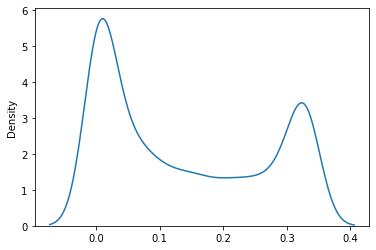
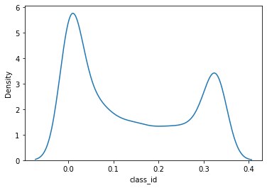
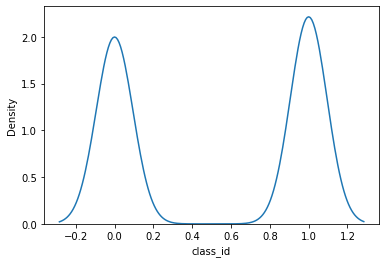

```python
import torch
import torchvision
import torch.nn.functional as F
import torch.nn as nn
import torchtoolbox.transform as transforms
from torch.utils.data import Dataset, DataLoader, Subset
from torch.optim.lr_scheduler import ReduceLROnPlateau
from sklearn.metrics import accuracy_score, roc_auc_score
from sklearn.model_selection import StratifiedKFold, GroupKFold, KFold
import pandas as pd
import numpy as np
import gc
import os
import cv2
import time
import datetime
import warnings
import random
import matplotlib.pyplot as plt
import seaborn as sns
from efficientnet_pytorch import EfficientNet
from tqdm import tqdm
%matplotlib inline
```


```python
warnings.simplefilter('ignore')
def seed_everything(seed):
    random.seed(seed)
    os.environ['PYTHONHASHSEED'] = str(seed)
    np.random.seed(seed)
    torch.manual_seed(seed)
    torch.cuda.manual_seed(seed)
    torch.backends.cudnn.deterministic = True
    torch.backends.cudnn.benchmark = True

seed_everything(47)
```


```python
device = torch.device("cuda" if torch.cuda.is_available() else "cpu")
device
print("Setup complete ,Using torch %s %s "%(torch.__version__,torch.cuda.get_device_properties(0) if torch.cuda.is_available() else 'CPU'))
```

    Setup complete ,Using torch 1.8.1+cu102 _CudaDeviceProperties(name='GeForce RTX 2080 Ti', major=7, minor=5, total_memory=11019MB, multi_processor_count=68) 


```python
class PhoneDataset(Dataset):
    def __init__(self,df:pd.DataFrame,imfolder:str, train:bool= True , transforms= None,meta_featrues= None):
        """
        类初始化：
            参数：
                df(pd.DataFrame):
                imfolder: id片文件夹地址
                train(bool):标记是训练数据集初始化还是测试数据集初始化
                transforms: 图像增强
                mete_fetures(list): 特征信息列表，比如像年龄，性别 
                
        """
        self.df = df
        self.imfolder = imfolder
        self.transforms = transforms
        self.train = train
        self.meta_featrues = meta_featrues
    def __getitem__(self,index):
#         print("加载图片",self.imfolder+self.df.iloc[index]['image_name'])
        im_path = self.imfolder+self.df.iloc[index]['image_name']
#         im_path = os.path.jion(self.imfolder,self.df.iloc[index]['image_name']+'jpg')
        
        x = cv2.imread(im_path)
        if x is None:
            print("当前cv2读取",im_path)
#         print("当前cv2读取",type(x))
        
#         meta = np.array(self.df.iloc[index][self.meta_featrues].values,dtype=np.float32)
        if self.transforms:
            x = self.transforms(x)
        if self.train:
            y = self.df.iloc[index]['class_id']
            return x,y
        else:
            return x
    def __len__(self):
            return len(self.df)
```


```python
class Net(nn.Module):
    def __init__(self,arch):
        super(Net,self).__init__()
        self.arch = arch
        if 'ResNet' in str(arch.__class__):
            self.arch.fc = nn.Linear(in_features=512,out_features=500,bias=True)
        if 'EfficientNet' in str(arch.__class__):
            self.arch._fc = nn.Linear(in_features=1280,out_features=500,bias=True)
        self.output = nn.Linear(500,1)
        
    def forward(self, inputs):
        """因为使用 BCEWithLogitsLoss ,没有 sigmoid，
         在计算损失时，这适用于 sigmoid"""
        x  = inputs
#         print("Net x.size",x.size())  #Net x.size torch.Size([32, 3, 256, 256])

        cnn_features = self.arch(x)
#         print("Net cnn_features.size",cnn_features.size())  #Net cnn_features.size torch.Size([32, 500])
        output = self.output(cnn_features)
        return output
        
        
```


```python
train_transform = transforms.Compose([
#     transforms.RandomResizedCrop(size=256, scale=(0.8, 1.0)),
    transforms.Resize(256),
    transforms.CenterCrop(256),
    transforms.RandomHorizontalFlip(),
    transforms.RandomVerticalFlip(),
    transforms.ToTensor(),
    transforms.Normalize(mean=[0.485, 0.456, 0.406],std=[0.229, 0.224, 0.225])
])
test_transform = transforms.Compose([
    transforms.ToTensor(),
    transforms.Normalize(mean=[0.485, 0.456, 0.406],std=[0.229, 0.224, 0.225])
])
```


```python
arch = EfficientNet.from_pretrained('efficientnet-b1')
```

    Loaded pretrained weights for efficientnet-b1


```python
# 整理训练和测试数据集

#训练数据集
data_dir = '/home/snnu/chenkequan/paperExper/yolov5/dataSet/'
no_phoneList =os.listdir(data_dir+'nophone/')
print('no_phoneList size',len(no_phoneList))
phoneList =os.listdir(data_dir+'phone/images/train/')
print('no_phoneList size',len(phoneList))
testList =os.listdir(data_dir+'phone_test/')
print('no_phoneList size',len(testList))

```

    no_phoneList size 10599
    no_phoneList size 8201
    no_phoneList size 4079


```python
no_phone_df = pd.DataFrame({'image_name':no_phoneList,'class_id':1})
no_phone_df
```


<div>
<style scoped>
    .dataframe tbody tr th:only-of-type {
        vertical-align: middle;
    }

    .dataframe tbody tr th {
        vertical-align: top;
    }

    .dataframe thead th {
        text-align: right;
    }
</style>
<table border="1" class="dataframe">
  <thead>
    <tr style="text-align: right;">
      <th></th>
      <th>image_name</th>
      <th>class_id</th>
    </tr>
  </thead>
  <tbody>
    <tr>
      <th>0</th>
      <td>0sduhnO3xRyb78lBVpe6Q1YDqG5AfkFP.jpg</td>
      <td>1</td>
    </tr>
    <tr>
      <th>1</th>
      <td>XfRKEQIG3igLU9W5oM4z6q1hCSYrpAHV.jpg</td>
      <td>1</td>
    </tr>
    <tr>
      <th>2</th>
      <td>6mfnwNZp5CBXhszKoTOxMyrcqFt1EGbi.jpg</td>
      <td>1</td>
    </tr>
    <tr>
      <th>3</th>
      <td>YPJQulBLwnptq98Urhzfj0sZmMDOGoeb.jpg</td>
      <td>1</td>
    </tr>
    <tr>
      <th>4</th>
      <td>H3a2sEQo8CVvlNF9pLkSy6d4bOtJZcRY.jpg</td>
      <td>1</td>
    </tr>
    <tr>
      <th>...</th>
      <td>...</td>
      <td>...</td>
    </tr>
    <tr>
      <th>10594</th>
      <td>Ja9IBK3NhF1ltnuf40ScqCeb6yoiLEZR.jpg</td>
      <td>1</td>
    </tr>
    <tr>
      <th>10595</th>
      <td>LSDgWf4v0ZInAHbCJOBYTempau5VQ78r.jpg</td>
      <td>1</td>
    </tr>
    <tr>
      <th>10596</th>
      <td>4EPk0h1W9nTiUp5A87RMvxFH3CgNjabc.jpg</td>
      <td>1</td>
    </tr>
    <tr>
      <th>10597</th>
      <td>aWnwDVCljRKygSYfUO9Q56Z0qFbumAtI.jpg</td>
      <td>1</td>
    </tr>
    <tr>
      <th>10598</th>
      <td>a1O46AXuHhRF5VirxQvc2Sn0GZy78MP3.jpg</td>
      <td>1</td>
    </tr>
  </tbody>
</table>
<p>10599 rows × 2 columns</p>
</div>


```python
phone_df = pd.DataFrame({'image_name':phoneList,'class_id':0})
phone_df
```


<div>
<style scoped>
    .dataframe tbody tr th:only-of-type {
        vertical-align: middle;
    }

    .dataframe tbody tr th {
        vertical-align: top;
    }

    .dataframe thead th {
        text-align: right;
    }
</style>
<table border="1" class="dataframe">
  <thead>
    <tr style="text-align: right;">
      <th></th>
      <th>image_name</th>
      <th>class_id</th>
    </tr>
  </thead>
  <tbody>
    <tr>
      <th>0</th>
      <td>IuVyK8LP5ntYle02FNApOzd3sokxS9X7.jpg</td>
      <td>0</td>
    </tr>
    <tr>
      <th>1</th>
      <td>8j2AlL19kHBONfconIr65uJsRtShQEGg.jpg</td>
      <td>0</td>
    </tr>
    <tr>
      <th>2</th>
      <td>lzcR9bdUNWCVp7BiLJ3mrQaZ6GgjDIPE.jpg</td>
      <td>0</td>
    </tr>
    <tr>
      <th>3</th>
      <td>2xpX8dDiHBG9oKaEvgcVTyt5fwNqFurP.jpg</td>
      <td>0</td>
    </tr>
    <tr>
      <th>4</th>
      <td>GSxeK5t3mqol4LAB607Hd1kJP28vYaIc.jpg</td>
      <td>0</td>
    </tr>
    <tr>
      <th>...</th>
      <td>...</td>
      <td>...</td>
    </tr>
    <tr>
      <th>8196</th>
      <td>ykOcJmiYtM5Ua173FQ2KqR9Zlrsg8Wb6.jpg</td>
      <td>0</td>
    </tr>
    <tr>
      <th>8197</th>
      <td>x9NWmbaFho2LCS7ljBzdUg5qXt0eZVrE.jpg</td>
      <td>0</td>
    </tr>
    <tr>
      <th>8198</th>
      <td>bvDMexHQBpd2on7iPGCcOE56lfwI0tmW.jpg</td>
      <td>0</td>
    </tr>
    <tr>
      <th>8199</th>
      <td>Fc7MOyQB4Gn8Perdsubxv2qLEhoiZNY3.jpg</td>
      <td>0</td>
    </tr>
    <tr>
      <th>8200</th>
      <td>mD5FCsz3HZGSApBruKcVo2T8jJE0M174.jpg</td>
      <td>0</td>
    </tr>
  </tbody>
</table>
<p>8201 rows × 2 columns</p>
</div>


```python
train_df =pd.concat([phone_df,no_phone_df], axis=0)
train_df.head()
```


```python
df_group = train_df.groupby(by = 'class_id')
Cata_list = list(df_group.groups.keys())
print(Cata_list)
```

    [0, 1]


```python
test_df = pd.DataFrame({'image_name':testList})
test_df
```


<div>
<style scoped>
    .dataframe tbody tr th:only-of-type {
        vertical-align: middle;
    }

    .dataframe tbody tr th {
        vertical-align: top;
    }

    .dataframe thead th {
        text-align: right;
    }
</style>
<table border="1" class="dataframe">
  <thead>
    <tr style="text-align: right;">
      <th></th>
      <th>image_name</th>
    </tr>
  </thead>
  <tbody>
    <tr>
      <th>0</th>
      <td>hNkyfPgBdDtj4ZszCO7b29p1o6QxWAHi.jpg</td>
    </tr>
    <tr>
      <th>1</th>
      <td>3nMH8kPiTtx9a6WjLFpEGSdhr1lQeyIV.jpg</td>
    </tr>
    <tr>
      <th>2</th>
      <td>JASbLvQtDRmkBIyowEslVZa8TY07cMN6.jpg</td>
    </tr>
    <tr>
      <th>3</th>
      <td>JCim0stTW4vyDEc7OuRSngKQ5olxd8Yb.jpg</td>
    </tr>
    <tr>
      <th>4</th>
      <td>kNJTlbKn9rPfSVvhgFRq0aYo5mIHc7ex.jpg</td>
    </tr>
    <tr>
      <th>...</th>
      <td>...</td>
    </tr>
    <tr>
      <th>4074</th>
      <td>W6ZTOiPrc85nQmqAj2C0XGtd3oa4VgUv.jpg</td>
    </tr>
    <tr>
      <th>4075</th>
      <td>EdsYO95XwxSQiu483NGVJ0CbjgDLZztr.jpg</td>
    </tr>
    <tr>
      <th>4076</th>
      <td>OkAJVLCyiZRU1dngWPbQBqvaeclt0DTm.jpg</td>
    </tr>
    <tr>
      <th>4077</th>
      <td>zki8yEZD5YlHg3mufsMeaPNS47wtJAKT.jpg</td>
    </tr>
    <tr>
      <th>4078</th>
      <td>Os86PyATuReJbrvgtpndazQ7lZNmEFYX.jpg</td>
    </tr>
  </tbody>
</table>
<p>4079 rows × 1 columns</p>
</div>


```python
test = PhoneDataset(df=test_df,
                       imfolder=f'{data_dir}phone_test/', 
                       train=False,
                       transforms=train_transform)
```


```python
skf = GroupKFold(n_splits=5)
```


```python
epochs = 60
es_patience = 3 #提前停止 不进行数据增强
TTA = 3 # # 测试时间增加回合
oof = np.zeros((len(train_df), 1))# 折叠预测
preds = torch.zeros((len(test), 1), dtype=torch.float32, device=device)  # 预测 测试集

skf = KFold(n_splits=5, shuffle=True, random_state=47)
# for fold, (train_idx, val_idx) in enumerate(skf.split(X=np.zeros(len(train_df)), y=train_df['class_id'], groups=train_df['class_id'].tolist()), 1):
for fold, (train_idx, val_idx) in tqdm(enumerate(skf.split(X=np.zeros(len(train_df)), y=train_df['class_id']), 1)):
    print('=' * 20, 'Fold', fold, '=' * 20)  
    
    model_path = f'model_{fold}.pth'  # 保存模型的路径和文件名
    best_val = 0  ## 此折叠内的最佳验证分数
    patience = es_patience  # Current patience counter
    arch = EfficientNet.from_pretrained('efficientnet-b1')
#     model = Net(arch=arch, n_meta_features=len(meta_features))  # 每个折叠的新模型
    model = Net(arch=arch)
    model = model.to(device)
    
    optim = torch.optim.Adam(model.parameters(), lr=0.001)
    scheduler = ReduceLROnPlateau(optimizer=optim, mode='max', patience=1, verbose=True, factor=0.2)
    criterion = nn.BCEWithLogitsLoss()
    
    train = PhoneDataset(df=train_df,
                       imfolder=f'{data_dir}trainEfficientNet/', 
                       train=True,
                       transforms=train_transform)
    val = PhoneDataset(df=train_df,
                       imfolder=f'{data_dir}trainEfficientNet/', 
                       train=True,
                       transforms=train_transform)
    
    train_loader = DataLoader(dataset=train, batch_size=32, shuffle=True, num_workers=1)
    val_loader = DataLoader(dataset=val, batch_size=32, shuffle=False, num_workers=1)
    test_loader = DataLoader(dataset=test, batch_size=32, shuffle=False, num_workers=1)
    
    for epoch in tqdm(range(epochs)):
        start_time = time.time()
        correct = 0
        epoch_loss = 0
        model.train()
        
        for x, y in tqdm(train_loader):
#             print("x.size()",x.size())
#             print("y.size()",y.size())
            x[0] = torch.tensor(x[0], device=device, dtype=torch.float32)
            x[1] = torch.tensor(x[1], device=device, dtype=torch.float32)
            y = torch.tensor(y, device=device, dtype=torch.float32)
            x = x.cuda()
#             print(type(x))
#             print(type(model))
            optim.zero_grad()
            z = model(x)
            loss = criterion(z, y.unsqueeze(1))
            loss.backward()
            optim.step()
            pred = torch.round(torch.sigmoid(z))  # round off sigmoid to obtain predictions
            correct += (pred.cpu() == y.cpu().unsqueeze(1)).sum().item()  # tracking number of correctly predicted samples
            epoch_loss += loss.item()
        train_acc = correct / len(train_idx)
        
        model.eval()  # switch model to the evaluation mode
        val_preds = torch.zeros((len(val_idx), 1), dtype=torch.float32, device=device)
        with torch.no_grad():  # Do not calculate gradient since we are only predicting
            # Predicting on validation set
            for j, (x_val, y_val) in tqdm(enumerate(val_loader)):
#                 print("j",j)
#                 print("x_val.size()",x_val.size())  #torch.Size([32, 3, 256, 256])
#                 print("y_val.size()",y_val.size())  #
                
                x_val[0] = torch.tensor(x_val[0], device=device, dtype=torch.float32)
                x_val[1] = torch.tensor(x_val[1], device=device, dtype=torch.float32)
                y_val = torch.tensor(y_val, device=device, dtype=torch.float32)
                x_val = x_val.cuda()
                z_val = model(x_val)
                val_pred = torch.sigmoid(z_val)
                print("val_pred.size()",val_pred.size()) #val_pred.size() torch.Size([32, 1])
                """The expanded size of the tensor (3) must match the existing size 
                (32) at non-singleton dimension 0.  Target sizes: [3, 1].  Tensor sizes: [32, 1]"""
#                 print("x_val[0].shape[0]",x_val[0].shape[0]) #x_val[0].shape[0] 3
#                 print("val_preds.size()",val_preds.size())  #val_preds.size() torch.Size([3760, 1])

                
                #将验证预测值存入最后结果
#                 val_preds[j*val_loader.batch_size:j*val_loader.batch_size + x_val[0].shape[0]] = val_pred
                if j*val_loader.batch_size+val_pred.shape[0]<len(val_idx):
                    val_preds[j*val_loader.batch_size:j*val_loader.batch_size+val_pred.shape[0]] = val_pred
                else:
                    val_preds[j*val_loader.batch_size:] = val_pred[:(len(val_idx)-j*val_loader.batch_size)]
                    break
            val_acc = accuracy_score(train_df.iloc[val_idx]['class_id'].values, torch.round(val_preds.cpu()))
            val_roc = roc_auc_score(train_df.iloc[val_idx]['class_id'].values, val_preds.cpu())
            
            print('Epoch {:03}: | Loss: {:.3f} | Train acc: {:.3f} | Val acc: {:.3f} | Val roc_auc: {:.3f} | Training time: {}'.format(
            epoch + 1, 
            epoch_loss, 
            train_acc, 
            val_acc, 
            val_roc, 
            str(datetime.timedelta(seconds=time.time() - start_time))[:7]))
            
            scheduler.step(val_roc)
                
            if val_roc >= best_val:
                best_val = val_roc
                patience = es_patience  # Resetting patience since we have new best validation accuracy
                torch.save(model, model_path)  # Saving current best model
            else:
                patience -= 1
                if patience == 0:
                    print('Early stopping. Best Val roc_auc: {:.3f}'.format(best_val))
                    break
                
    model = torch.load(model_path)  # Loading best model of this fold
    model.eval()  # switch model to the evaluation mode
    val_preds = torch.zeros((len(val_idx), 1), dtype=torch.float32, device=device)
    with torch.no_grad():
        # Predicting on validation set once again to obtain data for OOF
        for j, (x_val, y_val) in tqdm(enumerate(val_loader)):
            x_val[0] = torch.tensor(x_val[0], device=device, dtype=torch.float32)
            x_val[1] = torch.tensor(x_val[1], device=device, dtype=torch.float32)
            y_val = torch.tensor(y_val, device=device, dtype=torch.float32)
            x_val = x_val.cuda()
            z_val = model(x_val)
            val_pred = torch.sigmoid(z_val)
#             val_preds[j*val_loader.batch_size:j*val_loader.batch_size + x_val[0].shape[0]] = val_pred
            if j*val_loader.batch_size+val_pred.shape[0]<len(val_idx):
                val_preds[j*val_loader.batch_size:j*val_loader.batch_size+val_pred.shape[0]] = val_pred
            else:
                val_preds[j*val_loader.batch_size:] = val_pred[:(len(val_idx)-j*val_loader.batch_size)]
                break
        oof[val_idx] = val_preds.cpu().numpy()
        
        # Predicting on test set
        tta_preds = torch.zeros((len(test), 1), dtype=torch.float32, device=device)
        for _ in range(TTA):
            for i, x_test in enumerate(test_loader):
                x_test[0] = torch.tensor(x_test[0], device=device, dtype=torch.float32)
                x_test[1] = torch.tensor(x_test[1], device=device, dtype=torch.float32)
                x_test = x_test.cuda()
                z_test = model(x_test)
                z_test = torch.sigmoid(z_test)
                if i*test_loader.batch_size+z_test.shape[0]<len(test):
                    tta_preds[i*test_loader.batch_size:i*test_loader.batch_size+z_test.shape[0]]= z_test
                else:
                    tta_preds[i*test_loader.batch_size:i*test_loader.batch_size+z_test.shape[0]]= z_test[:(len(test)-j*test_loader.batch_size)]    
                    break
        preds += tta_preds / TTA
    
preds /= skf.n_splits
```


```python
print(model_path)
```

    model_5.pth


```python
print(val_pred.shape[0])
print(val_preds.size())
print(117*val_loader.batch_size)
print(117*val_loader.batch_size+val_pred.shape[0])
print(val_preds[j*val_loader.batch_size:j*val_loader.batch_size+val_pred.shape[0]].size())
print(val_pred.size())

print(len(val_idx))
val_preds1 = torch.zeros((len(val_idx), 1), dtype=torch.float32, device=device)
print(val_preds1.size())
print(x_val[0].size())
print(len(val_idx)-(j*val_loader.batch_size))
print(type((len(val_idx)-j*val_loader.batch_size)))
print(val_loader.batch_size)
```

    32
    torch.Size([3760, 1])
    3744
    3776
    torch.Size([16, 1])
    torch.Size([32, 1])
    3760
    torch.Size([3760, 1])
    torch.Size([3, 256, 256])
    16
    <class 'int'>
    32


```python
print(len(val_idx))
j
```

    3760


    117


```python
print('OOF: {:.3f}'.format(roc_auc_score(train_df['class_id'], oof)))
```

    OOF: 0.514


```python
sns.kdeplot(pd.Series(preds.cpu().numpy().reshape(-1,)));
```


    

    


```python
# Saving OOF predictions so stacking would be easier
pd.Series(oof.reshape(-1,)).to_csv('oof.csv', index=False)
```


```python
sub = pd.read_csv('/home/snnu/chenkequan/paperExper/yolov5/dataSet/test_submit.csv')
sub['class_id_Effi'] = preds.cpu().numpy().reshape(-1,)
sub.head()
```


<div>
<style scoped>
    .dataframe tbody tr th:only-of-type {
        vertical-align: middle;
    }

    .dataframe tbody tr th {
        vertical-align: top;
    }

    .dataframe thead th {
        text-align: right;
    }
</style>
<table border="1" class="dataframe">
  <thead>
    <tr style="text-align: right;">
      <th></th>
      <th>image_name</th>
      <th>class_id</th>
      <th>class_id_Effi</th>
    </tr>
  </thead>
  <tbody>
    <tr>
      <th>0</th>
      <td>hNkyfPgBdDtj4ZszCO7b29p1o6QxWAHi.jpg</td>
      <td>1</td>
      <td>0.333053</td>
    </tr>
    <tr>
      <th>1</th>
      <td>3nMH8kPiTtx9a6WjLFpEGSdhr1lQeyIV.jpg</td>
      <td>1</td>
      <td>0.026697</td>
    </tr>
    <tr>
      <th>2</th>
      <td>JASbLvQtDRmkBIyowEslVZa8TY07cMN6.jpg</td>
      <td>1</td>
      <td>0.000025</td>
    </tr>
    <tr>
      <th>3</th>
      <td>JCim0stTW4vyDEc7OuRSngKQ5olxd8Yb.jpg</td>
      <td>1</td>
      <td>0.063491</td>
    </tr>
    <tr>
      <th>4</th>
      <td>kNJTlbKn9rPfSVvhgFRq0aYo5mIHc7ex.jpg</td>
      <td>1</td>
      <td>0.333289</td>
    </tr>
  </tbody>
</table>
</div>


```python
sub= sub[['image_name','class_id_Effi']]
sub = sub.rename(columns={"class_id_Effi":"class_id"})
sub.head()
```


<div>
<style scoped>
    .dataframe tbody tr th:only-of-type {
        vertical-align: middle;
    }

    .dataframe tbody tr th {
        vertical-align: top;
    }

    .dataframe thead th {
        text-align: right;
    }
</style>
<table border="1" class="dataframe">
  <thead>
    <tr style="text-align: right;">
      <th></th>
      <th>image_name</th>
      <th>class_id</th>
    </tr>
  </thead>
  <tbody>
    <tr>
      <th>0</th>
      <td>hNkyfPgBdDtj4ZszCO7b29p1o6QxWAHi.jpg</td>
      <td>0.333053</td>
    </tr>
    <tr>
      <th>1</th>
      <td>3nMH8kPiTtx9a6WjLFpEGSdhr1lQeyIV.jpg</td>
      <td>0.026697</td>
    </tr>
    <tr>
      <th>2</th>
      <td>JASbLvQtDRmkBIyowEslVZa8TY07cMN6.jpg</td>
      <td>0.000025</td>
    </tr>
    <tr>
      <th>3</th>
      <td>JCim0stTW4vyDEc7OuRSngKQ5olxd8Yb.jpg</td>
      <td>0.063491</td>
    </tr>
    <tr>
      <th>4</th>
      <td>kNJTlbKn9rPfSVvhgFRq0aYo5mIHc7ex.jpg</td>
      <td>0.333289</td>
    </tr>
  </tbody>
</table>
</div>


```python
sub.head()
```


<div>
<style scoped>
    .dataframe tbody tr th:only-of-type {
        vertical-align: middle;
    }

    .dataframe tbody tr th {
        vertical-align: top;
    }

    .dataframe thead th {
        text-align: right;
    }
</style>
<table border="1" class="dataframe">
  <thead>
    <tr style="text-align: right;">
      <th></th>
      <th>image_name</th>
      <th>class_id</th>
    </tr>
  </thead>
  <tbody>
    <tr>
      <th>0</th>
      <td>hNkyfPgBdDtj4ZszCO7b29p1o6QxWAHi.jpg</td>
      <td>0.333053</td>
    </tr>
    <tr>
      <th>1</th>
      <td>3nMH8kPiTtx9a6WjLFpEGSdhr1lQeyIV.jpg</td>
      <td>0.026697</td>
    </tr>
    <tr>
      <th>2</th>
      <td>JASbLvQtDRmkBIyowEslVZa8TY07cMN6.jpg</td>
      <td>0.000025</td>
    </tr>
    <tr>
      <th>3</th>
      <td>JCim0stTW4vyDEc7OuRSngKQ5olxd8Yb.jpg</td>
      <td>0.063491</td>
    </tr>
    <tr>
      <th>4</th>
      <td>kNJTlbKn9rPfSVvhgFRq0aYo5mIHc7ex.jpg</td>
      <td>0.333289</td>
    </tr>
  </tbody>
</table>
</div>


```python
sub.describe()
```


<div>
<style scoped>
    .dataframe tbody tr th:only-of-type {
        vertical-align: middle;
    }

    .dataframe tbody tr th {
        vertical-align: top;
    }

    .dataframe thead th {
        text-align: right;
    }
</style>
<table border="1" class="dataframe">
  <thead>
    <tr style="text-align: right;">
      <th></th>
      <th>class_id</th>
    </tr>
  </thead>
  <tbody>
    <tr>
      <th>count</th>
      <td>4.079000e+03</td>
    </tr>
    <tr>
      <th>mean</th>
      <td>1.375785e-01</td>
    </tr>
    <tr>
      <th>std</th>
      <td>1.275234e-01</td>
    </tr>
    <tr>
      <th>min</th>
      <td>1.005283e-11</td>
    </tr>
    <tr>
      <th>25%</th>
      <td>1.162768e-02</td>
    </tr>
    <tr>
      <th>50%</th>
      <td>9.714108e-02</td>
    </tr>
    <tr>
      <th>75%</th>
      <td>2.728050e-01</td>
    </tr>
    <tr>
      <th>max</th>
      <td>3.333332e-01</td>
    </tr>
  </tbody>
</table>
</div>


```python
sub['class_id'].value_counts().iloc[[3.862082e-02]]
```


    0.33332    3
    Name: class_id, dtype: int64


```python
sub.iloc[[2.728050e-01]]
```


<div>
<style scoped>
    .dataframe tbody tr th:only-of-type {
        vertical-align: middle;
    }

    .dataframe tbody tr th {
        vertical-align: top;
    }

    .dataframe thead th {
        text-align: right;
    }
</style>
<table border="1" class="dataframe">
  <thead>
    <tr style="text-align: right;">
      <th></th>
      <th>image_name</th>
      <th>class_id</th>
    </tr>
  </thead>
  <tbody>
    <tr>
      <th>0</th>
      <td>hNkyfPgBdDtj4ZszCO7b29p1o6QxWAHi.jpg</td>
      <td>0.333053</td>
    </tr>
  </tbody>
</table>
</div>


```python
sub = sub.sort_values(by='class_id',ascending=False)
sub
```


<div>
<style scoped>
    .dataframe tbody tr th:only-of-type {
        vertical-align: middle;
    }

    .dataframe tbody tr th {
        vertical-align: top;
    }

    .dataframe thead th {
        text-align: right;
    }
</style>
<table border="1" class="dataframe">
  <thead>
    <tr style="text-align: right;">
      <th></th>
      <th>image_name</th>
      <th>class_id</th>
    </tr>
  </thead>
  <tbody>
    <tr>
      <th>3987</th>
      <td>1QWApLPlZkue2ihbCfxVUv9mj0Bw5nOz.jpg</td>
      <td>3.333332e-01</td>
    </tr>
    <tr>
      <th>3564</th>
      <td>kTIdqo9OSptBjK36Pm7GMuVr2feEx5Ug.jpg</td>
      <td>3.333332e-01</td>
    </tr>
    <tr>
      <th>616</th>
      <td>aZ6dUTBJ7GnXAVqQIMbNho2eFtmYcgkr.jpg</td>
      <td>3.333331e-01</td>
    </tr>
    <tr>
      <th>1643</th>
      <td>wAluQ1RStcKrmf6bIWF5JYjBN9Loa0PC.jpg</td>
      <td>3.333330e-01</td>
    </tr>
    <tr>
      <th>3820</th>
      <td>qwiPp5yhzF2CJkTXRdV6etmM9K48ZSjN.jpg</td>
      <td>3.333329e-01</td>
    </tr>
    <tr>
      <th>...</th>
      <td>...</td>
      <td>...</td>
    </tr>
    <tr>
      <th>2412</th>
      <td>sHSid2pvlJNMVQmnUL13XERGyDAxeF07.jpg</td>
      <td>2.609968e-08</td>
    </tr>
    <tr>
      <th>940</th>
      <td>jkp4oP6XlSFx21DmT5dfZnuUvqMaV3Nt.jpg</td>
      <td>2.169016e-08</td>
    </tr>
    <tr>
      <th>3711</th>
      <td>nNrBDsmTQlJtbyP7fCR1vi4e2uHZSV9A.jpg</td>
      <td>1.019523e-08</td>
    </tr>
    <tr>
      <th>1070</th>
      <td>LJx0gOr3iSzqpvFPE9XAHakuZfBbUDw1.jpg</td>
      <td>8.920620e-09</td>
    </tr>
    <tr>
      <th>739</th>
      <td>07PAgyXKHlTx6WkC3Nf52IcGojpZU4wF.jpg</td>
      <td>1.005283e-11</td>
    </tr>
  </tbody>
</table>
<p>4079 rows × 2 columns</p>
</div>


```python
sub.loc[1601]

```


    image_name    wumSOvezrCc7LJXkFKd6lh35NGsPDoiQ.jpg
    class_id                                   0.31289
    Name: 1601, dtype: object


```python
submit_yolo  = pd.read_csv('/home/snnu/chenkequan/paperExper/yolov5/dataSet/submission_all.csv')
submit_yolo['class_id'].value_counts().iloc[[0]]
```


    1    2144
    Name: class_id, dtype: int64


```python
submit_yolo['class_id'].value_counts().iloc[[1]]
```


    0    1935
    Name: class_id, dtype: int64


```python
len(submit_yolo)
```


    4079


```python
low_thr = 0.12
high_thr = 0.25
def filter_2cls(row, low_thr=low_thr, high_thr=high_thr):
#     prob = row['target']
#使用yolo直接作为最终结果
    prob = row['class_id']
    if prob<low_thr:
        ## Less chance of having no phone
        row['class_id'] = 1
    elif low_thr<=prob<high_thr:
        ## More change of having any diesease
        row['class_id']+= 0
    elif high_thr<=prob:      
        row['class_id'] = 0
    else:
        raise ValueError('Prediction must be from [0-1]')
    return row
```


```python
subEfficen = sub
subEfficen2 = sub
```


```python
subEfficen = subEfficen.apply(filter_2cls, axis=1)
subEfficen
```


<div>
<style scoped>
    .dataframe tbody tr th:only-of-type {
        vertical-align: middle;
    }

    .dataframe tbody tr th {
        vertical-align: top;
    }

    .dataframe thead th {
        text-align: right;
    }
</style>
<table border="1" class="dataframe">
  <thead>
    <tr style="text-align: right;">
      <th></th>
      <th>image_name</th>
      <th>class_id</th>
    </tr>
  </thead>
  <tbody>
    <tr>
      <th>3987</th>
      <td>1QWApLPlZkue2ihbCfxVUv9mj0Bw5nOz.jpg</td>
      <td>0.0</td>
    </tr>
    <tr>
      <th>3564</th>
      <td>kTIdqo9OSptBjK36Pm7GMuVr2feEx5Ug.jpg</td>
      <td>0.0</td>
    </tr>
    <tr>
      <th>616</th>
      <td>aZ6dUTBJ7GnXAVqQIMbNho2eFtmYcgkr.jpg</td>
      <td>0.0</td>
    </tr>
    <tr>
      <th>1643</th>
      <td>wAluQ1RStcKrmf6bIWF5JYjBN9Loa0PC.jpg</td>
      <td>0.0</td>
    </tr>
    <tr>
      <th>3820</th>
      <td>qwiPp5yhzF2CJkTXRdV6etmM9K48ZSjN.jpg</td>
      <td>0.0</td>
    </tr>
    <tr>
      <th>...</th>
      <td>...</td>
      <td>...</td>
    </tr>
    <tr>
      <th>2412</th>
      <td>sHSid2pvlJNMVQmnUL13XERGyDAxeF07.jpg</td>
      <td>1.0</td>
    </tr>
    <tr>
      <th>940</th>
      <td>jkp4oP6XlSFx21DmT5dfZnuUvqMaV3Nt.jpg</td>
      <td>1.0</td>
    </tr>
    <tr>
      <th>3711</th>
      <td>nNrBDsmTQlJtbyP7fCR1vi4e2uHZSV9A.jpg</td>
      <td>1.0</td>
    </tr>
    <tr>
      <th>1070</th>
      <td>LJx0gOr3iSzqpvFPE9XAHakuZfBbUDw1.jpg</td>
      <td>1.0</td>
    </tr>
    <tr>
      <th>739</th>
      <td>07PAgyXKHlTx6WkC3Nf52IcGojpZU4wF.jpg</td>
      <td>1.0</td>
    </tr>
  </tbody>
</table>
<p>4079 rows × 2 columns</p>
</div>


```python
print(len(subEfficen))
subEfficen['class_id'].value_counts().iloc[[1]]
```

    4079


    0.333333    2
    Name: class_id, dtype: int64


```python
subEfficen['class_id'].value_counts().iloc[[0]]
```


    0.33332    3
    Name: class_id, dtype: int64


```python
EffList = subEfficen['class_id']
type(EffList)
sns.kdeplot(pd.Series(EffList));
```


    

    


```python
EffList2 = subEfficen2['class_id']
type(EffList2)
sns.kdeplot(pd.Series(EffList2));
```


    

    


```python
yoloList = submit_yolo['class_id']
sns.kdeplot(pd.Series(yoloList));
```


    

    


```python
submit_df_all = pd.merge(submit_yolo,subEfficen2,on = 'image_name',how='left')
# .fillna({"class_id":0})
submit_df_all
```


<div>
<style scoped>
    .dataframe tbody tr th:only-of-type {
        vertical-align: middle;
    }

    .dataframe tbody tr th {
        vertical-align: top;
    }

    .dataframe thead th {
        text-align: right;
    }
</style>
<table border="1" class="dataframe">
  <thead>
    <tr style="text-align: right;">
      <th></th>
      <th>image_name</th>
      <th>class_id_x</th>
      <th>class_id_y</th>
    </tr>
  </thead>
  <tbody>
    <tr>
      <th>0</th>
      <td>hNkyfPgBdDtj4ZszCO7b29p1o6QxWAHi.jpg</td>
      <td>1</td>
      <td>0.333053</td>
    </tr>
    <tr>
      <th>1</th>
      <td>3nMH8kPiTtx9a6WjLFpEGSdhr1lQeyIV.jpg</td>
      <td>0</td>
      <td>0.026697</td>
    </tr>
    <tr>
      <th>2</th>
      <td>JASbLvQtDRmkBIyowEslVZa8TY07cMN6.jpg</td>
      <td>0</td>
      <td>0.000025</td>
    </tr>
    <tr>
      <th>3</th>
      <td>JCim0stTW4vyDEc7OuRSngKQ5olxd8Yb.jpg</td>
      <td>1</td>
      <td>0.063491</td>
    </tr>
    <tr>
      <th>4</th>
      <td>kNJTlbKn9rPfSVvhgFRq0aYo5mIHc7ex.jpg</td>
      <td>1</td>
      <td>0.333289</td>
    </tr>
    <tr>
      <th>...</th>
      <td>...</td>
      <td>...</td>
      <td>...</td>
    </tr>
    <tr>
      <th>4074</th>
      <td>W6ZTOiPrc85nQmqAj2C0XGtd3oa4VgUv.jpg</td>
      <td>0</td>
      <td>0.123692</td>
    </tr>
    <tr>
      <th>4075</th>
      <td>EdsYO95XwxSQiu483NGVJ0CbjgDLZztr.jpg</td>
      <td>1</td>
      <td>0.000082</td>
    </tr>
    <tr>
      <th>4076</th>
      <td>OkAJVLCyiZRU1dngWPbQBqvaeclt0DTm.jpg</td>
      <td>0</td>
      <td>0.000007</td>
    </tr>
    <tr>
      <th>4077</th>
      <td>zki8yEZD5YlHg3mufsMeaPNS47wtJAKT.jpg</td>
      <td>0</td>
      <td>0.013090</td>
    </tr>
    <tr>
      <th>4078</th>
      <td>Os86PyATuReJbrvgtpndazQ7lZNmEFYX.jpg</td>
      <td>0</td>
      <td>0.198496</td>
    </tr>
  </tbody>
</table>
<p>4079 rows × 3 columns</p>
</div>


```python

def filter3(row, low=low, high=high):
#     prob = row['target']
#使用yolo直接作为最终结果
    prob = row['class_id_y']
    if prob<low_thr:
        ## Less chance of having phone
        row['class_id_x'] = 0
    elif low_thr<=prob<high_thr:
        ## More change of having any diesease
        row['class_id_x'] += 0
    elif high_thr<=prob:      
        row['class_id_x'] = 1
    else:
        raise ValueError('Prediction must be from [0-1]')
    return row

```


```python
submit_df_all
```


<div>
<style scoped>
    .dataframe tbody tr th:only-of-type {
        vertical-align: middle;
    }

    .dataframe tbody tr th {
        vertical-align: top;
    }

    .dataframe thead th {
        text-align: right;
    }
</style>
<table border="1" class="dataframe">
  <thead>
    <tr style="text-align: right;">
      <th></th>
      <th>image_name</th>
      <th>class_id_x</th>
      <th>class_id_y</th>
    </tr>
  </thead>
  <tbody>
    <tr>
      <th>0</th>
      <td>hNkyfPgBdDtj4ZszCO7b29p1o6QxWAHi.jpg</td>
      <td>1</td>
      <td>0.333053</td>
    </tr>
    <tr>
      <th>1</th>
      <td>3nMH8kPiTtx9a6WjLFpEGSdhr1lQeyIV.jpg</td>
      <td>0</td>
      <td>0.026697</td>
    </tr>
    <tr>
      <th>2</th>
      <td>JASbLvQtDRmkBIyowEslVZa8TY07cMN6.jpg</td>
      <td>0</td>
      <td>0.000025</td>
    </tr>
    <tr>
      <th>3</th>
      <td>JCim0stTW4vyDEc7OuRSngKQ5olxd8Yb.jpg</td>
      <td>1</td>
      <td>0.063491</td>
    </tr>
    <tr>
      <th>4</th>
      <td>kNJTlbKn9rPfSVvhgFRq0aYo5mIHc7ex.jpg</td>
      <td>1</td>
      <td>0.333289</td>
    </tr>
    <tr>
      <th>...</th>
      <td>...</td>
      <td>...</td>
      <td>...</td>
    </tr>
    <tr>
      <th>4074</th>
      <td>W6ZTOiPrc85nQmqAj2C0XGtd3oa4VgUv.jpg</td>
      <td>0</td>
      <td>0.123692</td>
    </tr>
    <tr>
      <th>4075</th>
      <td>EdsYO95XwxSQiu483NGVJ0CbjgDLZztr.jpg</td>
      <td>1</td>
      <td>0.000082</td>
    </tr>
    <tr>
      <th>4076</th>
      <td>OkAJVLCyiZRU1dngWPbQBqvaeclt0DTm.jpg</td>
      <td>0</td>
      <td>0.000007</td>
    </tr>
    <tr>
      <th>4077</th>
      <td>zki8yEZD5YlHg3mufsMeaPNS47wtJAKT.jpg</td>
      <td>0</td>
      <td>0.013090</td>
    </tr>
    <tr>
      <th>4078</th>
      <td>Os86PyATuReJbrvgtpndazQ7lZNmEFYX.jpg</td>
      <td>0</td>
      <td>0.198496</td>
    </tr>
  </tbody>
</table>
<p>4079 rows × 3 columns</p>
</div>


```python
low =0.000162768
high = 0.31
submit_df_all4 =submit_df_all.apply(filter3,axis=1)
```


```python
submit_df_all4
```


<div>
<style scoped>
    .dataframe tbody tr th:only-of-type {
        vertical-align: middle;
    }

    .dataframe tbody tr th {
        vertical-align: top;
    }

    .dataframe thead th {
        text-align: right;
    }
</style>
<table border="1" class="dataframe">
  <thead>
    <tr style="text-align: right;">
      <th></th>
      <th>image_name</th>
      <th>class_id_x</th>
      <th>class_id_y</th>
    </tr>
  </thead>
  <tbody>
    <tr>
      <th>0</th>
      <td>hNkyfPgBdDtj4ZszCO7b29p1o6QxWAHi.jpg</td>
      <td>1</td>
      <td>0.333053</td>
    </tr>
    <tr>
      <th>1</th>
      <td>3nMH8kPiTtx9a6WjLFpEGSdhr1lQeyIV.jpg</td>
      <td>0</td>
      <td>0.026697</td>
    </tr>
    <tr>
      <th>2</th>
      <td>JASbLvQtDRmkBIyowEslVZa8TY07cMN6.jpg</td>
      <td>0</td>
      <td>0.000025</td>
    </tr>
    <tr>
      <th>3</th>
      <td>JCim0stTW4vyDEc7OuRSngKQ5olxd8Yb.jpg</td>
      <td>0</td>
      <td>0.063491</td>
    </tr>
    <tr>
      <th>4</th>
      <td>kNJTlbKn9rPfSVvhgFRq0aYo5mIHc7ex.jpg</td>
      <td>1</td>
      <td>0.333289</td>
    </tr>
    <tr>
      <th>...</th>
      <td>...</td>
      <td>...</td>
      <td>...</td>
    </tr>
    <tr>
      <th>4074</th>
      <td>W6ZTOiPrc85nQmqAj2C0XGtd3oa4VgUv.jpg</td>
      <td>0</td>
      <td>0.123692</td>
    </tr>
    <tr>
      <th>4075</th>
      <td>EdsYO95XwxSQiu483NGVJ0CbjgDLZztr.jpg</td>
      <td>0</td>
      <td>0.000082</td>
    </tr>
    <tr>
      <th>4076</th>
      <td>OkAJVLCyiZRU1dngWPbQBqvaeclt0DTm.jpg</td>
      <td>0</td>
      <td>0.000007</td>
    </tr>
    <tr>
      <th>4077</th>
      <td>zki8yEZD5YlHg3mufsMeaPNS47wtJAKT.jpg</td>
      <td>0</td>
      <td>0.013090</td>
    </tr>
    <tr>
      <th>4078</th>
      <td>Os86PyATuReJbrvgtpndazQ7lZNmEFYX.jpg</td>
      <td>0</td>
      <td>0.198496</td>
    </tr>
  </tbody>
</table>
<p>4079 rows × 3 columns</p>
</div>


```python
submit_df_all4['class_id_x'].value_counts().iloc[[1]]
```


    1    1535
    Name: class_id_x, dtype: int64


```python
submit_df_all23['class_id_x'].value_counts().iloc[[0]]
```


    0    2544
    Name: class_id_x, dtype: int64


```python
submit_df_all = submit_df_all[['image_name','class_id_x']]
submit_df_all = submit_df_all.rename(columns={"class_id_x":"class_id"})
submit_df_all
```


<div>
<style scoped>
    .dataframe tbody tr th:only-of-type {
        vertical-align: middle;
    }

    .dataframe tbody tr th {
        vertical-align: top;
    }

    .dataframe thead th {
        text-align: right;
    }
</style>
<table border="1" class="dataframe">
  <thead>
    <tr style="text-align: right;">
      <th></th>
      <th>image_name</th>
      <th>class_id</th>
    </tr>
  </thead>
  <tbody>
    <tr>
      <th>0</th>
      <td>hNkyfPgBdDtj4ZszCO7b29p1o6QxWAHi.jpg</td>
      <td>1</td>
    </tr>
    <tr>
      <th>1</th>
      <td>3nMH8kPiTtx9a6WjLFpEGSdhr1lQeyIV.jpg</td>
      <td>0</td>
    </tr>
    <tr>
      <th>2</th>
      <td>JASbLvQtDRmkBIyowEslVZa8TY07cMN6.jpg</td>
      <td>0</td>
    </tr>
    <tr>
      <th>3</th>
      <td>JCim0stTW4vyDEc7OuRSngKQ5olxd8Yb.jpg</td>
      <td>0</td>
    </tr>
    <tr>
      <th>4</th>
      <td>kNJTlbKn9rPfSVvhgFRq0aYo5mIHc7ex.jpg</td>
      <td>1</td>
    </tr>
    <tr>
      <th>...</th>
      <td>...</td>
      <td>...</td>
    </tr>
    <tr>
      <th>4074</th>
      <td>W6ZTOiPrc85nQmqAj2C0XGtd3oa4VgUv.jpg</td>
      <td>0</td>
    </tr>
    <tr>
      <th>4075</th>
      <td>EdsYO95XwxSQiu483NGVJ0CbjgDLZztr.jpg</td>
      <td>0</td>
    </tr>
    <tr>
      <th>4076</th>
      <td>OkAJVLCyiZRU1dngWPbQBqvaeclt0DTm.jpg</td>
      <td>0</td>
    </tr>
    <tr>
      <th>4077</th>
      <td>zki8yEZD5YlHg3mufsMeaPNS47wtJAKT.jpg</td>
      <td>0</td>
    </tr>
    <tr>
      <th>4078</th>
      <td>Os86PyATuReJbrvgtpndazQ7lZNmEFYX.jpg</td>
      <td>0</td>
    </tr>
  </tbody>
</table>
<p>4079 rows × 2 columns</p>
</div>


```python
submit_df_all['class_id'].value_counts().iloc[[1]]
```


    1    1535
    Name: class_id, dtype: int64


```python
submit_df_all['class_id'].value_counts().iloc[[0]]
```


    0    2544
    Name: class_id, dtype: int64


```python
submit_df_all2.to_csv('submission.csv', index=False)
```
