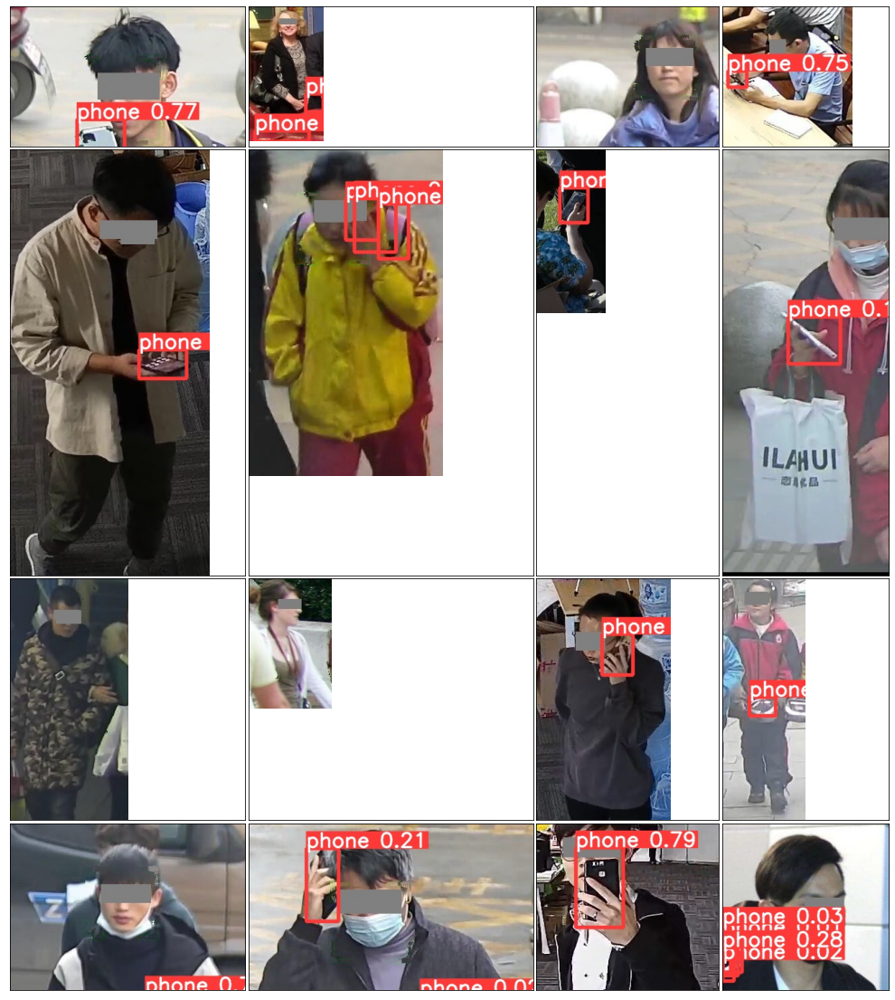
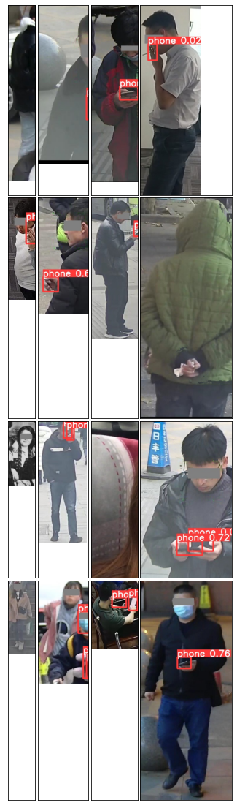

# YoloV5进行训练和测试手机数据集


```python
from __future__ import print_function, division

import torch
import torchvision
import torch.nn.functional as F
import torch.nn as nn
import torchtoolbox.transform as transforms
from torch.utils.data import Dataset,DataLoader,Subset
from torch.optim.lr_scheduler import ReduceLROnPlateau
from sklearn.metrics import accuracy_score,roc_auc_score
from sklearn.model_selection import StratifiedKFold,GroupKFold,KFold
import pandas as pd 
import numpy as np
import gc
import os
import cv2
import time
import datetime
import warnings
import random
from glob import glob
import matplotlib.pyplot as plt
import seaborn as sns
from efficientnet_pytorch import EfficientNet
from IPython.display import Image,clear_output
```


```python
warnings.simplefilter('ignore')
def seed_everthing(seed):
    random.seed(seed)
    os.environ['PYTHONASHSEED'] = str(seed)
    np.random.seed(seed)
    torch.manual_seed(seed)
    torch.cuda.manual_seed(seed)
    torch.backends.cudnn.deterministic =True
    torch.backends.cudnn.benchmark = True
seed_everthing(47)
```


```python
#设置训练参数
device = torch.device("cuda" if torch.cuda.is_available() else "cpu")
device
print("Setup complete ,Using torch %s %s "%(torch.__version__,torch.cuda.get_device_properties(0) if torch.cuda.is_available() else 'CPU'))
```

    Setup complete ,Using torch 1.8.1+cu102 _CudaDeviceProperties(name='GeForce RTX 2080 Ti', major=7, minor=5, total_memory=11019MB, multi_processor_count=68) 


```python
import csv
import cv2
#先将test数据读取
dim = 512
origin_dir = f'/home/snnu/chenkequan/paperExper/yolov5/dataSet/'
test_dir = f'{origin_dir}phone_test/'
train_nophone = f'{origin_dir}nophone/'
test_image = os.listdir(test_dir)
train_nophone_iamges = os.listdir(train_nophone)

test_csv_header = ['image_id','width','height']
test_submit_header = ['image_name','class_id ']
#创建测试文件夹csv
with open(origin_dir+"test_wh.csv",'w') as testFile:  
    writer = csv.writer(testFile)
    writer.writerow(test_csv_header)
    for image in test_image:
        image_file = cv2.imread(f'{origin_dir}phone_test/{image}')
        image_name = image.split('.')[0]
        w , h = image_file.shape[0],image_file.shape[1]
        writer.writerow([image_name,w,h])
        
with open(origin_dir+"test_submit.csv",'w') as testFile:  
    writer = csv.writer(testFile)
    writer.writerow(test_submit_header)
    for image in test_image:
        writer.writerow([image,1])    

#创建nophone训练集
with open(origin_dir+"train_nophone.csv",'w') as trainNoPhoneFile:  
    writer = csv.writer(trainNoPhoneFile)
    writer.writerow(test_csv_header)
    for image in train_nophone_iamges:
        writer.writerow([image,0])

weights_dir = '/home/snnu/chenkequan/paperExper/yolov5/runs/train/exp5_yolov5s/weights/best.pt'
```


```python

test_submit_df = pd.read_csv(origin_dir+"test_submit.csv")
test_submit_df.head()
```


<div>
<style scoped>
    .dataframe tbody tr th:only-of-type {
        vertical-align: middle;
    }

    .dataframe tbody tr th {
        vertical-align: top;
    }
    
    .dataframe thead th {
        text-align: right;
    }
</style>
<table border="1" class="dataframe">
  <thead>
    <tr style="text-align: right;">
      <th></th>
      <th>image_name</th>
      <th>class_id</th>
    </tr>
  </thead>
  <tbody>
    <tr>
      <th>0</th>
      <td>hNkyfPgBdDtj4ZszCO7b29p1o6QxWAHi.jpg</td>
      <td>1</td>
    </tr>
    <tr>
      <th>1</th>
      <td>3nMH8kPiTtx9a6WjLFpEGSdhr1lQeyIV.jpg</td>
      <td>1</td>
    </tr>
    <tr>
      <th>2</th>
      <td>JASbLvQtDRmkBIyowEslVZa8TY07cMN6.jpg</td>
      <td>1</td>
    </tr>
    <tr>
      <th>3</th>
      <td>JCim0stTW4vyDEc7OuRSngKQ5olxd8Yb.jpg</td>
      <td>1</td>
    </tr>
    <tr>
      <th>4</th>
      <td>kNJTlbKn9rPfSVvhgFRq0aYo5mIHc7ex.jpg</td>
      <td>1</td>
    </tr>
  </tbody>
</table>
</div>


```python
test_df = pd.read_csv(origin_dir+"test_wh.csv")
test_df.head()
```


<div>
<style scoped>
    .dataframe tbody tr th:only-of-type {
        vertical-align: middle;
    }

    .dataframe tbody tr th {
        vertical-align: top;
    }
    
    .dataframe thead th {
        text-align: right;
    }
</style>
<table border="1" class="dataframe">
  <thead>
    <tr style="text-align: right;">
      <th></th>
      <th>image_id</th>
      <th>width</th>
      <th>height</th>
    </tr>
  </thead>
  <tbody>
    <tr>
      <th>0</th>
      <td>hNkyfPgBdDtj4ZszCO7b29p1o6QxWAHi</td>
      <td>286</td>
      <td>109</td>
    </tr>
    <tr>
      <th>1</th>
      <td>3nMH8kPiTtx9a6WjLFpEGSdhr1lQeyIV</td>
      <td>724</td>
      <td>230</td>
    </tr>
    <tr>
      <th>2</th>
      <td>JASbLvQtDRmkBIyowEslVZa8TY07cMN6</td>
      <td>209</td>
      <td>194</td>
    </tr>
    <tr>
      <th>3</th>
      <td>JCim0stTW4vyDEc7OuRSngKQ5olxd8Yb</td>
      <td>718</td>
      <td>280</td>
    </tr>
    <tr>
      <th>4</th>
      <td>kNJTlbKn9rPfSVvhgFRq0aYo5mIHc7ex</td>
      <td>214</td>
      <td>105</td>
    </tr>
  </tbody>
</table>
</div>


```python
os.getcwd()
```


    '/home/snnu'


```python
os.chdir('chenkequan/paperExper/yolov5')
```


```python
os.getcwd()
```


    '/home/snnu/chenkequan/paperExper/yolov5'


```python
# #复制yolov5代码
# shutil.copytree('/kaggle/input/yolov5-official-v31-dataset/yolov5', '/kaggle/working/yolov5')
```


```python
#训练
! python train.py --img 1280 --batch 4 --epochs 30 --cfg yolov5m6.yaml  --hyp data/hyps/hyp.scratch-p6.yaml --noval --multi-scale   --data chan/phone.yaml --weights ./checkpoint/yolov5x6.pt
```


```python
#推理
# !python detect.py --weights runs/train/exp14/weights/best.pt --img 640 --conf 0.01 --iou 0.4 --source dataSet/phone_test/ --save-txt --save-conf --exist-ok
```


```python
# 绘图
files = glob('runs/detect/exp/*')
```


```python
import matplotlib.pyplot as plt
from mpl_toolkits.axes_grid1 import ImageGrid
import numpy as np
import random
import cv2
from glob import glob
from tqdm import tqdm

files = glob('runs/detect/exp/*.jpg')
for _ in range(3):
    row = 4
    col = 4
    grid_files = random.sample(files,row*col)
    images = []
    for image_path in tqdm(grid_files):
        img = cv2.cvtColor(cv2.imread(image_path),cv2.COLOR_BGR2RGB)
        images.append(img)
    fig = plt.figure(figsize=(col*5,row*5))
    grid = ImageGrid(fig,111,
                    nrows_ncols=(col,row),
                    axes_pad=0.05,)
    for ax,im in zip(grid,images):
        ax.imshow(im)
        ax.set_xticks([])
        ax.set_yticks([])
    plt.show()
```

    100%|██████████████████████████████████████████| 16/16 [00:00<00:00, 482.93it/s]


    


    100%|██████████████████████████████████████████| 16/16 [00:00<00:00, 389.53it/s]



    


    100%|██████████████████████████████████████████| 16/16 [00:00<00:00, 366.08it/s]



    


```python
def xywh2xyxy(img_h,img_w,x):
    # Convert nx4 boxes from [x, y, w, h] to [x1, y1, x2, y2] where xy1=top-left, xy2=bottom-right
    y = x.clone() if isinstance(x, torch.Tensor) else np.copy(x)
    y[:, 0] = img_w * (x[:, 0] - x[:, 2] / 2)  # top left x
    y[:, 1] = img_h * (x[:, 1] - x[:, 3] / 2)  # top left y
    y[:, 2] = img_w * (x[:, 0] + x[:, 2] / 2)  # bottom right x
    y[:, 3] = img_h * (x[:, 1] + x[:, 3] / 2)  # bottom right y
    return y
```


```python
image_names = []
class_id  = []
conf = []

for file_path in tqdm(glob('runs/detect/exp/labels/*txt')):
        image_name= file_path.split('/')[-1].replace('txt','jpg')
        f = open(file_path,'r')
        #在推理的标签中读取数据，先替换换行符，去空格，以空格分割，转浮点型，变形
        data = np.array(f.read().replace('\n',' ').strip().split(' ')).astype(np.float32).reshape(-1,6)      
#         以 标签 置信度 box 排列
        data = data[:,[0,5,1,2,3,4]]
#         print(data)= data[:,[]]
        bbox_max = []
        if len(data)==1 :
            bbox_max = data[0] 
        elif len(data)>1:
            bbox_max = data[0] 
            for box in data:
                if bbox_max[1] < box[1]:
                     bbox_max = box
#                 print("box",box)
        
#         bbox_max = bbox_max[:2]
#         print("bbox_max",bbox_max)
        image_names.append(image_name)
        class_id.append(bbox_max[0])
        conf.append(bbox_max[1])        
print(len(image_names))
print(len(class_id))
print(len(conf))

```

    100%|████████████████████████████████████| 3442/3442 [00:00<00:00, 16619.75it/s]
    
    3442
    3442
    3442


​    


```python
submit_df = pd.DataFrame({'image_name':image_names,'class_id_yolo':class_id,'conf':conf})

submit_df

```


<div>
<style scoped>
    .dataframe tbody tr th:only-of-type {
        vertical-align: middle;
    }

    .dataframe tbody tr th {
        vertical-align: top;
    }
    
    .dataframe thead th {
        text-align: right;
    }
</style>
<table border="1" class="dataframe">
  <thead>
    <tr style="text-align: right;">
      <th></th>
      <th>image_name</th>
      <th>class_id_yolo</th>
      <th>conf</th>
    </tr>
  </thead>
  <tbody>
    <tr>
      <th>0</th>
      <td>ZKJ5yBmGYrX9k0soEd6UTHxFqcj8nPie.jpg</td>
      <td>0.0</td>
      <td>0.625115</td>
    </tr>
    <tr>
      <th>1</th>
      <td>zmVrhvGWZR0HEA93ux6Ue8qc7PXMkYj5.jpg</td>
      <td>0.0</td>
      <td>0.338602</td>
    </tr>
    <tr>
      <th>2</th>
      <td>IN10tvns89ukX6ypelGrbJqh54xTPS3K.jpg</td>
      <td>0.0</td>
      <td>0.773858</td>
    </tr>
    <tr>
      <th>3</th>
      <td>5qNswAQ6SbVlgfUTcjt1a32O4yIv8rom.jpg</td>
      <td>0.0</td>
      <td>0.335339</td>
    </tr>
    <tr>
      <th>4</th>
      <td>810Equjr9aNJwQUcktVzHYgOeKXxZoDi.jpg</td>
      <td>0.0</td>
      <td>0.573804</td>
    </tr>
    <tr>
      <th>...</th>
      <td>...</td>
      <td>...</td>
      <td>...</td>
    </tr>
    <tr>
      <th>3437</th>
      <td>cHo0fVZPkIrMnWgsFSlA5viT3eXQRm1O.jpg</td>
      <td>0.0</td>
      <td>0.421191</td>
    </tr>
    <tr>
      <th>3438</th>
      <td>DTyn9bfkaZeYlJi3OxU4GsCtRrdEP758.jpg</td>
      <td>0.0</td>
      <td>0.092122</td>
    </tr>
    <tr>
      <th>3439</th>
      <td>V1vHdWrha38jADo6LI0QEcpKNSmPMbit.jpg</td>
      <td>0.0</td>
      <td>0.703122</td>
    </tr>
    <tr>
      <th>3440</th>
      <td>d5jfBaJonbHZmXh8Qui2zVEpPWIcxKr0.jpg</td>
      <td>0.0</td>
      <td>0.761653</td>
    </tr>
    <tr>
      <th>3441</th>
      <td>wCMeOdnV3HtqEFTryZc8GYPAh9sWl0km.jpg</td>
      <td>0.0</td>
      <td>0.839174</td>
    </tr>
  </tbody>
</table>
<p>3442 rows × 3 columns</p>
</div>


```python
submit_df = pd.merge(test_submit_df,submit_df,on = 'image_name',how='left').fillna({"class_id_yolo":0,"conf":0})
submit_df =submit_df[["image_name","class_id_yolo","conf"]]
submit_df = submit_df.rename(columns={"class_id_yolo":"class_id"})
submit_df
```


<div>
<style scoped>
    .dataframe tbody tr th:only-of-type {
        vertical-align: middle;
    }

    .dataframe tbody tr th {
        vertical-align: top;
    }
    
    .dataframe thead th {
        text-align: right;
    }
</style>
<table border="1" class="dataframe">
  <thead>
    <tr style="text-align: right;">
      <th></th>
      <th>image_name</th>
      <th>class_id</th>
      <th>conf</th>
    </tr>
  </thead>
  <tbody>
    <tr>
      <th>0</th>
      <td>hNkyfPgBdDtj4ZszCO7b29p1o6QxWAHi.jpg</td>
      <td>0.0</td>
      <td>0.000000</td>
    </tr>
    <tr>
      <th>1</th>
      <td>3nMH8kPiTtx9a6WjLFpEGSdhr1lQeyIV.jpg</td>
      <td>0.0</td>
      <td>0.814892</td>
    </tr>
    <tr>
      <th>2</th>
      <td>JASbLvQtDRmkBIyowEslVZa8TY07cMN6.jpg</td>
      <td>0.0</td>
      <td>0.752787</td>
    </tr>
    <tr>
      <th>3</th>
      <td>JCim0stTW4vyDEc7OuRSngKQ5olxd8Yb.jpg</td>
      <td>0.0</td>
      <td>0.073413</td>
    </tr>
    <tr>
      <th>4</th>
      <td>kNJTlbKn9rPfSVvhgFRq0aYo5mIHc7ex.jpg</td>
      <td>0.0</td>
      <td>0.000000</td>
    </tr>
    <tr>
      <th>...</th>
      <td>...</td>
      <td>...</td>
      <td>...</td>
    </tr>
    <tr>
      <th>4074</th>
      <td>W6ZTOiPrc85nQmqAj2C0XGtd3oa4VgUv.jpg</td>
      <td>0.0</td>
      <td>0.723167</td>
    </tr>
    <tr>
      <th>4075</th>
      <td>EdsYO95XwxSQiu483NGVJ0CbjgDLZztr.jpg</td>
      <td>0.0</td>
      <td>0.012705</td>
    </tr>
    <tr>
      <th>4076</th>
      <td>OkAJVLCyiZRU1dngWPbQBqvaeclt0DTm.jpg</td>
      <td>0.0</td>
      <td>0.820465</td>
    </tr>
    <tr>
      <th>4077</th>
      <td>zki8yEZD5YlHg3mufsMeaPNS47wtJAKT.jpg</td>
      <td>0.0</td>
      <td>0.798504</td>
    </tr>
    <tr>
      <th>4078</th>
      <td>Os86PyATuReJbrvgtpndazQ7lZNmEFYX.jpg</td>
      <td>0.0</td>
      <td>0.784097</td>
    </tr>
  </tbody>
</table>
<p>4079 rows × 3 columns</p>
</div>


```python
df_group = submit_df.groupby(by = 'class_id')
Cata_list = list(df_group.groups.keys())
print(Cata_list)
```

    [0.0]


```python
low_thr = 0.5
high_thr = 0.5
def filter_2cls(row, low_thr=low_thr, high_thr=high_thr):
#     prob = row['target']
#使用yolo直接作为最终结果
    prob = row['conf']
    if prob<low_thr:
        ## Less chance of having no phone
        row['class_id'] = '1'
    elif low_thr<=prob<high_thr:
        ## More change of having any diesease
        row['class_id']+= '0'
    elif high_thr<=prob:      
        row['class_id'] = '0'
    else:
        raise ValueError('Prediction must be from [0-1]')
    return row
```


```python
#设置分割阈值
low_thr = 0.3
high_thr = 0.3

sub = submit_df.apply(filter_2cls, axis=1)
sub
```


<div>
<style scoped>
    .dataframe tbody tr th:only-of-type {
        vertical-align: middle;
    }

    .dataframe tbody tr th {
        vertical-align: top;
    }
    
    .dataframe thead th {
        text-align: right;
    }
</style>
<table border="1" class="dataframe">
  <thead>
    <tr style="text-align: right;">
      <th></th>
      <th>image_name</th>
      <th>class_id</th>
      <th>conf</th>
    </tr>
  </thead>
  <tbody>
    <tr>
      <th>0</th>
      <td>hNkyfPgBdDtj4ZszCO7b29p1o6QxWAHi.jpg</td>
      <td>1</td>
      <td>0.000000</td>
    </tr>
    <tr>
      <th>1</th>
      <td>3nMH8kPiTtx9a6WjLFpEGSdhr1lQeyIV.jpg</td>
      <td>0</td>
      <td>0.814892</td>
    </tr>
    <tr>
      <th>2</th>
      <td>JASbLvQtDRmkBIyowEslVZa8TY07cMN6.jpg</td>
      <td>0</td>
      <td>0.752787</td>
    </tr>
    <tr>
      <th>3</th>
      <td>JCim0stTW4vyDEc7OuRSngKQ5olxd8Yb.jpg</td>
      <td>1</td>
      <td>0.073413</td>
    </tr>
    <tr>
      <th>4</th>
      <td>kNJTlbKn9rPfSVvhgFRq0aYo5mIHc7ex.jpg</td>
      <td>1</td>
      <td>0.000000</td>
    </tr>
    <tr>
      <th>...</th>
      <td>...</td>
      <td>...</td>
      <td>...</td>
    </tr>
    <tr>
      <th>4074</th>
      <td>W6ZTOiPrc85nQmqAj2C0XGtd3oa4VgUv.jpg</td>
      <td>0</td>
      <td>0.723167</td>
    </tr>
    <tr>
      <th>4075</th>
      <td>EdsYO95XwxSQiu483NGVJ0CbjgDLZztr.jpg</td>
      <td>1</td>
      <td>0.012705</td>
    </tr>
    <tr>
      <th>4076</th>
      <td>OkAJVLCyiZRU1dngWPbQBqvaeclt0DTm.jpg</td>
      <td>0</td>
      <td>0.820465</td>
    </tr>
    <tr>
      <th>4077</th>
      <td>zki8yEZD5YlHg3mufsMeaPNS47wtJAKT.jpg</td>
      <td>0</td>
      <td>0.798504</td>
    </tr>
    <tr>
      <th>4078</th>
      <td>Os86PyATuReJbrvgtpndazQ7lZNmEFYX.jpg</td>
      <td>0</td>
      <td>0.784097</td>
    </tr>
  </tbody>
</table>
<p>4079 rows × 3 columns</p>
</div>


```python
sub = sub[["image_name","class_id"]]
sub
```


<div>
<style scoped>
    .dataframe tbody tr th:only-of-type {
        vertical-align: middle;
    }

    .dataframe tbody tr th {
        vertical-align: top;
    }
    
    .dataframe thead th {
        text-align: right;
    }
</style>
<table border="1" class="dataframe">
  <thead>
    <tr style="text-align: right;">
      <th></th>
      <th>image_name</th>
      <th>class_id</th>
    </tr>
  </thead>
  <tbody>
    <tr>
      <th>0</th>
      <td>hNkyfPgBdDtj4ZszCO7b29p1o6QxWAHi.jpg</td>
      <td>1</td>
    </tr>
    <tr>
      <th>1</th>
      <td>3nMH8kPiTtx9a6WjLFpEGSdhr1lQeyIV.jpg</td>
      <td>0</td>
    </tr>
    <tr>
      <th>2</th>
      <td>JASbLvQtDRmkBIyowEslVZa8TY07cMN6.jpg</td>
      <td>0</td>
    </tr>
    <tr>
      <th>3</th>
      <td>JCim0stTW4vyDEc7OuRSngKQ5olxd8Yb.jpg</td>
      <td>1</td>
    </tr>
    <tr>
      <th>4</th>
      <td>kNJTlbKn9rPfSVvhgFRq0aYo5mIHc7ex.jpg</td>
      <td>1</td>
    </tr>
    <tr>
      <th>...</th>
      <td>...</td>
      <td>...</td>
    </tr>
    <tr>
      <th>4074</th>
      <td>W6ZTOiPrc85nQmqAj2C0XGtd3oa4VgUv.jpg</td>
      <td>0</td>
    </tr>
    <tr>
      <th>4075</th>
      <td>EdsYO95XwxSQiu483NGVJ0CbjgDLZztr.jpg</td>
      <td>1</td>
    </tr>
    <tr>
      <th>4076</th>
      <td>OkAJVLCyiZRU1dngWPbQBqvaeclt0DTm.jpg</td>
      <td>0</td>
    </tr>
    <tr>
      <th>4077</th>
      <td>zki8yEZD5YlHg3mufsMeaPNS47wtJAKT.jpg</td>
      <td>0</td>
    </tr>
    <tr>
      <th>4078</th>
      <td>Os86PyATuReJbrvgtpndazQ7lZNmEFYX.jpg</td>
      <td>0</td>
    </tr>
  </tbody>
</table>
<p>4079 rows × 2 columns</p>
</div>


```python
sub['class_id'].value_counts().iloc[[0]]
```


    1    2144
    Name: class_id, dtype: int64


```python
sub['class_id'].value_counts().iloc[[1]]
```


    0    1935
    Name: class_id, dtype: int64


```python
sub.to_csv('自己的路径+/paperExper/yolov5/dataSet/submission_all.csv',index = False)
```


```python

```
